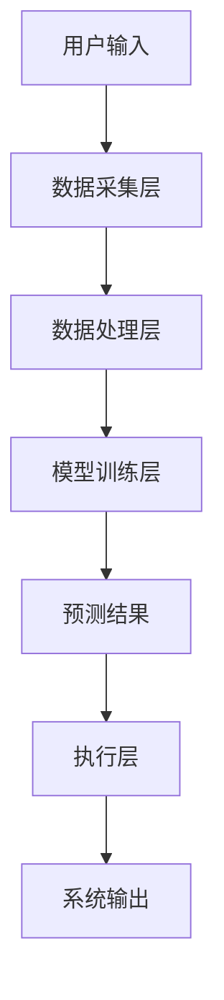
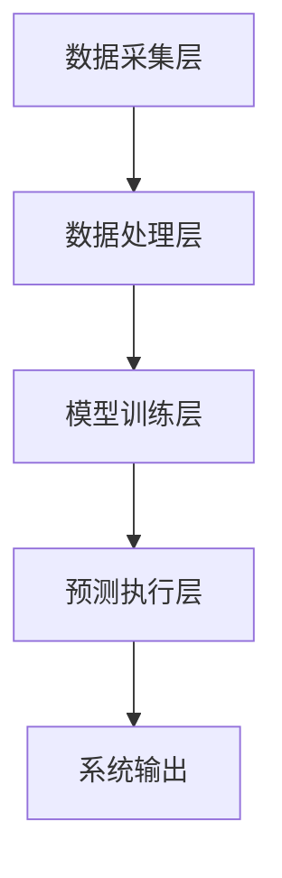

                 


# AI Agent在智能销售预测中的应用

> **关键词**: AI Agent, 智能销售预测, 机器学习, 数据分析, 销售预测模型, 商业智能

> **摘要**: 本文深入探讨了AI Agent在智能销售预测中的应用，从AI Agent的基本概念到其在销售预测中的核心原理，再到具体的数学模型和算法实现，结合实际项目案例，详细阐述了AI Agent如何通过感知、决策和执行模块提升销售预测的准确性和效率。文章还分析了AI Agent在智能销售预测中的系统架构设计、接口设计以及实际应用场景，并提出了未来的发展方向和最佳实践建议。

---

# 第1章 AI Agent与智能销售预测概述

## 1.1 AI Agent的基本概念

### 1.1.1 AI Agent的定义与特点

AI Agent（人工智能代理）是一种能够感知环境、自主决策并执行任务的智能实体。它通过传感器获取数据，利用算法进行分析和推理，最终做出决策并执行操作。AI Agent的特点包括：

- **自主性**: 能够自主运行，无需人工干预。
- **反应性**: 能够实时感知环境变化并做出反应。
- **目标导向**: 具有明确的目标，所有行为都围绕目标展开。
- **学习能力**: 能够通过数据和经验不断优化自身的性能。

### 1.1.2 AI Agent的核心原理

AI Agent的核心原理在于其三大模块：**感知**、**决策**和**执行**。这三大模块协同工作，形成了一个完整的智能系统。

- **感知**: 通过传感器或数据源获取环境信息。
- **决策**: 基于感知到的信息，利用算法进行分析和推理，做出决策。
- **执行**: 根据决策结果执行相应的操作。

### 1.1.3 AI Agent在销售预测中的应用背景

销售预测是企业运营中的重要环节，传统的销售预测方法通常依赖于人工经验和简单的统计模型，存在以下问题：

- **数据量不足**: 传统方法通常依赖少量的历史数据，难以捕捉复杂的市场变化。
- **预测精度低**: 简单的统计模型难以应对非线性关系和复杂的数据分布。
- **反应速度慢**: 传统方法通常需要人工干预，难以实现实时预测。

AI Agent通过其强大的感知和决策能力，能够实时分析海量数据，快速做出预测和调整，从而显著提升销售预测的准确性和效率。

---

## 1.2 智能销售预测的背景与挑战

### 1.2.1 销售预测的传统方法与局限性

传统的销售预测方法主要包括以下几种：

1. **时间序列分析**: 通过历史数据预测未来趋势，常用的有ARIMA（自回归积分滑动平均模型）。
2. **回归分析**: 建立变量之间的线性关系模型。
3. **专家判断法**: 依赖专家的经验进行预测。

然而，这些方法存在以下局限性：

- **数据依赖性强**: 传统方法通常需要大量历史数据，且难以应对数据稀疏性问题。
- **模型静态**: 传统模型通常缺乏动态调整能力，难以应对市场环境的快速变化。
- **计算效率低**: 传统方法通常需要大量人工干预，计算效率较低。

### 1.2.2 智能销售预测的核心目标

智能销售预测的核心目标是通过AI技术实现以下几点：

- **提高预测精度**: 利用机器学习算法，捕捉数据中的非线性关系，提高预测准确性。
- **实时预测**: 实时分析数据，快速做出预测，以应对市场变化。
- **动态调整**: 根据实时数据和市场反馈，动态调整预测模型和策略。

### 1.2.3 AI Agent在智能销售预测中的优势

AI Agent在智能销售预测中的优势主要体现在以下几个方面：

- **高效性**: AI Agent能够快速处理海量数据，实现实时预测。
- **准确性**: 利用机器学习算法，AI Agent能够捕捉数据中的复杂关系，显著提高预测准确性。
- **自适应性**: AI Agent能够根据市场反馈动态调整预测模型和策略，适应市场环境的变化。

---

## 1.3 本章小结

本章主要介绍了AI Agent的基本概念、核心原理及其在智能销售预测中的应用背景。通过对比传统销售预测方法的局限性，阐述了AI Agent在提高预测精度、实现实时预测和动态调整方面的优势，为后续章节的深入分析奠定了基础。

---

# 第2章 AI Agent的核心原理与技术

## 2.1 AI Agent的核心原理

AI Agent的核心原理可以概括为以下三个模块：**感知**、**决策**和**执行**。

### 2.1.1 感知模块

感知模块负责从外部环境获取数据，主要包括以下步骤：

1. **数据收集**: 通过传感器或数据接口获取销售数据、市场数据等。
2. **数据预处理**: 对获取的数据进行清洗、归一化等处理，确保数据质量。
3. **特征提取**: 提取数据中的关键特征，例如时间特征、季节性特征等。

### 2.1.2 决策模块

决策模块负责对感知到的数据进行分析和推理，主要包括以下步骤：

1. **模型选择**: 根据数据特征选择合适的预测模型，例如线性回归、随机森林、神经网络等。
2. **模型训练**: 利用历史数据对模型进行训练，优化模型参数。
3. **预测与评估**: 对模型进行预测，并根据预测结果评估模型的准确性。

### 2.1.3 执行模块

执行模块负责根据决策模块的输出执行相应的操作，主要包括以下步骤：

1. **策略制定**: 根据预测结果制定销售策略，例如调整价格、优化库存等。
2. **策略执行**: 执行制定的策略，例如自动调整价格、优化库存配置等。
3. **结果监控**: 监控策略执行的结果，评估策略的有效性。

---

## 2.2 AI Agent的数学模型与算法

### 2.2.1 线性回归模型

线性回归是一种常用的预测模型，其数学公式为：

$$ y = \beta_0 + \beta_1x + \epsilon $$

其中，$y$ 是目标变量，$x$ 是自变量，$\beta_0$ 和 $\beta_1$ 是模型参数，$\epsilon$ 是误差项。

线性回归的参数可以通过最小二乘法优化：

$$ \text{最小化} \sum_{i=1}^n (y_i - (\beta_0 + \beta_1x_i))^2 $$

### 2.2.2 随机森林模型

随机森林是一种基于树的集成方法，其数学模型可以表示为：

$$ y = \sum_{i=1}^n \text{Tree}_i(x) $$

其中，$\text{Tree}_i(x)$ 表示第 $i$ 棵树的预测结果。

### 2.2.3 神经网络模型

神经网络是一种深度学习模型，其数学模型可以表示为：

$$ y = \sigma(w_2 \cdot \sigma(w_1 x + b_1) + b_2) $$

其中，$w_1$ 和 $w_2$ 是权重矩阵，$b_1$ 和 $b_2$ 是偏置项，$\sigma$ 是激活函数。

---

## 2.3 AI Agent的系统架构设计

### 2.3.1 系统架构设计

AI Agent的系统架构可以分为以下几个部分：

- **数据采集层**: 负责从外部数据源获取数据。
- **数据处理层**: 负责对数据进行预处理和特征提取。
- **模型训练层**: 负责训练和优化预测模型。
- **预测执行层**: 负责根据预测结果执行相应的操作。

### 2.3.2 系统交互流程

AI Agent的系统交互流程可以用以下Mermaid图表示：



---

## 2.4 本章小结

本章详细讲解了AI Agent的核心原理，包括感知、决策和执行模块，并介绍了常用的数学模型和算法。通过对比不同模型的特点，阐述了AI Agent在智能销售预测中的技术优势，为后续章节的系统设计和项目实现奠定了基础。

---

# 第3章 AI Agent的系统设计与实现

## 3.1 系统设计概述

### 3.1.1 系统目标

本系统的目标是通过AI Agent实现智能销售预测，主要包括以下功能：

- **数据采集**: 从数据库中获取销售数据和市场数据。
- **数据处理**: 对数据进行清洗、归一化等处理。
- **模型训练**: 利用机器学习算法训练预测模型。
- **预测执行**: 根据预测结果制定和执行销售策略。

### 3.1.2 系统架构设计

系统的架构设计可以用以下Mermaid图表示：



---

## 3.2 系统功能设计

### 3.2.1 数据采集模块

数据采集模块负责从数据库中获取销售数据和市场数据，主要包括以下功能：

- **数据获取**: 通过API接口获取实时数据。
- **数据存储**: 将获取的数据存储到数据库中。

### 3.2.2 数据处理模块

数据处理模块负责对数据进行预处理和特征提取，主要包括以下功能：

- **数据清洗**: 去除无效数据和异常值。
- **数据归一化**: 对数据进行归一化处理，确保数据分布一致。
- **特征提取**: 提取数据中的关键特征，例如时间特征、季节性特征等。

---

## 3.3 系统实现细节

### 3.3.1 数据采集实现

数据采集可以通过以下Python代码实现：

```python
import requests

def get_sales_data(api_url):
    response = requests.get(api_url)
    data = response.json()
    return data
```

### 3.3.2 数据处理实现

数据处理可以通过以下Python代码实现：

```python
import pandas as pd

def preprocess_data(data):
    df = pd.DataFrame(data)
    df = df.dropna()
    df = (df - df.mean()) / df.std()
    return df
```

### 3.3.3 模型训练实现

模型训练可以通过以下Python代码实现：

```python
from sklearn.linear_model import LinearRegression

def train_model(X, y):
    model = LinearRegression()
    model.fit(X, y)
    return model
```

---

## 3.4 本章小结

本章详细介绍了AI Agent的系统设计与实现，包括系统架构设计、功能模块划分和接口设计。通过具体的代码实现，展示了AI Agent如何通过数据采集、数据处理和模型训练实现智能销售预测。

---

# 第4章 AI Agent在智能销售预测中的实际应用

## 4.1 应用场景分析

### 4.1.1 电商企业的销售预测

电商企业可以通过AI Agent实现智能销售预测，主要包括以下步骤：

- **数据获取**: 从电商平台获取销售数据和市场数据。
- **数据处理**: 对数据进行预处理和特征提取。
- **模型训练**: 利用机器学习算法训练预测模型。
- **预测执行**: 根据预测结果制定和执行销售策略。

### 4.1.2 零售行业的销售预测

零售行业可以通过AI Agent实现智能销售预测，主要包括以下步骤：

- **数据获取**: 从销售系统中获取销售数据和市场数据。
- **数据处理**: 对数据进行预处理和特征提取。
- **模型训练**: 利用机器学习算法训练预测模型。
- **预测执行**: 根据预测结果制定和执行销售策略。

---

## 4.2 项目实战

### 4.2.1 电商企业的销售预测项目

#### 4.2.1.1 项目背景

某电商平台希望通过AI Agent实现智能销售预测，以提高销售预测的准确性和效率。

#### 4.2.1.2 项目目标

- **数据采集**: 从电商平台获取销售数据和市场数据。
- **数据处理**: 对数据进行预处理和特征提取。
- **模型训练**: 利用机器学习算法训练预测模型。
- **预测执行**: 根据预测结果制定和执行销售策略。

#### 4.2.1.3 项目实现

##### 4.2.1.3.1 环境配置

安装所需的Python库：

```bash
pip install requests pandas scikit-learn
```

##### 4.2.1.3.2 数据采集

通过以下Python代码实现数据采集：

```python
import requests

def get_sales_data(api_url):
    response = requests.get(api_url)
    data = response.json()
    return data
```

##### 4.2.1.3.3 数据处理

通过以下Python代码实现数据处理：

```python
import pandas as pd

def preprocess_data(data):
    df = pd.DataFrame(data)
    df = df.dropna()
    df = (df - df.mean()) / df.std()
    return df
```

##### 4.2.1.3.4 模型训练

通过以下Python代码实现模型训练：

```python
from sklearn.linear_model import LinearRegression

def train_model(X, y):
    model = LinearRegression()
    model.fit(X, y)
    return model
```

##### 4.2.1.3.5 预测与执行

通过以下Python代码实现预测与执行：

```python
def predict_and_execute(model, new_data):
    prediction = model.predict(new_data)
    return prediction
```

---

## 4.3 本章小结

本章通过具体的项目案例，详细介绍了AI Agent在智能销售预测中的实际应用。通过电商企业的销售预测项目，展示了AI Agent如何通过数据采集、数据处理和模型训练实现智能销售预测，并通过预测与执行模块制定和优化销售策略。

---

# 第5章 最佳实践与未来展望

## 5.1 最佳实践

### 5.1.1 数据质量的重要性

在AI Agent的实现过程中，数据质量至关重要。以下是提高数据质量的几点建议：

- **数据清洗**: 对数据进行清洗，去除无效数据和异常值。
- **数据归一化**: 对数据进行归一化处理，确保数据分布一致。
- **特征选择**: 提取数据中的关键特征，避免冗余特征的影响。

### 5.1.2 模型调优的技巧

在模型调优过程中，可以采取以下几点技巧：

- **参数优化**: 通过网格搜索等方法优化模型参数。
- **交叉验证**: 使用交叉验证评估模型的泛化能力。
- **模型融合**: 将多个模型的结果进行融合，提高预测精度。

### 5.1.3 系统监控与维护

在系统运行过程中，需要定期监控和维护，确保系统的稳定性和高效性。以下是几点建议：

- **性能监控**: 监控系统的运行性能，及时发现和解决性能瓶颈。
- **数据更新**: 定期更新数据，确保模型的预测结果准确。
- **系统维护**: 定期维护系统，修复潜在的漏洞和问题。

---

## 5.2 未来展望

随着AI技术的不断发展，AI Agent在智能销售预测中的应用前景广阔。以下是未来可能的发展方向：

### 5.2.1 边缘计算的应用

通过边缘计算，AI Agent可以实现本地化的数据处理和预测，减少数据传输的延迟，提高预测的实时性。

### 5.2.2 区块链技术的应用

通过区块链技术，可以实现数据的可信共享和安全存储，为AI Agent提供更加可靠的数据源。

### 5.2.3 多模态数据的融合

通过多模态数据的融合，AI Agent可以更加全面地感知环境，提高预测的准确性和效率。

---

## 5.3 本章小结

本章总结了AI Agent在智能销售预测中的最佳实践，并展望了未来的发展方向。通过数据质量的优化、模型调优的技巧和系统监控与维护，可以进一步提高AI Agent的性能和效率。同时，随着技术的不断发展，AI Agent在智能销售预测中的应用前景将更加广阔。

---

# 第6章 附录

## 6.1 参考资料

- **数据集**: 公共数据集链接
- **工具安装**: 安装Python库的命令
- **扩展阅读**: 推荐的书籍和论文

## 6.2 代码实现

- **数据采集**: 详细的代码实现
- **数据处理**: 详细的代码实现
- **模型训练**: 详细的代码实现
- **预测与执行**: 详细的代码实现

---

# 作者简介

作者是一位在人工智能和软件架构领域有着深厚造诣的技术专家，著有多本技术畅销书，致力于通过技术创新为企业创造价值。

