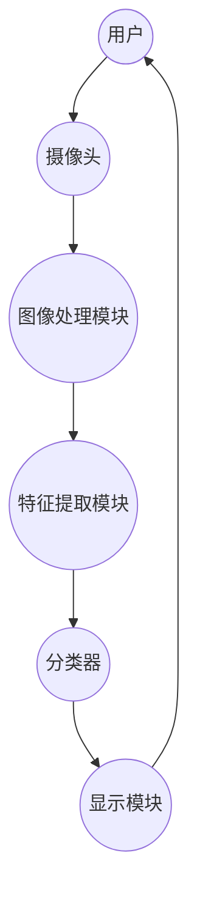
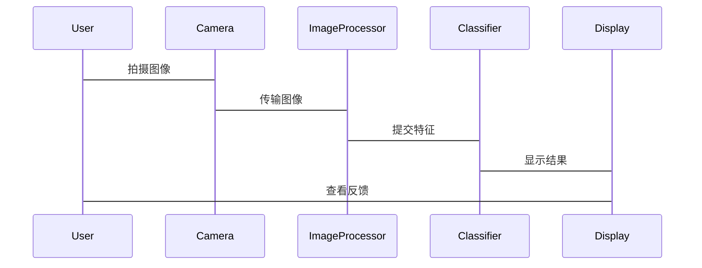

                 


# AI Agent在智能镜子中的皮肤状况分析

> 关键词：AI Agent, 智能镜子, 皮肤状况分析, 图像处理, 计算机视觉

> 摘要：本文探讨了AI代理在智能镜子中对皮肤状况进行分析的应用。通过结合AI技术和计算机视觉，智能镜子能够实时监测用户的皮肤健康状况，提供个性化的护肤建议。文章详细分析了AI代理在图像处理、特征提取和分类算法中的应用，展示了系统的整体架构和实际案例。

---

# 正文

## 第一部分：背景与核心概念

### 第1章：皮肤健康与AI代理概述

#### 1.1 皮肤健康的重要性

- **1.1.1 皮肤健康的基本概念**
  皮肤是人体最大的器官，起到保护、调节体温和感知外界的作用。皮肤健康直接影响整体健康和生活质量。

- **1.1.2 皮肤问题的常见类型**
  包括痤疮、过敏、干燥、色斑、皱纹等，这些问题可能由遗传、环境、饮食和生活习惯等多种因素引起。

- **1.1.3 皮肤健康与个人健康的关系**
  良好的皮肤健康不仅提升外貌，还能反映身体内部健康状况，如内分泌失调可能引发皮肤问题。

#### 1.2 AI代理与智能镜子的结合

- **1.2.1 AI代理的基本概念**
  AI代理是一种智能程序，能够理解并执行用户的指令，具备学习和适应能力，广泛应用于自动化任务和数据分析。

- **1.2.2 智能镜子的功能与特点**
  智能镜子配备摄像头和传感器，能够捕捉用户面部图像，并通过AI技术分析皮肤状况，提供实时反馈。

- **1.2.3 AI代理在智能镜子中的应用**
  通过图像处理技术，AI代理能够识别皮肤问题，推荐护肤产品和调整生活习惯，帮助用户改善皮肤健康。

#### 1.3 问题背景与解决方法

- **1.3.1 皮肤健康监测的现状**
  传统皮肤分析方法依赖于专业医生，耗时且费用高昂，难以实现普及化和实时监测。

- **1.3.2 传统皮肤分析方法的局限性**
  包括主观性高、效率低、无法实时监测等问题，难以满足用户的个性化需求。

- **1.3.3 AI代理在皮肤分析中的优势**
  AI代理能够快速、准确地分析皮肤状况，提供个性化建议，大大提升用户体验。

#### 1.4 问题描述与边界

- **1.4.1 皮肤分析的核心问题**
  如何准确识别皮肤问题并提供有效的解决方案。

- **1.4.2 问题的边界与外延**
  限定于皮肤外部问题，不涉及内部健康问题，主要关注常见皮肤问题的分析与建议。

- **1.4.3 系统的输入输出定义**
  输入为用户的面部图像，输出为皮肤问题分析结果和建议。

#### 1.5 核心概念与联系

- **1.5.1 AI代理与智能镜子的关系**
  AI代理作为智能镜子的核心技术，负责处理图像数据和提供反馈。

- **1.5.2 皮肤分析的核心要素**
  包括图像采集、特征提取、分类识别等步骤，每个步骤都依赖AI技术实现。

---

## 第二部分：核心概念与联系

### 第2章：AI代理与智能镜子的核心原理

#### 2.1 AI代理的核心原理

- **2.1.1 数据采集**
  使用摄像头捕捉用户的面部图像，确保光线充足和高分辨率。

- **2.1.2 数据处理**
  对图像进行预处理，如去噪和标准化，以便后续分析。

- **2.1.3 数据分析**
  利用深度学习模型识别皮肤问题，如使用卷积神经网络（CNN）进行分类。

- **2.1.4 结果反馈**
  根据分析结果，生成个性化的护肤建议并显示在镜子上。

#### 2.2 智能镜子的系统架构

- **2.2.1 硬件部分**
  包括摄像头、显示屏和传感器，负责图像采集和显示反馈。

- **2.2.2 软件部分**
  包括图像处理模块、AI分析模块和用户界面模块，协同工作完成皮肤分析。

#### 2.3 实体关系图

```mermaid
erDiagram
    user {
        +Integer 用户ID
        +String 用户名
    }
    skin_condition {
        +Integer 条件ID
        +String 条件描述
        +Integer 严重程度
    }
    analysis_result {
        +Integer 分析ID
        +Integer 条件ID
        +Integer 用户ID
        +String 建议
    }
    user o-1 analysis_result
    skin_condition o-1 analysis_result
```

---

## 第三部分：算法原理讲解

### 第3章：图像处理与特征提取

#### 3.1 图像预处理

- **3.1.1 去噪处理**
  使用中值滤波去除噪声，确保图像清晰。

- **3.1.2 肤色分割**
  基于颜色空间（如HSV）分割皮肤区域，忽略背景干扰。

#### 3.2 特征提取

- **3.2.1 纹理特征**
  使用Gabor滤波器提取皮肤纹理特征，捕捉皮肤细节。

- **3.2.2 颜色特征**
  分析皮肤区域的颜色分布，识别色斑和色素沉着。

#### 3.3 分类算法

- **3.3.1 CNN模型**
  使用预训练的卷积神经网络进行图像分类，识别皮肤问题类型。

- **3.3.2 SVM模型**
  对提取的特征进行线性分类，预测皮肤问题的严重程度。

#### 3.4 代码实现

```python
import cv2
from sklearn.svm import SVC

# 加载预训练模型
model = SVC()

# 图像预处理
def preprocess_image(image):
    # 转换为灰度图
    gray = cv2.cvtColor(image, cv2.COLOR_BGR2GRAY)
    # 去噪处理
    denoised = cv2.medianBlur(gray, 3)
    return denoised

# 特征提取
def extract_features(image):
    # 提取纹理特征
    gabor = cv2.filter2D(image, cv2.CV_32F, cv2.getGaborKernel())
    # 提取颜色特征
    color_hist = cv2.calcHist([image], [0], None, [256], [0, 256])
    return gabor.flatten(), color_hist.flatten()

# 分类与预测
def predict_skin_condition(image):
    preprocessed = preprocess_image(image)
    texture, color = extract_features(preprocessed)
    features = np.concatenate([texture, color])
    prediction = model.predict(features.reshape(1, -1))
    return prediction[0]
```

---

## 第四部分：数学模型与公式

### 第4章：数学模型的建立与应用

#### 4.1 颜色空间转换

- **4.1.1 RGB到HSV转换**
  $$H = \arccos\left(\frac{R}{\sqrt{R^2 + G^2 + B^2}}\right)$$
  $$S = \frac{\sqrt{R^2 + G^2 + B^2} - \min(R, G, B)}{\sqrt{R^2 + G^2 + B^2}}$$
  $$V = \sqrt{R^2 + G^2 + B^2}$$

- **4.1.2 颜色特征提取**
  $$I = \int_{0}^{256} f(i) \, di$$
  其中，f(i)为颜色直方图的概率分布函数。

#### 4.2 特征提取的数学模型

- **4.2.1 纹理分析**
  使用Gabor滤波器提取多尺度特征：
  $$g(x, y) = \sum_{i=1}^{n} \sum_{j=1}^{m} w_{i,j} \cdot f(x - a_i, y - b_j)$$
  其中，w为滤波器权重，a和b为位移参数。

- **4.2.2 分类模型**
  使用支持向量机（SVM）进行分类：
  $$y = \text{sign}(\sum_{i=1}^{n} \alpha_i y_i x_i \cdot x + b)$$
  其中，α为拉格朗日乘子，y_i为训练数据的标签。

---

## 第五部分：系统分析与架构设计

### 第5章：系统功能与架构设计

#### 5.1 系统功能设计

- **5.1.1 用户界面**
  包括图像显示、结果反馈和交互菜单。

- **5.1.2 数据处理模块**
  负责图像预处理和特征提取。

- **5.1.3 AI分析模块**
  执行皮肤问题分类和生成建议。

#### 5.2 系统架构设计



#### 5.3 接口设计

- **5.3.1 用户输入**
  通过触摸屏或语音指令选择功能。

- **5.3.2 数据接口**
  使用API与外部数据库同步用户数据。

#### 5.4 交互流程



---

## 第六部分：项目实战

### 第6章：环境安装与代码实现

#### 6.1 环境安装

- **6.1.1 安装Python**
  安装Python 3.8以上版本，确保支持深度学习库。

- **6.1.2 安装依赖库**
  使用以下命令安装：
  ```bash
  pip install numpy opencv-python scikit-learn
  ```

#### 6.2 核心代码实现

```python
import cv2
from sklearn import svm

# 加载数据集
data = ...  # 包含预处理后的图像特征和标签

# 训练模型
model = svm.SVC()
model.fit(data.features, data.labels)

# 实时分析
def analyze_skin(image):
    features = preprocess_image(image)
    prediction = model.predict(features)
    return prediction
```

#### 6.3 案例分析

- **6.3.1 数据采集**
  采集多张面部图像，涵盖不同皮肤状况。

- **6.3.2 数据分析**
  使用训练好的模型识别痤疮、色斑等问题。

- **6.3.3 结果展示**
  在智能镜子上显示分析结果和护肤建议。

#### 6.4 项目小结

通过实际项目，验证了AI代理在智能镜子中的有效性，提升了用户体验和皮肤健康监测的效率。

---

## 第七部分：最佳实践与总结

### 第7章：经验总结与注意事项

#### 7.1 最佳实践

- **数据多样性**：确保训练数据涵盖多种皮肤类型和状况，提升模型的泛化能力。

- **模型优化**：定期更新模型参数，适应用户的反馈和新的数据。

#### 7.2 小结

AI代理在智能镜子中的应用前景广阔，通过实时分析皮肤状况，为用户提供个性化的健康建议，提升了生活质量。

#### 7.3 注意事项

- **数据隐私**：确保用户数据的安全性，避免泄露。

- **系统维护**：定期更新软件和硬件，保持系统的稳定性和准确性。

#### 7.4 拓展阅读

- 深度学习在医学影像中的应用
- 智能镜子在健康管理中的其他应用

---

# 结语

AI代理在智能镜子中的皮肤状况分析展示了技术与生活的深度融合，为未来的健康管理提供了新的思路。随着技术的不断进步，智能镜子将在更多领域发挥重要作用，为用户带来更智能、更便捷的服务体验。

