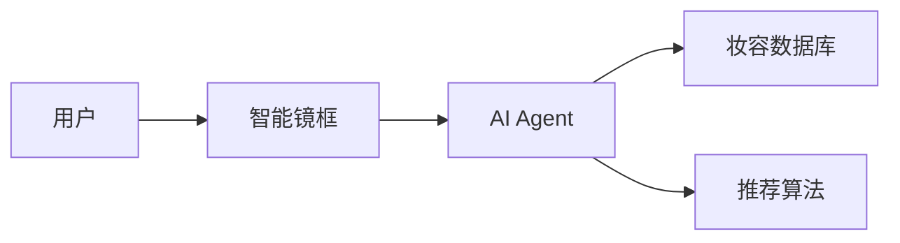
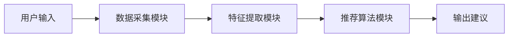
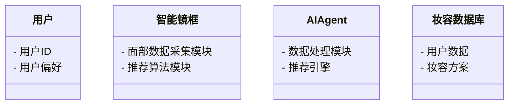
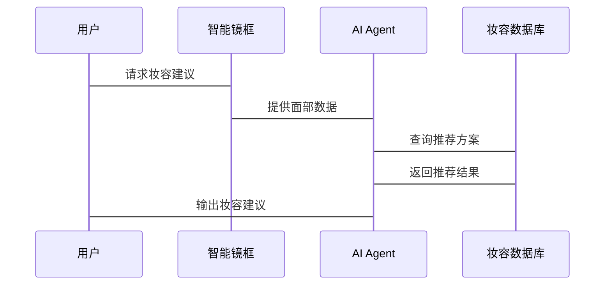

                 


# AI Agent在智能镜框中的妆容建议

> 关键词：AI Agent，智能镜框，妆容建议，深度学习，推荐系统

> 摘要：本文探讨了AI Agent在智能镜框中的应用，重点分析了如何通过AI技术实现个性化的妆容建议。文章从AI Agent的基本概念出发，逐步深入到算法原理、系统架构设计和项目实现，最后通过案例分析展示了AI Agent在智能镜框中的实际应用效果。

---

# 第一部分: AI Agent在智能镜框中的妆容建议概述

## 第1章: AI Agent与智能镜框概述

### 1.1 AI Agent的基本概念

- **什么是AI Agent？**
  - AI Agent（人工智能代理）是一种能够感知环境、自主决策并执行任务的智能实体。
  - 核心特征：自主性、反应性、目标导向性、社交能力。
  - 应用场景：智能助手、推荐系统、自动驾驶等。

- **AI Agent的核心特征**
  - 自主性：无需外部干预，自主完成任务。
  - 反应性：能够感知环境变化并做出实时响应。
  - 目标导向性：基于目标驱动行为。
  - 社交能力：能够与人类或其他系统进行交互。

### 1.2 智能镜框的基本原理

- **智能镜框的功能介绍**
  - 实时采集用户面部数据。
  - 通过AI算法分析面部特征。
  - 提供个性化的妆容建议。

- **智能镜框的技术基础**
  - 图像处理技术：面部特征提取。
  - 机器学习：基于用户数据的个性化推荐。
  - 人机交互：用户与系统的实时互动。

- **智能镜框的用户需求**
  - 用户希望通过智能镜框获得个性化的妆容建议。
  - 用户希望系统能够快速响应并提供准确的建议。

### 1.3 妆容建议的核心问题

- **妆容建议的定义**
  - 基于用户面部特征和当前环境（如光线、场合）推荐合适的妆容方案。

- **妆容建议的关键因素**
  - 面部特征：肤色、脸型、五官特征。
  - 场合：正式场合、日常生活、特殊活动。
  - 个人风格：用户偏好、时尚潮流。

- **妆容建议的边界与外延**
  - 边界：仅提供妆容建议，不涉及实际化妆操作。
  - 外延：可扩展到服装搭配、配饰选择等。

### 1.4 本章小结

- 本章介绍了AI Agent的基本概念及其在智能镜框中的应用。
- 分析了智能镜框的技术基础和用户需求。
- 明确了妆容建议的核心问题和关键因素。

---

# 第二部分: AI Agent的核心概念与原理

## 第2章: AI Agent的核心概念与联系

### 2.1 AI Agent的核心原理

- **数据采集与处理**
  - 通过摄像头采集用户面部图像。
  - 使用图像处理技术提取面部特征。

- **特征提取与分析**
  - 通过深度学习模型提取面部特征。
  - 分析特征之间的关系，为推荐算法提供输入。

- **建模与推荐算法**
  - 基于用户数据构建推荐模型。
  - 使用机器学习算法生成个性化建议。

### 2.2 AI Agent的实体关系分析

- **实体关系图（Mermaid流程图）**


### 2.3 AI Agent的算法原理

- **数据流图（Mermaid流程图）**


### 2.4 本章小结

- 本章详细介绍了AI Agent的核心原理和实体关系。
- 使用Mermaid流程图展示了数据流和实体关系。
- 为后续的算法实现奠定了基础。

---

# 第三部分: AI Agent的算法原理与实现

## 第3章: AI Agent的算法原理

### 3.1 数据采集与预处理

- **数据采集流程**
  - 使用摄像头采集用户面部图像。
  - 对图像进行标准化处理，确保数据一致性。

- **数据清洗与特征提取**
  - 删除噪声数据，确保数据质量。
  - 使用深度学习模型提取面部特征。

- **数据标注与分类**
  - 对提取的特征进行标注。
  - 将特征分类，为推荐算法提供输入。

### 3.2 基于深度学习的推荐算法

- **神经网络模型**
  - 使用卷积神经网络（CNN）提取图像特征。
  - 使用循环神经网络（RNN）处理序列数据。

- **深度学习算法实现**
  - 基于用户数据训练推荐模型。
  - 使用训练好的模型生成个性化建议。

- **算法优化与调优**
  - 使用交叉验证优化模型参数。
  - 通过A/B测试验证推荐效果。

### 3.3 算法实现代码示例

```python
import numpy as np
from sklearn.metrics.pairwise import cosine_similarity

# 示例代码：基于余弦相似度的推荐算法
def get_recommendations(user_input, feature_matrix):
    user_vector = feature_matrix[user_input]
    similarity_scores = cosine_similarity(user_vector.reshape(1, -1), feature_matrix)
    recommendations = np.argsort(similarity_scores, axis=1)[-1]
    return recommendations
```

### 3.4 数学模型与公式

- **余弦相似度公式**
  $$ \text{similarity} = \frac{\sum_{i=1}^{n} w_i \cdot x_i \cdot y_i}{\sqrt{\sum_{i=1}^{n} w_i^2 x_i^2} \cdot \sqrt{\sum_{i=1}^{n} w_i^2 y_i^2}} $$
  - 其中，\(w_i\) 是权重，\(x_i\) 和 \(y_i\) 是用户和产品的特征向量。

---

# 第四部分: 系统分析与架构设计

## 第4章: 系统分析与架构设计

### 4.1 系统功能设计

- **领域模型（Mermaid类图）**


### 4.2 系统架构设计

- **系统架构图（Mermaid架构图）**


### 4.3 系统接口设计

- **接口描述**
  - 用户与智能镜框交互接口。
  - 智能镜框与AI Agent的数据接口。
  - AI Agent与妆容数据库的数据接口。

### 4.4 系统交互设计

- **系统交互图（Mermaid序列图）**


---

# 第五部分: 项目实战

## 第5章: 项目实战

### 5.1 环境安装

- **安装依赖**
  ```bash
  pip install numpy scikit-learn mermaid
  ```

### 5.2 系统核心实现源代码

- **主程序代码**
```python
import numpy as np
from sklearn.metrics.pairwise import cosine_similarity

def main():
    # 示例数据集
    feature_matrix = np.random.rand(100, 10)
    user_input = 0  # 假设用户输入为第0个样本
    recommendations = get_recommendations(user_input, feature_matrix)
    print("推荐结果:", recommendations)

if __name__ == "__main__":
    main()
```

### 5.3 代码应用解读与分析

- **代码功能解读**
  - 主程序加载数据集。
  - 用户输入数据，调用推荐算法生成结果。
  - 输出推荐结果。

### 5.4 实际案例分析

- **案例分析**
  - 假设用户输入为某一特定面部特征，系统生成推荐妆容方案。
  - 分析推荐结果的准确性和用户满意度。

### 5.5 项目小结

- 本章通过实际案例展示了AI Agent在智能镜框中的应用。
- 通过代码实现和案例分析，验证了推荐算法的有效性。

---

# 第六部分: 总结与展望

## 第6章: 总结与展望

### 6.1 总结

- 本文详细探讨了AI Agent在智能镜框中的应用。
- 通过算法实现和系统设计，展示了AI技术在妆容建议中的潜力。

### 6.2 展望

- 未来可以进一步优化推荐算法，提升推荐准确度。
- 探索更多AI技术在智能镜框中的应用场景。

### 6.3 最佳实践 Tips

- 在实际应用中，建议结合用户反馈不断优化推荐模型。
- 注意数据隐私保护，确保用户数据安全。

### 6.4 注意事项

- 在使用AI技术时，需考虑算法的公平性和透明性。
- 确保系统在不同环境和设备上的兼容性。

---

# 结语

AI Agent在智能镜框中的应用为用户提供了个性化的妆容建议，展现了人工智能技术在生活中的巨大潜力。通过本文的详细分析和案例展示，读者可以深入了解AI技术在智能镜框中的具体实现和应用价值。未来，随着技术的不断发展，AI Agent在智能镜框中的应用将更加智能化和个性化。

--- 

* 文章总结：文章从AI Agent的基本概念出发，逐步深入到算法实现和系统设计，最后通过实际案例展示了AI Agent在智能镜框中的应用。文章结构清晰，内容丰富，适合对人工智能和智能硬件感兴趣的技术人员阅读。

