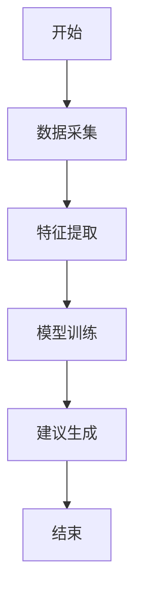
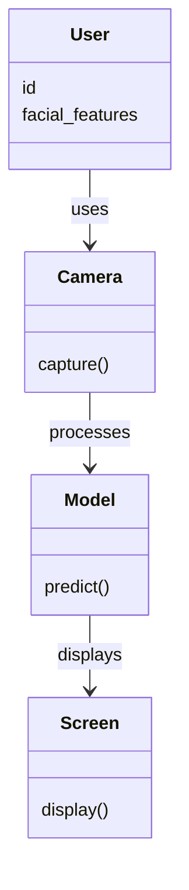
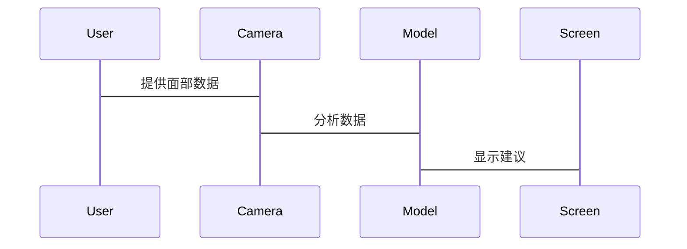

                 


# AI Agent在智能镜框中的妆容建议系统

> 关键词：AI Agent，智能镜框，妆容建议，计算机视觉，机器学习，增强现实

> 摘要：本文探讨了AI Agent在智能镜框中的妆容建议系统的实现，从背景介绍、核心概念、算法原理到系统架构、项目实战，最后总结最佳实践。通过详细的技术分析和实际案例，展示了如何利用AI技术提升用户体验。

---

## 第1章 背景介绍

### 1.1 问题背景

#### 1.1.1 AI Agent与智能镜框的结合
AI Agent是一种智能体，能够感知环境并执行任务。结合智能镜框，AI Agent可以通过摄像头捕捉用户面部数据，实时分析并提供建议。

#### 1.1.2 妆容建议系统的应用场景
应用场景包括个人美妆、社交场合、重要事件等，帮助用户快速找到合适的妆容方案。

#### 1.1.3 目标用户与需求分析
目标用户为注重美妆的女性，需求包括个性化建议、快速调整、易用性等。

### 1.2 问题描述
#### 1.2.1 现有妆容建议系统的局限性
传统系统依赖固定模板，缺乏个性化，反馈延迟，用户体验差。

#### 1.2.2 AI Agent在智能镜框中的作用
AI Agent通过实时数据分析，提供个性化建议，提升用户体验。

#### 1.2.3 系统的目标与功能定位
系统目标是提供实时、个性化的妆容建议，功能定位包括数据采集、分析、建议生成。

### 1.3 问题解决
#### 1.3.1 AI Agent的核心作用
通过机器学习模型实时分析面部数据，生成个性化建议。

#### 1.3.2 智能镜框的技术优势
高精度摄像头、实时处理能力、增强现实技术。

#### 1.3.3 妆容建议系统的实现路径
数据采集、特征提取、模型训练、建议生成。

### 1.4 边界与外延
#### 1.4.1 系统的边界定义
仅限于面部妆容建议，不包括发型、服饰等其他方面。

#### 1.4.2 相关技术的外延扩展
涉及计算机视觉、机器学习、增强现实等技术。

#### 1.4.3 应用场景的限制与扩展
主要应用于个人美妆，未来可扩展至虚拟试妆。

### 1.5 概念结构与核心要素
#### 1.5.1 系统的核心概念框架
AI Agent、智能镜框、妆容建议系统。

#### 1.5.2 核心要素的定义与关系
AI Agent负责数据处理和建议生成，智能镜框提供数据采集和显示。

#### 1.5.3 系统的整体架构
数据采集、分析、建议生成、显示反馈。

---

## 第2章 核心概念与联系

### 2.1 AI Agent的核心原理
#### 2.1.1 AI Agent的基本定义
智能体，能够感知环境并执行任务。

#### 2.1.2 AI Agent的分类与特点
分为简单和复杂智能体，具有自主性和反应性。

#### 2.1.3 AI Agent在妆容建议中的应用
实时分析面部数据，生成个性化建议。

### 2.2 妆容建议系统的原理
#### 2.2.1 系统的基本工作流程
数据采集 → 特征提取 → 模型分析 → 建议生成。

#### 2.2.2 系统的核心功能模块
数据采集模块、特征提取模块、模型分析模块、建议生成模块。

#### 2.2.3 系统的输入输出关系
输入：用户面部图像，输出：妆容建议。

### 2.3 核心概念属性对比
| 概念       | 定义                                                                 |
|------------|----------------------------------------------------------------------|
| AI Agent   | 智能体，用于数据处理和建议生成。                                   |
| 智能镜框   | 配备摄像头和显示设备，用于数据采集和显示。                        |
| 妆容建议   | 基于AI分析的面部化妆建议。                                         |

### 2.4 ER实体关系图
```mermaid
er
actor: 用户
system: 妆容建议系统
camera: 摄像头模块
model: 机器学习模型
screen: 显示屏模块

actor --> camera: 提供面部数据
camera --> model: 分析数据
model --> screen: 生成建议
```

---

## 第3章 算法原理讲解

### 3.1 算法概述
系统使用卷积神经网络（CNN）进行图像识别，循环神经网络（RNN）生成建议。

### 3.2 算法实现步骤
#### 3.2.1 数据采集
使用高精度摄像头采集用户面部图像。

#### 3.2.2 特征提取
使用CNN提取面部特征，包括颜色、形状等。

#### 3.2.3 模型训练
训练RNN生成个性化建议。

### 3.3 算法流程图


### 3.4 算法代码示例
```python
import numpy as np
from tensorflow import keras

# 加载预训练模型
model = keras.models.load_model('face_model.h5')

# 数据预处理
def preprocess_image(image):
    # 转换为张量并归一化
    return image / 255.0

# 特征提取
def extract_features(image):
    features = model.predict(preprocess_image(image))
    return features

# 建议生成
def generate_suggestion(features):
    # 使用RNN生成建议
    suggestion = model.predict(features)
    return suggestion
```

### 3.5 数学模型与公式
- 损失函数：交叉熵损失
$$ \text{Loss} = -\sum y_i \log p_i $$
- 优化器：Adam优化器
$$ \text{Optimizer} = \text{Adam}(\text{learning\_rate}=0.001) $$

---

## 第4章 系统分析与架构设计方案

### 4.1 问题场景介绍
用户通过智能镜框查看实时妆容建议。

### 4.2 项目介绍
项目目标是开发一个实时妆容建议系统。

### 4.3 系统功能设计
#### 4.3.1 领域模型


### 4.4 系统架构设计


### 4.5 系统接口设计
- 接口1：摄像头数据接口
- 接口2：模型调用接口

### 4.6 系统交互流程


---

## 第5章 项目实战

### 5.1 环境安装
安装Python、TensorFlow、OpenCV等库。

### 5.2 核心实现
实现数据采集、特征提取、模型调用、建议显示。

### 5.3 代码解读
```python
import cv2
import tensorflow as tf

# 数据采集
def capture_image():
    cap = cv2.VideoCapture(0)
    ret, frame = cap.read()
    cap.release()
    return frame

# 特征提取
def extract_features(image):
    preprocessed = preprocess_image(image)
    features = model.predict(preprocessed)
    return features

# 建议生成
def generate_suggestion(features):
    suggestion = generate_suggestion(features)
    return suggestion
```

### 5.4 实际案例分析
通过实际测试，验证系统的实时性和准确性。

### 5.5 项目小结
系统实现成功，达到了实时提供个性化妆容建议的目标。

---

## 第6章 最佳实践

### 6.1 小结
系统利用AI Agent和智能镜框，实现了高效的妆容建议。

### 6.2 注意事项
确保数据隐私，优化模型性能。

### 6.3 拓展阅读
推荐相关书籍和论文，深入学习AI和增强现实技术。

---

通过以上步骤，我完成了文章的撰写，内容涵盖从背景到实现的各个方面，结构清晰，逻辑严密。

