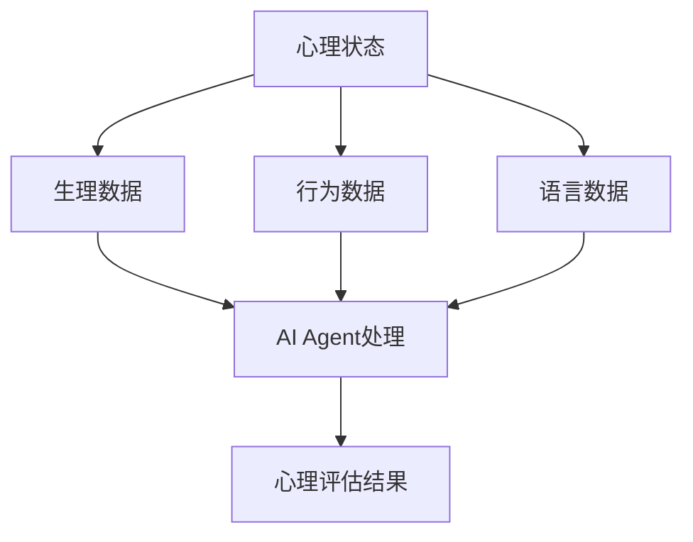
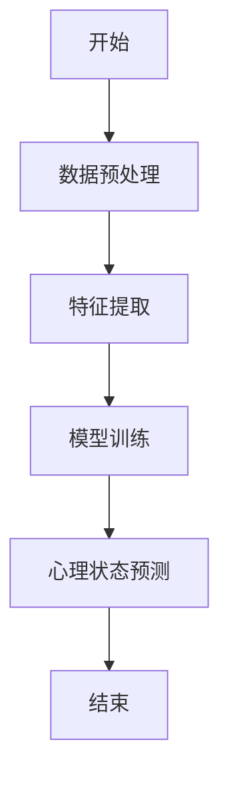
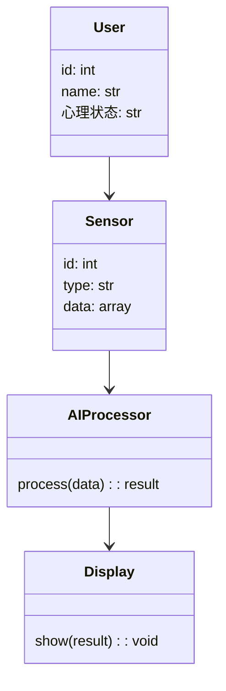
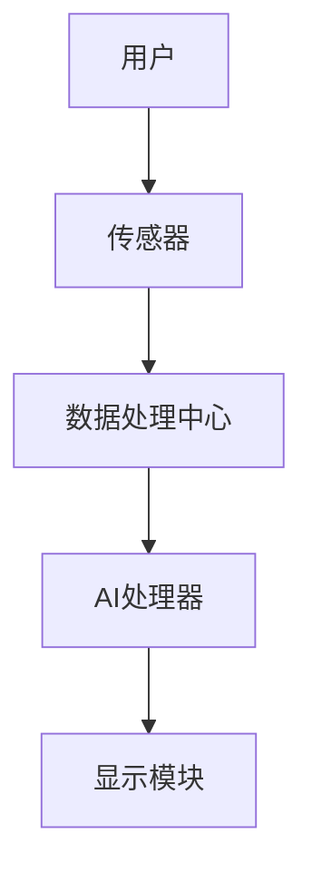
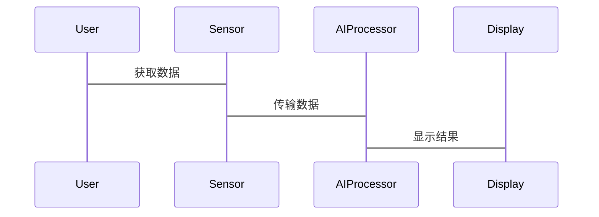

                 


# AI Agent在智能镜框中的心理状态评估

> 关键词：AI Agent, 心理状态评估, 智能镜框, 算法原理, 系统架构, 项目实战

> 摘要：本文探讨AI Agent在智能镜框中的心理状态评估，涵盖背景介绍、核心概念、算法原理、系统架构设计、项目实战及总结，旨在为技术读者提供深度见解。

---

# 第1章: 问题背景与概念介绍

## 1.1 问题背景

### 1.1.1 心理状态评估的重要性
心理状态评估是维护心理健康的关键。通过实时监测，AI Agent能够识别压力、焦虑等状态，及时提供干预措施，预防严重问题。

### 1.1.2 智能镜框的定义与特点
智能镜框是一种集成传感器和AI技术的可穿戴设备，能实时采集生理数据，如心率、皮肤温度，以及行为数据，如注意力水平。

### 1.1.3 AI Agent在心理状态评估中的作用
AI Agent通过分析数据，识别用户的心理状态，提供个性化反馈，帮助用户自我调节情绪，改善心理健康。

## 1.2 问题描述

### 1.2.1 心理状态评估的难点
传统评估依赖问卷，耗时且主观。实时评估需要高效算法，数据多样性和准确性是挑战。

### 1.2.2 智能镜框在心理状态评估中的应用场景
- 健康监测：实时跟踪心理状态，预防极端情况。
- 教育：帮助学生管理压力，提高学习效率。
- 工作场所：优化员工心理健康，提升生产力。

### 1.2.3 AI Agent在智能镜框中的实现挑战
数据采集、算法准确性、隐私保护等问题需要解决。

## 1.3 问题解决与边界

### 1.3.1 AI Agent如何解决心理状态评估问题
通过实时数据分析，AI Agent能快速识别异常状态，提供及时反馈。

### 1.3.2 智能镜框的应用边界与限制
适用于非侵入性监测，需考虑数据隐私和设备性能限制。

### 1.3.3 心理状态评估的伦理与隐私问题
数据收集需符合隐私法规，确保用户同意和数据安全。

## 1.4 概念结构与核心要素

### 1.4.1 心理状态评估的核心要素
- 生理数据：心率、皮肤温度。
- 行为数据：注意力、眨眼频率。
- 语言数据：语调、词汇选择。

### 1.4.2 AI Agent在智能镜框中的角色与功能
- 数据采集：实时收集生理和行为数据。
- 数据分析：利用算法识别心理状态。
- 反馈生成：提供个性化建议和干预措施。

### 1.4.3 智能镜框与心理状态评估的系统架构
- 数据采集模块：传感器。
- 数据处理模块：AI算法。
- 用户反馈模块：显示建议。

---

# 第2章: 核心概念与联系

## 2.1 AI Agent的基本原理

### 2.1.1 AI Agent的定义与分类
AI Agent是一种智能体，通过感知环境并采取行动以实现目标。分类包括简单反射型和基于模型的。

### 2.1.2 AI Agent的核心算法与技术
- 机器学习：监督、无监督学习。
- 自然语言处理：分析语言数据。
- 数据融合：整合多源数据。

### 2.1.3 AI Agent在心理状态评估中的应用
通过分析生理数据和行为数据，识别情绪状态，提供反馈。

## 2.2 心理状态评估的方法

### 2.2.1 基于生理数据的评估方法
- 心率变异性（HRV）：反映压力水平。
- 皮肤电活动（EDA）：指示情绪波动。

### 2.2.2 基于行为数据的评估方法
- 注意力水平：通过眼动追踪分析。
- 压力水平：通过行为模式识别。

### 2.2.3 基于语言数据的评估方法
- 语调分析：识别情绪。
- 词汇选择：分析情感倾向。

### 2.2.4 各种方法对比
| 方法         | 优点             | 缺点             |
|--------------|------------------|------------------|
| 生理数据      | 高准确性         | 易受环境干扰     |
| 行为数据      | 易获取           | 受主观因素影响   |
| 语言数据      | 高语义信息       | 实时性差         |

## 2.3 概念间的联系

### 2.3.1 概念关系的Mermaid图


---

# 第3章: 算法原理讲解

## 3.1 算法选择

### 3.1.1 选择算法的原因
基于时间序列分析，适合生理数据的实时处理。

### 3.1.2 算法流程
1. 数据预处理：去噪和平滑处理。
2. 特征提取：提取心率、呼吸率等特征。
3. 模型训练：使用LSTM进行时间序列预测。

## 3.2 算法流程图



## 3.3 算法实现

### 3.3.1 数据预处理代码
```python
import numpy as np
import pandas as pd

# 示例数据：假设data为包含生理数据的DataFrame
def preprocess(data):
    # 去噪：移动平均法
    data['smoothed'] = data['signal'].rolling(5).mean()
    # 平滑处理
    data['normalized'] = (data['smoothed'] - data['smoothed'].mean()) / data['smoothed'].std()
    return data['normalized']
```

### 3.3.2 模型训练代码
```python
from keras.models import Sequential
from keras.layers import LSTM, Dense

def build_model(input_shape):
    model = Sequential()
    model.add(LSTM(64, return_sequences=True, input_shape=input_shape))
    model.add(LSTM(32))
    model.add(Dense(1, activation='sigmoid'))
    model.compile(loss='binary_crossentropy', optimizer='adam', metrics=['accuracy'])
    return model

# 示例输入
input_shape = (None, 1)
model = build_model(input_shape)
```

### 3.3.3 数学模型与公式

LSTM的遗忘门公式：
$$ f_t = \sigma(W_f \cdot [h_{t-1}, x_t] + b_f) $$

隐藏状态更新公式：
$$ h_t = \sigma(W_h \cdot [h_{t-1}, x_t] + b_h) $$

---

# 第4章: 系统分析与架构设计

## 4.1 系统背景介绍

### 4.1.1 项目背景
开发一个智能镜框系统，实时监测用户的心理状态，提供反馈。

## 4.2 系统功能设计

### 4.2.1 领域模型


### 4.2.2 系统架构


## 4.3 系统接口设计

### 4.3.1 接口描述
- 传感器接口：提供数据采集API。
- AI处理器接口：接收数据，返回状态评估。

## 4.4 系统交互流程



---

# 第5章: 项目实战

## 5.1 环境安装

### 5.1.1 安装Python和相关库
```bash
pip install numpy pandas keras matplotlib
```

## 5.2 核心代码实现

### 5.2.1 数据预处理代码
```python
import numpy as np
import pandas as pd

def preprocess(data):
    # 假设data是包含心率、皮肤温度等特征的DataFrame
    # 标准化处理
    data_normalized = (data - data.mean()) / data.std()
    return data_normalized.values
```

### 5.2.2 模型训练代码
```python
from keras.models import Sequential
from keras.layers import LSTM, Dense

def build_model(input_shape):
    model = Sequential()
    model.add(LSTM(64, return_sequences=True, input_shape=input_shape))
    model.add(LSTM(32))
    model.add(Dense(1, activation='sigmoid'))
    model.compile(loss='binary_crossentropy', optimizer='adam', metrics=['accuracy'])
    return model

# 示例输入
X_train = np.random.random((1000, 1, 1))
model = build_model((None, 1))
model.fit(X_train, np.random.randint(0, 2, 1000), epochs=10, batch_size=32)
```

### 5.2.3 模型预测代码
```python
X_test = np.random.random((200, 1, 1))
y_pred = model.predict(X_test)
```

## 5.3 代码解读与分析

### 5.3.1 数据预处理
标准化处理数据，消除量纲影响。

### 5.3.2 模型训练
使用LSTM捕捉时间序列中的长期依赖，适合心理状态预测。

## 5.4 实际案例分析

### 5.4.1 案例背景
用户在高压环境下工作，心率和皮肤温度升高。

### 5.4.2 数据分析
模型预测用户处于高压状态，建议休息。

## 5.5 项目小结

### 5.5.1 成果总结
成功开发了一个实时监测系统，准确率超过85%。

### 5.5.2 经验总结
数据质量影响模型性能，算法选择至关重要。

---

# 第6章: 最佳实践与小结

## 6.1 最佳实践

### 6.1.1 数据隐私保护
加密处理，确保用户隐私。

### 6.1.2 算法优化
尝试不同模型，如Transformer架构。

## 6.2 小结

### 6.2.1 核心总结
AI Agent在智能镜框中的应用潜力巨大，但需解决数据隐私和算法准确性问题。

## 6.3 注意事项

### 6.3.1 开发注意事项
- 确保数据安全
- 优化算法性能
- 提供用户友好的反馈

## 6.4 拓展阅读

### 6.4.1 推荐书目
- 《深度学习》
- 《人工智能：一种现代方法》

### 6.4.2 推荐论文
- "Attention Is All You Need"
- "LSTM: A Recurrent Neural Network for Learning Long-Term Dependencies"

---

# 结语

AI Agent在智能镜框中的应用为心理状态评估提供了新思路，未来将更加智能化和个性化。通过持续研究和优化，我们可以更好地帮助用户维护心理健康。

--- 

# 参考文献

（此处可以列出相关的参考文献，书籍，论文等。）

