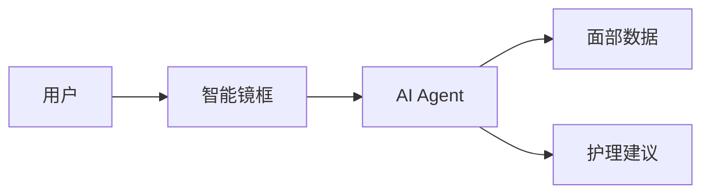
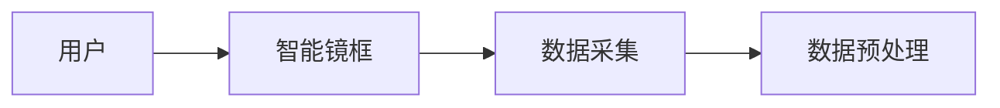
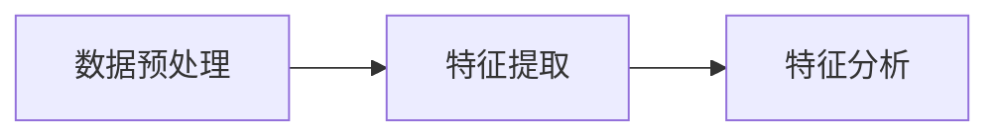
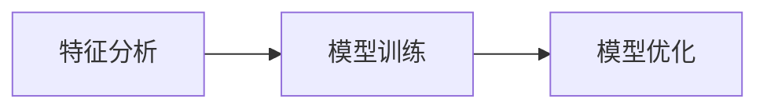
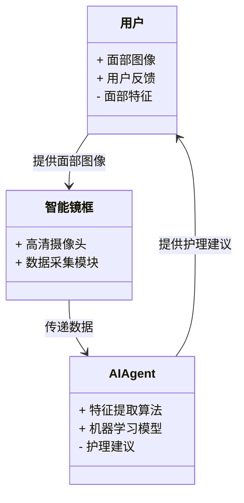
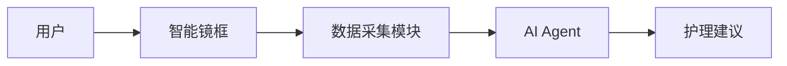
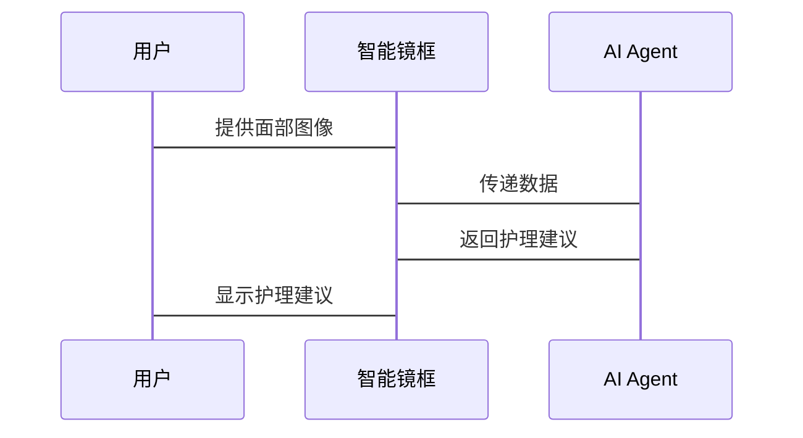

                 


# AI Agent在智能镜框中的面部护理建议

> 关键词：AI Agent，智能镜框，面部护理，计算机视觉，机器学习

> 摘要：本文探讨了AI Agent在智能镜框中的应用，通过计算机视觉和机器学习技术，实时分析面部数据，提供个性化的护理建议，旨在优化用户的面部护理体验。

---

# 第1章：AI Agent与智能镜框的背景介绍

## 1.1 问题背景与描述

### 1.1.1 传统面部护理的局限性
传统面部护理方法依赖于人工经验，存在以下问题：
- **缺乏个性化**：每个人的肤质和需求不同，通用的护理方案效果有限。
- **效率低下**：人工分析面部特征耗时耗力，难以实时反馈。
- **准确性不足**：依赖主观判断，容易受经验影响，准确性难以保证。

### 1.1.2 智能镜框的定义与特点
智能镜框是一种集成AI技术的智能设备，具备以下特点：
- **实时监测**：通过摄像头和传感器实时采集面部数据。
- **数据处理**：利用计算机视觉和机器学习技术分析数据。
- **智能交互**：提供个性化的护理建议，并支持用户交互。

### 1.1.3 AI Agent在面部护理中的作用
AI Agent作为智能镜框的核心，负责：
- **数据处理**：实时分析面部特征，如肤色、纹理等。
- **决策支持**：基于分析结果，推荐护理方案和产品。
- **动态调整**：根据用户反馈和环境变化，动态优化建议。

### 1.1.4 问题的边界与外延
智能镜框的边界包括：
- **数据采集范围**：仅限于面部数据，不涉及身体其他部位。
- **功能限制**：专注于护理建议，不涉及医疗诊断。
- **使用场景**：适用于个人日常护理，不适用于专业医疗环境。

### 1.1.5 概念结构与核心要素
智能镜框的面部护理系统由以下核心要素组成：
- **用户数据**：面部图像、皮肤状态等。
- **AI算法**：用于特征提取、分类和推荐。
- **交互界面**：用户与系统互动的媒介。
- **护理知识库**：包含各种护理建议和产品信息。

---

## 1.2 本章小结
本章介绍了AI Agent在智能镜框中的应用背景，分析了传统护理的局限性，定义了智能镜框的特点及其在面部护理中的作用，明确了系统的边界和核心要素。

---

# 第2章：AI Agent的核心概念与原理

## 2.1 AI Agent的核心概念

### 2.1.1 AI Agent的定义
AI Agent是一种能够感知环境、自主决策并采取行动的智能系统，旨在为用户提供智能化服务。

### 2.1.2 AI Agent的核心属性对比
| 属性 | 描述 |
|------|------|
| 智能性 | 基于AI算法进行决策 |
| 交互性 | 支持用户交互 |
| 实时性 | 可实时处理数据 |
| 个性化 | 提供个性化建议 |

### 2.1.3 AI Agent与智能镜框的关系
通过mermaid图展示：


## 2.2 智能镜框的实体关系图


---

## 2.3 本章小结
本章详细阐述了AI Agent的核心概念，分析了其在智能镜框中的角色和功能，通过实体关系图展示了系统各组件之间的关系。

---

# 第3章：AI Agent的算法与流程

## 3.1 数据采集与处理

### 3.1.1 面部数据采集流程


### 3.1.2 数据预处理步骤
- **图像增强**：调整亮度、对比度等。
- **噪声消除**：去除图像中的噪声。
- **标准化处理**：统一数据格式和尺寸。

## 3.2 特征提取与分析

### 3.2.1 面部特征提取算法


### 3.2.2 常见特征提取方法
- **基于纹理的特征提取**：分析皮肤纹理特征。
- **基于颜色的特征提取**：提取面部颜色分布特征。

## 3.3 AI模型训练与优化

### 3.3.1 神经网络模型训练


### 3.3.2 模型优化策略
- **超参数调整**：优化学习率、批次大小等参数。
- **数据增强**：增加训练数据的多样性。

## 3.4 算法数学模型

### 3.4.1 面部特征提取的数学公式
$$ y = f(x) $$
其中，$x$ 是输入的面部特征，$y$ 是输出的特征向量。

### 3.4.2 模型训练的损失函数
$$ L = \sum_{i=1}^{n} (y_i - \hat{y_i})^2 $$

---

## 3.5 本章小结
本章详细讲解了AI Agent在智能镜框中的算法流程，包括数据采集、特征提取、模型训练等步骤，并通过数学公式和流程图展示了算法的实现过程。

---

# 第4章：系统分析与架构设计方案

## 4.1 问题场景介绍
智能镜框的使用场景包括：
- **家庭使用**：用户在家中使用智能镜框进行日常护理。
- **美容店**：美容顾问可以使用智能镜框为顾客提供专业建议。

## 4.2 系统功能设计

### 4.2.1 领域模型


### 4.2.2 系统架构设计


### 4.2.3 系统接口设计
- **输入接口**：用户面部图像输入。
- **输出接口**：护理建议输出。
- **交互接口**：用户与系统互动的界面。

### 4.2.4 系统交互序列图


---

## 4.3 本章小结
本章分析了智能镜框的系统架构，设计了系统的功能模块和交互流程，并通过mermaid图展示了系统的类图和序列图。

---

# 第5章：项目实战

## 5.1 环境安装

### 5.1.1 系统环境
- 操作系统：Linux/Windows/MacOS
- 开发工具：PyCharm/VS Code
- 依赖库：OpenCV、TensorFlow、Keras

### 5.1.2 安装步骤
```bash
pip install opencv-python tensorflow keras
```

## 5.2 核心代码实现

### 5.2.1 数据采集模块
```python
import cv2

def capture_face():
    cap = cv2.VideoCapture(0)
    ret, frame = cap.read()
    if ret:
        cv2.imwrite("face.jpg", frame)
    cap.release()
```

### 5.2.2 特征提取模块
```python
import cv2
import numpy as np

def extract_features(image_path):
    img = cv2.imread(image_path)
    # 转换为灰度图像
    gray = cv2.cvtColor(img, cv2.COLOR_BGR2GRAY)
    # 使用OpenCV进行特征提取
    features = cv2.face.LBPHFaceRecognizer().extract Features(gray)
    return features
```

### 5.2.3 AI模型训练模块
```python
from tensorflow.keras.models import Sequential
from tensorflow.keras.layers import Dense

def train_model(features, labels):
    model = Sequential()
    model.add(Dense(64, activation='relu', input_dim=features.shape[1]))
    model.add(Dense(10, activation='softmax'))
    model.compile(optimizer='adam', loss='sparse_categorical_crossentropy', metrics=['accuracy'])
    model.fit(features, labels, epochs=10, batch_size=32)
    return model
```

## 5.3 代码解读与分析
- **数据采集模块**：通过摄像头捕获用户面部图像并保存。
- **特征提取模块**：使用OpenCV提取面部特征。
- **AI模型训练模块**：构建神经网络模型，训练分类器以识别不同面部特征。

## 5.4 实际案例分析
假设用户上传一张面部图像，系统通过AI Agent分析后，推荐适合的洁面产品和防晒霜。

## 5.5 本章小结
本章通过实际项目案例，详细讲解了智能镜框的实现过程，包括环境安装、核心代码实现和案例分析。

---

# 第6章：总结与展望

## 6.1 本章总结
AI Agent在智能镜框中的应用，通过计算机视觉和机器学习技术，为用户提供个性化的面部护理建议，显著提升了护理的效率和准确性。

## 6.2 注意事项
- **数据隐私**：确保用户数据的安全性和隐私性。
- **模型优化**：持续优化AI模型，提高推荐的准确性。

## 6.3 拓展阅读
- 《深度学习入门》
- 《计算机视觉实战》
- 《Python机器学习》

---

# 附录：参考文献
1. LeCun, Y., Bengio, Y., & Hinton, G. (2015). Deep learning. Nature, 521(7555), 436-444.
2. Everingham, A., Eslami, S. M., & Torr, P. H. (2010). The Pascal visual object classes (VOC) challenge.

---

# 结语
通过本文的介绍，读者可以全面了解AI Agent在智能镜框中的应用，从理论到实践，掌握其在面部护理中的潜力和价值。希望本文能为相关领域的研究和应用提供有益的参考。

