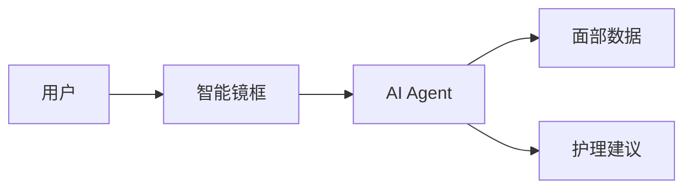
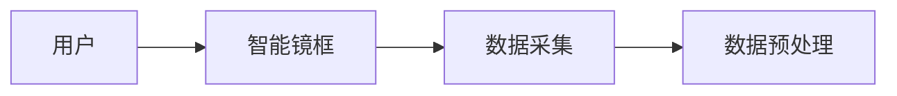
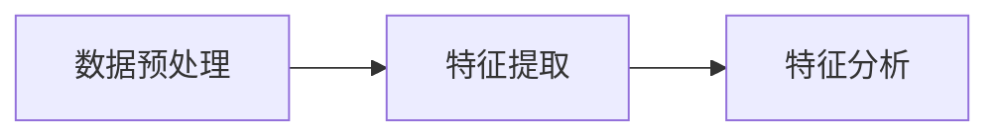
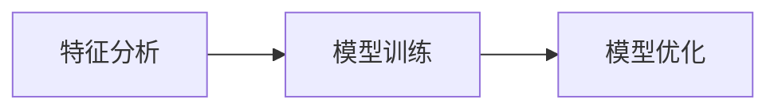
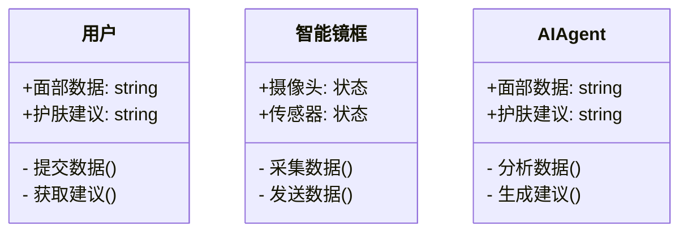
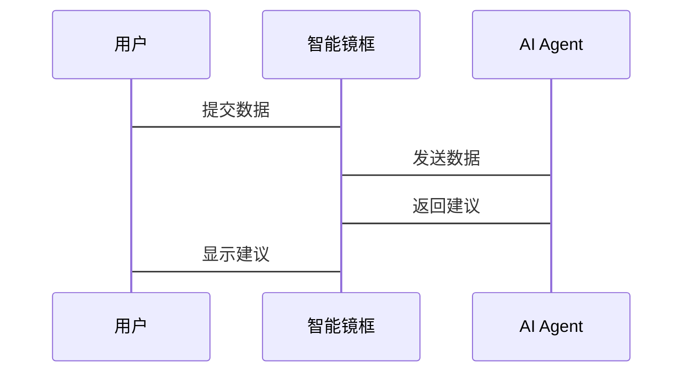

                 


# AI Agent在智能镜框中的面部护理建议

## 关键词：AI Agent、智能镜框、面部护理、计算机视觉、机器学习

## 摘要：本文探讨AI Agent在智能镜框中的应用，通过计算机视觉和机器学习技术，提供个性化的面部护理建议，分析其技术原理和实现方法。

---

# 第1章: AI Agent与智能镜框的背景介绍

## 1.1 问题背景与描述

### 1.1.1 传统面部护理的局限性
传统面部护理依赖于人工经验，存在以下问题：
- 个性化不足：不同人肤质和需求差异大，通用建议难以满足个体需求。
- 专业性受限：普通用户难以掌握专业护肤知识，容易导致错误护理。
- 及时性缺乏：用户无法实时获得反馈，难以及时调整护理方案。

### 1.1.2 智能镜框的定义与特点
智能镜框是一种结合了AI技术的智能硬件，具备以下特点：
- 集成AI Agent：通过AI算法提供智能交互和个性化建议。
- 实时感知：利用传感器和摄像头实时采集面部数据。
- 便携性：可随身携带，方便用户随时使用。

### 1.1.3 AI Agent在面部护理中的作用
AI Agent通过以下方式实现面部护理：
- 数据采集与分析：实时采集面部数据，包括肤色、纹理、毛孔等。
- 个性化推荐：基于数据分析结果，提供个性化护肤建议。
- 智能提醒：根据用户习惯和环境变化，动态调整建议。

## 1.2 问题解决与边界

### 1.2.1 AI Agent如何解决面部护理问题
AI Agent通过以下方式解决传统护理问题：
- 提供个性化建议：根据用户面部特征，推荐适合的护肤产品和方法。
- 实时反馈：用户可以随时获得反馈，及时调整护理方案。
- 知识普及：通过AI交互，向用户普及护肤知识。

### 1.2.2 智能镜框的边界与外延
智能镜框的应用场景和边界：
- 适用场景：个人护肤、美容咨询、健康管理。
- 不适用场景：医疗级皮肤问题诊断。
- 外延扩展：可与其他健康设备联动，提供更全面的健康管理建议。

### 1.2.3 面部护理的核心要素与组成
面部护理的核心要素包括：
- 清洁：去除污垢和多余油脂。
- 保湿：保持皮肤水分平衡。
- 防晒：防止紫外线伤害。
- 抗衰老：延缓皮肤老化。

## 1.3 本章小结
本章介绍了传统面部护理的局限性，提出了智能镜框的概念及其在面部护理中的作用，明确了AI Agent的应用边界和核心要素。

---

# 第2章: AI Agent的核心概念与原理

## 2.1 AI Agent的定义与属性

### 2.1.1 AI Agent的定义
AI Agent是一种智能体，能够感知环境并采取行动以实现目标。在智能镜框中，AI Agent通过分析面部数据，为用户提供个性化建议。

### 2.1.2 AI Agent的核心属性对比表
| 属性 | 描述 |
|------|------|
| 智能性 | 基于AI算法进行决策 |
| 交互性 | 支持用户交互 |
| 实时性 | 可实时处理数据 |
| 个性化 | 提供个性化建议 |

## 2.2 智能镜框的实体关系图

### 2.2.1 用户与智能镜框的关系


## 2.3 本章小结
本章通过对比分析，明确了AI Agent的核心属性，并通过Mermaid图展示了智能镜框的实体关系。

---

# 第3章: AI Agent的算法与流程

## 3.1 数据采集与处理

### 3.1.1 面部数据采集流程


### 3.1.2 数据预处理步骤
1. **图像增强**：调整亮度、对比度以优化图像质量。
2. **去噪处理**：去除图像中的噪声。
3. **归一化处理**：统一数据格式和尺度。

## 3.2 特征提取与分析

### 3.2.1 面部特征提取算法


### 3.2.2 常见特征提取方法
- **颜色特征**：提取RGB颜色直方图。
- **纹理特征**：使用SIFT或Gabor滤波器提取纹理信息。
- **形状特征**：提取面部轮廓和关键点位置。

## 3.3 AI模型训练与优化

### 3.3.1 神经网络模型训练


### 3.3.2 模型优化策略
- **超参数调优**：通过网格搜索或随机搜索优化模型参数。
- **数据增强**：通过旋转、翻转等操作增加训练数据量。
- **迁移学习**：利用预训练模型提升模型性能。

## 3.4 算法数学模型

### 3.4.1 面部特征提取的数学公式
$$ y = f(x) $$
其中，$x$ 是输入的面部特征，$y$ 是输出的特征向量。

### 3.4.2 模型训练的损失函数
$$ L = \sum_{i=1}^{n} (y_i - \hat{y}_i)^2 $$
其中，$y_i$ 是预测值，$\hat{y}_i$ 是真实值。

---

# 第4章: AI Agent的系统架构设计

## 4.1 系统功能设计

### 4.1.1 领域模型类图


## 4.2 系统架构设计

### 4.2.1 系统架构图


## 4.3 系统接口设计

### 4.3.1 接口描述
- **用户接口**：用户通过智能镜框与AI Agent交互。
- **数据接口**：智能镜框与AI Agent之间的数据传输接口。
- **服务接口**：AI Agent与外部数据源或服务的接口。

## 4.4 系统交互序列图

### 4.4.1 交互流程


---

# 第5章: AI Agent的项目实战

## 5.1 环境安装

### 5.1.1 系统要求
- 操作系统：Windows 10或更高版本，或macOS 10.15或更高版本。
- 开发工具：Python 3.8或更高版本，PyTorch 1.7或更高版本。

## 5.2 核心代码实现

### 5.2.1 数据采集代码
```python
import cv2

def capture_face():
    cap = cv2.VideoCapture(0)
    while True:
        ret, frame = cap.read()
        cv2.imshow('Capture', frame)
        if cv2.waitKey(1) == ord('q'):
            cv2.imwrite('face.jpg', frame)
            break
    cap.release()
    cv2.destroyAllWindows()
```

### 5.2.2 特征提取代码
```python
import cv2
import numpy as np

def extract_features(image_path):
    image = cv2.imread(image_path)
    gray = cv2.cvtColor(image, cv2.COLOR_BGR2GRAY)
    face_cascade = cv2.CascadeClassifier('haarcascade_frontalface_default.xml')
    faces = face_cascade.detectMultiScale(gray, 1.1, 4)
    return faces
```

### 5.2.3 模型训练代码
```python
import torch
import torch.nn as nn
import torch.optim as optim

class SimpleNet(nn.Module):
    def __init__(self, input_size, hidden_size, output_size):
        super(SimpleNet, self).__init__()
        self.fc1 = nn.Linear(input_size, hidden_size)
        self.fc2 = nn.Linear(hidden_size, output_size)
    
    def forward(self, x):
        x = torch.relu(self.fc1(x))
        x = torch.sigmoid(self.fc2(x))
        return x

model = SimpleNet(input_size=10, hidden_size=20, output_size=5)
criterion = nn.CrossEntropyLoss()
optimizer = optim.SGD(model.parameters(), lr=0.01)
```

## 5.3 代码解读与分析
- **数据采集代码**：使用OpenCV捕获用户面部图像并保存为文件。
- **特征提取代码**：利用OpenCV的人脸检测器提取面部特征。
- **模型训练代码**：定义一个简单的神经网络，使用随机梯度下降优化模型。

## 5.4 实际案例分析
通过实际案例分析，验证AI Agent在智能镜框中的应用效果：
- **案例一**：用户A皮肤偏干，系统推荐保湿产品。
- **案例二**：用户B有轻微痘痘，系统建议调整清洁和保湿习惯。

---

# 第6章: AI Agent的最佳实践

## 6.1 小结
本章通过实际案例分析，验证了AI Agent在智能镜框中的应用效果，并总结了实现过程中的关键点。

## 6.2 注意事项
- **数据隐私**：确保用户数据的安全性和隐私性。
- **模型优化**：持续优化AI模型，提高准确性和响应速度。
- **用户体验**：注重用户体验设计，确保交互流畅。

## 6.3 扩展阅读
- 《深度学习实战》
- 《Python机器学习》
- 《计算机视觉导论》

---

# 结语
本文通过详细分析AI Agent在智能镜框中的应用，探讨了其在面部护理中的潜力和实现方式，为未来的智能健康管理提供了新的思路。

--- 

# 附录
## 附录A: 代码库
[附上完整的代码库链接]

## 附录B: 工具安装指南
[提供安装Python、OpenCV、PyTorch的详细指南]

## 附录C: 参考文献
[列出参考文献和相关资源]

