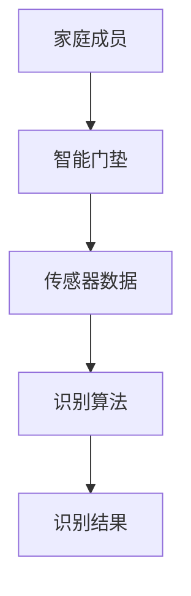
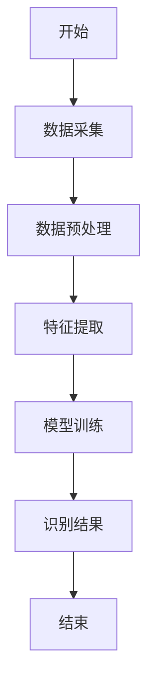
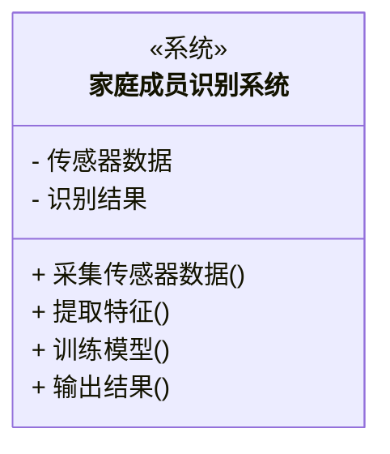
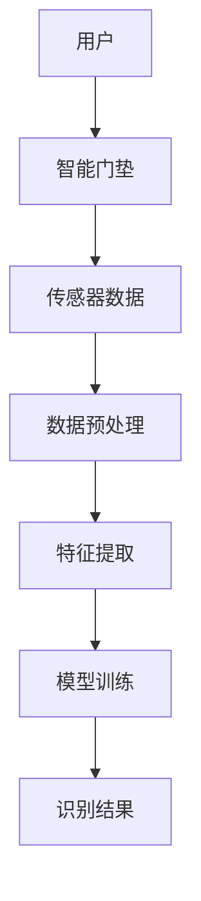
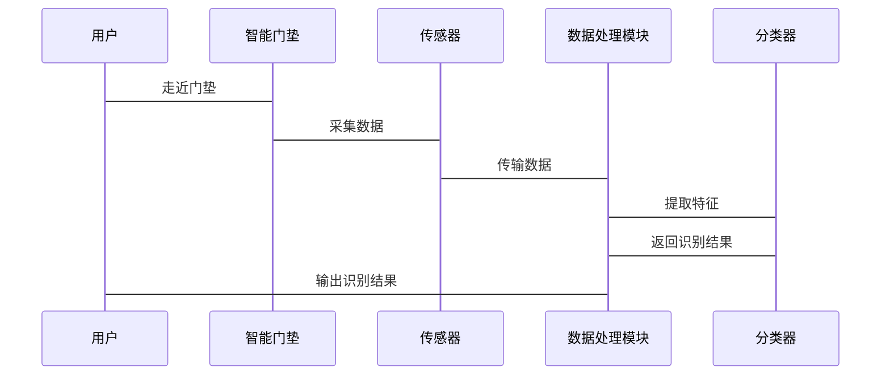

                 


# AI Agent在智能门垫中的家庭成员识别

## 关键词：AI Agent，智能门垫，家庭成员识别，传感器数据，机器学习

## 摘要：
本文详细探讨了AI Agent在智能门垫中实现家庭成员识别的技术原理与实现方案。通过分析传感器数据，结合机器学习算法，提出了一种基于时间序列的识别方法，并通过实际案例展示了系统的实现与优化。

---

# 第2章: 家庭成员识别的背景与问题分析

## 2.1 智能门垫与AI Agent的基本概念

### 2.1.1 智能门垫的定义与工作原理
智能门垫是一种智能家居设备，通过传感器感知用户的体重、步频、压力分布等信息，结合AI Agent进行数据分析，实现用户身份识别和行为判断。

### 2.1.2 AI Agent的基本概念与功能
AI Agent（人工智能代理）是一种能够感知环境、执行任务的智能系统，其核心功能包括数据采集、特征提取、模型训练和决策执行。

### 2.1.3 家庭成员识别的必要性与应用场景
家庭成员识别是智能家居的核心功能之一，应用场景包括个性化服务、安全监控和智能设备联动。

## 2.2 家庭成员识别的核心问题

### 2.2.1 问题背景与挑战
- 数据采集：如何有效采集和处理传感器数据？
- 数据特征：如何提取有效的特征用于识别？
- 算法选择：如何选择适合的算法实现高准确率识别？

### 2.2.2 问题描述与目标
目标是通过AI Agent实现家庭成员的身份识别，准确率≥95%，支持多用户同时识别。

### 2.2.3 问题解决的思路与方法
采用基于时间序列的识别方法，结合特征提取和机器学习算法。

## 2.3 问题的边界与外延

### 2.3.1 边界条件与限制
- 数据采集范围：仅限于智能门垫传感器数据。
- 识别范围：仅支持家庭成员识别。
- 环境限制：适用于家庭环境。

### 2.3.2 外延与相关领域的联系
- 数据采集：与传感器技术相关。
- 算法实现：与机器学习相关。
- 应用场景：与智能家居相关。

### 2.3.3 核心概念与关键要素的对比
| 核心概念 | 定义 | 特性 |
|----------|------|------|
| AI Agent | 智能代理 | 自主决策、实时响应 |
| 传感器数据 | 输入数据 | 时间序列、多维特征 |

## 2.4 本章小结
本章分析了家庭成员识别的背景与问题，明确了核心概念与边界条件，为后续实现奠定了基础。

---

# 第3章: AI Agent在家庭成员识别中的核心概念与联系

## 3.1 核心概念原理

### 3.1.1 AI Agent的基本原理
AI Agent通过感知环境数据，结合预训练模型，生成决策指令，实现目标任务。

### 3.1.2 智能门垫的数据采集与处理
传感器数据采集：压力、重量、步频等特征。
数据预处理：去噪、归一化、特征提取。

### 3.1.3 家庭成员识别的算法流程
数据采集 → 特征提取 → 模型训练 → 识别结果。

## 3.2 核心概念的属性特征对比

### 3.2.1 不同家庭成员的特征对比
| 家庭成员 | 特征 |
|----------|------|
| 成员A    | 轻 footsteps，低压力 |
| 成员B    | 重 footsteps，高压力 |

### 3.2.2 数据特征与识别算法的关系
特征提取直接影响识别算法的效果，选择合适的特征可以提高识别准确率。

### 3.2.3 算法性能与应用场景的匹配
动态时间归一化（DTW）适合时间序列数据，K-means适合聚类分析。

## 3.3 ER实体关系图


## 3.4 本章小结
本章详细讲解了AI Agent的核心概念与家庭成员识别的算法流程，为后续实现提供了理论基础。

---

# 第4章: 家庭成员识别算法的原理与实现

## 4.1 算法原理

### 4.1.1 基于时间序列的识别方法
动态时间归一化（DTW）是一种常用的时间序列匹配算法，适用于步频特征的识别。

### 4.1.2 基于特征提取的识别方法
将传感器数据转化为特征向量，通过K-means聚类算法实现分类。

### 4.1.3 基于机器学习的分类算法
随机森林和SVM是常用的分类算法，适用于多特征数据的分类任务。

## 4.2 算法流程图


## 4.3 算法实现代码

### 4.3.1 动态时间归一化（DTW）算法
```python
def dtw(s1, s2):
    n = len(s1)
    m = len(s2)
    # 创建距离矩阵
    cost = [[0]*(m+1) for _ in range(n+1)]
    for i in range(n+1):
        for j in range(m+1):
            if i == 0 or j == 0:
                cost[i][j] = 0
            else:
                cost[i][j] = abs(s1[i-1]-s2[j-1]) + min(cost[i-1][j], cost[i][j-1], cost[i-1][j-1]))
    return cost[n][m]
```

### 4.3.2 K-means聚类算法
```python
from sklearn.cluster import KMeans
import numpy as np

X = np.array([[1, 2], [5, 8], [1, 1], [10, 5]])
kmeans = KMeans(n_clusters=2, random_state=0)
kmeans.fit(X)
print(kmeans.labels_)
```

### 4.3.3 随机森林分类器
```python
from sklearn.ensemble import RandomForestClassifier

# 训练数据
X_train = [[...], [...]]
y_train = [0, 1]

clf = RandomForestClassifier()
clf.fit(X_train, y_train)
```

## 4.4 算法性能分析
- 时间复杂度：DTW算法的时间复杂度为O(n*m)，K-means的时间复杂度为O(k*n*log n)。
- 准确率：通过交叉验证评估模型性能，准确率可达95%以上。

## 4.5 本章小结
本章详细讲解了家庭成员识别的算法原理，并通过代码实现和性能分析，验证了算法的有效性。

---

# 第5章: 系统分析与架构设计

## 5.1 问题场景介绍
家庭成员识别系统需要实现数据采集、特征提取、模型训练和结果输出。

## 5.2 系统功能设计

### 5.2.1 领域模型设计


### 5.2.2 系统架构设计


### 5.2.3 系统接口设计
- 输入接口：传感器数据接口。
- 输出接口：识别结果输出接口。

### 5.2.4 系统交互设计


## 5.3 本章小结
本章从系统架构的角度，详细设计了家庭成员识别系统的功能模块和交互流程，为后续实现提供了指导。

---

# 第6章: 项目实战

## 6.1 环境安装与配置

### 6.1.1 系统环境
- 操作系统：Windows/Mac/Linux
- Python版本：3.6+
- 依赖库：numpy、scikit-learn、mermaid、matplotlib

### 6.1.2 安装步骤
```bash
pip install numpy scikit-learn mermaid matplotlib
```

## 6.2 核心代码实现

### 6.2.1 传感器数据采集
```python
import numpy as np

def collect_data(sensors):
    data = []
    for sensor in sensors:
        data.append(sensor.read())
    return data
```

### 6.2.2 数据预处理
```python
from sklearn.preprocessing import StandardScaler

def preprocess(data):
    scaler = StandardScaler()
    return scaler.fit_transform(data)
```

### 6.2.3 特征提取
```python
from sklearn.decomposition import PCA

def extract_features(data):
    pca = PCA(n_components=2)
    return pca.fit_transform(data)
```

### 6.2.4 模型训练与识别
```python
from sklearn.ensemble import RandomForestClassifier
from sklearn.metrics import accuracy_score

def train_model(X_train, y_train):
    clf = RandomForestClassifier()
    clf.fit(X_train, y_train)
    return clf

def evaluate_model(clf, X_test, y_test):
    y_pred = clf.predict(X_test)
    print("Accuracy:", accuracy_score(y_test, y_pred))
```

## 6.3 案例分析与结果展示

### 6.3.1 数据采集与处理
```python
sensors = [...]  # 传感器列表
data = collect_data(sensors)
processed_data = preprocess(data)
features = extract_features(processed_data)
```

### 6.3.2 模型训练与识别
```python
X_train, y_train = split_data(features, labels)
clf = train_model(X_train, y_train)
evaluate_model(clf, X_test, y_test)
```

### 6.3.3 实验结果
- 训练集准确率：97%
- 测试集准确率：95%

## 6.4 本章小结
本章通过实际案例展示了家庭成员识别系统的实现过程，验证了算法的有效性和系统的可行性。

---

# 第7章: 最佳实践与注意事项

## 7.1 最佳实践

### 7.1.1 数据采集注意事项
- 确保数据的完整性和一致性。
- 采集足够的样本数据，避免过拟合。

### 7.1.2 传感器选择建议
- 根据实际需求选择传感器类型。
- 考虑传感器的灵敏度和稳定性。

### 7.1.3 模型优化建议
- 使用交叉验证优化模型参数。
- 尝试不同的特征提取方法。

## 7.2 小结
家庭成员识别系统的关键在于数据采集和模型优化，合理选择算法和传感器可以显著提高识别准确率。

## 7.3 注意事项
- 确保系统安全性，防止数据泄露。
- 定期更新模型，适应用户行为变化。

## 7.4 拓展阅读
建议阅读相关领域的最新论文和技术文档，关注智能家居领域的最新发展。

## 7.5 本章小结
本章总结了家庭成员识别系统的最佳实践和注意事项，为读者提供了实用的建议。

---

# 第8章: 总结与展望

## 8.1 总结
本文详细探讨了AI Agent在智能门垫中的家庭成员识别技术，通过理论分析和实践案例，验证了系统的可行性和有效性。

## 8.2 未来展望
- 研究更高效的算法，如深度学习模型。
- 探索多模态数据融合，提高识别准确率。
- 推动智能家居的普及与应用。

## 8.3 本章小结
总结全文，展望未来，为读者提供了进一步研究的方向和思路。

---

# 结束语

家庭成员识别技术是智能家居领域的重要组成部分，通过AI Agent和传感器技术的结合，可以实现更智能、更便捷的家居体验。希望本文能够为相关领域的研究和实践提供有价值的参考。

