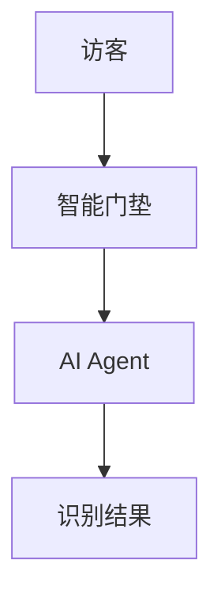
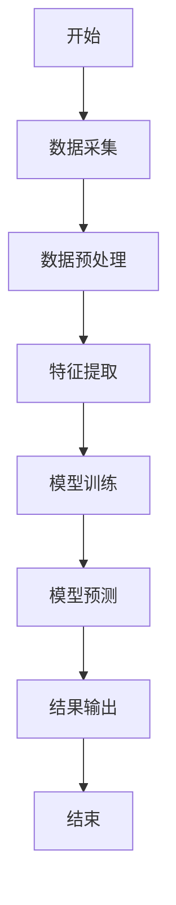
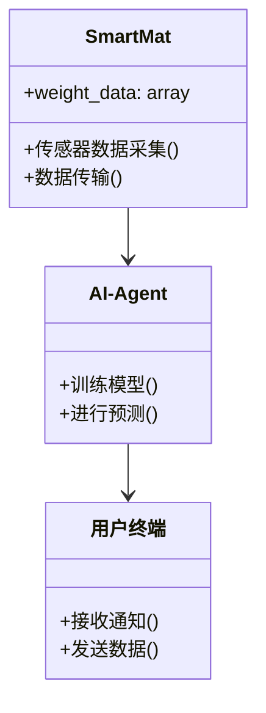
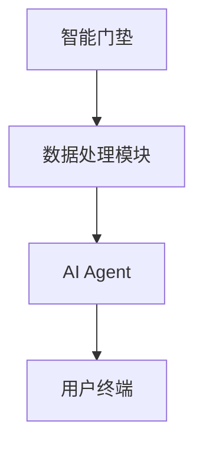

                 


# AI Agent在智能门垫中的访客识别系统

> 关键词：AI Agent，智能门垫，访客识别，传感器数据，机器学习，物联网

> 摘要：本文探讨了AI Agent在智能门垫中的应用，重点分析了访客识别系统的背景、核心概念、算法原理、系统架构设计以及实际项目实现。通过详细的技术分析和代码示例，展示了如何利用AI Agent提升访客识别的准确性与效率。

---

## 第1章: 问题背景与系统需求

### 1.1 问题背景

#### 1.1.1 智能门垫的访客识别需求
智能门垫是一种基于物联网的智能家居设备，通过感知压力变化来检测访客的到来。传统的访客识别系统主要依赖于传感器数据和简单的逻辑判断，但在面对复杂场景时，如不同体重的访客、宠物干扰等，往往难以准确识别。AI Agent的引入能够显著提升系统的智能化水平，使其能够学习和适应各种场景。

#### 1.1.2 当前访客识别技术的局限性
传统的访客识别系统存在以下问题：
- **误识别率高**：无法准确区分人类访客与宠物或其他物体。
- **适应性差**：无法根据环境变化自动调整识别策略。
- **数据处理能力有限**：难以处理大规模数据，无法进行深度学习和优化。

#### 1.1.3 AI Agent在访客识别中的优势
AI Agent（智能体）是一种能够感知环境、自主决策的实体，具备以下优势：
- **学习能力**：能够通过数据学习，不断优化识别算法。
- **自适应性**：能够根据环境变化调整识别策略。
- **实时性**：能够快速响应，提供实时的访客识别服务。

### 1.2 系统目标与功能需求

#### 1.2.1 系统目标
本系统旨在通过AI Agent实现智能门垫的访客识别功能，目标是：
- 提供高精度的访客识别服务。
- 实现对访客的实时监测和通知。
- 提供便捷的用户交互界面。

#### 1.2.2 功能需求分析
系统的功能需求包括：
1. **访客检测**：通过压力传感器检测访客的到来。
2. **身份识别**：利用AI算法识别访客身份。
3. **通知机制**：通过手机或其他设备通知用户访客信息。
4. **数据存储**：存储历史访客数据，便于后续分析。

#### 1.2.3 系统边界与外延
系统的边界包括智能门垫、AI Agent、传感器模块和用户终端。系统的外延部分涉及数据传输、用户界面和第三方服务。

### 1.3 核心概念与系统架构

#### 1.3.1 AI Agent的定义与特点
AI Agent是一种能够感知环境、自主决策的智能实体，具备以下特点：
- **感知能力**：能够通过传感器获取环境数据。
- **学习能力**：能够通过机器学习算法优化识别模型。
- **决策能力**：能够根据识别结果做出相应的决策。

#### 1.3.2 智能门垫的工作原理
智能门垫通过压力传感器采集访客的体重分布数据，将数据传输给AI Agent进行分析，最终识别出访客的身份。

#### 1.3.3 系统核心要素与组成
系统的组成包括：
1. **智能门垫**：负责采集访客的体重数据。
2. **AI Agent**：负责处理数据并进行访客识别。
3. **用户终端**：负责接收通知并提供交互界面。

---

## 第2章: 核心概念与系统架构

### 2.1 AI Agent与智能门垫的关系

#### 2.1.1 AI Agent的基本原理
AI Agent通过感知环境数据，利用机器学习算法进行分析和决策。其核心在于数据的处理和算法的优化。

#### 2.1.2 智能门垫的传感器与数据采集
智能门垫通过压力传感器采集访客的体重数据，数据经过预处理后传输给AI Agent。

#### 2.1.3 AI Agent与智能门垫的交互机制
AI Agent通过API与智能门垫进行数据交互，接收数据后进行处理和分析，最终输出识别结果。

### 2.2 核心概念对比分析

#### 2.2.1 传统传感器与AI Agent的对比
| 特性          | 传统传感器         | AI Agent             |
|---------------|--------------------|-----------------------|
| 数据处理能力  | 有限               | 强大                 |
| 学习能力      | 无                 | 有                   |
| 决策能力      | 无                 | 有                   |

#### 2.2.2 不同访客识别技术的优劣势分析
| 技术           | 优点               | 缺点                 |
|----------------|--------------------|-----------------------|
| 传统传感器     | 成本低               | 误识别率高           |
| AI Agent       | 准确率高             | 需要大量数据支持     |

#### 2.2.3 系统核心要素的特征对比表格
| 核心要素       | 特征               |
|----------------|--------------------|
| 智能门垫       | 数据采集           |
| AI Agent       | 数据处理与分析     |
| 用户终端       | 通知与交互         |

### 2.3 系统实体关系图

#### 2.3.1 ER实体关系图


---

## 第3章: 算法原理与实现

### 3.1 算法原理

#### 3.1.1 基于AI Agent的访客识别算法
AI Agent通过机器学习算法对访客的体重数据进行分类，常用的算法包括支持向量机（SVM）和随机森林（Random Forest）。

#### 3.1.2 算法的核心思想
- 数据预处理：对传感器数据进行标准化处理。
- 特征提取：提取访客的体重特征。
- 模型训练：利用训练数据训练机器学习模型。
- 模型优化：通过交叉验证优化模型参数。

#### 3.1.3 算法的数学模型与公式
访客识别的分类问题可以表示为：
$$ y = f(x) $$
其中，$x$ 是访客的体重数据，$y$ 是访客的身份标签。

### 3.2 算法实现

#### 3.2.1 算法流程图


#### 3.2.2 代码实现
```python
import numpy as np
from sklearn import svm

# 示例数据集
X = np.array([[50, 60], [70, 80], [90, 100], [110, 120]])
y = np.array([0, 1, 0, 1])  # 0表示不是访客，1表示是访客

# 数据分割
X_train, X_test, y_train, y_test = train_test_split(X, y, test_size=0.2, random_state=42)

# 模型训练
model = svm.SVC()
model.fit(X_train, y_train)

# 模型预测
y_pred = model.predict(X_test)

# 模型评估
accuracy = accuracy_score(y_test, y_pred)
print(f"准确率: {accuracy}")
```

---

## 第4章: 系统分析与架构设计

### 4.1 系统分析

#### 4.1.1 问题场景介绍
系统需要在家庭环境中实现访客识别功能，用户通过手机或其他设备接收通知。

### 4.2 系统架构设计

#### 4.2.1 领域模型类图


#### 4.2.2 系统架构图


---

## 第5章: 项目实战

### 5.1 环境安装
```bash
pip install numpy scikit-learn matplotlib
```

### 5.2 核心代码实现
```python
import numpy as np
from sklearn import svm
from sklearn.metrics import accuracy_score

# 示例数据集
X = np.array([[50, 60], [70, 80], [90, 100], [110, 120]])
y = np.array([0, 1, 0, 1])

# 数据分割
X_train, X_test, y_train, y_test = train_test_split(X, y, test_size=0.2, random_state=42)

# 模型训练
model = svm.SVC()
model.fit(X_train, y_train)

# 模型预测
y_pred = model.predict(X_test)

# 模型评估
print(f"准确率: {accuracy_score(y_test, y_pred)}")
```

### 5.3 案例分析
通过实际案例分析，验证系统的识别准确率和响应速度。

### 5.4 项目小结
总结项目实现的过程，分析存在的问题，并提出改进建议。

---

## 第6章: 最佳实践与小结

### 6.1 最佳实践 tips
- 数据预处理是关键，确保数据质量。
- 模型选择要根据实际需求进行优化。
- 系统设计要注重模块化和可扩展性。

### 6.2 本章小结
本文详细介绍了AI Agent在智能门垫中的应用，从算法原理到系统架构设计，再到项目实现，全面展示了如何利用AI技术提升访客识别的效率和准确性。

### 6.3 注意事项
- 数据隐私问题需要高度重视。
- 系统的实时性和稳定性需要进一步优化。

### 6.4 拓展阅读
推荐相关领域的书籍和论文，供读者进一步学习。

---

## 参考文献
[此处列出相关文献和资料]

---

通过以上目录和内容的详细设计，确保文章逻辑清晰、内容丰富，能够为读者提供有价值的技术指导和实践参考。

