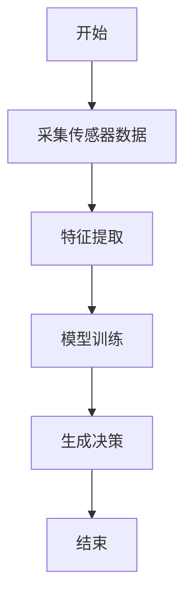
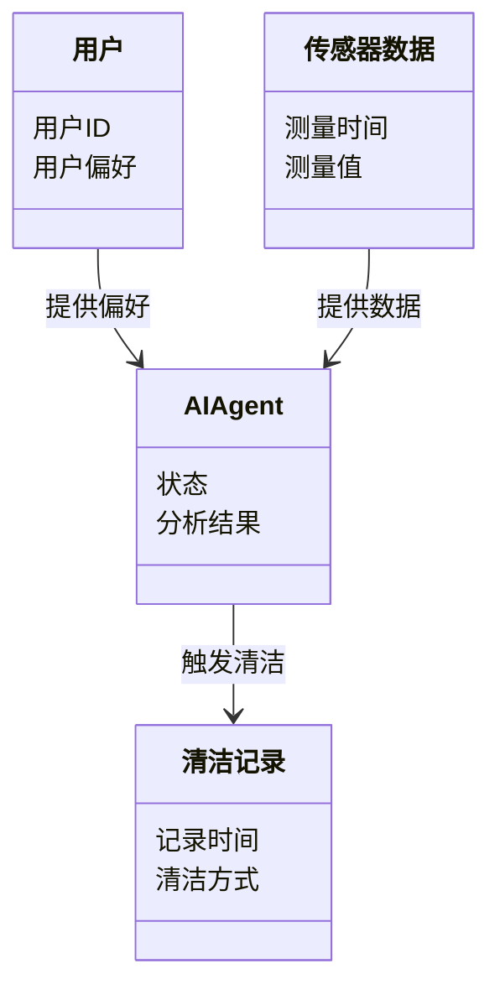
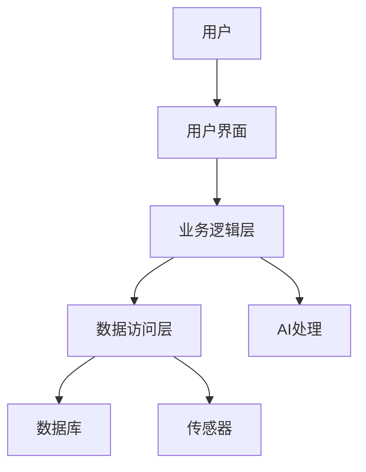
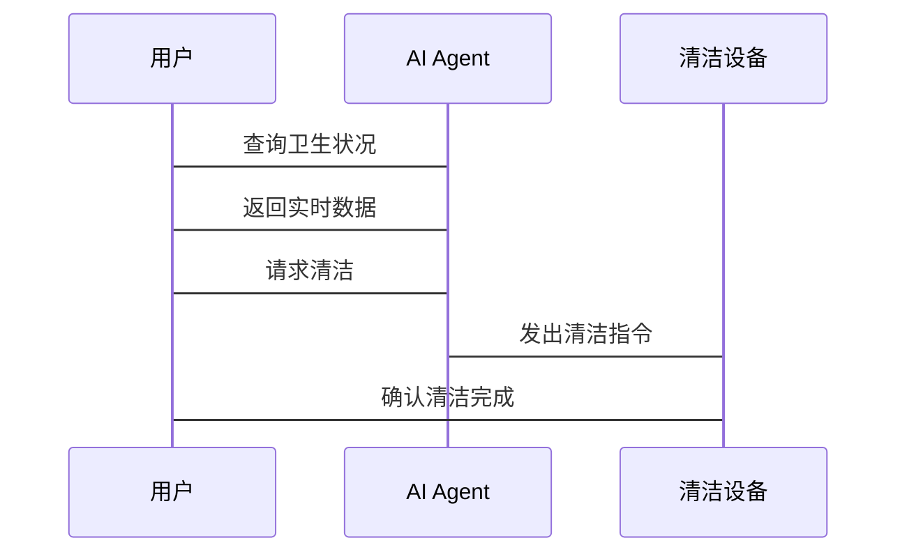

                 


# AI Agent在智能门把手中卫生状况监测

## 关键词：AI Agent, 智能门把手, 卫生监测, 传感器数据, 机器学习, 系统架构

## 摘要：本文探讨了AI Agent在智能门把手中卫生状况监测的应用，分析了其背景、核心概念、算法原理、系统架构及项目实战，展示了如何利用AI技术提升公共卫生管理水平。

---

# 第1章 背景介绍

## 1.1 问题背景
### 1.1.1 公共卫生的重要性
公共卫生是社会健康的基础，特别是在疫情后，人们对公共环境的卫生状况更加关注。门把手作为高频接触点，是细菌传播的主要途径之一。实时监测门把手的卫生状况，能有效预防疾病传播。

### 1.1.2 传统卫生监测的局限性
传统的卫生监测方法依赖人工检查，效率低、成本高，且难以实现实时监控。此外，人工检查可能存在遗漏和误差，无法满足现代公共卫生管理的需求。

### 1.1.3 AI Agent在卫生监测中的潜力
AI Agent（人工智能代理）能够通过传感器数据实时分析环境状况，提供精准的卫生监测。AI Agent的自适应学习能力使其能够优化监测策略，提升卫生管理的效率和准确性。

## 1.2 问题描述
### 1.2.1 智能门把手的卫生监测需求
智能门把手需要实时监测表面的细菌或污染物含量，确保用户的安全。监测数据应包括污染物种类、浓度等信息，并能触发清洁或消毒机制。

### 1.2.2 用户对卫生状况的关注点
用户关心门把手的卫生状况，希望获得实时数据和清洁建议。此外，用户还关注数据的隐私保护和系统操作的便捷性。

### 1.2.3 当前卫生监测技术的痛点
现有技术主要依赖定期采样和实验室分析，耗时长、成本高，难以实现连续监测。此外，数据处理能力有限，无法支持实时反馈。

## 1.3 问题解决
### 1.3.1 AI Agent的核心作用
AI Agent通过整合传感器数据、历史信息和环境因素，实现对门把手卫生状况的实时分析和预测。它能够自动触发清洁流程，优化资源利用。

### 1.3.2 通过AI技术实现卫生监测的可行性
AI技术在图像识别、数据处理和自动化控制方面的优势，使其成为智能门把手卫生监测的理想选择。传感器技术的进步为AI Agent提供了丰富的数据来源。

### 1.3.3 解决方案的创新点
AI Agent不仅提供实时监测，还能根据数据优化清洁策略，减少资源浪费，提升卫生管理的智能化水平。

## 1.4 边界与外延
### 1.4.1 AI Agent在智能门把手中的应用边界
AI Agent主要负责数据采集、分析和决策，不直接处理物理清洁工作。其应用范围限于门把手的卫生监测，不涉及其他环境区域。

### 1.4.2 卫生监测的范围界定
监测内容包括细菌、病毒和污染物的种类、浓度及分布情况。监测数据用于触发清洁流程和提醒用户。

### 1.4.3 相关技术的外延扩展
AI Agent可与其他智能设备联动，如智能清洁机器人和物联网系统，构建更完善的卫生管理生态系统。

## 1.5 概念结构与核心要素
### 1.5.1 AI Agent的核心要素
- **传感器**：采集环境数据。
- **AI算法**：处理数据并生成决策。
- **反馈机制**：根据结果调整监测策略。

### 1.5.2 卫生监测的关键指标
- **细菌浓度**：监测细菌数量。
- **污染物种类**：识别污染物类型。
- **清洁状态**：判断是否需要清洁。

### 1.5.3 系统整体架构
- **硬件层**：传感器、执行器。
- **数据处理层**：AI算法、数据存储。
- **应用层**：用户界面、决策模块。

---

# 第2章 核心概念与联系

## 2.1 AI Agent的原理
AI Agent通过整合多源数据，利用机器学习模型分析环境状况，提供实时反馈。其核心是数据处理和决策优化。

## 2.2 概念属性特征对比
| 概念         | 特性               | 优势                 |
|--------------|--------------------|----------------------|
| 数据采集     | 实时性、准确性     | 确保监测的及时性     |
| AI算法       | 自适应、高精度     | 提升分析的准确性     |
| 反馈机制     | 快速响应、闭环控制 | 优化系统操作         |

## 2.3 ER实体关系图
```mermaid
er
  entity 传感器数据 {
    key 测量时间
    属性 测量值
  }
  entity 清洁记录 {
    key 记录时间
    属性 清洁方式
  }
  entity AI Agent {
    key 状态
    属性 分析结果
  }
  entity 用户 {
    key 用户ID
    属性 用户偏好
  }
  relation 实体关系 {
    传感器数据 -> AI Agent: 提供数据支持
    AI Agent -> 清洁记录: 触发清洁操作
    用户 -> AI Agent: 提供偏好设置
  }
```

---

# 第3章 算法原理讲解

## 3.1 算法流程图


## 3.2 核心算法代码
```python
import numpy as np
from sklearn.model_selection import train_test_split
from sklearn.linear_model import LogisticRegression

# 示例数据集：0代表干净，1代表需要清洁
X = np.random.rand(100, 5)  # 5个特征，100个样本
y = np.random.randint(0, 2, 100)

# 划分训练集和测试集
X_train, X_test, y_train, y_test = train_test_split(X, y, test_size=0.2)

# 训练模型
model = LogisticRegression()
model.fit(X_train, y_train)

# 预测
y_pred = model.predict(X_test)
print("准确率:", np.mean(y_pred == y_test))
```

## 3.3 数学模型
分类算法的目标函数：
$$ \text{损失函数} = -\frac{1}{m} \sum_{i=1}^{m} y_i \log(p_i) + (1 - y_i) \log(1 - p_i) $$
其中，$p_i$ 是第i个样本的预测概率，$y_i$ 是真实标签。

---

# 第4章 系统分析与架构设计方案

## 4.1 应用场景
智能门把手卫生监测适用于医院、办公楼、学校等公共场所，帮助管理和优化卫生状况。

## 4.2 系统功能设计
- 实时监测：持续采集和分析传感器数据。
- 数据记录：存储历史数据，支持追溯。
- 用户通知：通过APP或短信通知用户和管理员。
- 清洁管理：自动触发清洁流程，记录清洁结果。

## 4.3 领域模型类图


## 4.4 系统架构图


## 4.5 系统接口设计
- **输入接口**：传感器数据采集、用户偏好设置。
- **输出接口**：显示分析结果、触发清洁设备。

## 4.6 系统交互流程图


---

# 第5章 项目实战

## 5.1 环境搭建
- **传感器**：安装接触式或光学传感器。
- **网络连接**：配置物联网模块，确保数据传输。
- **开发工具**：安装Python、TensorFlow、Mermaid等工具。

## 5.2 核心代码实现
```python
import numpy as np
from sklearn.ensemble import RandomForestClassifier

# 示例数据集
X = np.random.rand(100, 5)
y = np.random.randint(0, 2, 100)

# 划分训练集和测试集
X_train, X_test, y_train, y_test = train_test_split(X, y, test_size=0.2)

# 训练随机森林模型
model = RandomForestClassifier()
model.fit(X_train, y_train)

# 预测
y_pred = model.predict(X_test)
print("准确率:", np.mean(y_pred == y_test))
```

## 5.3 实际案例分析
在疫情期间，某办公楼使用AI Agent监测门把手卫生状况。系统每天生成报告，帮助物业优化清洁策略，降低病毒传播风险。

## 5.4 项目小结
通过AI Agent实现智能门把手卫生监测，提升了公共卫生管理的效率和准确性。项目验证了技术的可行性和实用性。

---

# 第6章 最佳实践

## 6.1 小结
AI Agent在智能门把手中卫生监测的应用潜力巨大，能够显著提升公共卫生管理水平。

## 6.2 注意事项
- 数据隐私保护：确保用户数据安全。
- 系统维护：定期更新传感器和模型，保持准确性。

## 6.3 拓展阅读
- 探索更多AI技术在公共卫生中的应用。
- 研究新型传感器技术，提升监测精度。

## 6.4 参考文献
- 《人工智能入门》
- 《传感器技术与应用》
- 《智能系统设计》

---

# 附录

## 附录A：数学公式总结
- 二分类问题的目标函数：$$ \text{损失函数} = -\frac{1}{m} \sum_{i=1}^{m} y_i \log(p_i) + (1 - y_i) \log(1 - p_i) $$

## 附录B：系统架构图


## 附录C：代码示例
```python
import numpy as np
from sklearn.ensemble import RandomForestClassifier

# 示例数据集
X = np.random.rand(100, 5)
y = np.random.randint(0, 2, 100)

# 划分训练集和测试集
X_train, X_test, y_train, y_test = train_test_split(X, y, test_size=0.2)

# 训练随机森林模型
model = RandomForestClassifier()
model.fit(X_train, y_train)

# 预测
y_pred = model.predict(X_test)
print("准确率:", np.mean(y_pred == y_test))
```

---

通过以上章节的详细讲解，我们全面探讨了AI Agent在智能门把手中卫生监测的应用，从理论到实践，为公共卫生管理提供了创新的解决方案。

