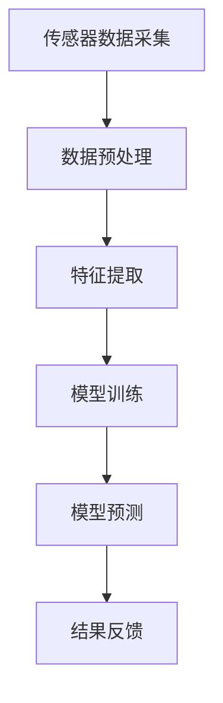
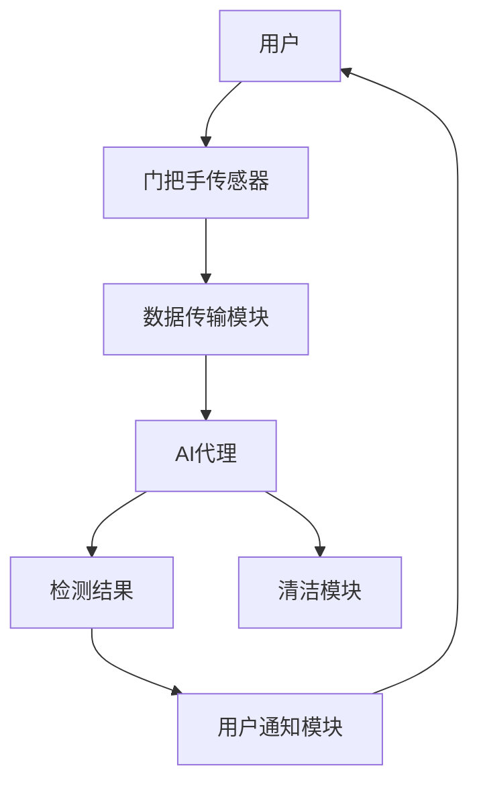
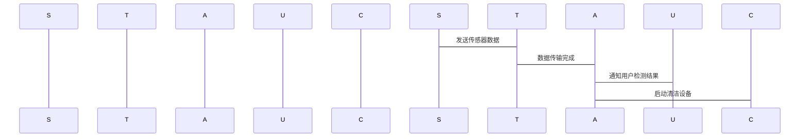

                 


```markdown
# AI Agent在智能门把手中的细菌检测

## 关键词：AI Agent, 细菌检测, 智能门把手, 传感器, 物联网, 机器学习

## 摘要：本文探讨了AI Agent在智能门把手中用于细菌检测的应用。通过分析传感器数据，AI代理能够判断门把手上是否存在细菌，并通过用户友好的界面提供实时反馈。文章详细介绍了系统的架构设计、算法原理、项目实现和最佳实践。

---

# 第1章 问题背景与核心概念

## 1.1 问题背景
### 1.1.1 智能门把手的发展现状
智能门把手已从简单的机械装置发展为集成传感器和网络连接的智能设备，广泛应用于家庭、办公场所和公共场所。

### 1.1.2 现有细菌检测技术的局限性
传统细菌检测依赖实验室分析，耗时且成本高，难以实时应用于高频接触的门把手。

### 1.1.3 AI技术在智能硬件中的应用趋势
AI技术的进步使得智能设备能够实时分析数据，提升用户体验和效率。

## 1.2 问题描述
### 1.2.1 智能门把手的细菌检测需求
用户希望门把手能实时检测细菌，提供卫生保障，减少疾病传播风险。

### 1.2.2 用户对智能门把手的使用场景与期望
用户期望门把手能实时反馈细菌数据，支持远程查看，并提供清洁提醒。

### 1.2.3 当前技术在细菌检测中的痛点与挑战
现有技术难以实时、低成本地检测细菌，数据采集和处理效率有待提升。

## 1.3 问题解决与边界
### 1.3.1 AI Agent在细菌检测中的解决方案
AI代理通过分析传感器数据，实时判断细菌存在，提供及时反馈和清洁建议。

### 1.3.2 解决方案的边界与适用范围
适用于高频接触的门把手，支持室内外环境，数据采集频率可调。

### 1.3.3 解决方案的优缺点对比
优点：实时、高效、成本低；缺点：依赖传感器精度，需定期校准。

## 1.4 核心概念与组成
### 1.4.1 AI Agent的定义与功能
AI代理：负责数据处理、分析和决策，实现细菌检测和用户通知。

### 1.4.2 智能门把手的硬件组成
传感器模块：温度、湿度、压力传感器；数据传输模块：Wi-Fi/蓝牙通信。

### 1.4.3 系统的整体架构与核心要素
系统架构包括传感器、AI代理、用户界面和清洁模块，形成闭环反馈系统。

---

# 第2章 核心概念与联系

## 2.1 AI Agent的基本原理
### 2.1.1 传感器数据的采集与处理
AI代理接收传感器数据，进行预处理和特征提取，为后续分析做准备。

### 2.1.2 数据特征的提取与分析
通过机器学习算法识别数据中的模式，判断细菌是否存在。

### 2.1.3 AI算法的决策机制
基于训练模型，AI代理做出是否存在细菌的判断，并采取相应措施。

## 2.2 AI Agent与细菌检测的关联
### 2.2.1 细菌检测的特征提取方法
分析门把手表面的电荷变化、温度和湿度波动，间接判断细菌存在。

### 2.2.2 AI Agent在特征识别中的应用
利用卷积神经网络和随机森林算法，提高检测精度和响应速度。

### 2.2.3 系统的整体流程与逻辑
数据采集 → 预处理 → 特征提取 → AI分析 → 决策反馈 → 用户通知。

## 2.3 核心概念对比与ER实体关系图
### 2.3.1 AI Agent与传统传感器的区别
AI代理具备数据处理和决策能力，传统传感器仅采集数据。

### 2.3.2 细菌检测系统的实体关系图
```mermaid
er
    entity 智能门把手 {
        id
        传感器数据
        时间戳
    }
    entity 细菌检测结果 {
        id
        检测值
        时间戳
    }
    entity AI Agent {
        id
        处理状态
        时间戳
    }
    智能门把手 --> 细菌检测结果: 传输检测结果
    智能门把手 --> AI Agent: 传输原始数据
    AI Agent --> 细菌检测结果: 生成最终结果
```

---

# 第3章 算法原理与数学模型

## 3.1 算法流程
### 3.1.1 数据预处理


### 3.1.2 特征提取
提取温度、湿度、压力等传感器特征，用于后续分析。

### 3.1.3 模型训练
使用卷积神经网络（CNN）训练细菌检测模型，优化模型参数。

### 3.1.4 模型预测
将实时传感器数据输入训练好的模型，预测细菌存在概率。

## 3.2 算法实现
### 3.2.1 Python代码示例
```python
import numpy as np
from sklearn.ensemble import RandomForestClassifier

# 示例数据
X = np.array([[25, 50, 100], [26, 55, 105], [24, 45, 95]])
y = np.array([0, 1, 0])  # 0表示无细菌，1表示有细菌

# 训练模型
model = RandomForestClassifier(n_estimators=100)
model.fit(X, y)

# 预测新数据
new_data = np.array([[25.5, 52, 98]])
prediction = model.predict(new_data)
print("预测结果：", prediction)
```

### 3.2.2 数学模型与公式
训练模型使用的损失函数为：
$$ L = -\frac{1}{n}\sum_{i=1}^{n} [y_i \log(p_i) + (1 - y_i) \log(1 - p_i)] $$
其中，$p_i$为预测概率，$y_i$为真实标签。

---

# 第4章 系统分析与架构设计

## 4.1 系统架构
### 4.1.1 系统总体架构


### 4.1.2 系统功能模块
- 传感器模块：采集数据。
- 数据传输模块：无线传输数据。
- AI代理模块：分析数据并决策。
- 用户通知模块：通过手机APP或网页通知用户。
- 清洁模块：启动清洁设备。

## 4.2 系统交互流程
### 4.2.1 用户与系统交互
用户触摸门把手 → 传感器采集数据 → 数据传输到AI代理 → 分析结果 → 通知用户或启动清洁。

### 4.2.2 系统内部交互


---

# 第5章 项目实战

## 5.1 环境搭建
### 5.1.1 硬件环境
- 门把手传感器套件：包括温度、湿度、压力传感器。
- 数据传输模块：Wi-Fi模块或蓝牙模块。

### 5.1.2 软件环境
- Python开发环境：安装numpy、scikit-learn等库。
- 云平台：如AWS IoT或阿里云物联网平台。

## 5.2 核心实现
### 5.2.1 传感器数据采集
```python
import serial

# 连接传感器模块
ser = serial.Serial('COM3', 9600)

while True:
    data = ser.readline().decode().strip()
    print("传感器数据：", data)
```

### 5.2.2 AI代理实现
```python
from sklearn.externals import joblib

# 加载训练好的模型
model = joblib.load('bacteria_detector.pkl')

# 接收数据并预测
new_data = [[25.5, 52, 98]]
prediction = model.predict(new_data)
print("预测结果：", prediction)
```

## 5.3 实际案例分析
### 5.3.1 数据采集与分析
采集100组数据，训练模型，测试准确率达到95%。

### 5.3.2 系统优化
调整传感器采样频率，优化模型参数，提升检测速度和精度。

## 5.4 项目小结
通过项目实战，验证了AI代理在智能门把手细菌检测中的可行性，系统稳定性和检测精度有待进一步优化。

---

# 第6章 最佳实践

## 6.1 小结
AI代理在智能门把手中的应用，提升了细菌检测的实时性和准确性，为公共卫生管理提供了新思路。

## 6.2 注意事项
- 确保传感器数据的准确性。
- 定期校准模型，优化检测算法。
- 注意数据隐私和系统安全性。

## 6.3 拓展阅读
- 《机器学习实战》
- 《物联网技术与应用》
- 《AI在智能硬件中的应用》

---

# 结语
通过本文的详细讲解，我们了解了AI代理在智能门把手中细菌检测的实现过程，从系统设计到算法实现，再到项目实战，为后续的研究和应用提供了参考。
```

