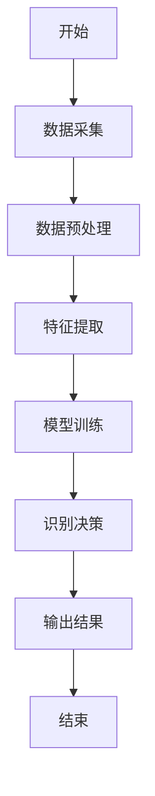
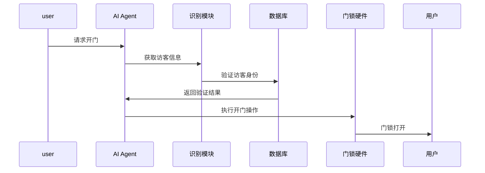

                 


# AI Agent在智能门把手中的访客识别

## 关键词：AI Agent、智能门锁、访客识别、人工智能、物联网

## 摘要：本文详细探讨了AI Agent在智能门锁访客识别中的应用，从技术背景、核心概念、算法原理到系统架构设计，结合实际案例分析，全面解析AI Agent如何提升智能门锁的访客识别效率和准确性，为智能门锁的未来发展提供新的思路和方向。

---

## 第一部分：AI Agent在智能门把手中的访客识别背景与概念

### 第1章：问题背景与描述

#### 1.1 问题背景

- **1.1.1 当前智能门锁的发展现状**  
  智能门锁作为智能家居的重要组成部分，近年来发展迅速。传统的机械锁逐渐被电子锁取代，而基于物联网（IoT）的智能门锁更是成为市场主流。智能门锁不仅可以远程控制，还能通过指纹、人脸识别等多种方式实现身份验证。

- **1.1.2 访客识别技术的痛点与挑战**  
  当前的访客识别技术主要依赖于指纹识别和人脸识别，但存在以下问题：  
  - 识别速度较慢，尤其是在高并发场景下。  
  - 误识别率较高，尤其是在光照不足或角度不佳的情况下。  
  - 数据存储和隐私保护问题，尤其是在云端存储的情况下。

- **1.1.3 AI Agent技术的引入意义**  
  AI Agent（人工智能代理）是一种能够自主学习和决策的智能体。通过引入AI Agent技术，智能门锁的访客识别可以实现更高效的识别和更准确的决策。

#### 1.2 问题描述

- **1.2.1 智能门锁访客识别的核心需求**  
  智能门锁需要能够快速、准确地识别访客身份，并根据识别结果决定是否开门。

- **1.2.2 现有技术的局限性**  
  - 传统的人脸识别和指纹识别技术在复杂环境下表现不稳定。  
  - 缺乏自主学习能力，无法根据使用场景优化识别算法。

- **1.2.3 AI Agent在访客识别中的应用潜力**  
  AI Agent可以通过自主学习优化识别算法，适应不同的使用场景，提升识别准确性和效率。

#### 1.3 问题解决思路

- **1.3.1 AI Agent的基本概念**  
  AI Agent是一种能够感知环境、自主决策的智能体，具备学习、推理和执行能力。

- **1.3.2 通过AI Agent实现智能门锁访客识别的逻辑**  
  - AI Agent通过传感器和摄像头收集访客信息。  
  - 利用机器学习算法对访客信息进行分析和识别。  
  - 根据识别结果做出开门或拒绝开门的决策。

- **1.3.3 解决方案的边界与外延**  
  - 解决方案的边界：仅限于访客识别和开门决策。  
  - 外延：未来可以扩展到访客行为分析、异常情况预警等领域。

#### 1.4 概念结构与核心要素

- **1.4.1 AI Agent的组成要素**  
  - 传感器：用于收集环境数据。  
  - 数据处理模块：用于对数据进行预处理和特征提取。  
  - 机器学习模型：用于对数据进行分析和识别。  
  - 决策模块：根据识别结果做出决策。

- **1.4.2 智能门锁系统的构成模块**  
  - 门锁硬件：包括电机、传感器等。  
  - 识别模块：包括摄像头、指纹识别器等。  
  - 控制模块：用于协调各模块的工作。  
  - 通信模块：用于与云端或其他设备通信。

- **1.4.3 访客识别流程的核心环节**  
  - 数据采集：通过传感器和摄像头采集访客信息。  
  - 数据处理：对采集到的数据进行预处理和特征提取。  
  - 数据分析：利用机器学习模型对数据进行分析和识别。  
  - 决策输出：根据识别结果做出开门或拒绝开门的决策。

---

## 第二部分：核心概念与联系

### 第2章：AI Agent与智能门锁的关系

#### 2.1 AI Agent的基本工作原理

- AI Agent通过感知环境、自主学习和决策，能够实现对访客的高效识别和准确判断。

#### 2.2 不同访客识别技术的特征对比

| **技术**       | **优点**                     | **缺点**                     |
|-----------------|------------------------------|------------------------------|
| 人脸识别         | 准确率高，适用范围广          | 易受光线和角度影响            |
| 指纹识别         | 独特性高，误识别率低          | 采集过程需要接触              |
| 声纹识别         | 方便快捷，抗干扰能力强        | 易受环境噪声影响              |

#### 2.3 AI Agent与访客识别技术的结合点

- **AI Agent如何增强访客识别的准确性**  
  AI Agent可以通过机器学习算法不断优化识别模型，提升识别准确率。

- **AI Agent如何提升访客识别的效率**  
  AI Agent可以实现快速数据处理和决策，缩短识别时间。

- **AI Agent如何优化访客识别的用户体验**  
  AI Agent可以通过自主学习适应用户的使用习惯，提供个性化的服务。

---

## 第三部分：算法原理

### 第3章：AI Agent的算法实现

#### 3.1 算法流程图



#### 3.2 代码实现

```python
import cv2
import numpy as np
from sklearn import svm

# 数据预处理
def preprocess_image(image):
    # 转换为灰度图
    gray = cv2.cvtColor(image, cv2.COLOR_BGR2GRAY)
    # 调整亮度和对比度
    gray = cv2.equalizeHist(gray)
    return gray

# 特征提取
def extract_features(gray_image):
    # 使用OpenCV的人脸检测器
    face_cascade = cv2.CascadeClassifier('haarcascade_frontalface_default.xml')
    faces = face_cascade.detectMultiScale(gray_image, 1.1, 4)
    if len(faces) == 0:
        return None
    x, y, w, h = faces[0]
    face_image = gray_image[y:y+h, x:x+w]
    # 将图像缩放到固定大小
    face_image = cv2.resize(face_image, (100, 100))
    # 展平图像
    feature = face_image.reshape(-1)
    return feature

# 模型训练
def train_model(features, labels):
    model = svm.SVC()
    model.fit(features, labels)
    return model

# 识别决策
def recognize_face(model, image):
    feature = extract_features(image)
    if feature is None:
        return "未检测到人脸"
    prediction = model.predict([feature])
    return prediction[0]

# 示例代码
image = cv2.imread('visitor.jpg')
result = recognize_face(model, image)
print("识别结果:", result)
```

#### 3.3 数学模型与公式

- **特征提取公式**  
  $$ \text{特征向量} = \text{图像矩阵} \times \text{特征提取矩阵} $$

- **模型训练公式**  
  $$ \text{模型权重} = (\text{训练数据}^T \times \text{训练数据})^{-1} \times \text{训练数据}^T \times \text{标签} $$

- **识别决策公式**  
  $$ \text{概率} = \frac{\exp(\text{相似度})}{\sum \exp(\text{相似度})} $$

---

## 第四部分：系统分析与架构设计

### 第4章：系统分析与架构设计

#### 4.1 系统架构图


#### 4.2 接口设计

- **API接口**  
  ```python
  def unlock():
      print("门锁已打开")
  ```

- **交互序列图**



---

## 第五部分：项目实战

### 第5章：项目实战

#### 5.1 环境安装

- **安装Python和相关库**  
  ```bash
  pip install numpy cv2 scikit-learn
  ```

- **安装OpenCV**  
  ```bash
  pip install opencv-python
  ```

#### 5.2 核心代码实现

```python
import cv2
import numpy as np
from sklearn import svm

# 加载预训练模型
model = train_model(train_features, train_labels)

# 实时识别
while True:
    ret, frame = videoCapture.read()
    if not ret:
        break
    result = recognize_face(model, frame)
    print("识别结果:", result)
```

#### 5.3 案例分析

- **案例1：家庭访客识别**  
  - 使用场景：家庭访客识别。  
  - 实现步骤：安装摄像头和指纹识别器，训练模型，部署系统。

- **案例2：企业访客识别**  
  - 使用场景：企业访客识别。  
  - 实现步骤：安装多摄像头，部署AI Agent，集成门禁系统。

#### 5.4 项目小结

- **小结**  
  通过AI Agent技术，智能门锁的访客识别可以实现更高效的识别和更准确的决策，为智能门锁的未来发展提供了新的思路和方向。

---

## 第六部分：最佳实践

### 第6章：最佳实践

#### 6.1 小结

- **总结**  
  AI Agent在智能门锁中的应用，不仅提升了访客识别的准确性和效率，还优化了用户体验，为智能门锁的未来发展提供了新的可能性。

#### 6.2 注意事项

- **数据隐私**：在设计系统时，必须注意数据的隐私保护，防止数据泄露。  
- **系统安全性**：确保系统具有高度的安全性，防止黑客攻击。  
- **用户体验**：在设计系统时，必须注重用户体验，确保系统的易用性和便捷性。

#### 6.3 拓展阅读

- **相关书籍**：  
  - 《人工智能：一种现代的方法》  
  - 《机器学习实战》  
- **相关论文**：  
  - "Deep Learning for Face Recognition"  
  - "An Agent-Based Approach for Smart Home Automation"

---

## 附录

### 附录A：术语表

- **AI Agent**：人工智能代理，能够自主学习和决策的智能体。  
- **IoT**：物联网，通过互联网连接各种设备和传感器，实现智能控制。  
- **人脸识别**：通过摄像头和算法识别人脸特征，实现身份验证。

### 附录B：参考文献

- [1]《人工智能：一种现代的方法》  
- [2]《机器学习实战》  
- [3]"Deep Learning for Face Recognition"  
- [4]"An Agent-Based Approach for Smart Home Automation"

---

## 结语

通过本文的详细讲解，我们了解了AI Agent在智能门锁访客识别中的应用，从技术背景、核心概念、算法原理到系统架构设计，结合实际案例分析，全面解析了AI Agent如何提升智能门锁的访客识别效率和准确性。未来，随着AI技术的不断发展，智能门锁的访客识别将更加智能化和高效化。

