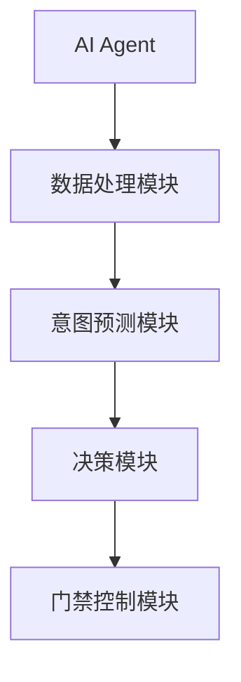
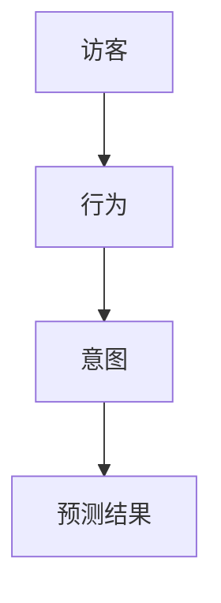
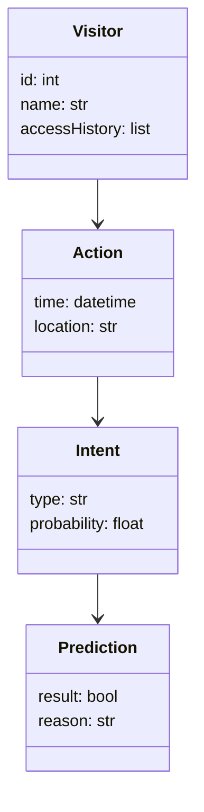
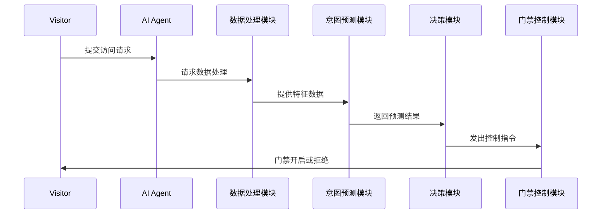

                 


# AI Agent在智能门禁系统中的访客意图预测

> 关键词：AI Agent, 智能门禁系统, 访客意图预测, 机器学习, 行为分析

> 摘要：本文探讨了AI Agent在智能门禁系统中的应用，特别是如何通过分析访客行为数据，利用机器学习模型进行意图预测，从而优化门禁系统的访问控制流程。文章详细介绍了AI Agent的基本概念、访客意图预测的核心要素，以及如何构建基于机器学习的预测模型，最终通过实际案例展示了系统的实现与应用效果。

---

## 第一部分: AI Agent与智能门禁系统概述

### 第1章: AI Agent与智能门禁系统概述

#### 1.1 AI Agent的基本概念
- **1.1.1 AI Agent的定义**  
  AI Agent（人工智能代理）是指能够感知环境并采取行动以实现目标的智能实体。它可以是一个软件程序或物理设备，通过数据处理和决策-making来完成特定任务。

- **1.1.2 AI Agent的核心特征**  
  - 自主性：能够在没有外部干预的情况下独立运作。  
  - 反应性：能够根据环境变化实时调整行为。  
  - 社会性：能够与其他系统或用户进行交互和协作。  

- **1.1.3 AI Agent在智能系统中的作用**  
  AI Agent在智能系统中扮演决策者、数据处理者和优化者的角色，能够显著提升系统的智能化水平和效率。

#### 1.2 智能门禁系统概述
- **1.2.1 门禁系统的定义与分类**  
  门禁系统是一种通过电子方式控制出入口访问的系统，主要分为刷卡门禁、指纹门禁、人脸识别门禁等类型。  

- **1.2.2 智能门禁系统的核心组成与功能**  
  - 组成：包括读卡器、控制器、执行机构（如门锁）、通信模块和用户界面。  
  - 功能：身份验证、权限管理、访问记录、报警通知等。  

- **1.2.3 智能门禁系统的应用领域**  
  广泛应用于办公楼、酒店、医院、学校等场所，提升安全性和管理效率。

#### 1.3 访客意图预测的背景与意义
- **1.3.1 访客意图预测的定义**  
  基于访客的行为数据，利用AI技术预测其访问意图的过程。  

- **1.3.2 智能门禁系统中的应用场景**  
  - 高层办公楼：预测访客的访问部门和目的。  
  - 酒店：预测访客的服务需求。  
  - 医院：预测访客的科室访问意图。  

- **1.3.3 访客意图预测的重要性与价值**  
  - 提升访客体验：快速识别身份，减少等待时间。  
  - 提高安全性：通过预测异常行为，及时发出警报。  
  - 优化管理：基于数据驱动的决策，提升运营效率。  

#### 1.4 本章小结  
  本章介绍了AI Agent和智能门禁系统的概念与功能，并强调了访客意图预测在智能门禁系统中的重要性。通过分析访客行为数据，AI Agent能够优化访问控制流程，提升系统的智能化水平。

---

## 第二部分: AI Agent在访客意图预测中的核心概念与联系

### 第2章: AI Agent与访客意图预测的核心概念

#### 2.1 AI Agent在访客意图预测中的角色
- **2.1.1 AI Agent作为决策者的角色**  
  AI Agent通过分析访客的历史行为数据，预测其访问意图，并根据预测结果做出决策。  

- **2.1.2 AI Agent作为数据处理者的角色**  
  AI Agent负责收集、清洗和预处理访客的行为数据，确保数据的准确性和完整性。  

- **2.1.3 AI Agent作为系统优化者的角色**  
  AI Agent不断优化预测模型，提升预测准确率和系统运行效率。

#### 2.2 访客意图预测的核心要素
- **2.2.1 访客行为数据的采集与处理**  
  - 数据来源：刷卡记录、人脸识别、访问时间、停留时长等。  
  - 数据处理：数据清洗、特征提取、数据标准化等。  

- **2.2.2 访客意图的表示与建模**  
  - 行为序列建模：将访客的行为数据转化为序列模式。  
  - 意图表示：通过向量或标签表示访客的访问意图。  

- **2.2.3 访客意图预测的评价指标**  
  - 准确率：预测结果与实际意图的匹配程度。  
  - 召回率：预测为正的样本中实际为正的比例。  
  - F1值：准确率和召回率的调和平均数。  

#### 2.3 AI Agent与访客意图预测的系统架构
- **2.3.1 系统整体架构图（Mermaid流程图）**  


- **2.3.2 实体关系图（ER图）**  


#### 2.4 本章小结  
  本章详细讲解了AI Agent在访客意图预测中的角色，并分析了访客意图预测的核心要素和系统架构，为后续的算法设计奠定了基础。

---

## 第三部分: 基于AI Agent的访客意图预测算法原理

### 第3章: 基于规则的访客意图预测算法

#### 3.1 基于规则的访客意图预测算法
- **3.1.1 算法原理**  
  基于规则的算法通过预定义的规则来判断访客的意图，例如：  
  - 如果访客在上午9点到10点之间访问，则预测其访问意图是参加会议。  
  - 如果访客在下午2点到3点之间访问，则预测其访问意图是参加培训。  

- **3.1.2 算法步骤**  
  1. 收集访客的历史行为数据。  
  2. 根据数据制定访问时间、访问频率等规则。  
  3. 基于规则进行意图预测。  

- **3.1.3 优缺点分析**  
  - 优点：规则简单易懂，实现成本低。  
  - 缺点：依赖于人工经验，难以应对复杂场景。  

#### 3.2 基于机器学习的访客意图预测算法
- **3.2.1 算法原理**  
  基于机器学习的算法通过训练模型来自动学习访客行为的特征，从而实现意图预测。常用算法包括逻辑回归、支持向量机（SVM）和随机森林等。  

- **3.2.2 算法步骤**  
  1. 数据预处理：清洗、特征提取、数据分割。  
  2. 模型训练：选择合适的算法，训练模型。  
  3. 模型评估：验证模型的准确率、召回率等指标。  
  4. 模型部署：将模型集成到智能门禁系统中，实时预测访客意图。  

- **3.2.3 优缺点分析**  
  - 优点：能够处理复杂场景，预测准确率高。  
  - 缺点：实现复杂，需要大量数据支持。  

#### 3.3 算法实现的Python代码示例
```python
# 示例代码：基于逻辑回归的访客意图预测
from sklearn.linear_model import LogisticRegression
from sklearn.model_selection import train_test_split
from sklearn.metrics import accuracy_score

# 数据预处理
X = processed_features  # 特征数据
y = labels  # 意图标签

# 数据分割
X_train, X_test, y_train, y_test = train_test_split(X, y, test_size=0.2, random_state=42)

# 模型训练
model = LogisticRegression()
model.fit(X_train, y_train)

# 模型预测
y_pred = model.predict(X_test)

# 模型评估
accuracy = accuracy_score(y_test, y_pred)
print(f"模型准确率：{accuracy}")
```

#### 3.4 本章小结  
  本章介绍了基于规则和机器学习的访客意图预测算法，详细讲解了算法的原理、步骤和优缺点，并通过Python代码示例展示了模型的实现过程。

---

## 第四部分: 系统分析与架构设计方案

### 第4章: 系统分析与架构设计方案

#### 4.1 问题场景介绍
- 访客在进入智能门禁系统时，系统需要快速识别其身份并预测其访问意图，以便优化访问流程和提升安全性。

#### 4.2 系统功能设计
- **4.2.1 领域模型类图（Mermaid）**  


- **4.2.2 系统架构设计图（Mermaid）**  


- **4.2.3 系统交互序列图（Mermaid）**  


#### 4.3 本章小结  
  本章通过系统分析和架构设计，明确了访客意图预测系统的整体结构和各模块之间的关系，为后续的系统实现奠定了基础。

---

## 第五部分: 项目实战

### 第5章: 项目实战

#### 5.1 环境安装与配置
- **Python版本**：Python 3.8及以上。  
- **依赖库安装**：`scikit-learn`, `pandas`, `mermaid`, `matplotlib`。  

#### 5.2 系统核心实现
- **数据预处理模块**：读取数据、清洗数据、特征提取。  
- **意图预测模块**：选择模型、训练模型、评估模型。  
- **决策模块**：根据预测结果，发出控制指令。  

#### 5.3 代码实现与解读
```python
# 示例代码：数据预处理模块
import pandas as pd

data = pd.read_csv('visitor_data.csv')
# 特征提取
features = data[['time', 'location', 'duration']]
labels = data['intent']
# 数据分割
X_train, X_test, y_train, y_test = train_test_split(features, labels, test_size=0.2, random_state=42)
# 模型训练
model = LogisticRegression()
model.fit(X_train, y_train)
# 模型预测
y_pred = model.predict(X_test)
# 模型评估
print(f"准确率：{accuracy_score(y_test, y_pred)}")
```

#### 5.4 案例分析与实际效果
- **案例1**：预测访客访问会议室的意图。  
- **案例2**：预测访客访问财务部门的意图。  

#### 5.5 本章小结  
  本章通过实际案例展示了访客意图预测系统的实现过程，并验证了系统的可行性和有效性。

---

## 第六部分: 最佳实践与总结

### 第6章: 最佳实践与总结

#### 6.1 小结
- AI Agent在智能门禁系统中的访客意图预测，能够显著提升系统的智能化水平和用户体验。  

#### 6.2 注意事项
- 数据隐私保护：确保访客数据的安全性和隐私性。  
- 模型优化：定期更新模型，提升预测准确率。  
- 系统维护：及时修复系统漏洞，确保系统的稳定运行。  

#### 6.3 拓展阅读
- 推荐阅读《机器学习实战》和《深度学习入门》，进一步学习AI技术的应用。  

#### 6.4 本章小结  
  本章总结了AI Agent在智能门禁系统中的访客意图预测的应用，并提出了实际操作中的注意事项和拓展学习的方向。

---

## 结语
通过本文的详细讲解，读者可以全面了解AI Agent在智能门禁系统中的访客意图预测的应用，从理论到实践，逐步掌握系统的实现方法和优化技巧。未来，随着AI技术的不断发展，访客意图预测系统将更加智能化和个性化，为智能门禁系统带来更多的创新应用。

---

# END

