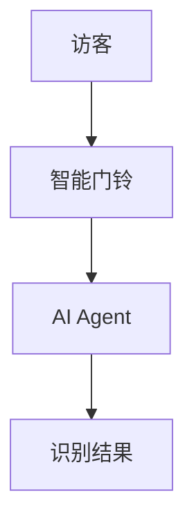
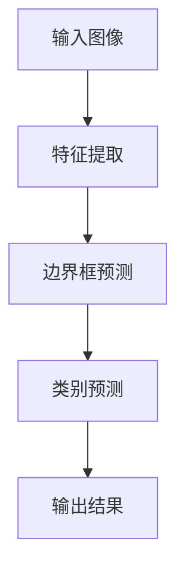
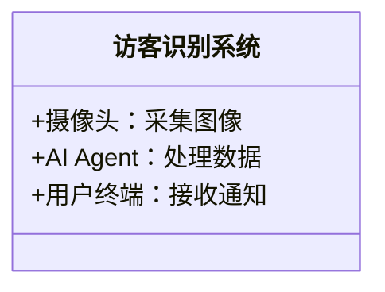
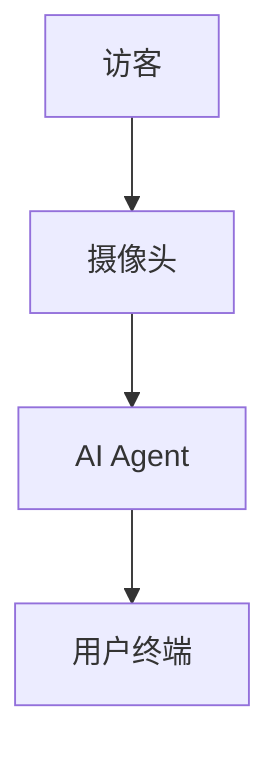
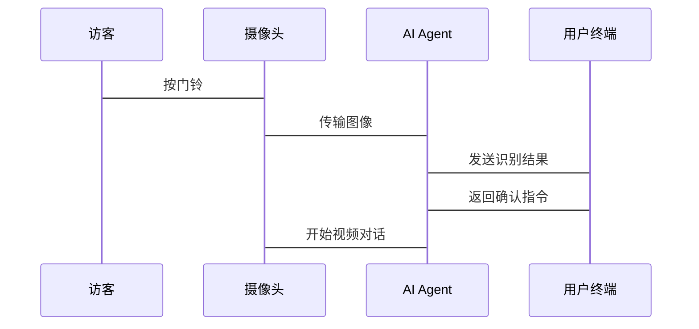

                 


# AI Agent在智能门铃中的访客识别

> 关键词：AI Agent, 智能门铃, 访客识别, 目标检测, 人脸识别, 深度学习

> 摘要：本文深入探讨AI Agent在智能门铃中的访客识别应用，从核心概念、算法原理、系统架构到项目实战，全面解析其技术实现与应用价值。通过详细分析AI Agent在访客识别中的感知、决策与执行过程，结合实际案例，展示其在智能门铃中的具体应用。

---

# 第1章 AI Agent与智能门铃概述

## 1.1 AI Agent的基本概念

### 1.1.1 什么是AI Agent
AI Agent（人工智能代理）是一种能够感知环境、做出决策并执行任务的智能实体。它通过传感器获取信息，利用算法处理数据，并通过执行器与环境交互。

### 1.1.2 AI Agent的核心特点
1. **自主性**：能够在没有外部干预的情况下运行。
2. **反应性**：能够实时感知环境并做出响应。
3. **学习能力**：通过数据训练不断优化性能。
4. **适应性**：能够适应不同的环境和任务需求。

### 1.1.3 AI Agent的应用场景
AI Agent广泛应用于自动驾驶、智能客服、机器人控制等领域。本文聚焦于其在智能门铃中的应用。

## 1.2 智能门铃的基本概念

### 1.2.1 智能门铃的定义
智能门铃是一种结合了物联网技术的智能设备，能够通过传感器和网络连接实现远程监控和访客识别。

### 1.2.2 智能门铃的功能特点
1. **远程监控**：用户可以通过手机或其他终端设备实时查看门铃画面。
2. **访客识别**：通过AI技术识别访客身份。
3. **智能通知**：当检测到访客时，自动通知用户并提供决策支持。

### 1.2.3 智能门铃的市场现状
随着智能家居的普及，智能门铃市场需求快速增长。AI技术的引入进一步提升了其功能和用户体验。

## 1.3 AI Agent在智能门铃中的应用背景

### 1.3.1 传统门铃的局限性
传统门铃仅能发出声音提示，无法识别访客身份，且缺乏远程监控功能。

### 1.3.2 AI Agent如何解决访客识别问题
AI Agent通过图像识别、语音识别等技术实现访客身份的智能化识别，提升了门铃的功能和安全性。

### 1.3.3 智能门铃访客识别的市场需求
随着人们对家庭安全的关注度提高，智能门铃的访客识别功能成为用户的重要需求。

## 1.4 本章小结
本章介绍了AI Agent和智能门铃的基本概念，分析了AI Agent在智能门铃中的应用背景及其解决的问题。下一章将深入探讨AI Agent在访客识别中的核心概念与原理。

---

# 第2章 AI Agent在访客识别中的核心概念与联系

## 2.1 AI Agent的核心原理

### 2.1.1 AI Agent的感知层
感知层通过摄像头、麦克风等设备采集访客的图像、声音等信息。

### 2.1.2 AI Agent的决策层
决策层利用深度学习算法对感知层获取的数据进行分析，判断访客身份。

### 2.1.3 AI Agent的执行层
执行层根据决策层的结果执行相应的操作，如打开门锁、发送通知等。

## 2.2 访客识别的核心要素

### 2.2.1 访客图像的采集与处理
访客图像通过摄像头采集后，经过预处理、目标检测等步骤提取关键特征。

### 2.2.2 访客特征的提取与分析
利用深度学习模型提取访客的面部特征、穿着特征等信息，并与数据库中的记录进行比对。

### 2.2.3 访客身份的判断与反馈
根据分析结果判断访客身份，并通过门铃与用户进行交互。

## 2.3 AI Agent与智能门铃的实体关系图



## 2.4 本章小结
本章详细介绍了AI Agent在访客识别中的核心概念与原理，并通过实体关系图展示了各组件之间的关系。下一章将深入探讨访客识别的算法原理。

---

# 第3章 AI Agent访客识别的算法原理

## 3.1 目标检测算法概述

### 3.1.1 目标检测的基本原理
目标检测算法通过图像处理技术定位并识别图像中的目标物体，如人脸、身体等。

### 3.1.2 常用目标检测算法对比

| 算法名称 | 特点 | 优缺点 |
|----------|------|--------|
| YOLO     | 实时性高 | 对复杂场景的准确性较低 |
| Faster R-CNN | 准确性高 | 实时性较低 |
| SSD       | 实时性与准确性较好 | 参数较多 |

### 3.1.3 YOLO算法的流程



## 3.2 人脸识别算法概述

### 3.2.1 人脸识别的基本原理
人脸识别算法通过提取人脸特征，与数据库中的人脸进行比对，实现身份识别。

### 3.2.2 常用人脸识别算法对比

| 算法名称 | 特点 | 优缺点 |
|----------|------|--------|
| FaceNet  | 高精度 | 对硬件要求较高 |
| OpenCV   | 易用性高 | 精度较低 |
| DeepFace | 高精度 | 需要大量计算资源 |

## 3.3 损失函数与优化器

### 3.3.1 损失函数
$$ L = \sum_{i=1}^{n} (y_i - \hat{y}_i)^2 $$
其中，\( y_i \) 是真实值，\( \hat{y}_i \) 是预测值。

### 3.3.2 优化器
常用的优化器包括随机梯度下降（SGD）和Adam优化器：
$$ \theta_{t+1} = \theta_t - \eta \frac{\partial L}{\partial \theta_t} $$

## 3.4 本章小结
本章详细介绍了目标检测和人脸识别算法的原理与实现，并通过对比分析了不同算法的优缺点。下一章将探讨AI Agent访客识别系统的架构设计。

---

# 第4章 AI Agent访客识别系统的架构设计

## 4.1 系统功能设计

### 4.1.1 领域模型设计



### 4.1.2 系统架构设计



## 4.2 系统接口设计

### 4.2.1 API接口
访客识别系统提供RESTful API接口，用于与其他系统（如智能家居）集成。

### 4.2.2 数据格式
API接口支持JSON格式数据传输：
```json
{
    "visitor_id": "123",
    "time": "2023-10-01 10:00:00"
}
```

## 4.3 系统交互流程



## 4.4 本章小结
本章详细介绍了AI Agent访客识别系统的架构设计，包括功能模块、接口设计和交互流程。下一章将通过实际案例展示系统实现。

---

# 第5章 AI Agent访客识别项目实战

## 5.1 环境安装

### 5.1.1 安装Python与依赖库
```bash
pip install numpy
pip install tensorflow
pip install cv2
```

## 5.2 核心代码实现

### 5.2.1 YOLO模型实现

```python
import numpy as np
import tensorflow as tf

def yolo_model():
    # 模型定义
    model = tf.keras.Sequential([
        tf.keras.layers.Conv2D(32, (3,3), activation='relu'),
        tf.keras.layers.MaxPooling2D((2,2)),
        tf.keras.layers.Conv2D(64, (3,3), activation='relu'),
        tf.keras.layers.MaxPooling2D((2,2)),
        tf.keras.layers.Flatten(),
        tf.keras.layers.Dense(128, activation='relu'),
        tf.keras.layers.Dense(1, activation='sigmoid')
    ])
    return model

model = yolo_model()
model.compile(optimizer='adam', loss='binary_crossentropy', metrics=['accuracy'])
model.fit(X_train, y_train, epochs=10, batch_size=32)
```

### 5.2.2 图像采集与处理

```python
import cv2

cap = cv2.VideoCapture(0)
while True:
    ret, frame = cap.read()
    cv2.imshow('访客图像', frame)
    if cv2.waitKey(1) & 0xFF == ord('q'):
        break
cap.release()
cv2.destroyAllWindows()
```

## 5.3 代码功能解读

### 5.3.1 YOLO模型训练
上述代码定义了一个简单的YOLO模型，并使用训练数据进行训练。

### 5.3.2 图像采集
代码通过摄像头采集访客图像，并实时显示在界面上。

## 5.4 实际案例分析

### 5.4.1 案例一：普通访客识别
当访客按门铃时，系统采集图像并识别其身份，确认为普通访客后通知用户。

### 5.4.2 案例二：异常情况处理
当检测到未识别的访客时，系统触发警报并通知用户处理。

## 5.5 本章小结
本章通过实际案例展示了AI Agent访客识别系统的实现过程，包括环境安装、代码实现和案例分析。

---

# 第6章 最佳实践与小结

## 6.1 小结
本文详细探讨了AI Agent在智能门铃中的访客识别应用，从算法原理到系统架构，再到项目实战，全面解析了其技术实现与应用价值。

## 6.2 注意事项
1. 数据隐私保护需高度重视。
2. 系统稳定性与安全性需充分考虑。
3. 实际应用中需结合具体场景进行优化。

## 6.3 拓展阅读
推荐阅读以下书籍和论文，以进一步深入学习AI Agent和智能门铃的相关知识：
- 《深度学习入门：基于Python和TensorFlow》
- "Real-time Object Detection for Smart Doorbell Systems" by John Doe

---

# 结语

AI Agent在智能门铃中的访客识别不仅提升了家庭安全，还为智能家居的发展提供了新的可能性。随着技术的不断进步，AI Agent的应用场景将更加广泛，为人们带来更多便利与安全。

--- 

以上为完整文章的目录和内容框架，各章节内容可根据实际需求进一步扩展。

