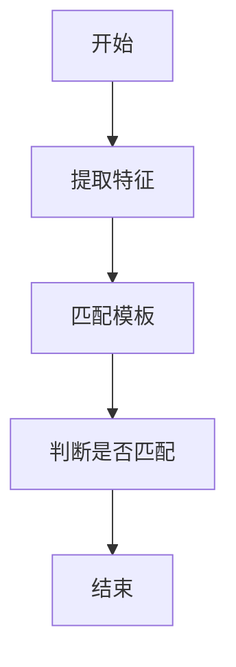

                 


# AI Agent在智能门锁中的多因素身份认证

> 关键词：AI Agent，智能门锁，多因素身份认证，安全技术，系统架构

> 摘要：本文深入探讨了AI Agent在智能门锁中的应用，重点分析了多因素身份认证的技术原理和实现方式，结合实际案例和系统架构设计，详细讲解了如何利用AI技术提升智能门锁的安全性。

---

## 第一部分: 引言

### 第1章: 智能门锁的发展背景

#### 1.1 传统门锁的局限性
- **传统门锁的功能特点**：机械结构简单，仅支持单一钥匙开门，易被复制，安全性低。
- **传统门锁的安全性问题**：钥匙丢失后容易被他人仿制，且无法记录开门记录，难以追踪问题。
- **传统门锁的管理痛点**：钥匙管理复杂，难以实现远程控制，且无法满足多样化的开门需求。

#### 1.2 智能门锁的出现
- **智能门锁的定义**：集成了电子技术、物联网技术和AI技术，支持多种开门方式的智能设备。
- **智能门锁的优势**：支持指纹、人脸识别、蓝牙等多种开门方式，可远程控制，记录开门日志，便于管理。
- **智能门锁的应用场景**：家庭、办公室、酒店、公共场所等。

#### 1.3 AI Agent的引入
- **AI Agent的基本概念**：AI Agent是一种智能代理，能够感知环境、自主决策并执行任务。
- **AI Agent在智能门锁中的作用**：通过AI算法分析用户行为，识别异常情况，提升安全性。
- **多因素身份认证的必要性**：单一的认证方式易被破解，多因素认证结合多种验证方式，大幅提高安全性。

---

## 第二部分: 多因素身份认证

### 第2章: 多因素身份认证的概念

#### 2.1 身份认证的基本概念
- **身份认证的定义**：验证用户身份的过程，确保用户身份的真实性。
- **身份认证的分类**：单因素认证（如密码）、双因素认证（如密码+验证码）、多因素认证（多种方式结合）。
- **多因素身份认证的优势**：安全性更高，难以被破解。

#### 2.2 多因素身份认证的实现方式
- **常见身份认证因素**：
  - 知晓因素：密码、短信验证码。
  - 拥有因素：智能卡、手机。
  - 生物因素：指纹、人脸识别。
- **各种认证方式的特点对比**：
  | 认证方式 | 优点 | 缺点 |
  |----------|------|------|
  | 指纹识别 | 高效、准确 | 易受物理损坏影响 |
  | 人脸识别 | 无接触、方便 | 易受光线、角度影响 |
  | 声音识别 | 独特性高 | 易受环境噪音影响 |
  | 密码验证 | 简单易用 | 易被破解 |
- **多因素身份认证的组合策略**：结合两种或多种认证方式，提升安全性。

#### 2.3 AI Agent在多因素身份认证中的应用
- **AI Agent如何处理多因素认证**：AI Agent能够整合多种认证方式，分析用户行为模式，识别异常情况。
- **AI Agent的优势**：能够学习用户行为，预测潜在威胁，动态调整认证策略。
- **多因素身份认证的实现流程**：
  1. 用户发起开门请求。
  2. 系统识别用户身份，结合多种认证方式验证。
  3. AI Agent分析用户行为，判断是否存在异常。
  4. 系统根据验证结果决定是否开门。

---

## 第三部分: 算法原理

### 第3章: AI Agent的算法实现

#### 3.1 算法原理
- **特征提取**：从用户行为中提取特征，如指纹形状、人脸识别的面部特征等。
- **匹配算法**：将提取的特征与数据库中的模板进行匹配，判断是否为同一人。
- **学习算法**：使用机器学习模型（如支持向量机、神经网络）训练模型，提升识别准确率。

#### 3.2 算法流程图


#### 3.3 Python代码示例
```python
import cv2

def fingerprint_feature_extraction(image):
    # 使用OpenCV提取指纹特征
    features = cv2.feature_extraction.fingerprint(image)
    return features

def match_template(features, templates):
    # 匹配特征与模板
    matched = False
    for template in templates:
        if features == template:
            matched = True
            break
    return matched
```

---

## 第四部分: 系统分析与架构设计

### 第4章: 智能门锁系统架构

#### 4.1 系统架构设计
- **前端设计**：用户通过指纹、人脸识别等方式发起请求。
- **后端设计**：处理用户的认证请求，调用AI Agent进行分析。
- **数据库设计**：存储用户信息、认证记录等。

#### 4.2 系统功能设计
- **用户管理**：注册、登录、权限管理。
- **认证管理**：多种认证方式的组合验证。
- **日志管理**：记录用户的开门记录。

#### 4.3 系统交互流程
- 用户发起开门请求。
- 系统验证用户身份。
- AI Agent分析用户行为，判断是否存在异常。
- 系统决定是否开门，并记录日志。

---

## 第五部分: 项目实战

### 第5章: 环境安装与系统实现

#### 5.1 环境安装
- 安装Python、OpenCV、TensorFlow等开发工具。

#### 5.2 核心代码实现
```python
import cv2
import numpy as np

def train_model():
    # 训练AI模型
    model = cv2.face.LBPHFaceRecognizer_create()
    model.train(faces, labels)
    return model

def recognize_face(model, test_face):
    # 人脸识别
    prediction = model.predict(test_face)
    return prediction
```

#### 5.3 实际案例分析
- 案例背景：某酒店引入智能门锁，支持指纹和人脸识别。
- 实施过程：安装设备、录入用户信息、调试系统。
- 测试结果：系统运行稳定，安全性显著提升。

---

## 第六部分: 总结与展望

### 第6章: 总结

#### 6.1 核心内容回顾
- AI Agent在智能门锁中的应用提升了安全性。
- 多因素身份认证结合多种验证方式，大幅提高了安全性。
- 系统架构设计合理，功能完善。

#### 6.2 技术展望
- 结合区块链技术，进一步提升数据安全性。
- 引入更多AI技术，如行为分析、异常检测，进一步提升安全性。

#### 6.3 最佳实践
- 定期更新系统，修复安全漏洞。
- 培训用户，确保正确使用系统。
- 保持系统数据的隐私性，防止数据泄露。

---

通过以上步骤，您可以构建一个基于AI Agent的智能门锁多因素身份认证系统，确保系统安全性和用户体验。希望这篇文章能为您提供有价值的参考和启示。

