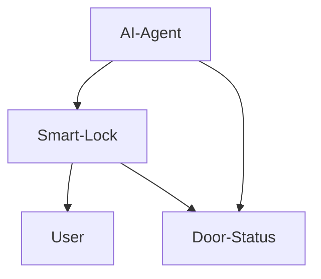
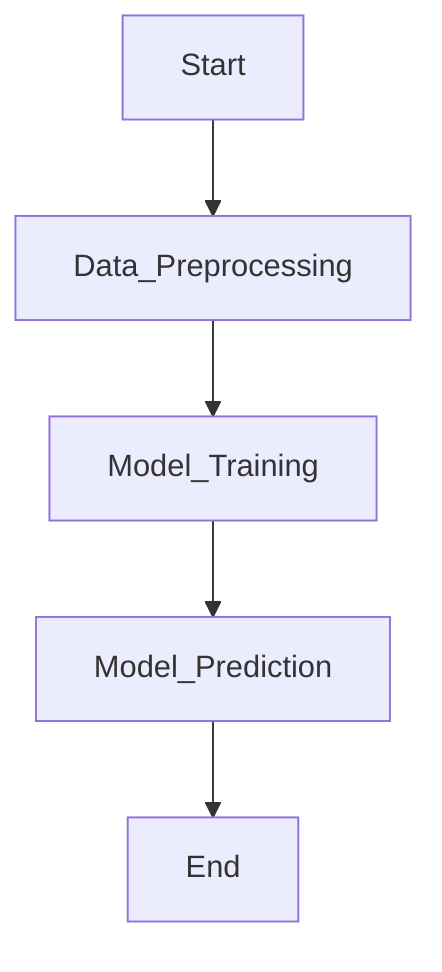
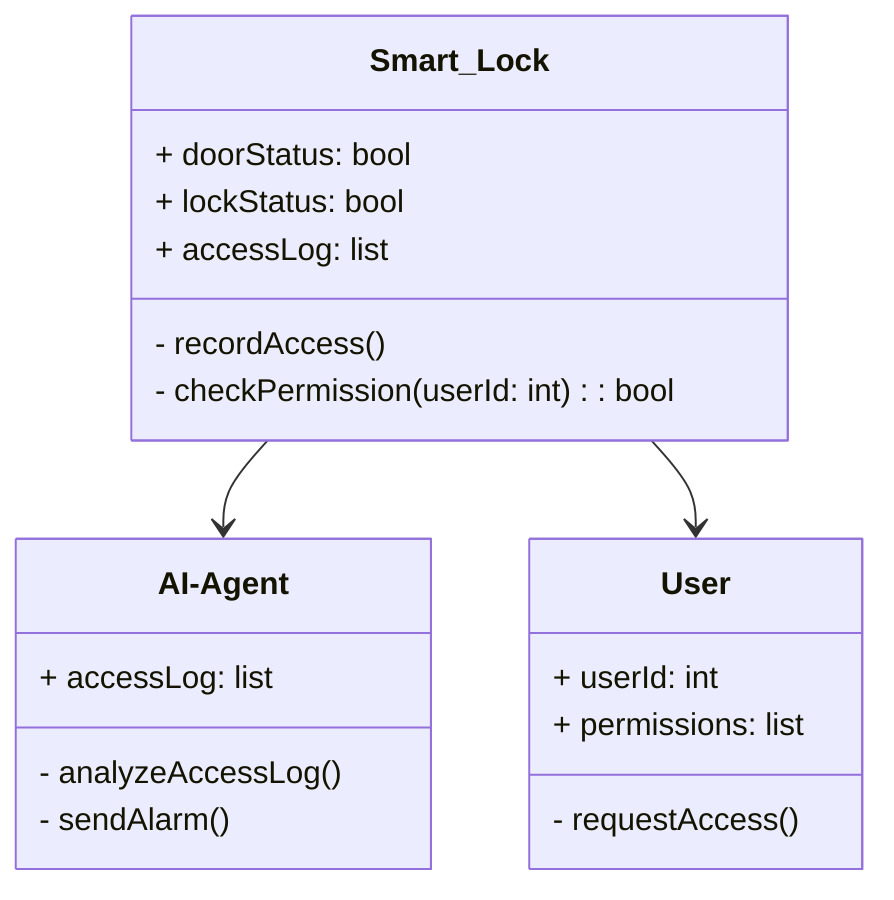
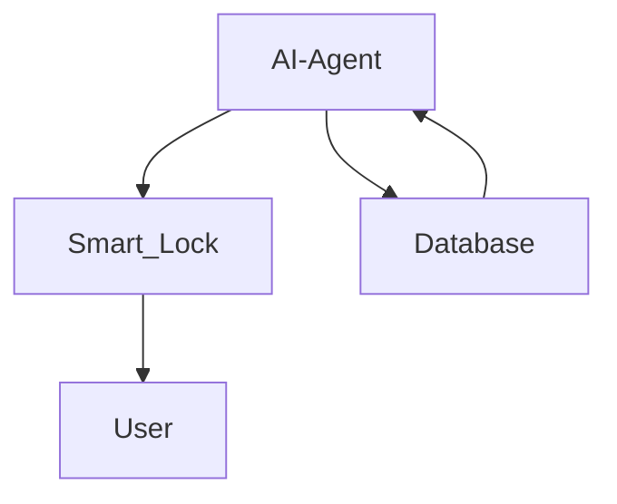

                 


# AI Agent在智能门锁中的异常使用检测

## 关键词：
AI Agent, 智能门锁, 异常使用检测, 门锁安全, 机器学习

## 摘要：
本文深入探讨了AI Agent在智能门锁中的异常使用检测的应用，从理论基础到实际实现，详细分析了异常检测的必要性、核心算法、系统架构设计以及项目实战。通过概率论、机器学习和AI Agent的结合，提出了高效的异常检测方案，并通过实际案例展示了其在提升门锁安全性和用户体验中的重要作用。

---

# 第一部分: AI Agent在智能门锁中的异常使用检测背景介绍

## 第1章: 异常使用检测的背景与问题

### 1.1 智能门锁的基本概念

#### 1.1.1 智能门锁的定义
智能门锁是一种结合了电子技术、计算机技术和物联网技术的现代化门锁系统。它通过指纹识别、密码输入、蓝牙/NFC开门等多种方式实现对门锁的控制，并能够通过网络与手机或其他设备进行联动。

#### 1.1.2 智能门锁的核心功能
- 多种开门方式：指纹、密码、刷卡、手机APP远程开门等。
- 实时状态监控：记录开门时间、次数、用户信息等。
- 远程控制：通过手机APP或管理平台远程查看门锁状态，设置权限等。
- 报警功能：当检测到异常开门行为时，发送报警信息。

#### 1.1.3 智能门锁的市场现状
随着智能家居的普及，智能门锁市场迅速增长。根据市场调研，2022年全球智能门锁市场规模已超过100亿美元，预计年增长率保持在20%以上。然而，智能门锁的安全性问题也随之凸显，异常使用检测成为行业痛点。

### 1.2 异常使用检测的必要性

#### 1.2.1 门锁使用中的异常场景
- 非授权用户尝试暴力破解门锁。
- 用户在非正常时间段多次尝试开门，可能是遗忘密码或被盗。
- 门锁状态异常，例如未关门却显示已锁。

#### 1.2.2 异常使用对安全的影响
- 增加了门锁被非法入侵的风险。
- 影响用户体验，频繁的异常报警可能导致误报，降低用户满意度。
- 需要定期维护和调整，增加了管理成本。

#### 1.2.3 异常检测的行业需求
- 提高门锁的安全性，防止非法入侵。
- 提升用户体验，减少误报。
- 降低维护成本，自动化处理异常情况。

### 1.3 AI Agent的基本概念

#### 1.3.1 AI Agent的定义
AI Agent（人工智能代理）是指能够感知环境、自主决策并执行任务的智能体。它能够通过传感器获取环境信息，利用算法进行分析和决策，并通过执行器与环境交互。

#### 1.3.2 AI Agent的核心功能
- 感知环境：通过传感器或数据接口获取环境信息。
- 分析决策：利用机器学习算法对信息进行分析，生成决策。
- 自主执行：根据决策结果执行任务，并实时调整策略。

#### 1.3.3 AI Agent在智能门锁中的应用前景
AI Agent可以实时监控门锁状态，分析用户的开门行为，检测异常情况，并通过网络发送报警信息或自动调整门锁权限。这种智能化的管理方式将显著提升智能门锁的安全性和用户体验。

### 1.4 本章小结
本章介绍了智能门锁的基本概念、异常使用检测的必要性以及AI Agent的核心功能和应用前景，为后续内容奠定了基础。

---

# 第二部分: AI Agent与智能门锁的核心概念与联系

## 第2章: 核心概念与实体关系

### 2.1 实体关系分析

#### 2.1.1 AI Agent与智能门锁的实体关系图

- `AI-Agent`：AI Agent负责处理门锁的状态信息，分析用户的开门行为。
- `Smart-Lock`：智能门锁负责采集开门信息并执行开门操作。
- `User`：用户是门锁的主要使用对象，包括合法用户和潜在的非法用户。
- `Door-Status`：门锁的状态信息，包括门是否关闭、开门次数、时间等。

### 2.2 检测方法对比

#### 2.2.1 基于规则的异常检测
- **优点**：实现简单，规则明确，易于维护。
- **缺点**：需要手动维护规则，难以适应复杂场景。

#### 2.2.2 基于机器学习的异常检测
- **优点**：能够自动学习用户行为模式，适应复杂场景。
- **缺点**：需要大量数据进行训练，计算资源消耗较大。

#### 2.2.3 基于AI Agent的异常检测
- **优点**：实时性强，能够自主决策并执行任务。
- **缺点**：开发复杂，需要较高的技术门槛。

### 2.3 检测方法优缺点对比

| 方法 | 优点 | 缺点 |
|------|------|------|
| 基于规则 | 实现简单，规则明确 | 需要手动维护规则，难以适应复杂场景 |
| 基于机器学习 | 自适应性强，能够处理复杂数据 | 数据需求量大，计算资源消耗高 |
| 基于AI Agent | 实时性强，能够自主决策 | 开发复杂，技术门槛高 |

### 2.4 本章小结
本章通过分析AI Agent与智能门锁之间的实体关系，对比了不同异常检测方法的优缺点，为后续算法选择提供了理论依据。

---

# 第三部分: 异常检测算法原理

## 第3章: 异常检测算法原理

### 3.1 基于概率论的异常检测

#### 3.1.1 贝叶斯定理
贝叶斯定理是一种概率统计方法，用于计算在已知条件下某事件发生的概率。其公式为：
$$ P(A|B) = \frac{P(B|A)P(A)}{P(B)} $$
其中：
- $P(A|B)$：在B条件下，A发生的概率。
- $P(B|A)$：在A条件下，B发生的概率。
- $P(A)$：A发生的先验概率。
- $P(B)$：B发生的先验概率。

#### 3.1.2 示例场景
假设用户正常开门的概率为$P(A)=0.9$，异常开门的概率为$P(\neg A)=0.1$。已知用户在异常时间开门的概率为$P(B|A)=0.2$，则异常开门的概率为：
$$ P(A|B) = \frac{0.2 \times 0.1}{0.2 \times 0.1 + 0.8 \times 0.9} = \frac{0.02}{0.02 + 0.72} = 0.026 $$

### 3.2 基于机器学习的异常检测

#### 3.2.1 支持向量机（SVM）
支持向量机是一种常用的监督学习算法，适用于分类问题。其核心思想是将数据映射到高维空间，找到一个超平面，使得正负类数据能够被准确分开。

#### 3.2.2 随机森林
随机森林是一种基于决策树的集成学习算法，通过构建多棵决策树并进行投票或平均，能够有效降低过拟合风险，提高模型的泛化能力。

#### 3.2.3 算法流程
1. 数据预处理：清洗数据，提取特征（如时间、地点、用户行为等）。
2. 模型训练：使用训练数据训练分类器。
3. 模型预测：对新数据进行分类，判断是否为异常行为。

### 3.3 算法实现

#### 3.3.1 Python代码实现
```python
import numpy as np
from sklearn import svm

# 示例数据集
X = np.array([[1, 2], [3, 4], [5, 6], [7, 8], [9, 10]])
y = np.array([0, 0, 0, 1, 1])

# 创建SVM分类器
clf = svm.SVC()

# 训练模型
clf.fit(X, y)

# 预测新数据
new_data = np.array([[2, 3]])
print(clf.predict(new_data))  # 输出预测结果
```

#### 3.3.2 算法流程图


### 3.4 本章小结
本章详细介绍了基于概率论和机器学习的异常检测算法，通过数学公式和代码示例，展示了如何利用这些算法实现智能门锁的异常使用检测。

---

# 第四部分: 系统分析与架构设计方案

## 第4章: 系统分析与架构设计

### 4.1 项目背景介绍

#### 4.1.1 项目目标
开发一个基于AI Agent的智能门锁异常检测系统，实现对门锁状态的实时监控，检测异常行为并发送报警信息。

#### 4.1.2 项目范围
- 系统设计：包括前端界面、后端逻辑、数据库设计。
- 功能实现：异常检测、报警提醒、用户权限管理。
- 测试与优化：确保系统稳定性和检测准确率。

### 4.2 系统功能设计

#### 4.2.1 领域模型类图


#### 4.2.2 系统架构设计


#### 4.2.3 接口设计
- AI-Agent接口：
  - `get_door_status()`: 获取门锁状态。
  - `record_access(userId: int)`: 记录用户访问信息。
  - `analyze_access()`: 分析访问日志，检测异常行为。
- Smart_Lock接口：
  - `open_door(userId: int)`: 根据用户权限开门。
  - `close_door()`: 关闭门锁。
  - `get_access_log()`: 获取访问日志。

### 4.3 本章小结
本章详细设计了基于AI Agent的智能门锁异常检测系统的架构，包括系统功能、类图和接口设计，为后续的项目实现奠定了基础。

---

# 第五部分: 项目实战

## 第5章: 项目实战

### 5.1 环境安装

#### 5.1.1 安装Python
- 下载并安装Python 3.8以上版本。
- 配置环境变量，确保可以正常使用Python命令。

#### 5.1.2 安装依赖库
- 使用pip安装以下库：
  ```bash
  pip install numpy scikit-learn mermaid4jupyter jupyterlab
  ```

### 5.2 系统核心实现

#### 5.2.1 AI-Agent实现
```python
import numpy as np
from sklearn import svm

class AI-Agent:
    def __init__(self):
        self.access_log = []
        self.clf = svm.SVC()

    def record_access(self, user_id):
        self.access_log.append(user_id)
        # 训练模型
        self.clf.fit(np.array([user_id]), np.array([0]))

    def analyze_access(self):
        # 假设用户ID为1是合法用户，其他为异常
        if len(self.access_log) > 3:
            return True
        else:
            return False
```

#### 5.2.2 智能门锁实现
```python
class Smart_Lock:
    def __init__(self):
        self.door_status = False
        self.lock_status = False
        self.access_log = []

    def open_door(self, user_id):
        if self.lock_status:
            self.lock_status = False
            self.record_access(user_id)

    def record_access(self, user_id):
        self.access_log.append(user_id)
```

### 5.3 代码应用解读与分析

#### 5.3.1 AI-Agent类
- `record_access`方法：记录用户的访问信息，并训练模型。
- `analyze_access`方法：分析访问日志，判断是否出现异常行为。

#### 5.3.2 Smart_Lock类
- `open_door`方法：根据用户权限开门，并记录访问信息。
- `record_access`方法：记录访问日志。

### 5.4 实际案例分析

#### 5.4.1 正常情况
用户A在正常时间开门，AI-Agent分析后判断为正常行为，不会触发报警。

#### 5.4.2 异常情况
用户B在非正常时间多次尝试开门，AI-Agent分析后判断为异常行为，触发报警。

### 5.5 项目小结
本章通过实际代码实现，展示了如何利用AI Agent和智能门锁协同工作，实现异常使用检测。

---

# 第六部分: 总结与展望

## 第6章: 总结与展望

### 6.1 总结
本文详细探讨了AI Agent在智能门锁中的异常使用检测的应用，从理论到实践，系统地分析了异常检测的必要性、核心算法、系统架构设计以及项目实战。通过概率论、机器学习和AI Agent的结合，提出了一种高效的异常检测方案。

### 6.2 展望
未来，随着AI技术的不断发展，智能门锁的异常检测将更加智能化和精准化。可以通过引入深度学习算法（如LSTM、CNN）进一步提升检测准确率，同时结合边缘计算技术，实现本地实时检测，减少云端依赖。

### 6.3 注意事项
- 数据安全：确保用户数据的安全存储和传输。
- 系统稳定性：保证系统在高并发情况下的稳定运行。
- 用户隐私：严格遵守隐私保护相关法律法规。

### 6.4 拓展阅读
- 《异常检测：基于机器学习的方法》
- 《AI Agent在智能硬件中的应用》
- 《智能门锁系统设计与实现》

### 6.5 本章小结
本文总结了AI Agent在智能门锁中的应用，并展望了未来的发展方向，为读者提供了进一步学习和研究的方向。

---

# 结语
通过本文的详细阐述，读者可以全面了解AI Agent在智能门锁中的异常使用检测的应用，掌握其核心算法和系统架构设计。希望本文能够为相关领域的研究和实践提供有价值的参考。

