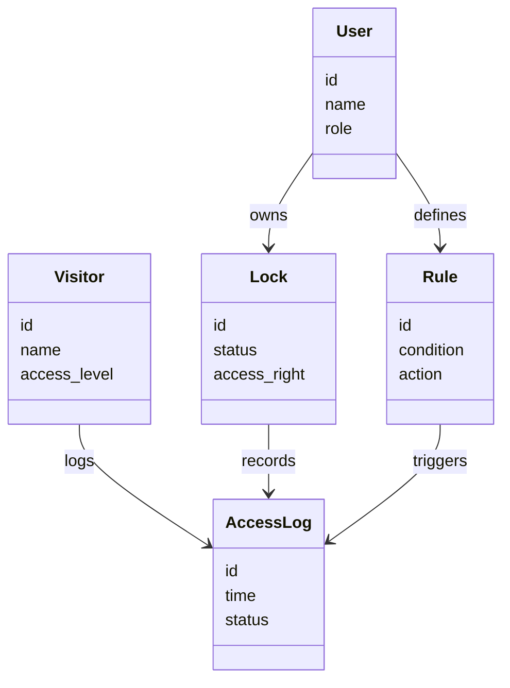
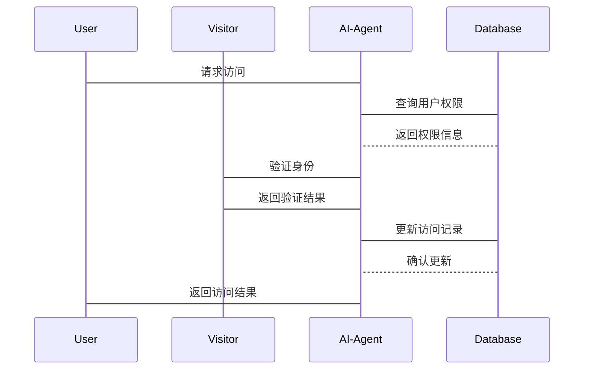

                 


## 第一部分: AI Agent在智能门锁中的访客权限管理概述

## 第2章: 核心概念与联系

### 2.1 核心概念原理

#### 2.1.1 AI Agent的基本原理
AI Agent是一种智能体，能够感知环境并采取行动以实现目标。在智能门锁中，AI Agent负责处理访客权限请求，分析用户行为模式，并根据规则做出决策。

#### 2.1.2 智能门锁的工作原理
智能门锁通过物联网技术连接到云端，用户可以通过手机应用远程控制门锁权限。AI Agent作为中间层，负责处理用户的请求并执行操作。

#### 2.1.3 访客权限管理的实现机制
访客权限管理通过AI Agent分析访客身份信息，结合用户设置的规则，动态调整权限。权限可以基于时间、地点或用户行为自动调整。

### 2.2 核心概念属性特征对比

#### 2.2.1 AI Agent与传统门锁系统的对比
- **智能化**：AI Agent能够主动学习和适应，而传统门锁只是被动响应。
- **安全性**：AI Agent通过行为分析提高安全性，传统门锁依赖固定密码。
- **便捷性**：AI Agent支持远程控制和自动化，传统门锁操作繁琐。

#### 2.2.2 访客权限管理的属性特征
- **动态性**：权限可以根据时间或行为变化。
- **智能性**：AI Agent能够自动调整权限。
- **安全性**：多重验证机制确保安全。

#### 2.2.3 系统扩展性与灵活性的对比
- **AI Agent**：高度可定制，支持多种验证方式。
- **传统系统**：扩展性差，难以适应新需求。

### 2.3 ER实体关系图

```mermaid
erDiagram
    user {
        id
        name
        role
    }
    visitor {
        id
        name
        access_level
    }
    access_log {
        id
        time
        status
    }
    lock {
        id
        status
        access_right
    }
    rule {
        id
        condition
        action
    }
    user --> lock : owns
    user --> rule : defines
    visitor --> access_log : logs
    lock --> access_log : records
    rule --> access_log : triggers
```

## 第3章: 算法原理讲解

### 3.1 算法概述
AI Agent通过机器学习算法分析用户行为模式，预测访客需求，并根据预设规则动态调整权限。

### 3.2 算法实现步骤

#### 3.2.1 数据收集与预处理
- 收集用户开门记录、访客请求日志等数据。
- 清洗数据，处理缺失值和异常值。

#### 3.2.2 特征提取
- 提取时间、地点、用户角色等特征。
- 使用主成分分析（PCA）降低维度。

#### 3.2.3 模型训练
- 使用随机森林或支持向量机（SVM）进行分类。
- 训练模型识别访客身份和权限。

#### 3.2.4 权限动态调整
- 根据模型预测结果调整访客权限。
- 实时更新访问日志。

### 3.3 代码实现

```python
import pandas as pd
from sklearn.ensemble import RandomForestClassifier
from sklearn.model_selection import train_test_split
from sklearn.metrics import accuracy_score

# 数据预处理
data = pd.read_csv('visitor_log.csv')
X = data.drop('access_level', axis=1)
y = data['access_level']

# 划分训练集和测试集
X_train, X_test, y_train, y_test = train_test_split(X, y, test_size=0.2, random_state=42)

# 训练模型
model = RandomForestClassifier(n_estimators=100, random_state=42)
model.fit(X_train, y_train)

# 预测和评估
y_pred = model.predict(X_test)
print("准确率:", accuracy_score(y_test, y_pred))
```

### 3.4 数学模型与公式

#### 3.4.1 随机森林算法
随机森林是一种基于决策树的集成学习方法，公式如下：
$$
\text{预测概率} = \frac{\sum_{i=1}^{n} \text{树} i \text{的预测结果}}{n}
$$

#### 3.4.2 支持向量机（SVM）
SVM通过最大化-margin分类器实现分类，公式如下：
$$
\text{优化目标} = \min \left( \frac{1}{2} \sum_{i=1}^{n} \omega^2 \right) + C \sum_{i=1}^{n} \xi_i
$$

## 第4章: 系统分析与架构设计方案

### 4.1 问题场景介绍

#### 4.1.1 需求分析
- 用户需要远程管理访客权限。
- 访客权限需要动态调整。
- 系统需要具备高安全性和可扩展性。

### 4.2 项目介绍

#### 4.2.1 项目目标
- 实现基于AI Agent的访客权限管理。
- 提供动态权限调整功能。
- 保证系统安全性和用户体验。

### 4.3 系统功能设计

#### 4.3.1 领域模型类图


#### 4.3.2 系统架构图
```mermaid
rectangle Database {
    User
    Visitor
    AccessLog
    Lock
    Rule
}
rectangle AI-Agent {
    PermissionManager
    LogManager
    RuleEvaluator
}
rectangle Web-Portal {
    UserInterface
    RequestHandler
}
rectangle IoT-Device {
    Lock
    Sensor
}
Database --> AI-Agent
AI-Agent --> Web-Portal
AI-Agent --> IoT-Device
```

### 4.4 系统接口设计

#### 4.4.1 访问控制接口
```python
class AccessManager:
    def grant_access(self, user_id, visitor_id):
        pass

    def revoke_access(self, user_id, visitor_id):
        pass

    def update_rule(self, rule_id, new_condition, new_action):
        pass
```

#### 4.4.2 日志管理接口
```python
class LogManager:
    def log_access(self, user_id, visitor_id, status):
        pass

    def retrieve_log(self, log_id):
        pass
```

### 4.5 系统交互设计

#### 4.5.1 序列图


## 第5章: 项目实战

### 5.1 环境安装

#### 5.1.1 安装Python和必要的库
```bash
pip install pandas scikit-learn matplotlib
```

#### 5.1.2 安装数据库和工具
使用MySQL或MongoDB，安装相应的Python驱动。

### 5.2 系统核心实现源代码

#### 5.2.1 访问控制模块
```python
from sklearn.ensemble import RandomForestClassifier
import pandas as pd
from sklearn.model_selection import train_test_split

# 数据加载
data = pd.read_csv('visitor_log.csv')
X = data.drop('access_level', axis=1)
y = data['access_level']

# 数据划分
X_train, X_test, y_train, y_test = train_test_split(X, y, test_size=0.2, random_state=42)

# 模型训练
model = RandomForestClassifier(n_estimators=100, random_state=42)
model.fit(X_train, y_train)

# 预测和评估
y_pred = model.predict(X_test)
print("准确率:", accuracy_score(y_test, y_pred))
```

#### 5.2.2 权限管理模块
```python
import sqlite3
from datetime import datetime

def grant_access(user_id, visitor_id):
    conn = sqlite3.connect('access.db')
    cursor = conn.cursor()
    cursor.execute('''
        INSERT INTO access_logs (user_id, visitor_id, access_time, status)
        VALUES (?, ?, ?, ?)
    ''', (user_id, visitor_id, datetime.now(), 'granted'))
    conn.commit()
    conn.close()

def revoke_access(user_id, visitor_id):
    conn = sqlite3.connect('access.db')
    cursor = conn.cursor()
    cursor.execute('''
        UPDATE access_logs SET status = ? WHERE user_id = ? AND visitor_id = ?
    ''', ('revoked', user_id, visitor_id))
    conn.commit()
    conn.close()
```

### 5.3 代码解读与分析

#### 5.3.1 访问控制模块
- 使用随机森林模型预测访客权限，基于用户行为和历史数据。
- 模型训练后，可以根据新数据预测权限，动态调整访客访问权限。

#### 5.3.2 权限管理模块
- 使用SQLite数据库存储访问日志，记录每次访问的状态。
- grant_access函数处理权限授予，revoke_access处理权限撤销。

### 5.4 案例分析与详细讲解

#### 5.4.1 实际应用场景
- 用户通过手机应用请求访客访问权限。
- AI Agent分析用户的历史行为，预测访客需求。
- 根据规则动态调整权限，记录访问日志。

#### 5.4.2 代码实现细节
- 训练好的模型部署到服务器，实时处理请求。
- 数据库存储访问日志，供后续分析和审计。

### 5.5 项目小结

#### 5.5.1 项目总结
通过AI Agent实现智能门锁的访客权限管理，提高了系统的智能化和安全性，减少了人为错误。

#### 5.5.2 经验与教训
- 数据质量对模型性能影响重大，需确保数据清洗和特征工程。
- 系统设计需考虑扩展性和可维护性，模块化设计有助于后续优化。

## 第6章: 最佳实践与小结

### 6.1 最佳实践

#### 6.1.1 系统设计建议
- 采用模块化设计，便于后续扩展和维护。
- 确保数据安全，防止未授权访问。

#### 6.1.2 开发规范
- 使用版本控制工具管理代码。
- 编写详细的文档，便于团队协作。

### 6.2 小结

#### 6.2.1 核心总结
AI Agent通过分析用户行为和历史数据，动态调整访客权限，显著提高了智能门锁的安全性和便捷性。

#### 6.2.2 展望
未来，随着AI技术的进步，智能门锁的访客权限管理将更加智能化和个性化，支持更多复杂的场景。

### 6.3 注意事项

#### 6.3.1 安全性提示
- 定期更新系统和模型，防范安全漏洞。
- 备份关键数据，防止数据丢失。

#### 6.3.2 性能优化建议
- 使用缓存技术减少数据库访问压力。
- 定期监控系统性能，优化算法和架构。

### 6.4 拓展阅读

#### 6.4.1 推荐书籍
- 《人工智能: 一种现代方法》
- 《机器学习实战》

#### 6.4.2 技术博客与资源
- 查看官方文档和开发者论坛，获取最新技术动态。

---

**摘要：** 本文详细探讨了AI Agent在智能门锁中的访客权限管理应用，从理论到实践，分析了系统的架构设计、算法实现和实际案例，总结了开发经验和最佳实践，为后续研究和应用提供了参考。

**关键词：** AI Agent, 智能门锁, 访客权限管理, 机器学习, 物联网, 系统架构

