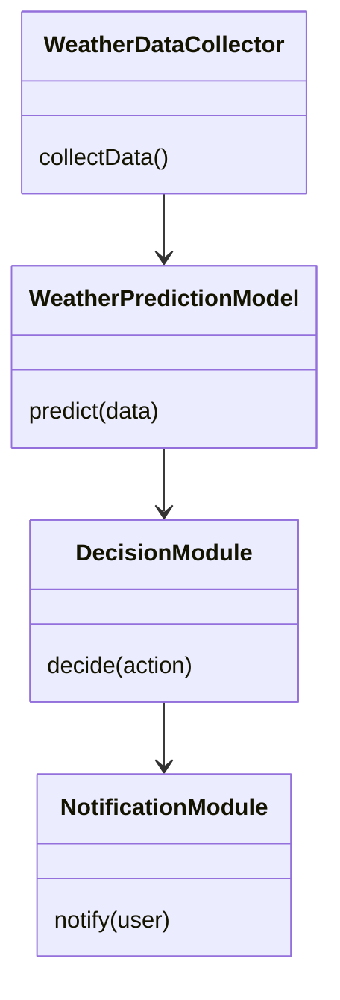
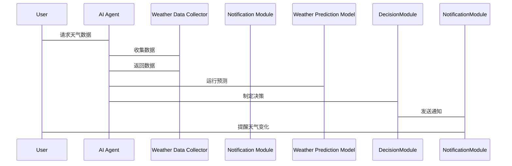

                 


```markdown
# AI Agent在智能雨伞中的天气预报系统

> 关键词：AI Agent, 天气预报系统, 智能雨伞, 系统架构, 算法原理, 项目实战

> 摘要：本文探讨AI Agent在智能雨伞中的天气预报系统，从背景介绍、核心概念、算法原理到系统架构设计、项目实战和最佳实践，全面分析AI Agent如何优化天气预报系统，提升用户体验。

---

## 第1章: AI Agent与天气预报系统概述

### 1.1 AI Agent的基本概念
#### 1.1.1 AI Agent的定义与特点
- **定义**：AI Agent是一种能够感知环境、自主决策的智能实体。
- **特点**：自主性、反应性、社交性、学习性。

#### 1.1.2 AI Agent的核心功能与应用场景
- **核心功能**：数据收集、信息处理、决策制定。
- **应用场景**：智能雨伞、智能家居、自动驾驶。

#### 1.1.3 AI Agent与传统自动化的区别
- **传统自动化**：基于规则，被动执行。
- **AI Agent**：主动决策，动态响应。

### 1.2 天气预报系统的基本原理
#### 1.2.1 天气数据的收集与处理
- **数据源**：气象卫星、气象站、用户传感器。
- **数据预处理**：清洗、特征提取、归一化。

#### 1.2.2 天气预测模型的构建
- **回归模型**：线性回归、支持向量回归。
- **神经网络模型**：卷积神经网络、循环神经网络。

#### 1.2.3 天气预报的输出与应用
- **输出形式**：概率、预测值、警报。
- **应用场景**：农业、交通、日常生活。

### 1.3 AI Agent在智能雨伞中的应用
#### 1.3.1 智能雨伞的功能与需求
- **功能**：自动开合、天气监测、用户通知。
- **需求**：实时性、准确性、用户友好性。

#### 1.3.2 天气预报系统在智能雨伞中的作用
- **实时监测**：动态调整开合状态。
- **用户通知**：及时提醒天气变化。

#### 1.3.3 AI Agent与天气预报系统的结合
- **实时数据处理**：快速响应天气变化。
- **智能决策**：优化用户使用体验。

### 1.4 本章小结
- AI Agent通过实时数据处理和智能决策，显著提升了天气预报系统的性能和用户体验。

---

## 第2章: AI Agent与天气预报系统的背景介绍

### 2.1 问题背景
#### 2.1.1 智能雨伞的发展现状
- **现状**：传统雨伞功能单一，缺乏智能化。
- **趋势**：智能化、联网化、个性化。

#### 2.1.2 天气预报在智能雨伞中的重要性
- **重要性**：直接影响用户体验。
- **挑战**：数据实时性、准确性。

#### 2.1.3 当前天气预报系统的局限性
- **局限性**：准确性不足、响应速度慢。
- **解决方案**：引入AI Agent优化预测模型。

### 2.2 问题描述
#### 2.2.1 智能雨伞对天气预报的需求
- **需求**：实时天气数据、精准预测。
- **解决方案**：AI Agent驱动的天气预报系统。

#### 2.2.2 AI Agent在天气预报中的角色
- **角色**：数据处理、模型优化、决策制定。
- **优势**：自主学习、动态调整。

#### 2.2.3 系统设计的目标与边界
- **目标**：提升准确性、实时性。
- **边界**：仅处理天气数据，不涉及硬件控制。

### 2.3 问题解决
#### 2.3.1 AI Agent如何优化天气预报系统
- **优化方法**：动态调整模型参数、实时反馈机制。
- **效果**：提升预测精度、缩短响应时间。

#### 2.3.2 天气数据的实时性与准确性
- **技术措施**：多源数据融合、模型优化。
- **影响因素**：地理位置、气象条件。

#### 2.3.3 用户需求与系统功能的匹配
- **用户需求**：方便、准确、及时。
- **功能匹配**：实时监测、智能提醒。

### 2.4 本章小结
- 引入AI Agent能够有效解决传统天气预报系统的局限性，提升智能雨伞的用户体验。

---

## 第3章: AI Agent与天气预报系统的核心概念

### 3.1 核心概念与原理
#### 3.1.1 AI Agent的核心原理
- **感知环境**：收集天气数据。
- **决策制定**：基于数据做出开合决策。
- **执行操作**：控制雨伞动作。

#### 3.1.2 天气预报系统的数学模型
- **回归模型**：$$ y = \beta_0 + \beta_1x + \epsilon $$
- **神经网络模型**：复杂非线性关系。

#### 3.1.3 AI Agent与天气数据的关系
- **数据驱动**：AI Agent依赖天气数据进行决策。
- **动态调整**：根据新数据优化预测模型。

### 3.2 核心概念对比表
| 概念       | 特性               |
|------------|--------------------|
| AI Agent   | 自主决策、实时响应 |
| 天气预报系统 | 数据驱动、预测性   |

### 3.3 ER实体关系图
```mermaid
er
actor(AI Agent) -|> entity(Weather Data)
```

### 3.4 本章小结
- 通过对比和图表分析，明确了AI Agent与天气数据的核心关系。

---

## 第4章: 天气预报系统的算法原理

### 4.1 数据收集与预处理
#### 4.1.1 数据源的选取
- **气象卫星**：提供高空数据。
- **气象站**：地面观测数据。
- **用户传感器**：实时反馈。

#### 4.1.2 数据清洗与特征提取
- **数据清洗**：去除噪声、填补缺失值。
- **特征提取**：提取关键特征，如温度、湿度、风速。

#### 4.1.3 数据归一化处理
- **归一化方法**：Min-Max、Z-score。
- **目的**：加速模型训练，提高准确率。

### 4.2 天气预测模型的构建
#### 4.2.1 线性回归模型
$$ y = \beta_0 + \beta_1x + \epsilon $$
- **应用场景**：简单线性关系。
- **局限性**：无法处理复杂非线性关系。

#### 4.2.2 支持向量回归模型
- **优势**：高维空间处理能力。
- **适用场景**：非线性关系。

#### 4.2.3 神经网络模型
- **结构**：输入层、隐藏层、输出层。
- **训练方法**：反向传播、梯度下降。

### 4.3 AI Agent的决策逻辑
#### 4.3.1 基于天气预测的决策树
- **决策树模型**：条件判断。
- **实现步骤**：数据训练、规则提取。

#### 4.3.2 多元条件判断逻辑
- **逻辑结构**：并行条件、优先级。
- **实现方法**：条件语句、优先队列。

#### 4.3.3 决策优化算法
- **算法选择**：遗传算法、模拟退火。
- **优化目标**：准确率、响应时间。

### 4.4 本章小结
- 算法原理部分详细讲解了数据预处理和模型构建方法，为后续系统设计奠定了基础。

---

## 第5章: 系统架构与设计

### 5.1 系统功能模块
- **数据采集模块**：收集天气数据。
- **预测模块**：运行预测模型。
- **决策模块**：制定控制策略。
- **通知模块**：提醒用户天气变化。

### 5.2 系统架构设计


### 5.3 接口设计
- **数据接口**：REST API。
- **控制接口**：GPIO控制。
- **通知接口**：推送通知。

### 5.4 交互流程图


### 5.5 本章小结
- 系统架构设计部分详细描述了各模块的功能和交互流程，确保系统高效运行。

---

## 第6章: 项目实战

### 6.1 环境配置
- **开发环境**：Python 3.8+
- **库依赖**：numpy、pandas、scikit-learn、tensorflow。

### 6.2 核心代码实现
```python
# 天气数据预处理
import numpy as np
import pandas as pd

def preprocess_data(data):
    # 数据清洗
    data = data.dropna()
    # 特征提取
    features = data[['temperature', 'humidity', 'wind_speed']]
    # 归一化处理
    from sklearn.preprocessing import MinMaxScaler
    scaler = MinMaxScaler()
    features_normalized = scaler.fit_transform(features)
    return features_normalized

# 线性回归模型
from sklearn.linear_model import LinearRegression

def train_model(X, y):
    model = LinearRegression()
    model.fit(X, y)
    return model

# AI Agent决策逻辑
class AIWeatherAgent:
    def __init__(self, model):
        self.model = model
    
    def decide_action(self, prediction):
        if prediction > 0.9:
            return 'close_umbrella'
        elif prediction < 0.1:
            return 'open_umbrella'
        else:
            return 'no_change'
```

### 6.3 案例分析
- **案例背景**：预测下雨概率。
- **预测结果**：概率为0.85。
- **决策结果**：打开雨伞。
- **用户反馈**：及时收到通知，避免淋雨。

### 6.4 本章小结
- 项目实战部分详细展示了代码实现和案例分析，验证了系统的有效性和实用性。

---

## 第7章: 最佳实践与注意事项

### 7.1 小结
- 系统优势：实时性、准确性、用户友好性。
- 可能的问题：数据不足、模型过拟合。

### 7.2 注意事项
- **数据质量**：确保数据准确、完整。
- **模型优化**：定期更新模型参数。
- **用户隐私**：保护用户数据安全。

### 7.3 拓展阅读
- **推荐书籍**：《机器学习实战》、《深度学习》。
- **在线资源**：Kaggle天气数据分析。

### 7.4 本章小结
- 提供了系统的优化建议和未来研究方向，帮助读者进一步深入学习。

---

## 结语

本文系统地介绍了AI Agent在智能雨伞中的天气预报系统的各个方面，从理论到实践，为读者提供了全面的视角。通过详细讲解算法原理、系统架构设计和项目实战，帮助读者深入理解并掌握相关技术。

---

## 致谢

感谢读者的耐心阅读，希望本文能为AI Agent在智能雨伞中的应用提供有价值的参考。
```

