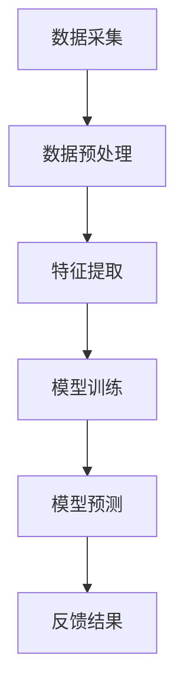
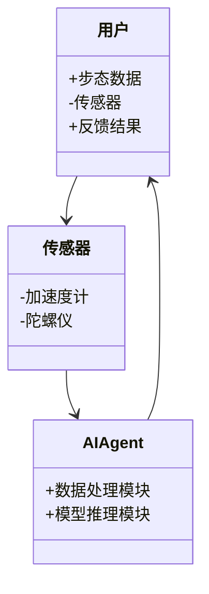
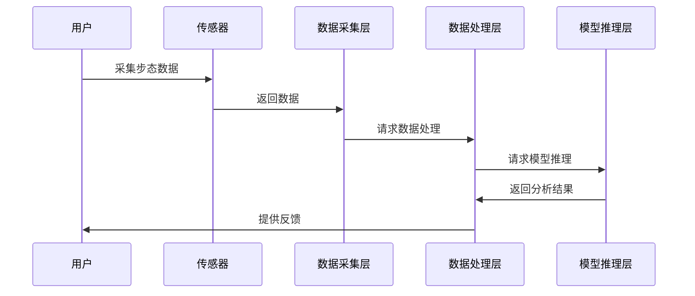

                 


# AI Agent在智能鞋中的步态分析

> 关键词：AI Agent, 步态分析, 智能鞋, 机器学习, 深度学习

> 摘要：本文探讨AI Agent在智能鞋中的步态分析应用，详细分析其背景、核心概念、算法原理、系统架构及项目实战，旨在为智能鞋的设计与优化提供技术参考。

---

# 第1章 AI Agent与步态分析概述

## 1.1 AI Agent的基本概念

### 1.1.1 什么是AI Agent
AI Agent（人工智能代理）是指能够感知环境、自主决策并执行任务的智能实体。它能够通过传感器获取数据，利用算法处理信息，并通过执行器与环境互动。AI Agent在智能鞋中的应用主要体现在数据采集、分析和反馈方面。

### 1.1.2 AI Agent的核心特征
AI Agent的核心特征包括自主性、反应性、目标导向和学习能力。这些特征使其能够适应动态环境，实时响应用户的行走数据。

### 1.1.3 AI Agent在智能鞋中的应用前景
AI Agent在智能鞋中的应用前景广阔，包括健康监测、运动分析、个性化建议等。通过实时分析用户的步态，AI Agent可以提供科学的运动建议，帮助用户优化行走姿势，预防运动损伤。

## 1.2 步态分析的基本概念

### 1.2.1 步态分析的定义
步态分析是通过对人体行走过程中的生物力学参数进行测量和分析，以评估步态的健康性和功能性。步态分析的关键指标包括步长、步频、步幅、单腿支撑时间等。

### 1.2.2 步态分析的关键指标
1. **步长**：单步的长度。
2. **步频**：单位时间内步数。
3. **步幅**：步长的总和。
4. **单腿支撑时间**：单腿支撑地面的时间。

### 1.2.3 步态分析的分类
1. **正常步态**：自然行走的步态。
2. **异常步态**：如跛行、外八字等。

## 1.3 AI Agent在步态分析中的作用

### 1.3.1 AI Agent如何辅助步态分析
AI Agent通过传感器采集行走数据，利用机器学习算法进行分析，提供个性化的步态反馈。

### 1.3.2 AI Agent在步态分析中的优势
1. **实时性**：能够实时分析步态数据。
2. **准确性**：通过机器学习提高分析精度。
3. **个性化**：根据用户数据提供定制化建议。

### 1.3.3 AI Agent步态分析的边界与外延
AI Agent步态分析的边界在于数据采集的准确性和算法的泛化能力。外延则涉及步态分析的医疗应用、运动训练等领域。

## 1.4 本章小结
本章介绍了AI Agent的基本概念、步态分析的关键指标及其在智能鞋中的应用前景。AI Agent通过实时分析步态数据，为用户提供个性化的健康建议和运动指导。

---

# 第2章 AI Agent步态分析的核心概念

## 2.1 AI Agent步态分析的原理

### 2.1.1 数据采集与处理
AI Agent通过鞋内嵌入的传感器（如加速度计、陀螺仪）采集行走数据，包括加速度、角速度等。

### 2.1.2 特征提取与识别
通过机器学习算法提取步态特征，如步长、步频等，识别步态类型。

### 2.1.3 分析与反馈
AI Agent分析步态特征，提供反馈，如建议调整步幅以减少运动损伤。

## 2.2 步态分析的关键技术

### 2.2.1 传感器技术
鞋内嵌入的传感器用于采集行走数据。

### 2.2.2 数据处理技术
包括数据清洗、特征提取等步骤，确保数据质量。

### 2.2.3 机器学习算法
使用随机森林、支持向量机等算法进行步态分类。

## 2.3 AI Agent与步态分析的结合

### 2.3.1 AI Agent在步态分析中的角色
AI Agent作为数据处理和分析的核心，实时处理行走数据。

### 2.3.2 步态分析对AI Agent的促进作用
步态分析的需求推动了AI Agent在传感器数据处理方面的优化。

### 2.3.3 二者的协同效应
AI Agent与步态分析的结合实现了智能鞋的智能化，为用户提供个性化的步态反馈。

## 2.4 本章小结
本章详细讲解了AI Agent步态分析的原理、关键技术及其结合方式，为后续章节的深入分析奠定基础。

---

# 第3章 AI Agent步态分析的核心算法

## 3.1 基于机器学习的步态分析

### 3.1.1 传统机器学习算法
1. **随机森林**：适用于特征重要性分析。
2. **支持向量机**：适用于步态分类。

### 3.1.2 深度学习算法
1. **卷积神经网络**：适用于图像类数据的特征提取。
2. **长短期记忆网络**：适用于时间序列数据的分析。

### 3.1.3 算法选择与优化
根据数据类型和任务需求选择合适的算法，并通过超参数调优优化性能。

## 3.2 步态分析的数学模型

### 3.2.1 数据预处理模型
$$ y_{\text{filtered}} = \alpha y_{\text{original}} + (1-\alpha) y_{\text{filtered}} $$

### 3.2.2 特征提取模型
$$ f(x) = w_1 x_1 + w_2 x_2 + \dots + w_n x_n + b $$

### 3.2.3 分类与回归模型
$$ P(y|X) = \prod_{i=1}^n P(x_i|y) P(y) $$

## 3.3 AI Agent步态分析的流程图



## 3.4 本章小结
本章详细讲解了AI Agent步态分析的核心算法，包括传统机器学习和深度学习算法，并通过数学模型和流程图展示了整个分析过程。

---

# 第4章 系统分析与架构设计方案

## 4.1 问题场景介绍
智能鞋需要实时采集步态数据，分析用户步态，提供个性化建议。

## 4.2 项目介绍
设计一个基于AI Agent的智能鞋系统，实现步态分析功能。

## 4.3 系统功能设计

### 4.3.1 领域模型类图


### 4.3.2 系统架构图


### 4.3.3 系统接口设计
1. 数据采集接口：传感器数据的读取。
2. 数据处理接口：数据预处理和特征提取。
3. 模型推理接口：步态分析模型的调用。
4. 反馈接口：将分析结果反馈给用户。

### 4.3.4 系统交互序列图


## 4.4 本章小结
本章通过系统架构图和交互序列图，详细描述了AI Agent步态分析系统的整体架构和各模块的交互流程。

---

# 第5章 项目实战

## 5.1 环境安装
1. 安装Python和相关库（如numpy、scikit-learn）。
2. 安装传感器数据采集库（如pybluez）。

## 5.2 核心代码实现

### 5.2.1 数据采集代码
```python
import bluetooth

def find_devices():
    devices = bluetooth discover nearby devices()
    return devices

devices = find_devices()
print(devices)
```

### 5.2.2 数据处理代码
```python
import numpy as np

def preprocess_data(data):
    return np.nan_to_num(data)
```

### 5.2.3 模型训练代码
```python
from sklearn.ensemble import RandomForestClassifier

# 假设X是特征矩阵，y是标签
model = RandomForestClassifier()
model.fit(X, y)
```

### 5.2.4 模型推理代码
```python
def predict_gait(data):
    return model.predict(data)
```

## 5.3 实际案例分析
以用户A为例，分析其步态数据，识别步态类型并提供反馈。

## 5.4 项目小结
本章通过实际案例展示了AI Agent步态分析系统的实现过程，从环境搭建到代码实现，再到案例分析，为读者提供了完整的实践指导。

---

# 第6章 最佳实践

## 6.1 小结
AI Agent在智能鞋中的步态分析应用具有广阔前景，能够为用户提供个性化的健康建议和运动指导。

## 6.2 注意事项
1. 数据采集的准确性直接影响分析结果。
2. 需要处理传感器数据的噪声问题。
3. 模型的泛化能力需要在不同用户群体中进行验证。

## 6.3 拓展阅读
推荐阅读相关领域的学术论文和书籍，深入理解AI Agent和步态分析的最新研究成果。

## 6.4 本章小结
本章总结了AI Agent步态分析系统的应用价值，并提供了实际应用中的注意事项和拓展阅读方向。

---

# 结语
AI Agent在智能鞋中的步态分析是人工智能技术在可穿戴设备中的重要应用。通过实时分析用户的行走数据，AI Agent能够提供个性化的健康建议和运动指导，帮助用户优化行走姿势，预防运动损伤。未来，随着技术的不断发展，AI Agent在智能鞋中的应用将更加广泛，为用户提供更加智能化的服务。

