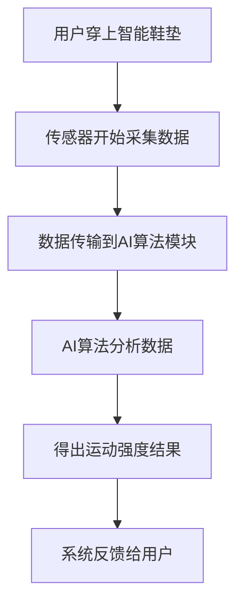
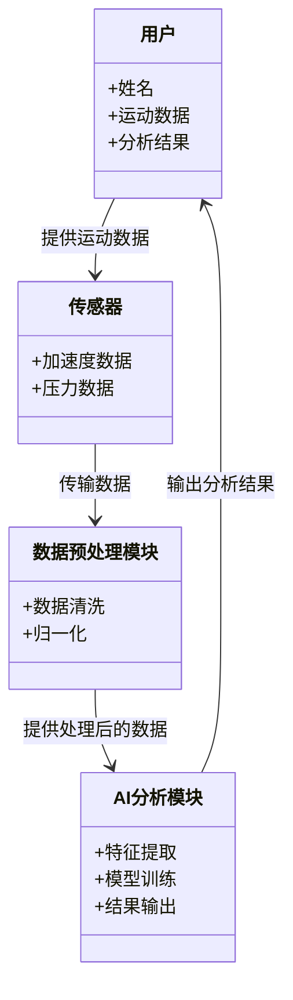

                 


# AI Agent在智能鞋垫中的运动强度分析

> 关键词：AI Agent, 智能鞋垫, 运动强度分析, 传感器数据, 机器学习, 算法优化, 系统架构设计

> 摘要：本文探讨AI Agent在智能鞋垫中的应用，重点分析其在运动强度分析中的原理、算法实现及系统架构设计。文章从背景介绍、核心概念、算法原理、系统架构、项目实战到总结，全面阐述AI Agent如何通过传感器数据和机器学习模型实现对运动强度的精准分析，并展望其未来的应用前景。

---

## 第一部分: AI Agent与智能鞋垫的背景介绍

### 第1章: AI Agent的基本概念

#### 1.1 AI Agent的定义与特点
- **AI Agent的定义**：AI Agent（人工智能代理）是指能够感知环境、自主决策并执行任务的智能实体。它能够通过传感器获取信息，利用算法处理数据，并根据结果采取行动。
- **AI Agent的核心特点**：
  - **自主性**：无需外部干预，自主完成任务。
  - **反应性**：能够实时感知环境变化并做出反应。
  - **学习能力**：通过数据训练不断优化性能。
  - **适应性**：能够适应不同的环境和任务需求。

- **AI Agent与传统算法的区别**：
  | 特性 | 传统算法 | AI Agent |
  |------|----------|----------|
  | 数据依赖性 | 低       | 高       |
  | 自适应性 | 低       | 高       |
  | 决策能力 | 单一     | 多样化   |

#### 1.2 智能鞋垫的定义与工作原理
- **智能鞋垫的定义**：智能鞋垫是一种内置了多种传感器的鞋垫，能够实时采集穿着者的运动数据，如加速度、压力分布、步频等。
- **智能鞋垫的工作原理**：
  1. **数据采集**：鞋垫中的传感器实时采集运动数据。
  2. **数据传输**：通过蓝牙或Wi-Fi将数据传输到手机或云端。
  3. **数据处理**：利用AI算法对数据进行分析，得出运动强度、步态分析等结果。

### 第2章: 运动强度分析的背景与意义
- **运动强度分析的背景**：
  - 运动强度是指运动时身体所承受的负荷，通常与心率、能量消耗等相关。
  - 随着健康意识的提升，人们对运动强度的科学分析需求日益增加。
- **AI Agent在运动强度分析中的应用**：
  - **优势**：AI Agent能够实时采集和分析数据，提供精准的运动强度评估。
  - **具体应用**：智能鞋垫通过AI Agent分析用户的运动数据，提供个性化的运动建议。
- **未来发展方向**：结合可穿戴设备和AI技术，实现更精准、更个性化的运动强度分析。

---

## 第二部分: AI Agent在智能鞋垫中的核心概念与联系

### 第3章: AI Agent的核心概念与原理

#### 3.1 AI Agent的核心概念
- **状态感知**：AI Agent通过传感器获取环境信息，如加速度、压力等。
- **行为决策**：基于感知到的信息，AI Agent利用算法做出决策，如判断运动强度。
- **动作执行**：根据决策结果，AI Agent通过执行机构（如反馈给用户）采取行动。

#### 3.2 AI Agent的感知与决策过程
- **数据采集与预处理**：
  - 数据采集：通过传感器获取原始数据。
  - 数据预处理：对数据进行清洗、归一化等处理。
- **数据分析与特征提取**：
  - 利用机器学习算法对数据进行特征提取，如加速度的最大值、平均值等。
- **决策模型的构建与优化**：
  - 使用回归分析或分类算法构建决策模型。
  - 通过训练数据不断优化模型性能。

### 第4章: AI Agent与智能鞋垫的实体关系分析

#### 4.1 实体关系图
```mermaid
erDiagram
    actor 用户
    actor 系统
    system 智能鞋垫
    system 数据库
    system 传感器
    system AI算法模块
    用户 --> 传感器 : 提供运动数据
    传感器 --> 系统 : 传输数据
    系统 --> AI算法模块 : 数据分析
    AI算法模块 --> 数据库 : 保存分析结果
    数据库 --> 用户 : 提供反馈
```

#### 4.2 AI Agent与智能鞋垫的交互流程


---

## 第三部分: AI Agent运动强度分析的算法原理

### 第5章: AI Agent运动强度分析的算法原理

#### 5.1 算法原理概述
- **数据采集与特征提取**：
  - 通过传感器获取加速度、压力等数据。
  - 提取特征，如加速度的最大值、平均值、方差等。
- **决策模型的构建**：
  - 使用回归分析或分类算法，如随机森林、支持向量机（SVM）等。
  - 对模型进行训练和验证，优化模型性能。

#### 5.2 算法实现
- **回归分析**：
  $$ y = \beta_0 + \beta_1 x + \epsilon $$
  其中，$y$ 是运动强度，$x$ 是加速度特征，$\beta_0$ 和 $\beta_1$ 是回归系数。
- **分类算法（以随机森林为例）**：
  ```python
  from sklearn.ensemble import RandomForestClassifier
  model = RandomForestClassifier(n_estimators=100)
  model.fit(X_train, y_train)
  y_pred = model.predict(X_test)
  ```

#### 5.3 算法优化
- **特征选择**：通过特征重要性分析选择关键特征。
- **超参数优化**：使用网格搜索或随机搜索优化模型参数。

---

## 第四部分: 系统分析与架构设计方案

### 第6章: 系统功能设计

#### 6.1 系统功能模块
- **传感器数据采集模块**：负责采集运动数据。
- **数据预处理模块**：对数据进行清洗和归一化。
- **AI分析模块**：利用机器学习算法进行运动强度分析。
- **用户反馈模块**：将分析结果反馈给用户。

#### 6.2 系统架构设计


### 第7章: 系统架构设计

#### 7.1 系统架构图


#### 7.2 系统接口设计
- **前端接口**：手机APP与用户的交互界面。
- **后端接口**：云端服务器接收数据并返回分析结果。

---

## 第五部分: 项目实战

### 第8章: 项目实战

#### 8.1 环境安装
- **Python环境**：安装Python 3.8及以上版本。
- **依赖库安装**：
  ```bash
  pip install numpy scikit-learn matplotlib
  ```

#### 8.2 核心代码实现
```python
import numpy as np
from sklearn.ensemble import RandomForestClassifier
from sklearn.metrics import accuracy_score

# 示例数据集
X = np.random.rand(100, 5)  # 5个特征，100个样本
y = np.random.randint(0, 2, 100)  # 二分类问题

# 数据分割
X_train, X_test = X[:70], X[70:]
y_train, y_test = y[:70], y[70:]

# 模型训练
model = RandomForestClassifier(n_estimators=100)
model.fit(X_train, y_train)

# 模型预测
y_pred = model.predict(X_test)

# 模型评估
print("Accuracy:", accuracy_score(y_test, y_pred))
```

#### 8.3 实际案例分析
- **案例背景**：假设一名用户穿着智能鞋垫进行跑步运动。
- **数据采集**：传感器采集用户的加速度、压力等数据。
- **数据分析**：AI算法分析数据，得出用户的运动强度为中等。
- **结果反馈**：系统建议用户调整跑步姿势以减少疲劳。

---

## 第六部分: 总结与展望

### 第9章: 总结
- **总结**：本文详细探讨了AI Agent在智能鞋垫中的应用，分析了其在运动强度分析中的原理、算法实现及系统架构设计。通过实际案例展示了AI Agent的优势和潜力。
- **小结**：AI Agent通过传感器数据和机器学习算法，能够实时分析用户的运动强度，为用户提供个性化的运动建议。

### 第10章: 注意事项与未来展望
- **注意事项**：
  - 数据采集的准确性会影响分析结果。
  - 模型的泛化能力需要通过数据增强和优化算法来提升。
- **未来展望**：
  - 结合更多的传感器数据，提高分析的精度。
  - 探索AI Agent在运动康复、运动损伤预防等领域的应用。

---

通过以上分析，AI Agent在智能鞋垫中的运动强度分析不仅能够提升用户的运动体验，还为未来的智能健康领域提供了新的可能性。

