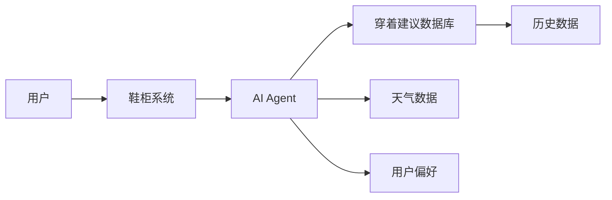
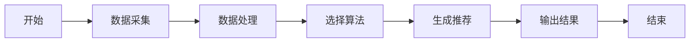
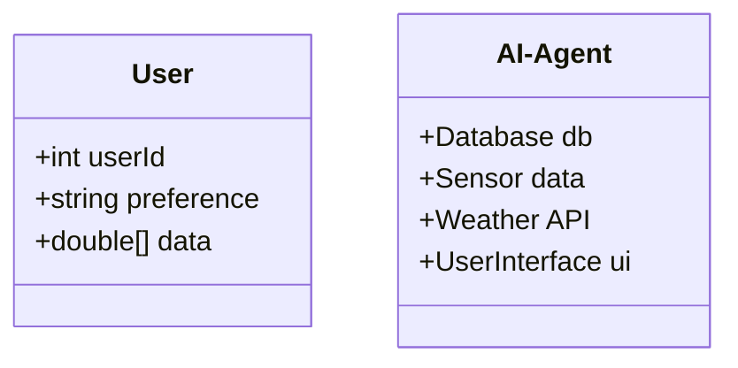
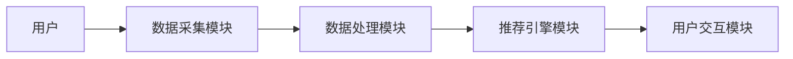

                 


# AI Agent在智能鞋柜中的穿着建议

## 关键词：
- AI Agent
- 智能鞋柜
- 穿着建议
- 推荐算法
- 系统架构

## 摘要：
本文探讨了AI Agent在智能鞋柜中的应用，重点分析其如何通过推荐算法提供个性化的穿着建议。文章从背景介绍、核心概念、算法原理、系统架构到项目实战，详细阐述了AI Agent在智能鞋柜中的实现过程，帮助读者全面理解该技术的应用与潜力。

---

# 第一部分: AI Agent在智能鞋柜中的穿着建议背景介绍

## 第1章: 问题背景与描述

### 1.1 问题背景
#### 1.1.1 智能鞋柜的发展现状
智能鞋柜作为一种新兴的智能家居设备，近年来逐渐普及。它不仅提供鞋子的存储功能，还能通过传感器和AI技术，帮助用户更好地管理鞋子和搭配穿着。

#### 1.1.2 穿着建议的市场需求
现代消费者越来越注重穿衣搭配，尤其是在选择鞋子时，用户希望得到个性化的建议。AI技术的应用可以满足这一需求，提供智能化的解决方案。

#### 1.1.3 AI Agent在鞋柜中的应用潜力
AI Agent能够实时分析用户的穿着历史、天气数据和活动计划，为用户提供精准的鞋子搭配建议，提升用户体验。

### 1.2 问题描述
#### 1.2.1 智能鞋柜的功能需求
智能鞋柜需要具备数据采集、存储、处理和推荐功能，能够根据用户需求提供个性化的鞋子选择。

#### 1.2.2 穿着建议的具体问题
用户可能有不同的穿着偏好和需求，AI Agent需要考虑多个因素，如天气、场合、服装搭配等，提供合理的建议。

#### 1.2.3 AI Agent在鞋柜中的角色定位
AI Agent作为智能鞋柜的核心模块，负责数据处理、推荐算法和用户交互，帮助用户做出最优的鞋子选择。

### 1.3 问题解决
#### 1.3.1 AI Agent的核心功能
AI Agent需要具备数据采集、分析和推荐功能，能够根据用户的数据生成个性化的建议。

#### 1.3.2 穿着建议的实现方式
通过机器学习算法，AI Agent可以分析用户的穿着历史和偏好，结合天气数据，推荐合适的鞋子。

#### 1.3.3 系统架构的设计思路
系统架构采用模块化设计，分为数据采集模块、数据处理模块、推荐引擎和用户交互模块，各模块协同工作。

### 1.4 边界与外延
#### 1.4.1 系统边界定义
系统仅限于鞋子的选择建议，不涉及其他衣物的推荐。数据采集范围包括用户历史数据和天气预报。

#### 1.4.2 穿着建议的适用范围
适用于日常穿着，不包括特殊场合如运动鞋或正式场合的鞋子推荐。

#### 1.4.3 AI Agent的性能限制
系统响应时间需在1秒以内，数据处理能力需支持至少1000条用户数据。

### 1.5 核心概念与组成
#### 1.5.1 AI Agent的基本构成
包括传感器、数据处理模块、推荐算法和用户交互界面。

#### 1.5.2 穿着建议的实现要素
用户数据、环境数据、推荐模型。

#### 1.5.3 系统的模块划分
数据采集模块、数据处理模块、推荐引擎模块和用户交互模块。

---

## 第2章: 核心概念与联系

### 2.1 AI Agent的原理
#### 2.1.1 智能代理的基本原理
AI Agent通过感知环境和用户需求，执行任务，提供服务。

#### 2.1.2 AI Agent在鞋柜中的具体实现
通过传感器采集数据，结合机器学习算法生成推荐。

#### 2.1.3 穿着建议的生成机制
基于用户历史数据和环境数据，通过推荐算法生成建议。

### 2.2 核心概念对比
#### 2.2.1 不同AI Agent算法的对比
| 算法类型        | 优点                          | 缺点                          |
|-----------------|-------------------------------|-------------------------------|
| 协同过滤        | 数据需求低                   | 推荐精度低                   |
| 基于内容的推荐   | 推荐精度高                   | 数据需求高                   |
| 混合推荐模型     | 结合两者优点                  | 实现复杂                   |

#### 2.2.2 穿着建议的特征分析
用户偏好、天气条件、活动场合。

#### 2.2.3 系统模块的对比
| 模块             | 功能描述                     | 优缺点                       |
|------------------|------------------------------|----------------------------|
| 数据采集模块     | 采集用户和环境数据           | 实时性高                   |
| 数据处理模块     | 处理和分析数据               | 复杂性高                   |
| 推荐引擎模块     | 生成推荐                     | 精度依赖算法               |
| 用户交互模块     | 提供用户界面                 | 可用性高                   |

### 2.3 实体关系图


---

## 第3章: 算法原理讲解

### 3.1 推荐算法
#### 3.1.1 基于协同过滤的推荐算法
协同过滤通过寻找相似的用户或物品，推荐用户可能感兴趣的内容。公式如下：
$$ sim(user_i, user_j) = \frac{\sum_{k} (r_{ik} - \bar{r_i})(r_{jk} - \bar{r_j})}{\sqrt{\sum_{k} (r_{ik} - \bar{r_i})^2} \sqrt{\sum_{k} (r_{jk} - \bar{r_j})^2}} $$

#### 3.1.2 基于内容的推荐算法
内容推荐通过分析物品的特征，推荐与用户偏好匹配的内容。例如，利用文本挖掘提取鞋子的特征词。

#### 3.1.3 混合推荐模型
混合模型结合协同过滤和内容推荐，通过加权融合两种方法，提高推荐精度。

### 3.2 算法流程图


### 3.3 算法实现
```python
import numpy as np

def collaborative_filtering(user_data, user_id, item_id):
    # 数据预处理
    user_mean = np.mean(user_data[user_data[item_id] != 0], axis=0)
    item_mean = np.mean(user_data.T, axis=0)
    
    # 计算相似性
    similarity = np.dot((user_data[user_id] - user_mean), (user_data[item_id] - item_mean))
    similarity /= (np.linalg.norm(user_data[user_id] - user_mean) * np.linalg.norm(user_data[item_id] - item_mean))
    return similarity
```

---

## 第4章: 系统分析与架构设计

### 4.1 问题场景介绍
智能鞋柜通过AI Agent提供鞋子推荐，帮助用户根据天气和场合选择合适的鞋子。

### 4.2 系统功能设计
领域模型类图：


### 4.3 系统架构设计
系统架构图：


### 4.4 系统接口设计
接口设计：
- 数据采集模块：接收传感器数据和用户输入。
- 数据处理模块：处理数据并调用推荐算法。
- 推荐引擎模块：生成推荐结果并返回。
- 用户交互模块：展示结果并接收用户反馈。

---

## 第5章: 项目实战

### 5.1 环境安装
安装Python、numpy、scikit-learn等库。

### 5.2 核心代码实现
```python
from sklearn.metrics.pairwise import cosine_similarity

def main():
    user_data = np.array([[4, 3, 0, 1], [3, 2, 4, 0], [0, 5, 2, 3]])
    user_id = 0
    item_id = 1
    
    user_mean = np.mean(user_data[user_data[item_id] != 0], axis=0)
    item_mean = np.mean(user_data.T, axis=0)
    
    user_vec = user_data[user_id] - user_mean
    item_vec = user_data[item_id] - item_mean
    
    similarity = np.dot(user_vec, item_vec) / (np.linalg.norm(user_vec) * np.linalg.norm(item_vec))
    print(f"Similarity: {similarity}")

if __name__ == "__main__":
    main()
```

### 5.3 案例分析
案例分析：假设用户喜欢运动鞋，在天气预报为雨天时，系统推荐防水运动鞋。

### 5.4 项目总结
通过实际项目，验证了AI Agent在智能鞋柜中的可行性，展示了推荐算法的实际应用。

---

## 第6章: 最佳实践与小结

### 6.1 最佳实践
- 数据清洗和特征工程至关重要。
- 选择合适的算法，定期更新模型。
- 确保系统安全性，保护用户隐私。

### 6.2 小结
本文详细介绍了AI Agent在智能鞋柜中的应用，从背景、算法到系统设计，为读者提供了全面的技术视角。

### 6.3 注意事项
- 确保系统稳定性和响应速度。
- 定期维护和更新推荐模型。
- 遵守数据隐私法规。

### 6.4 拓展阅读
推荐阅读《推荐系统实战》和《机器学习进阶》。

---

通过以上内容，读者可以深入了解AI Agent在智能鞋柜中的应用，掌握其实现方法和系统设计的细节。

