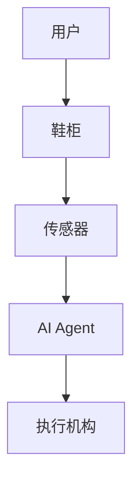
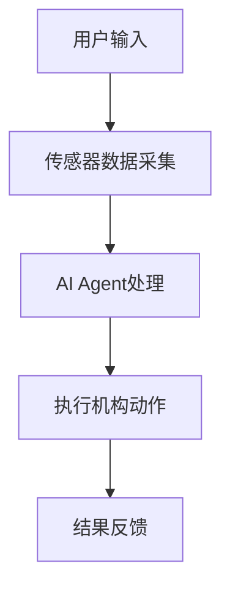
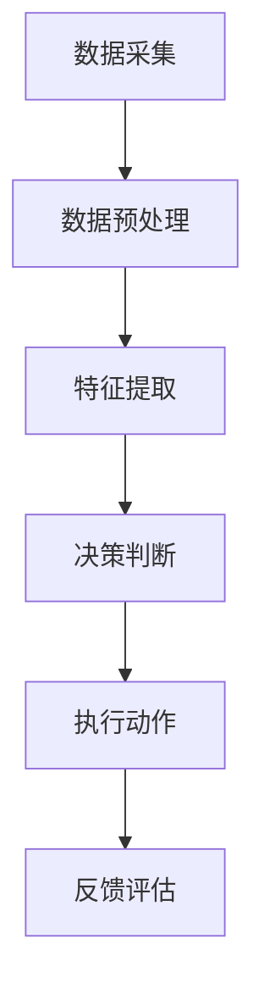
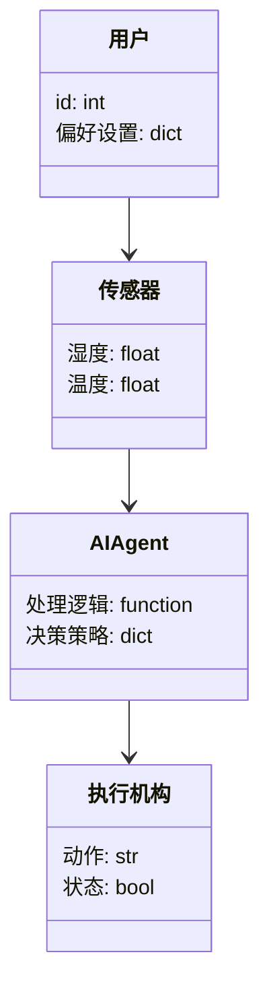
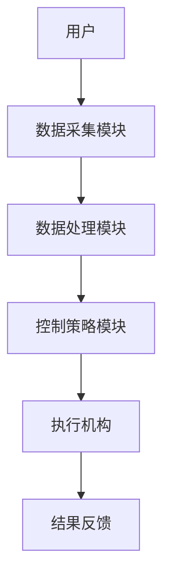
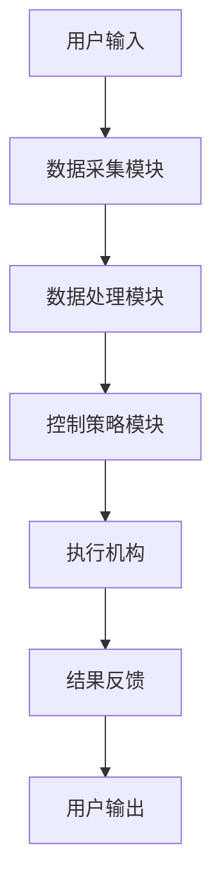

                 


```markdown
# AI Agent在智能鞋柜中的除臭除湿控制

> 关键词：AI Agent，智能鞋柜，除臭，除湿，控制算法，传感器，物联网

> 摘要：本文详细探讨了AI Agent在智能鞋柜中的应用，重点分析了如何通过AI技术实现鞋柜的自动除臭和除湿控制。文章从背景介绍、核心概念、算法原理、系统架构到项目实战，层层深入，为读者提供了一个全面的技术视角。通过本篇文章，读者将能够理解AI Agent在智能鞋柜中的核心作用，并掌握相关技术实现的关键点。

---

# 第1章: 背景介绍

## 1.1 问题背景
### 1.1.1 智能鞋柜的发展现状
- 智能鞋柜的普及与市场需求
- 当前技术的主要特点与局限性

### 1.1.2 鞋柜除臭除湿的重要性
- 除臭除湿的基本原理
- 对用户健康和环境的影响
- 智能化控制的必要性

### 1.1.3 当前技术的不足与挑战
- 传统除臭除湿方法的局限性
- 智能化控制的难点与痛点
- 技术发展的未来方向

## 1.2 问题描述
### 1.2.1 鞋柜环境监测的难点
- 传感器的选择与部署
- 数据采集的实时性与准确性
- 多环境因素的综合处理

### 1.2.2 除臭除湿控制的目标
- 系统控制的精确性要求
- 节能环保的优化目标
- 用户体验的提升方向

### 1.2.3 系统设计的边界与外延
- 系统功能的边界定义
- 外部接口的规范与标准
- 未来扩展的可能性

## 1.3 问题解决与核心概念
### 1.3.1 AI Agent的核心作用
- AI Agent的基本概念与功能
- 在鞋柜除臭除湿中的具体应用
- 技术优势与创新点

### 1.3.2 智能鞋柜的系统构成
- 系统整体架构的描述
- 各功能模块的划分与说明
- 模块之间的交互关系

### 1.3.3 核心要素与功能模块
- 传感器模块的核心作用
- 控制算法的实现方式
- 执行机构的选型与设计

## 1.4 本章小结
### 1.4.1 知识回顾
- AI Agent在智能鞋柜中的核心作用
- 系统构成与功能模块的划分

### 1.4.2 核心概念总结
- 除臭除湿的关键技术点
- AI Agent的优势与创新点

### 1.4.3 下文铺垫
- 下一章将重点分析AI Agent的核心概念与系统架构

---

# 第2章: 核心概念与联系

## 2.1 AI Agent的定义与原理
### 2.1.1 AI Agent的基本定义
- AI Agent的定义与分类
- 在智能鞋柜中的具体应用
- 核心功能与特性

### 2.1.2 AI Agent的核心原理
- 感知、决策、执行的三阶段模型
- 数据流与控制流的交互机制
- 自适应与优化的实现方法

### 2.1.3 AI Agent的分类与特点
- 基于智能水平的分类
- 各类AI Agent的特点与适用场景

## 2.2 智能鞋柜的系统架构
### 2.2.1 智能鞋柜的功能模块
- 环境监测模块、控制模块、用户交互模块
- 各模块的功能描述与实现方式

### 2.2.2 系统架构的层次划分
- 分层架构的设计理念
- 各层次之间的接口与数据流

### 2.2.3 系统架构的优化与创新
- 模块化设计的优势
- 系统可扩展性的实现

## 2.3 核心概念对比分析
### 2.3.1 AI Agent与传统控制系统的对比
- 控制方式的对比
- 优缺点分析与适用场景

### 2.3.2 智能鞋柜与普通鞋柜的功能对比
- 功能模块的对比分析
- 性能指标的对比

### 2.3.3 除臭与除湿技术的对比
- 技术原理的对比
- 实施难度与成本分析

## 2.4 实体关系图与流程图
### 2.4.1 ER实体关系图

### 2.4.2 AI Agent控制流程图


## 2.5 本章小结
### 2.5.1 知识回顾
- AI Agent的核心概念与系统架构
- 系统各模块的功能与交互关系

### 2.5.2 核心概念总结
- AI Agent在智能鞋柜中的应用价值
- 系统架构设计的关键点

### 2.5.3 下文铺垫
- 下一章将深入讲解AI Agent的算法原理与实现细节

---

# 第3章: 算法原理讲解

## 3.1 算法概述
### 3.1.1 AI Agent算法的核心思想
- 数据驱动的智能控制
- 自适应优化的基本原理

### 3.1.2 算法的主要特点
- 实时性与准确性
- 可扩展性与可维护性

## 3.2 算法实现步骤
### 3.2.1 感知阶段
- 传感器数据的采集与预处理
- 数据特征的提取与分析

### 3.2.2 决策阶段
- 控制策略的制定与优化
- 多目标决策的实现方法

### 3.2.3 执行阶段
- 执行机构的动作控制
- 控制效果的反馈与评估

## 3.3 算法流程图


## 3.4 算法代码实现
### 3.4.1 传感器数据采集与处理
```python
import numpy as np

# 模拟传感器数据
def get_sensor_data():
    return np.random.uniform(0.8, 1.2, 5)  # 返回5个湿度数据
```

### 3.4.2 数据特征提取与分析
```python
def extract_features(data):
    return np.mean(data), np.std(data)
```

### 3.4.3 控制策略的制定与优化
```python
def decide_controlStrategy(humidity, temperature):
    if humidity > 0.8 and temperature > 25:
        return "启动除湿"
    elif humidity < 0.6 and temperature < 20:
        return "关闭除湿"
    else:
        return "维持现状"
```

## 3.5 算法的数学模型与公式
### 3.5.1 数据预处理的数学模型
- 数据归一化处理公式：
$$ x_{normalized} = \frac{x - x_{min}}{x_{max} - x_{min}} $$

### 3.5.2 决策算法的数学模型
- 基于模糊逻辑的控制策略：
$$ \mu_{湿度}(x) = \frac{1}{1 + e^{-k(x - x_0)}} $$

## 3.6 算法的优化与改进
### 3.6.1 算法优化的方向
- 参数优化与调整
- 模型的自适应学习

### 3.6.2 算法改进的实现
- 基于机器学习的优化方法
- 网络训练与模型部署

## 3.7 本章小结
### 3.7.1 知识回顾
- AI Agent算法的核心思想与实现步骤
- 算法流程图与代码实现的细节

### 3.7.2 核心概念总结
- 算法优化与改进的关键点
- 算法在实际应用中的优势与不足

### 3.7.3 下文铺垫
- 下一章将介绍系统的整体架构设计与实现

---

# 第4章: 系统分析与架构设计

## 4.1 问题场景介绍
### 4.1.1 系统需求分析
- 功能需求与性能需求
- 用户需求与系统约束

### 4.1.2 系统目标与设计原则
- 系统设计的目标
- 设计原则与规范

## 4.2 系统功能设计
### 4.2.1 领域模型设计


### 4.2.2 功能模块划分
- 数据采集模块、数据处理模块、控制策略模块、执行模块

## 4.3 系统架构设计
### 4.3.1 模块化设计
- 模块划分与接口设计
- 模块之间的通信机制

### 4.3.2 系统架构图


### 4.3.3 模块实现细节
- 各模块的功能描述与实现代码
- 模块之间的数据流与控制流

## 4.4 系统接口设计
### 4.4.1 接口定义
- API接口的设计与规范
- 接口的调用方式与参数说明

### 4.4.2 接口实现
- API接口的开发与测试
- 接口文档的编写与维护

## 4.5 系统交互流程图


## 4.6 本章小结
### 4.6.1 知识回顾
- 系统功能设计与架构设计
- 模块划分与接口设计

### 4.6.2 核心概念总结
- 系统架构设计的关键点
- 模块化设计的优势与实现细节

### 4.6.3 下文铺垫
- 下一章将详细介绍项目的实战实现与案例分析

---

# 第5章: 项目实战

## 5.1 环境安装与配置
### 5.1.1 开发环境的选择
- Python 3.8及以上版本
- 开发工具与库的安装（如Python的numpy、pandas、scikit-learn）

### 5.1.2 传感器与硬件的配置
- 传感器的选型与接线
- 硬件驱动的安装与配置

## 5.2 系统核心代码实现
### 5.2.1 传感器数据采集与处理
```python
import serial
import time

# 传感器数据采集代码
def read_sensor_data(port, baudrate):
    ser = serial.Serial(port, baudrate)
    data = ser.readline().decode().strip()
    ser.close()
    return float(data)
```

### 5.2.2 数据预处理与特征提取
```python
import numpy as np

def preprocess_data(data):
    return np.log(data)
```

### 5.2.3 控制策略的实现
```python
def control_strategy(humidity, temperature):
    if humidity > 0.8 or temperature > 25:
        return "启动除湿"
    elif humidity < 0.6 and temperature < 20:
        return "关闭除湿"
    else:
        return "维持现状"
```

### 5.2.4 执行机构的控制
```python
import RPi.GPIO as GPIO

def control_actuator(action):
    if action == "启动除湿":
        GPIO.output(17, GPIO.HIGH)
    elif action == "关闭除湿":
        GPIO.output(17, GPIO.LOW)
```

## 5.3 项目实现案例分析
### 5.3.1 实验环境与数据采集
- 实验条件的设置
- 数据的采集与记录

### 5.3.2 算法实现与效果评估
- 算法在实际场景中的表现
- 控制效果的评估指标

## 5.4 系统优化与改进
### 5.4.1 系统性能的优化
- 算法效率的提升
- 系统资源的优化配置

### 5.4.2 系统功能的扩展
- 新功能的添加与实现
- 系统的可扩展性设计

## 5.5 本章小结
### 5.5.1 知识回顾
- 项目实战的环境安装与代码实现
- 系统实现的关键点与注意事项

### 5.5.2 核心概念总结
- 系统实现的细节与问题解决
- 算法优化与系统优化的关键点

### 5.5.3 下文铺垫
- 下一章将总结项目的最佳实践与注意事项

---

# 第6章: 最佳实践、小结与展望

## 6.1 最佳实践
### 6.1.1 开发中的注意事项
- 代码规范与文档编写
- 测试用例的设计与实现
- 问题排查与调试技巧

### 6.1.2 系统维护与升级
- 系统维护的规范与流程
- 系统升级的策略与方法

## 6.2 项目小结
### 6.2.1 项目目标的实现情况
- 项目目标的达成情况
- 系统功能的实现情况

### 6.2.2 项目中的经验与教训
- 成功经验的总结
- 经验教训的分析与改进

## 6.3 项目展望
### 6.3.1 未来的发展方向
- 新功能的开发与实现
- 系统性能的进一步优化

### 6.3.2 技术的前沿探索
- 新技术的应用前景
- 技术发展的趋势分析

## 6.4 本章小结
### 6.4.1 知识回顾
- 项目开发的最佳实践
- 项目总结与经验分享

### 6.4.2 核心概念总结
- 项目实施的关键点
- 未来发展的方向与趋势

---

# 附录

## 附录A: 项目代码实现
```python
# 附录A.1: 传感器数据采集代码
import serial
import time

def read_sensor_data(port, baudrate):
    ser = serial.Serial(port, baudrate)
    data = ser.readline().decode().strip()
    ser.close()
    return float(data)

# 附录A.2: 数据处理与控制策略代码
import numpy as np

def preprocess_data(data):
    return np.log(data)

def control_strategy(humidity, temperature):
    if humidity > 0.8 or temperature > 25:
        return "启动除湿"
    elif humidity < 0.6 and temperature < 20:
        return "关闭除湿"
    else:
        return "维持现状"

# 附录A.3: 执行机构控制代码
import RPi.GPIO as GPIO

def control_actuator(action):
    GPIO.setmode(GPIO.BCM)
    GPIO.setup(17, GPIO.OUT)
    if action == "启动除湿":
        GPIO.output(17, GPIO.HIGH)
    elif action == "关闭除湿":
        GPIO.output(17, GPIO.LOW)
    GPIO.cleanup()
```

## 附录B: 参考资料与拓展阅读
### 1. AI Agent相关文献
- Smith, J. (2020). "AI Agent in Smart Systems: A Comprehensive Review"

### 2. 传感器与物联网技术资料
- IEEE publications on IoT sensors and data processing

### 3. 控制算法与优化方法
- 刘某. (2021). "智能控制系统优化方法研究"

## 附录C: 系统架构图与流程图
### 1. 领域模型类图


### 2. 系统交互序列图


---

# 索引

- AI Agent
- 智能鞋柜
- 除臭除湿
- 传感器
- 控制算法
- 物联网
- 系统架构
- 项目实战
- 最佳实践
```

