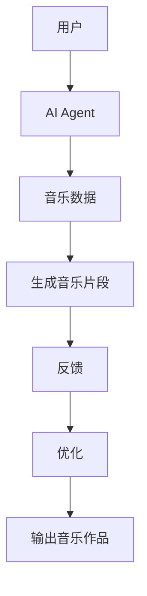
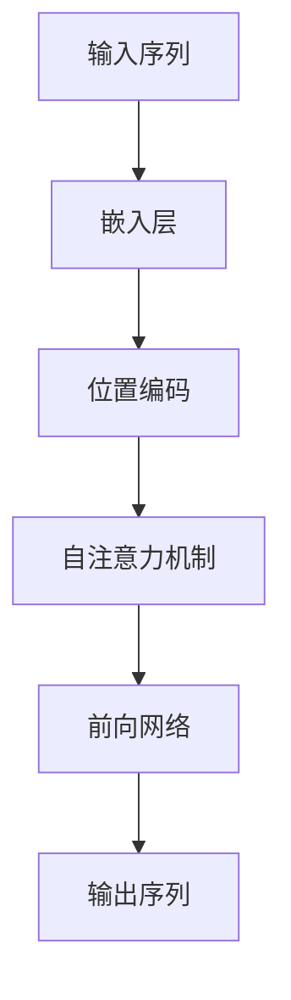
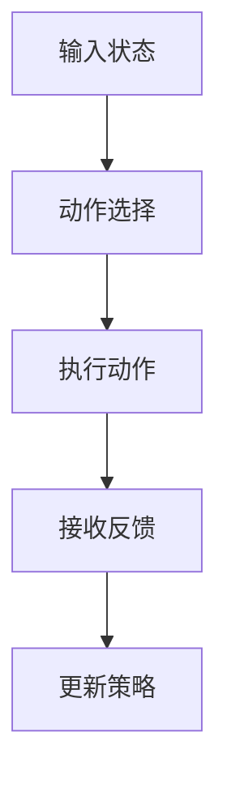
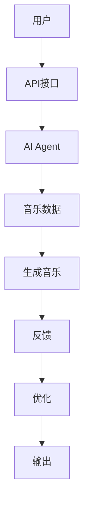
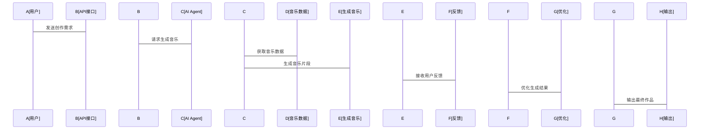

                 


# AI Agent在智能音乐创作中的应用

## 关键词：AI Agent，智能音乐创作，音乐生成模型，强化学习，Transformer

## 摘要：本文深入探讨AI Agent在智能音乐创作中的应用，分析其核心概念、算法原理、系统架构及实际案例。通过理论与实践结合，揭示AI Agent如何助力音乐创作，提升创作效率与质量。

---

## 第一部分: AI Agent在智能音乐创作中的背景与基础

## 第1章: AI Agent与智能音乐创作概述

### 1.1 AI Agent的基本概念

#### 1.1.1 AI Agent的定义与特点

AI Agent（人工智能代理）是指具备感知环境、理解任务、执行操作并能够自主决策的智能体。其特点包括：

- **自主性**：能够独立执行任务，无需人工干预。
- **反应性**：能够实时感知环境并做出反应。
- **目标导向**：以特定目标为导向，优化决策过程。
- **学习能力**：通过数据和反馈不断优化自身性能。

#### 1.1.2 AI Agent的核心技术原理

AI Agent的核心技术包括：

1. **感知模块**：通过传感器或数据接口获取环境信息。
2. **推理模块**：基于感知信息进行逻辑推理或模式识别。
3. **执行模块**：根据推理结果执行具体操作。

#### 1.1.3 AI Agent在音乐创作中的应用潜力

AI Agent在音乐创作中的潜力主要体现在：

- **自动化创作**：生成旋律、和弦等音乐元素。
- **实时交互**：与人类音乐家实时协作，提供实时反馈。
- **个性化推荐**：根据用户喜好推荐音乐风格或创作方向。

### 1.2 智能音乐创作的背景与现状

#### 1.2.1 音乐创作的传统模式

传统音乐创作主要依赖人类作曲家的创造力和经验，创作过程包括以下几个步骤：

1. **灵感收集**：作曲家通过各种途径获取创作灵感。
2. **草图创作**：将灵感转化为初步的音乐结构。
3. **细节完善**：对音乐作品进行润色和调整。
4. **协作与反馈**：与团队成员或其他音乐家进行协作和反馈。

#### 1.2.2 数字化音乐创作的演变

随着计算机技术的发展，音乐创作逐渐从纯人工模式转向数字化创作模式。数字化创作的优势在于：

- **工具支持**：利用DAW（数字音频工作站）等工具进行音乐制作。
- **数据驱动**：基于大量音乐数据进行分析和生成。
- **实时协作**：通过网络实现多人实时协作。

#### 1.2.3 当前AI在音乐创作中的应用现状

当前，AI在音乐创作中的应用主要集中在以下几个方面：

- **音乐生成**：利用GAN、Transformer等模型生成音乐片段。
- **风格迁移**：将一种音乐风格迁移到另一种风格。
- **自动编曲**：根据输入的音乐主题自动生成完整的编曲。

### 1.3 AI Agent与音乐创作的结合

#### 1.3.1 AI Agent在音乐创作中的角色定位

AI Agent在音乐创作中可以扮演多种角色：

- **创作助手**：帮助作曲家生成灵感和创意。
- **协作伙伴**：与人类音乐家实时互动，提供实时反馈。
- **自动编曲师**：根据输入生成完整的编曲。

#### 1.3.2 AI Agent与音乐创作的交互模式

AI Agent与音乐创作的交互模式主要包括：

1. **命令式交互**：用户通过命令直接指示AI Agent生成特定类型的音乐。
2. **实时交互**：用户与AI Agent实时互动，动态调整创作方向。
3. **自主式交互**：AI Agent根据预设目标自主进行创作。

#### 1.3.3 AI Agent在音乐创作中的优势与挑战

**优势**：

- **高效性**：AI Agent能够快速生成大量音乐片段，提高创作效率。
- **多样性**：能够生成多种风格和类型的音乐作品。
- **持续性**：能够24/7不间断地进行创作，不受人类工作时间限制。

**挑战**：

- **创意受限**：AI生成的音乐可能缺乏人类创作的深度和独特性。
- **技术瓶颈**：AI Agent的创作能力受限于模型的训练数据和算法水平。
- **用户接受度**：部分用户可能对AI生成的音乐缺乏信任感。

### 1.4 本章小结

本章主要介绍了AI Agent的基本概念及其在音乐创作中的应用潜力。通过分析传统音乐创作模式与数字化创作模式的演变，揭示了AI Agent在音乐创作中的重要性。同时，探讨了AI Agent在音乐创作中的角色定位与交互模式，并分析了其优势与挑战。

---

## 第二部分: AI Agent的核心概念与技术原理

## 第2章: AI Agent的核心概念与联系

### 2.1 AI Agent的核心概念

#### 2.1.1 AI Agent的感知模块

AI Agent的感知模块负责获取环境中的信息，主要包括：

- **音乐数据**：包括旋律、和弦、节奏等音乐元素。
- **用户输入**：包括用户的创作需求、偏好等。

#### 2.1.2 AI Agent的推理模块

AI Agent的推理模块负责对感知到的信息进行分析和处理，主要包括：

- **模式识别**：识别音乐中的模式和规律。
- **逻辑推理**：根据音乐规则和创作目标进行推理。
- **风格分析**：分析音乐的风格特征，生成符合目标风格的音乐。

#### 2.1.3 AI Agent的执行模块

AI Agent的执行模块负责根据推理结果生成音乐作品，主要包括：

- **生成模块**：生成音乐片段或完整的音乐作品。
- **优化模块**：对生成的音乐进行优化，使其更符合创作目标。
- **反馈模块**：根据用户反馈调整生成结果。

### 2.2 AI Agent与音乐创作的核心联系

#### 2.2.1 AI Agent在音乐创作中的任务驱动性

AI Agent的创作过程是以任务为导向的。例如，用户可以指示AI Agent生成一段特定风格的旋律，AI Agent根据任务要求生成相应的音乐片段。

#### 2.2.2 AI Agent在音乐创作中的实时性

AI Agent能够实时感知用户的创作需求，并快速生成相应的音乐片段，实现与用户的实时互动。

#### 2.2.3 AI Agent在音乐创作中的创造性

尽管AI Agent的创作能力受限于其训练数据和算法，但通过参数调整和模型优化，AI Agent可以生成多样化的音乐作品，展现出一定的创造性。

### 2.3 AI Agent在音乐创作中的实体关系图

#### 2.3.1 实体关系ER图

```mermaid
erDiagram
    musician {
        用户
        作曲家
        编曲家
    }
    agent {
        AI Agent
    }
    music_piece {
        乐谱
        音乐片段
        完整作品
    }
    tool {
        创作工具
        分析工具
    }
    relationship {
        - 用户与AI Agent交互
        - AI Agent与音乐数据交互
        - 乐谱与工具交互
    }
```

#### 2.3.2 AI Agent与音乐创作实体的交互流程



### 2.4 本章小结

本章主要介绍了AI Agent的核心概念及其在音乐创作中的具体应用。通过分析AI Agent的感知、推理和执行模块，揭示了其在音乐创作中的重要性。同时，通过ER图和流程图展示了AI Agent与音乐创作实体的交互关系。

---

## 第三部分: AI Agent在音乐创作中的算法原理

## 第3章: AI Agent的算法原理与数学模型

### 3.1 AI Agent的核心算法

#### 3.1.1 基于Transformer的音乐生成模型

基于Transformer的音乐生成模型是一种基于深度学习的生成模型，其核心思想是利用自注意力机制捕捉音乐序列中的长程依赖关系。

#### 3.1.2 基于RNN的音乐生成模型

基于RNN的音乐生成模型是一种基于循环神经网络的生成模型，其核心思想是利用RNN捕捉音乐序列中的时序关系。

#### 3.1.3 基于强化学习的音乐创作模型

基于强化学习的音乐创作模型是一种基于强化学习的生成模型，其核心思想是利用强化学习算法（如Policy Gradient）优化音乐生成过程。

### 3.2 算法原理的数学模型与公式

#### 3.2.1 Transformer模型的数学公式

$$
\text{Attention}(Q,K,V) = \text{softmax}\left(\frac{QK^T}{\sqrt{d_k}}\right)V
$$

其中，$Q$、$K$、$V$分别是查询、键和值向量，$d_k$是键的维度。

#### 3.2.2 强化学习模型的数学公式

$$
L = -\sum_{t} \log p(a_t|s_t)
$$

其中，$L$是损失函数，$p(a_t|s_t)$是动作$a_t$在状态$s_t$下的概率。

### 3.3 算法流程图

#### 3.3.1 Transformer模型的流程图



#### 3.3.2 强化学习模型的流程图



### 3.4 本章小结

本章主要介绍了AI Agent在音乐创作中的核心算法，包括Transformer、RNN和强化学习等模型。通过数学公式和流程图展示了这些算法的核心原理和具体实现。

---

## 第四部分: 系统分析与架构设计方案

## 第4章: 系统分析与架构设计

### 4.1 问题场景介绍

音乐创作是一个复杂的过程，涉及多个环节和多方协作。AI Agent在音乐创作中的应用需要一个高效、稳定的系统架构来支持。

### 4.2 项目介绍

本项目旨在设计一个基于AI Agent的智能音乐创作系统，该系统能够帮助音乐家高效地进行音乐创作。

### 4.3 系统功能设计

#### 4.3.1 系统功能模块

```mermaid
classDiagram
    class Musician {
        +name: String
        +instrument: String
        +experience: Integer
    }
    class AIAgent {
        +model: String
        +data: String
        +output: String
    }
    class MusicPiece {
        +title: String
        +composer: Musician
        +score: String
    }
    class Tool {
        +name: String
        +version: String
        +function: String
    }
    musician -->> AIAgent: 交互
    AIAgent --> MusicPiece: 生成
    MusicPiece --> Tool: 使用
```

### 4.4 系统架构设计

#### 4.4.1 系统架构图



### 4.5 系统接口设计

系统接口设计包括以下几个方面：

1. **输入接口**：用户输入创作需求。
2. **输出接口**：生成音乐作品。
3. **反馈接口**：用户对生成作品的反馈。

### 4.6 系统交互流程图



### 4.7 本章小结

本章主要介绍了基于AI Agent的智能音乐创作系统的架构设计。通过系统功能模块图、架构图和交互流程图，展示了系统的设计思路和实现过程。

---

## 第五部分: 项目实战

## 第5章: 项目实战与案例分析

### 5.1 项目环境安装

#### 5.1.1 安装Python环境

```bash
python --version
pip install --upgrade pip
```

#### 5.1.2 安装相关库

```bash
pip install numpy
pip install pandas
pip install tensorflow
pip install keras
pip install matplotlib
```

### 5.2 系统核心实现源代码

#### 5.2.1 音乐生成模型代码

```python
import numpy as np
import tensorflow as tf
from tensorflow.keras import layers

def build_model(vocab_size, max_length):
    model = tf.keras.Sequential()
    model.add(layers.Embedding(vocab_size, 512, input_length=max_length))
    model.add(layers.GlobalAveragePooling1D())
    model.add(layers.Dense(256, activation='relu'))
    model.add(layers.Dense(vocab_size, activation='softmax'))
    return model

model = build_model(vocab_size=32768, max_length=1024)
model.compile(optimizer='adam', loss='sparse_categorical_crossentropy', metrics=['accuracy'])
model.summary()
```

#### 5.2.2 生成音乐片段的代码

```python
def generate_music(model, start_sequence, length=100):
    for _ in range(length):
        predictions = model.predict(start_sequence)
        next_token = np.argmax(predictions, axis=-1)
        start_sequence = np.concatenate([start_sequence[1:], next_token.reshape(-1, 1)])
    return start_sequence

start_sequence = np.array([[1, 2, 3, 4]])
music = generate_music(model, start_sequence, length=100)
print(music)
```

### 5.3 代码应用解读与分析

#### 5.3.1 代码解读

上述代码实现了一个简单的音乐生成模型。`build_model`函数定义了一个基于Embedding和Dense层的音乐生成模型，`generate_music`函数利用该模型生成音乐片段。

#### 5.3.2 代码优化建议

1. **模型优化**：可以尝试使用更复杂的模型结构，如Transformer。
2. **训练优化**：可以使用更大的数据集和更长的训练时间。
3. **生成优化**：可以尝试多种生成策略，如随机采样和贪心采样。

### 5.4 实际案例分析

#### 5.4.1 案例介绍

以生成一首简单的旋律为例，用户输入一个音乐主题，AI Agent根据主题生成相应的旋律。

#### 5.4.2 案例分析

通过上述代码，用户可以输入一个音乐主题，AI Agent根据主题生成一段旋律。生成的旋律可以进一步优化，以更好地符合创作目标。

### 5.5 项目总结

通过本项目，我们实现了一个基于AI Agent的音乐生成系统，展示了AI Agent在音乐创作中的实际应用。尽管目前的实现相对简单，但通过进一步优化和扩展，可以生成更加复杂和多样化的音乐作品。

### 5.6 本章小结

本章通过实际案例展示了AI Agent在音乐创作中的应用。通过代码实现和案例分析，深入探讨了AI Agent在音乐生成中的具体实现过程。

---

## 第六部分: 总结与展望

## 第6章: 总结与展望

### 6.1 本章总结

本文深入探讨了AI Agent在智能音乐创作中的应用，分析了其核心概念、算法原理、系统架构及实际案例。通过理论与实践结合，揭示了AI Agent如何助力音乐创作，提升创作效率与质量。

### 6.2 展望

尽管目前AI Agent在音乐创作中的应用已经取得了一定的成果，但仍面临许多挑战。未来，随着AI技术的不断发展，AI Agent在音乐创作中的应用将更加广泛和深入。

---

## 第七部分: 最佳实践与注意事项

## 第7章: 最佳实践与注意事项

### 7.1 最佳实践

1. **数据质量**：确保训练数据的多样性和高质量，以提高生成音乐的质量。
2. **模型优化**：不断优化模型结构和训练策略，以提高生成音乐的多样性。
3. **用户反馈**：及时收集和处理用户反馈，以优化生成结果。

### 7.2 注意事项

1. **版权问题**：生成的音乐可能涉及版权问题，需谨慎处理。
2. **技术瓶颈**：AI Agent的创作能力受限于模型的训练数据和算法水平，需不断优化。
3. **用户体验**：确保系统界面友好，操作简便，以提高用户体验。

### 7.3 本章小结

本章总结了AI Agent在音乐创作中的最佳实践和注意事项，为读者提供了宝贵的参考。

---

## 第八部分: 拓展阅读

## 第8章: 拓展阅读与学习资源

### 8.1 拓展阅读

1. **《生成式人工智能：音乐生成模型的研究与应用》**
2. **《深度学习在音乐创作中的应用》**
3. **《AI Agent在音乐产业中的应用》**

### 8.2 学习资源

1. **GitHub代码库**：[AI Agent音乐生成项目](https://github.com/...)
2. **在线课程**：[AI音乐生成](https://wwwCoursera.org/...)
3. **技术博客**：[AI Agent音乐创作](https://towardsdatascience.com/...)

### 8.3 本章小结

本章为读者提供了丰富的拓展阅读资源和学习资源，帮助读者进一步深入学习AI Agent在音乐创作中的应用。

---

## 结语

通过本文的探讨，我们深入分析了AI Agent在智能音乐创作中的应用，揭示了其在音乐生成、创作协作和个性化推荐等方面的重要作用。未来，随着AI技术的不断发展，AI Agent在音乐创作中的应用将更加广泛和深入，为音乐创作带来更多的可能性和创新。

---

