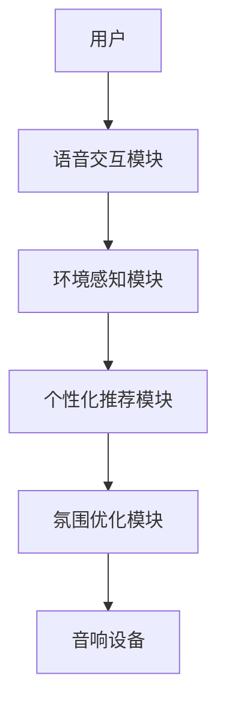
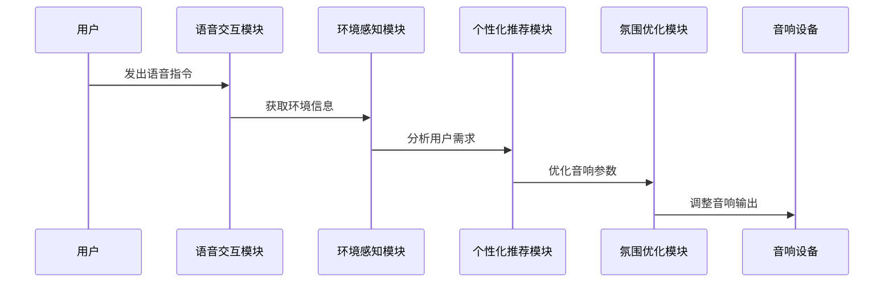

                 


# AI Agent在智能音响中的家庭氛围营造

## 关键词
- AI Agent, 智能音响, 家庭氛围, 智能化, 个性化推荐

## 摘要
本文探讨了AI Agent在智能音响中的应用，重点分析了AI Agent如何通过感知、分析和优化家庭环境，营造个性化的家庭氛围。文章从AI Agent的基本概念出发，详细讲解了其在家庭氛围营造中的核心作用，包括算法原理、系统架构和项目实战等，最后给出了最佳实践和总结。

---

# 第1章：AI Agent的基本概念与家庭氛围营造的背景

## 1.1 AI Agent的基本概念

### 1.1.1 什么是AI Agent
AI Agent（人工智能代理）是指能够感知环境、自主决策并执行任务的智能实体。它可以是一个软件程序，也可以是一个硬件设备，其核心目标是通过智能化的交互和服务，提升用户体验。

### 1.1.2 AI Agent的核心特征
AI Agent的核心特征包括：
1. **自主性**：能够在没有人工干预的情况下自主运行。
2. **反应性**：能够实时感知环境并做出反应。
3. **学习性**：能够通过数据学习和优化自身的决策能力。
4. **交互性**：能够与用户和其他系统进行高效的交互。

### 1.1.3 AI Agent在智能设备中的应用
AI Agent在智能设备中的应用非常广泛，尤其是在智能音箱、智能家电和智能家居等领域。通过AI Agent，智能设备能够实现更智能化的功能，例如语音交互、个性化推荐和自动化控制。

---

## 1.2 家庭氛围营造的需求与挑战

### 1.2.1 家庭氛围营造的定义
家庭氛围营造是指通过技术手段，优化家庭环境中的声音、光线、温度等因素，以满足用户的个性化需求，提升生活品质。

### 1.2.2 当前家庭氛围营造的主要问题
1. **缺乏智能化**：传统家庭氛围营造设备通常只能实现简单的功能，无法根据用户需求进行智能调整。
2. **个性化不足**：不同用户的需求差异较大，传统设备难以提供个性化的服务。
3. **缺乏协同性**：家庭环境中的各种设备通常无法协同工作，导致整体效果不佳。

### 1.2.3 AI Agent在家庭氛围营造中的作用
AI Agent可以通过感知用户的需求和环境的变化，实时调整音响设备的输出，从而营造出个性化的家庭氛围。例如，当用户看电影时，AI Agent可以根据电影情节调整音效；当用户放松时，AI Agent可以播放柔和的音乐并降低音量。

---

# 第2章：AI Agent的核心概念与家庭氛围营造的关系

## 2.1 AI Agent的核心概念

### 2.1.1 AI Agent的感知层
AI Agent的感知层负责获取环境中的信息，例如声音、光线和温度等。在智能音响中，AI Agent可以通过麦克风和光线传感器感知用户的语音指令和环境光线强度。

### 2.1.2 AI Agent的决策层
AI Agent的决策层负责分析感知到的信息，并根据预设的规则和模型做出决策。在智能音响中，决策层可以根据用户的语音指令和当前环境信息，决定如何优化音效。

### 2.1.3 AI Agent的执行层
AI Agent的执行层负责根据决策层的指令，执行具体的动作。在智能音响中，执行层可以调整音响的音量、音调和音效等参数。

---

## 2.2 家庭氛围营造的核心要素

### 2.2.1 声音的氛围营造
声音是家庭氛围营造的核心要素之一。通过AI Agent，智能音响可以根据用户的喜好和场景需求，调整音效，营造出不同的听觉体验。

### 2.2.2 环境感知与反馈
AI Agent需要实时感知家庭环境的变化，并根据环境信息调整音响的输出。例如，当房间光线较暗时，AI Agent可以自动调整音响的音量，以提供更舒适的听觉体验。

### 2.2.3 用户行为分析与个性化推荐
通过分析用户的听歌习惯和行为模式，AI Agent可以为用户提供个性化的音乐推荐服务。例如，当用户喜欢听古典音乐时，AI Agent可以优先推荐相关的音乐作品。

---

## 2.3 AI Agent在家庭氛围营造中的核心作用

### 2.3.1 AI Agent如何感知家庭环境
AI Agent可以通过多种传感器和数据源感知家庭环境，例如麦克风、光线传感器和温度传感器等。这些传感器可以提供环境中的声音、光线和温度等信息。

### 2.3.2 AI Agent如何分析用户需求
AI Agent可以通过分析用户的语音指令和行为模式，了解用户的偏好和需求。例如，当用户说“播放轻松的音乐”时，AI Agent可以根据用户的语言和历史听歌记录，推荐相应的音乐。

### 2.3.3 AI Agent如何优化家庭氛围
AI Agent可以根据感知到的环境信息和用户需求，实时调整音响的输出参数，例如音量、音调和音效等，从而营造出个性化的家庭氛围。

---

# 第3章：AI Agent的算法原理

## 3.1 语音识别算法

### 3.1.1 语音识别的基本原理
语音识别的基本原理包括语音信号的采集、特征提取、模型训练和识别推理等步骤。通过这些步骤，AI Agent可以将用户的语音指令转换为计算机能够理解的文本。

### 3.1.2 常见的语音识别算法
目前常用的语音识别算法包括基于模板匹配的算法和基于深度学习的算法。基于深度学习的算法（如神经网络）在实际应用中表现更为优异。

### 3.1.3 语音识别在家庭氛围营造中的应用
在智能音响中，语音识别算法主要用于识别用户的语音指令。例如，当用户说“播放音乐”时，AI Agent会通过语音识别算法识别用户的指令，并调用相应的音乐播放功能。

---

## 3.2 自然语言处理算法

### 3.2.1 自然语言处理的基本原理
自然语言处理的基本原理包括文本分词、语义分析和意图识别等步骤。通过这些步骤，AI Agent可以理解用户的语言意图，并做出相应的回应。

### 3.2.2 常见的自然语言处理算法
常见的自然语言处理算法包括基于规则的算法和基于深度学习的算法。基于深度学习的算法（如循环神经网络和Transformer模型）在实际应用中表现更为优异。

### 3.2.3 自然语言处理在家庭氛围营造中的应用
在智能音响中，自然语言处理算法主要用于理解和分析用户的语言意图。例如，当用户说“我喜欢轻音乐”时，AI Agent会通过自然语言处理算法理解用户的偏好，并推荐相应的音乐。

---

## 3.3 个性化推荐算法

### 3.3.1 个性化推荐的基本原理
个性化推荐的基本原理包括用户行为分析、特征提取和推荐模型训练等步骤。通过这些步骤，AI Agent可以为用户提供个性化的推荐服务。

### 3.3.2 常见的个性化推荐算法
常见的个性化推荐算法包括基于协同过滤的算法和基于内容的算法。基于深度学习的推荐算法（如神经网络协同过滤）在实际应用中表现更为优异。

### 3.3.3 个性化推荐在家庭氛围营造中的应用
在智能音响中，个性化推荐算法主要用于为用户提供个性化的音乐推荐服务。例如，当用户喜欢听流行音乐时，AI Agent会优先推荐流行音乐作品。

---

# 第4章：系统分析与架构设计方案

## 4.1 问题场景介绍

### 4.1.1 项目介绍
本项目旨在通过AI Agent技术，优化智能音响的家庭氛围营造功能。通过感知用户的需求和环境的变化，AI Agent可以实时调整音响的输出参数，从而提升用户体验。

### 4.1.2 系统功能设计
系统功能设计包括语音交互、环境感知、个性化推荐和氛围优化等功能。通过这些功能的协同工作，AI Agent可以实现智能化的家庭氛围营造。

### 4.1.3 领域模型设计
领域模型设计包括用户、音响设备、环境传感器和推荐系统等核心组件。通过这些组件的协同工作，AI Agent可以实现智能化的家庭氛围营造。

---

## 4.2 系统架构设计

### 4.2.1 系统架构图
以下是系统架构图的mermaid代码：



### 4.2.2 系统交互设计
以下是系统交互设计的mermaid代码：



---

## 4.3 项目实战

### 4.3.1 环境安装
在开始项目实战之前，需要安装以下环境：
- Python 3.6+
- TensorFlow 2.0+
- scikit-learn 0.20+

### 4.3.2 系统核心实现

#### 4.3.2.1 语音识别实现
以下是语音识别的Python代码：

```python
import tensorflow as tf
from tensorflow.keras import layers

# 定义语音识别模型
def speech_recognition_model():
    model = tf.keras.Sequential()
    model.add(layers.Dense(128, activation='relu', input_shape=(16000,)))
    model.add(layers.Dense(128, activation='relu'))
    model.add(layers.Dense(10, activation='softmax'))
    return model

# 编译模型
model = speech_recognition_model()
model.compile(optimizer='adam', loss='sparse_categorical_crossentropy', metrics=['accuracy'])
```

#### 4.3.2.2 个性化推荐实现
以下是个性化推荐的Python代码：

```python
import numpy as np
from sklearn.neighbors import NearestNeighbors

# 定义个性化推荐模型
def personalized_recommendation_model():
    model = NearestNeighbors(n_neighbors=5, algorithm='ball_tree')
    return model

# 训练模型
model = personalized_recommendation_model()
model.fit(X_train)
```

### 4.3.3 案例分析
以下是一个实际案例分析：
1. 用户发出语音指令：“播放轻松的音乐。”
2. 语音交互模块识别用户的指令，并将其传递给环境感知模块。
3. 环境感知模块获取当前环境信息（例如光线较暗），并将其传递给个性化推荐模块。
4. 个性化推荐模块分析用户的听歌历史和当前环境信息，推荐5首轻松的音乐。
5. 氛围优化模块根据推荐的音乐，调整音响的音量和音调，以提供最佳的听觉体验。

---

# 第5章：最佳实践与总结

## 5.1 最佳实践
1. **数据隐私保护**：在实际应用中，需要重视用户数据的隐私保护，确保用户数据不被滥用。
2. **系统优化**：通过不断优化算法和系统架构，提升AI Agent的性能和用户体验。
3. **用户体验设计**：在设计AI Agent时，需要注重用户体验，确保系统易于使用且功能强大。

## 5.2 小结
本文详细探讨了AI Agent在智能音响中的家庭氛围营造的应用。通过分析AI Agent的核心概念、算法原理和系统架构，我们了解了如何通过AI技术优化家庭环境，提升用户体验。未来，随着AI技术的不断发展，AI Agent在家庭氛围营造中的应用将更加广泛和深入。

## 5.3 注意事项
在实际应用中，需要注意以下几点：
1. **数据安全**：确保用户数据的安全性和隐私性。
2. **系统稳定性**：确保系统的稳定性和可靠性，避免因系统故障影响用户体验。
3. **用户体验**：注重用户体验设计，确保系统易于使用且功能强大。

## 5.4 拓展阅读
1. **AI Agent在智能家居中的应用**：了解AI Agent在智能家居中的其他应用场景。
2. **深度学习在语音识别中的应用**：学习深度学习在语音识别中的应用和优化方法。
3. **个性化推荐算法的研究**：研究最新的个性化推荐算法，提升推荐系统的性能。

--- 

# 结语
通过本文的探讨，我们了解了AI Agent在智能音响中的家庭氛围营造的应用。希望本文的内容能够为读者提供有价值的参考和启发，帮助大家更好地理解和应用AI技术，提升家庭生活的智能化水平。

