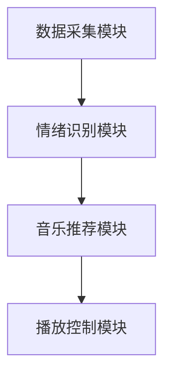

                 


# AI Agent在智能音响中的情绪识别播放

> 关键词：AI Agent，智能音响，情绪识别，语音识别，智能系统，音乐播放

> 摘要：本文深入探讨了AI Agent在智能音响中的情绪识别与音乐播放应用。首先介绍了情绪识别的基本概念与技术原理，接着分析了AI Agent在智能音响中的设计与实现，详细讲解了基于语音特征的情绪识别算法及其数学模型，最后通过项目实战展示了如何实现一个基于AI Agent的智能音响系统，并给出了系统优化与扩展的建议。

---

## 第一部分: AI Agent与情绪识别概述

### 第1章: AI Agent与情绪识别概述

#### 1.1 情绪识别的基本概念
情绪识别是通过分析用户的语音、语调、语速、语义等信息，判断用户当前的情绪状态（如快乐、悲伤、愤怒、平静等）。其核心在于将不可量化的“情绪”转化为可量化的数据特征，并通过算法模型进行分类。

#### 1.2 AI Agent的基本概念
AI Agent（人工智能代理）是指能够感知环境、执行任务并做出决策的智能实体。在智能音响中，AI Agent负责接收用户的语音输入，分析情绪特征，并根据分析结果推荐合适的音乐或播放列表。

#### 1.3 AI Agent与智能音响的结合
智能音响通过集成AI Agent，能够实现智能化的音乐播放控制。例如，当用户表达“我今天很累”时，AI Agent会识别出用户的情绪为“疲惫”，并推荐舒缓的音乐来缓解用户的疲劳感。

---

## 第2章: 情绪识别的关键技术

### 2.1 情绪识别的主要方法
#### 2.1.1 语音特征提取
- **音调分析**：音调的高低变化可以反映情绪的波动。例如，高音可能表示兴奋，低音可能表示悲伤。
- **语速分析**：快速说话可能表示焦虑或愤怒，而缓慢说话可能表示平静或悲伤。
- **音量分析**：大声说话可能表示愤怒或兴奋，小声说话可能表示悲伤或疲惫。

#### 2.1.2 语义理解
- **关键词检测**：通过识别负面词汇（如“讨厌”、“难过”）来判断情绪。
- **情感分析**：基于自然语言处理技术，分析用户语言中的情感倾向。

#### 2.1.3 综合特征分析
结合语音特征和语义特征，构建多维度的情绪分析模型，能够更准确地识别用户情绪。

---

### 2.2 常见的情绪分类算法
#### 2.2.1 支持向量机（SVM）
- **原理**：SVM是一种监督学习算法，通过构建超平面将数据分成不同的类别。
- **数学模型**：
  - 最大化间隔：$$ \text{maximize} \quad \frac{1}{2}||\mathbf{w}||^2 $$
  - 约束条件：$$ y_i (\mathbf{w} \cdot \mathbf{x}_i + b) \geq 1 $$

#### 2.2.2 随机森林（Random Forest）
- **原理**：随机森林是一种基于决策树的集成学习算法，通过投票机制进行分类。
- **优点**：能够处理高维数据，对噪声数据具有较强的鲁棒性。

#### 2.2.3 深度学习模型
- **卷积神经网络（CNN）**：适用于语音特征的提取。
- **循环神经网络（RNN）**：适用于时序数据的处理。

---

## 第3章: AI Agent在情绪识别中的实现

### 3.1 情绪识别的特征提取过程
#### 3.1.1 数据预处理
- 声音信号的降噪处理。
- 语音分割与标准化。

#### 3.1.2 特征提取
- 提取梅尔频谱特征（MFCC）、语调、语速、音量等特征。

#### 3.1.3 特征标准化
- 使用归一化方法对特征进行标准化处理，确保模型输入的稳定性。

---

### 3.2 情绪分类算法的选择与实现
#### 3.2.1 基于SVM的情绪分类模型
- **代码示例**：
  ```python
  from sklearn import svm
  # 初始化SVM模型
  clf = svm.SVC(kernel='linear', C=1)
  # 训练模型
  clf.fit(X_train, y_train)
  # 预测结果
  y_pred = clf.predict(X_test)
  ```

#### 3.2.2 基于深度学习的情绪分类模型
- **代码示例**：
  ```python
  import tensorflow as tf
  # 定义模型结构
  model = tf.keras.Sequential([
      tf.keras.layers.Dense(64, activation='relu'),
      tf.keras.layers.Dense(10, activation='softmax')
  ])
  # 编译模型
  model.compile(optimizer='adam', loss='sparse_categorical_crossentropy', metrics=['accuracy'])
  # 训练模型
  model.fit(X_train, y_train, epochs=10, batch_size=32)
  ```

---

## 第4章: 系统架构与实现

### 4.1 系统功能设计
- **功能模块**：
  - 数据采集模块：采集用户语音输入。
  - 情绪识别模块：分析用户情绪。
  - 音乐推荐模块：根据情绪推荐音乐。
  - 播放控制模块：控制音响播放。

### 4.2 系统架构设计


---

## 第5章: 项目实战

### 5.1 环境配置
- **安装Python与依赖库**：
  ```bash
  pip install numpy scikit-learn tensorflow
  ```

### 5.2 核心代码实现
#### 5.2.1 数据预处理
```python
import numpy as np
from sklearn import feature_extraction

# 假设X为输入数据
X = np.array([...])
# 标准化处理
from sklearn.preprocessing import StandardScaler
scaler = StandardScaler()
X_scaled = scaler.fit_transform(X)
```

#### 5.2.2 模型训练与预测
```python
from sklearn.svm import SVC
model = SVC(kernel='linear', C=1)
model.fit(X_scaled, y_train)
y_pred = model.predict(X_test)
```

---

## 第6章: 系统优化与扩展

### 6.1 系统优化
- **数据增强**：通过增加训练数据的多样性提高模型的泛化能力。
- **模型优化**：尝试不同的算法和超参数优化，提升分类准确率。

### 6.2 功能扩展
- **多语言支持**：支持多种语言的情绪识别。
- **实时反馈**：在播放音乐的过程中实时监测用户情绪变化，动态调整播放列表。

---

## 第7章: 最佳实践与注意事项

### 7.1 注意事项
- **数据隐私**：用户语音数据的采集和存储需遵守隐私保护法规。
- **模型泛化能力**：确保模型在不同场景下的表现稳定。

### 7.2 小结
通过本文的讲解，我们深入探讨了AI Agent在智能音响中的情绪识别与音乐播放应用。从理论到实践，结合具体代码示例和系统架构图，为读者提供了一个完整的解决方案。

---

## 参考文献
- [1] 《机器学习实战》, 周志华
- [2] 《深度学习》, Ian Goodfellow

