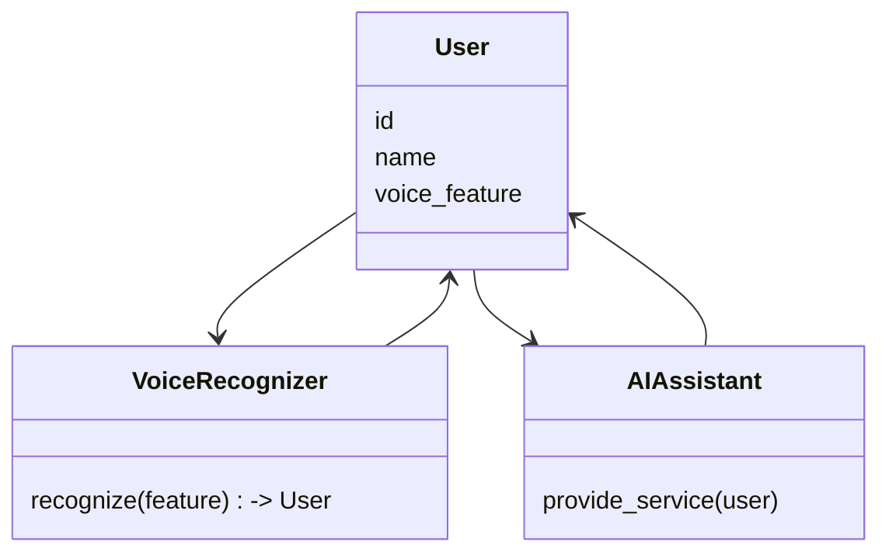
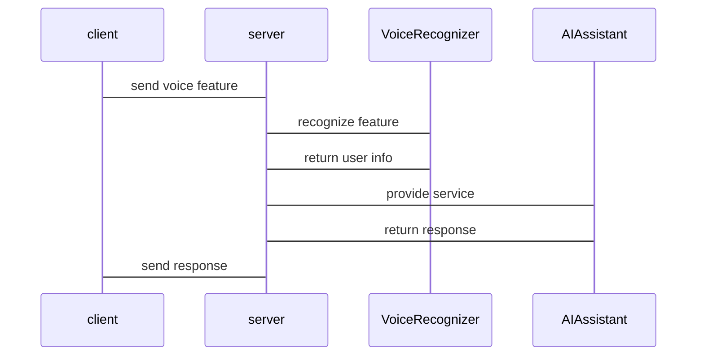

                 


# AI Agent在智能音箱中的声纹识别

> **关键词**：AI Agent，声纹识别，智能音箱，语音识别，人工智能，机器学习

> **摘要**：本文详细探讨了AI Agent在智能音箱中的声纹识别技术，从背景介绍、核心概念、算法原理到系统架构设计，再到项目实战和总结展望，全面分析了声纹识别在智能音箱中的应用及其与AI Agent的结合。文章通过具体的技术细节和实际案例，帮助读者理解声纹识别的实现过程，并展示了AI Agent如何提升智能音箱的用户体验。

---

## 第一部分：声纹识别与AI Agent概述

### 第1章：声纹识别的基本概念

#### 1.1 声纹识别的定义与原理
声纹识别是一种基于语音特征的生物识别技术，通过分析语音信号中的特征信息来识别说话人身份。其核心原理包括特征提取、模式匹配和语音信号处理等步骤。

- **1.1.1 声纹识别的基本概念**
  声纹识别（Voiceprint Recognition）通过分析语音中的声学特征（如音调、音高、音色等）来识别人的身份。与传统的密码或卡片识别方式相比，声纹识别具有非接触式、便捷性和安全性高等特点。

- **1.1.2 声纹识别的核心原理**
  声纹识别的核心在于提取语音信号中的特征信息，并将其与已知模板进行匹配。特征提取是关键步骤，常用的特征包括梅尔频率倒谱系数（MFCC）、线性预测编码（LPC）和声调特征等。

- **1.1.3 声纹识别的关键技术**
  声纹识别的关键技术包括特征提取算法、模式匹配算法和抗噪声干扰技术。其中，抗噪声干扰技术尤为重要，因为实际场景中的噪声会对识别效果产生显著影响。

#### 1.2 AI Agent的基本概念
AI Agent（人工智能代理）是一种能够感知环境、自主决策并执行任务的智能实体。在智能音箱中，AI Agent主要负责处理用户的语音指令，并通过声纹识别技术实现个性化的服务。

- **1.2.1 AI Agent的定义**
  AI Agent是一种能够感知环境、自主决策并执行任务的智能实体。它能够通过多种方式与用户交互，并根据用户的需求提供相应的服务。

- **1.2.2 AI Agent的核心功能**
  AI Agent的核心功能包括感知环境、理解用户需求、自主决策和执行任务。在智能音箱中，AI Agent主要负责处理用户的语音指令，并通过声纹识别技术实现个性化的服务。

- **1.2.3 AI Agent与传统算法的区别**
  与传统算法相比，AI Agent具有更强的自主性和适应性。它能够通过学习和自适应算法不断优化自身的性能，并能够在复杂环境中做出决策。

#### 1.3 声纹识别在智能音箱中的应用背景
随着智能音箱的普及，声纹识别技术在其中的应用越来越广泛。通过声纹识别，智能音箱能够实现个性化的用户识别和语音交互，从而提升用户体验。

- **1.3.1 智能音箱的发展现状**
  智能音箱作为一种智能家居设备，已经成为人们日常生活中不可或缺的一部分。它能够通过语音交互为用户提供各种服务，如播放音乐、查询信息、控制家电等。

- **1.3.2 声纹识别在智能音箱中的作用**
  声纹识别在智能音箱中的作用主要体现在用户身份识别和个性化服务提供方面。通过声纹识别，智能音箱能够区分不同的用户，并为每个用户提供个性化的服务。

- **1.3.3 AI Agent在声纹识别中的应用前景**
  随着AI技术的不断发展，AI Agent在声纹识别中的应用前景广阔。通过结合AI Agent的智能决策能力和声纹识别的精准识别能力，智能音箱将能够提供更加智能化和个性化的服务。

---

### 第2章：声纹识别与AI Agent的核心概念与联系

#### 2.1 声纹识别的核心概念
声纹识别的核心概念包括特征提取、模式匹配和性能指标等。这些概念共同构成了声纹识别的技术基础。

- **2.1.1 声纹识别的特征提取**
  特征提取是声纹识别的关键步骤，常用的特征包括MFCC、LPC和声调特征等。这些特征能够有效地反映说话人的语音特征。

- **2.1.2 声纹识别的模式匹配**
  模式匹配是声纹识别的另一个关键步骤。通过将提取的特征与已知模板进行匹配，可以实现用户身份的识别。

- **2.1.3 声纹识别的性能指标**
  声纹识别的性能指标包括识别准确率、识别速度和抗噪声能力等。这些指标能够衡量声纹识别技术的优劣。

#### 2.2 AI Agent的核心概念
AI Agent的核心概念包括智能决策机制、学习与自适应能力以及交互方式等。这些概念共同构成了AI Agent的技术基础。

- **2.2.1 AI Agent的智能决策机制**
  AI Agent的智能决策机制是其核心能力之一。通过感知环境和理解用户需求，AI Agent能够做出最优决策。

- **2.2.2 AI Agent的学习与自适应能力**
  AI Agent具有强大的学习和自适应能力，能够通过不断的学习优化自身的性能，并适应不同的环境。

- **2.2.3 AI Agent的交互方式**
  AI Agent的交互方式包括语音交互、文本交互和 gesture交互等。在智能音箱中，主要采用语音交互方式。

#### 2.3 声纹识别与AI Agent的关系
声纹识别与AI Agent之间存在密切的关系。声纹识别为AI Agent提供身份识别能力，而AI Agent则为声纹识别提供智能化处理能力。

- **2.3.1 声纹识别为AI Agent提供身份识别能力**
  通过声纹识别，AI Agent能够准确识别人的身份，从而实现个性化的服务。

- **2.3.2 AI Agent为声纹识别提供智能化处理能力**
  AI Agent能够通过智能决策和自适应学习优化声纹识别的性能，提高识别的准确率和速度。

- **2.3.3 两者的结合在智能音箱中的应用**
  在智能音箱中，声纹识别与AI Agent的结合能够实现更加智能化和个性化的语音交互。例如，当用户通过声纹识别登录后，AI Agent可以根据用户的历史行为和偏好提供个性化的服务。

---

### 第3章：声纹识别的算法原理

#### 3.1 声纹识别的特征提取
特征提取是声纹识别的关键步骤，常用的特征包括MFCC和LPC等。这些特征能够有效地反映说话人的语音特征。

- **3.1.1 声学特征提取的数学模型**
  声学特征提取的数学模型可以通过以下公式表示：
  $$ f(x) = \sum_{i=1}^{n} a_i x_i + b $$
  其中，$x_i$ 表示输入信号，$a_i$ 是权重系数，$b$ 是偏置项。

- **3.1.2 常见的特征提取方法**
  常见的特征提取方法包括MFCC和LPC等。MFCC通过将语音信号转换到梅尔域，提取频域特征；LPC通过线性预测模型提取时域特征。

---

#### 3.2 声纹识别的模式匹配
模式匹配是声纹识别的另一个关键步骤。通过将提取的特征与已知模板进行匹配，可以实现用户身份的识别。

- **3.2.1 模式匹配的数学模型**
  模式匹配的数学模型可以通过以下公式表示：
  $$ D(x, y) = \sum_{i=1}^{n} (x_i - y_i)^2 $$
  其中，$x_i$ 和 $y_i$ 分别表示两个特征向量的元素。

- **3.2.2 常见的模式匹配算法**
  常见的模式匹配算法包括欧氏距离匹配和余弦相似度匹配等。欧氏距离匹配通过计算两个特征向量之间的欧氏距离进行匹配；余弦相似度匹配通过计算两个特征向量之间的夹角余弦值进行匹配。

---

#### 3.3 声纹识别的抗噪声处理
在实际场景中，噪声会对声纹识别的效果产生显著影响。因此，抗噪声处理是声纹识别中不可或缺的一部分。

- **3.3.1 常见的抗噪声处理方法**
  常见的抗噪声处理方法包括频域滤波和时域滤波等。频域滤波通过在频域对信号进行滤波处理，去除噪声；时域滤波通过在时域对信号进行滤波处理，去除噪声。

- **3.3.2 抗噪声处理的数学模型**
  抗噪声处理的数学模型可以通过以下公式表示：
  $$ y_i = \sum_{j=1}^{n} w_j x_j $$
  其中，$x_j$ 表示输入信号，$w_j$ 是滤波器的权重系数。

---

### 第4章：AI Agent的算法原理

#### 4.1 AI Agent的智能决策机制
AI Agent的智能决策机制是其核心能力之一。通过感知环境和理解用户需求，AI Agent能够做出最优决策。

- **4.1.1 智能决策的数学模型**
  智能决策的数学模型可以通过以下公式表示：
  $$ f(x) = \arg\max_{i} p(y_i | x) $$
  其中，$x$ 表示输入信号，$y_i$ 表示可能的输出类别，$p(y_i | x)$ 是后验概率。

- **4.1.2 常见的智能决策算法**
  常见的智能决策算法包括支持向量机（SVM）和随机森林（Random Forest）等。SVM通过构建最大边距分类器进行决策；随机森林通过集成多个决策树进行决策。

---

#### 4.2 AI Agent的学习与自适应能力
AI Agent具有强大的学习和自适应能力，能够通过不断的学习优化自身的性能，并适应不同的环境。

- **4.2.1 学习算法的数学模型**
  学习算法的数学模型可以通过以下公式表示：
  $$ \theta = \arg\min_{\theta} \sum_{i=1}^{n} (y_i - f_\theta(x_i))^2 $$
  其中，$\theta$ 是模型参数，$x_i$ 是输入信号，$y_i$ 是目标输出。

- **4.2.2 常见的学习算法**
  常见的学习算法包括深度学习和强化学习等。深度学习通过构建深度神经网络进行学习；强化学习通过与环境交互获得奖励信号进行学习。

---

### 第5章：声纹识别与AI Agent的结合

#### 5.1 结合的必要性
声纹识别与AI Agent的结合能够实现更加智能化和个性化的语音交互。

- **5.1.1 提高识别准确率**
  通过结合AI Agent的智能决策能力，声纹识别的准确率可以得到显著提高。

- **5.1.2 实现个性化服务**
  声纹识别可以为AI Agent提供用户身份信息，从而实现个性化的服务。

#### 5.2 结合的具体实现
声纹识别与AI Agent的结合可以通过以下步骤实现：

1. **特征提取**：提取用户的语音特征。
2. **身份识别**：通过AI Agent进行智能决策，实现用户身份识别。
3. **个性化服务**：根据用户身份信息，提供个性化的服务。

---

## 第二部分：系统分析与架构设计

### 第6章：系统分析与架构设计

#### 6.1 问题场景介绍
在智能音箱中，声纹识别与AI Agent的结合能够实现个性化的用户识别和语音交互。

- **6.1.1 问题背景**
  随着智能音箱的普及，用户对个性化服务的需求不断增加。传统的密码识别方式存在安全性低、用户体验差等问题。

- **6.1.2 问题描述**
  通过声纹识别与AI Agent的结合，智能音箱能够实现个性化的用户识别和语音交互。

- **6.1.3 解决方案**
  通过结合声纹识别与AI Agent，智能音箱可以实现更加智能化和个性化的服务。

#### 6.2 系统功能设计
系统功能设计包括用户身份识别、个性化服务和智能交互等。

- **6.2.1 领域模型**
  领域模型可以通过Mermaid类图表示，展示系统的各个组件及其关系。



- **6.2.2 系统架构设计**
  系统架构设计可以通过Mermaid架构图表示，展示系统的整体架构。

```mermaid
client
    server
        database
        VoiceRecognizer
        AIAssistant
```

- **6.2.3 系统接口设计**
  系统接口设计可以通过Mermaid序列图表示，展示系统各组件之间的交互流程。



---

## 第三部分：项目实战

### 第7章：项目实战

#### 7.1 环境安装
项目实战需要安装Python、深度学习框架（如TensorFlow）和语音处理库（如 librosa）。

- **7.1.1 安装Python**
  ```bash
  python --version
  ```

- **7.1.2 安装TensorFlow**
  ```bash
  pip install tensorflow
  ```

- **7.1.3 安装 librosa**
  ```bash
  pip install librosa
  ```

#### 7.2 系统核心实现
系统核心实现包括特征提取、模式匹配和智能决策等。

- **7.2.1 特征提取实现**
  ```python
  import librosa

  def extract_feature(audio_path):
      audio, sr = librosa.load(audio_path, sr=16000)
      mfcc = librosa.feature.mfcc(y=audio, sr=sr, n_mfcc=13)
      return mfcc.T
  ```

- **7.2.2 模式匹配实现**
  ```python
  def match_feature(feature, templates):
      distances = []
      for template in templates:
          distance = np.mean(np.abs(feature - template))
          distances.append(distance)
      return np.argmin(distances)
  ```

- **7.2.3 智能决策实现**
  ```python
  import tensorflow as tf

  model = tf.keras.Sequential([
      tf.keras.layers.Dense(64, activation='relu'),
      tf.keras.layers.Dense(1, activation='sigmoid')
  ])
  model.compile(optimizer='adam', loss='binary_crossentropy', metrics=['accuracy'])
  model.fit(X_train, y_train, epochs=10, batch_size=32)
  ```

#### 7.3 代码应用解读与分析
代码实现包括特征提取、模式匹配和智能决策的实现，以及系统架构的搭建。

- **7.3.1 特征提取代码解读**
  ```python
  import librosa

  def extract_feature(audio_path):
      audio, sr = librosa.load(audio_path, sr=16000)
      mfcc = librosa.feature.mfcc(y=audio, sr=sr, n_mfcc=13)
      return mfcc.T
  ```
  该代码通过 librosa 库提取音频的MFCC特征，返回特征向量。

- **7.3.2 模式匹配代码解读**
  ```python
  def match_feature(feature, templates):
      distances = []
      for template in templates:
          distance = np.mean(np.abs(feature - template))
          distances.append(distance)
      return np.argmin(distances)
  ```
  该代码通过计算特征向量与模板之间的欧氏距离，找到最接近的模板，实现用户身份识别。

- **7.3.3 智能决策代码解读**
  ```python
  import tensorflow as tf

  model = tf.keras.Sequential([
      tf.keras.layers.Dense(64, activation='relu'),
      tf.keras.layers.Dense(1, activation='sigmoid')
  ])
  model.compile(optimizer='adam', loss='binary_crossentropy', metrics=['accuracy'])
  model.fit(X_train, y_train, epochs=10, batch_size=32)
  ```
  该代码通过构建一个简单的神经网络模型，进行智能决策。模型通过训练学习，能够根据输入的特征向量做出决策。

#### 7.4 案例分析
案例分析通过具体的场景，展示声纹识别与AI Agent的结合在智能音箱中的应用。

- **7.4.1 场景描述**
  用户通过语音指令唤醒智能音箱，音箱通过声纹识别确认用户身份，并通过AI Agent提供个性化的服务。

- **7.4.2 实现步骤**
  1. 用户发出语音指令。
  2. 智能音箱通过麦克风采集语音信号。
  3. 通过特征提取算法提取语音特征。
  4. 通过模式匹配算法识别用户身份。
  5. 通过AI Agent提供个性化的服务。

#### 7.5 项目小结
项目小结总结了项目实现的关键点和经验教训，为后续的优化提供参考。

- **7.5.1 关键点总结**
  - 特征提取算法的选择和优化。
  - 模式匹配算法的选

