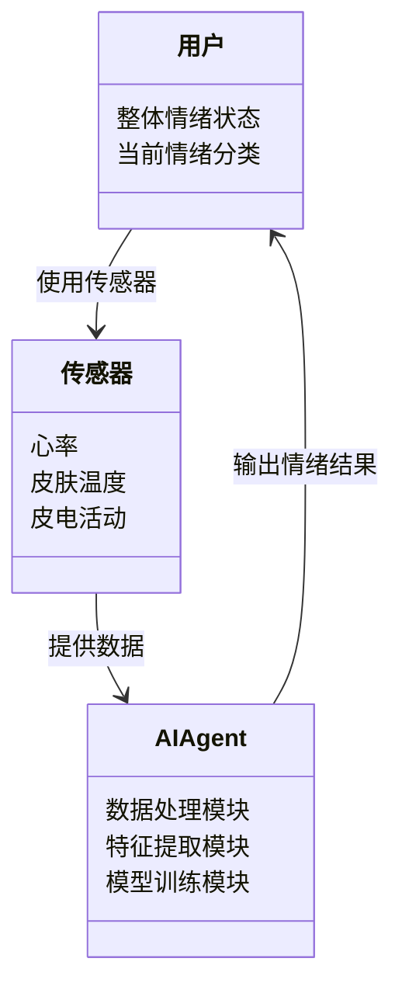
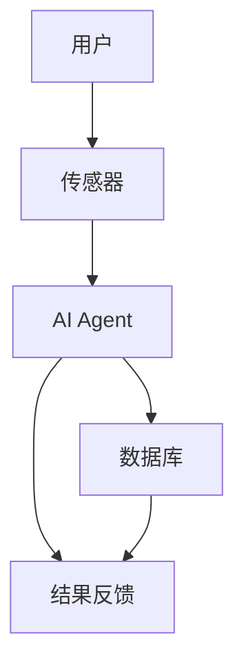
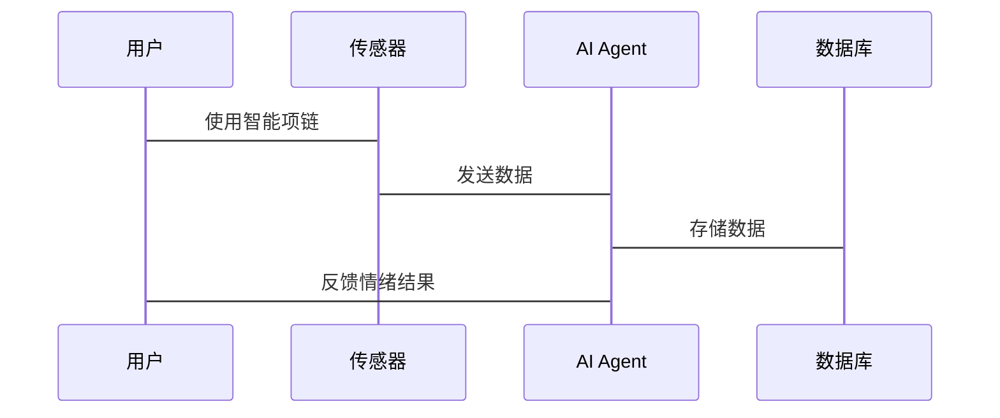

                 


# AI Agent在智能项链中的情绪监测

## 关键词
AI Agent, 情绪监测, 智能项链, 数据采集, 算法原理, 系统架构, 项目实战

## 摘要
本文深入探讨AI Agent在智能项链中的情绪监测技术，从背景介绍、核心概念、算法原理到系统架构和项目实战，全面解析情绪监测的实现路径和应用场景。通过详细的技术分析和实际案例，帮助读者理解AI Agent如何通过数据采集、特征提取和模型训练实现情绪监测，并设计智能项链的整体架构，提供可操作的实战指导。

---

## 第一部分：背景介绍

### 第1章：AI Agent与情绪监测概述

#### 1.1 问题背景
- **情绪监测的定义与重要性**：情绪监测是指通过技术手段分析个体的情绪状态，包括高兴、愤怒、悲伤等。随着心理健康问题的日益突出，情绪监测在医疗、教育和日常生活中的应用越来越广泛。智能设备如智能项链的出现，为实时监测情绪提供了便利。
- **AI Agent在智能设备中的应用**：AI Agent（人工智能代理）是一种能够感知环境并执行任务的智能实体。在智能设备中，AI Agent负责数据处理、决策和反馈，是实现情绪监测的核心技术。
- **智能项链的市场与技术趋势**：智能项链作为一种可穿戴设备，结合了时尚与科技，逐渐成为市场热点。AI技术的快速发展推动了智能项链在情绪监测领域的应用。

#### 1.2 问题描述
- **情绪监测的多维度挑战**：情绪监测涉及生理数据、行为数据和语言数据等多个维度，数据采集和分析的复杂性较高。
- **智能项链数据采集的复杂性**：智能项链需要在小型设备上集成多种传感器，数据处理能力有限，且需要考虑佩戴舒适性和隐私保护。
- **AI Agent在实时监测中的作用**：AI Agent能够实时处理数据，快速做出反馈，满足智能项链的实时监测需求。

#### 1.3 问题解决
- **AI Agent的核心功能与优势**：AI Agent能够通过机器学习模型实时分析情绪数据，提供精准的监测结果。其优势在于高效性、实时性和准确性。
- **情绪监测的实现路径**：通过传感器采集数据，利用AI Agent进行特征提取和模型训练，最终实现情绪分类。
- **智能项链的用户需求与痛点**：用户希望智能项链能够提供个性化的健康建议和情绪管理工具，痛点在于数据准确性和隐私保护。

#### 1.4 边界与外延
- **情绪监测的适用范围与限制**：情绪监测适用于个人健康管理、教育和医疗领域，但受到数据质量和传感器精度的限制。
- **AI Agent的性能边界**：AI Agent的性能受限于硬件能力和算法复杂度，需要在资源有限的设备上进行优化。
- **智能项链与其他设备的协同**：智能项链可以与其他设备如手机、电脑协同工作，实现数据共享和远程监控。

#### 1.5 概念结构与核心要素
- **情绪监测的核心要素**：包括数据采集、特征提取、模型训练和结果反馈。
- **AI Agent的功能模块**：数据处理模块、特征提取模块、模型训练模块和反馈模块。
- **智能项链的硬件与软件架构**：硬件包括传感器和通信模块，软件包括数据采集模块、AI处理模块和用户界面模块。

---

## 第二部分：核心概念与联系

### 第2章：AI Agent的核心原理

#### 2.1 AI Agent的原理分析
- **AI Agent的基本工作流程**：
  1. 数据采集：通过传感器获取生理数据。
  2. 数据预处理：清洗和标准化数据。
  3. 特征提取：提取关键特征。
  4. 模型训练：训练情绪分类模型。
  5. 情绪反馈：输出情绪结果。
- **情绪监测的算法基础**：基于机器学习和深度学习的算法，如支持向量机（SVM）和长短期记忆网络（LSTM）。
- **数据采集与特征提取**：通过心率、皮肤温度和语音等数据，提取特征如心率变异性（HRV）和语调变化。

#### 2.2 情绪监测的特征对比
- **生理指标特征对比**：
  | 特征类型 | 特征描述 | 示例 |
  |----------|----------|------|
  | 心率     | 心率的快慢反映情绪状态 | 心率增加表示紧张 |
  | 皮肤温度 | 皮肤温度变化反映情绪波动 | 皮肤温度降低表示冷静 |
  | 皮电活动 | 皮电活动变化反映情绪波动 | 皮电活动增加表示兴奋 |
- **行为特征对比**：
  | 行为特征 | 特征描述 | 示例 |
  |----------|----------|------|
  | 说话频率 | 说话频率增加表示兴奋 | 高频率对话表示紧张 |
  | 语速变化 | 语速快慢反映情绪状态 | 语速变快表示焦虑 |
  | 停顿次数 | 停顿次数增加表示思考 | 频繁停顿表示压力大 |
- **语言特征对比**：
  | 语言特征 | 特征描述 | 示例 |
  |----------|----------|------|
  | 词汇选择 | 词汇选择反映情绪状态 | 使用积极词汇表示快乐 |
  | 语气语调 | 语气语调变化反映情绪 | 上扬语调表示兴奋 |

#### 2.3 ER实体关系图
```mermaid
er
actor: 用户
agent: AI Agent
device: 智能项链
action: 数据采集
```

---

## 第三部分：算法原理讲解

### 第3章：AI Agent算法流程

#### 3.1 数据采集与预处理
- **数据采集流程**：
  1. 传感器采集生理数据（如心率、皮肤温度）。
  2. 数据预处理：去除噪声，标准化数据。
- **数据清洗与标准化**：使用均值填充法处理缺失值，标准化数据分布。

#### 3.2 特征提取
- **基于生理指标的特征提取**：提取心率变异性（HRV）和皮肤温度变化率。
- **基于行为数据的特征提取**：提取说话频率、语速变化和停顿次数。

#### 3.3 模型训练与优化
- **机器学习模型选择**：选择支持向量机（SVM）和随机森林（Random Forest）进行分类。
- **模型训练流程**：
  1. 数据分割：训练集、验证集和测试集。
  2. 模型训练：使用训练集训练模型。
  3. 模型验证：调整超参数，优化模型性能。
  4. 模型测试：评估模型的准确率和召回率。
- **模型优化**：使用网格搜索（Grid Search）进行超参数优化。

---

### 第4章：数学模型和公式

#### 4.1 特征提取的数学模型
- **心率变异性（HRV）的计算公式**：
  $$ HRV = \sqrt{\text{Mean}(RR_{\text{sq}}) - (\text{Mean}(RR))^2} $$
  其中，$RR_{\text{sq}}$是相邻心动周期的平方，$\text{Mean}(RR)$是平均心动周期。

#### 4.2 情绪分类的数学模型
- **支持向量机（SVM）分类器**：
  $$ \text{分类结果} = \text{sign}(w \cdot x + b) $$
  其中，$w$是权重向量，$x$是输入特征，$b$是偏置项。

---

## 第四部分：系统分析与架构设计

### 第5章：系统分析与架构设计方案

#### 5.1 项目介绍
- **项目场景**：智能项链用于实时监测佩戴者的情绪状态，提供个性化的情绪管理建议。

#### 5.2 系统功能设计
- **领域模型**：


#### 5.3 系统架构设计
- **系统架构图**：


#### 5.4 接口设计
- **数据接口**：传感器数据通过蓝牙或Wi-Fi传输到AI Agent。
- **反馈接口**：AI Agent通过震动或LED灯反馈情绪结果。

#### 5.5 交互流程
- **交互流程图**：


---

## 第五部分：项目实战

### 第6章：项目实战

#### 6.1 环境安装
- **安装Python和必要的库**：
  ```bash
  pip install numpy pandas scikit-learn
  ```

#### 6.2 系统核心实现
- **数据采集模块**：
  ```python
  import numpy as np
  import pandas as pd

  # 读取传感器数据
  data = pd.read_csv('sensor_data.csv')
  ```

- **特征提取模块**：
  ```python
  def extract_features(data):
      # 提取心率特征
      heart_rate = data['heart_rate'].values
      # 提取皮肤温度特征
      skin_temp = data['skin_temp'].values
      return heart_rate, skin_temp
  ```

- **模型训练模块**：
  ```python
  from sklearn.svm import SVC
  from sklearn.metrics import accuracy_score

  def train_model(X, y):
      model = SVC()
      model.fit(X, y)
      return model

  # 训练模型
  X, y = extract_features(data)
  model = train_model(X, y)
  ```

#### 6.3 实际案例分析
- **案例分析**：通过实际数据，展示模型如何分类情绪状态，并提供反馈建议。

---

## 第六部分：最佳实践与总结

### 第7章：总结与展望

#### 7.1 最佳实践
- **数据质量**：确保数据采集的准确性和完整性。
- **模型优化**：定期更新模型，提高分类准确率。
- **隐私保护**：加强数据加密和隐私保护措施。

#### 7.2 项目小结
- **项目总结**：通过AI Agent实现智能项链的情绪监测，提供了一种高效、实时的情绪管理工具。
- **未来展望**：随着AI技术的进步，智能项链将具备更多功能，如情绪预测和行为干预。

#### 7.3 注意事项
- **数据采集的准确性**：传感器精度直接影响监测结果。
- **模型的可解释性**：确保用户能够理解情绪监测的结果。
- **隐私保护**：严格遵守数据隐私保护法规。

#### 7.4 拓展阅读
- **相关书籍**：《人工智能：一种现代的方法》
- **学术论文**：《基于可穿戴设备的情绪监测研究》

---

通过以上内容，读者可以系统地了解AI Agent在智能项链中的情绪监测技术，从理论到实践，掌握实现方法和应用技巧。

