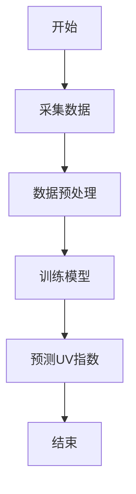
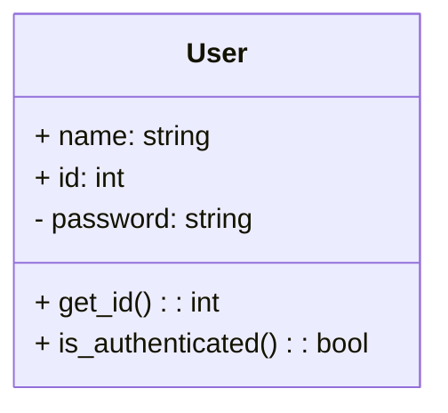

                 


# AI Agent在智能项链中的紫外线防护提醒

## 关键词
AI Agent, 智能项链, 紫外线防护, 紫外线预测算法, 系统架构设计

## 摘要
随着紫外线相关健康问题的日益严重，紫外线防护的重要性逐渐凸显。本文探讨了AI Agent在智能项链中的应用，特别是在紫外线防护提醒方面。通过分析AI Agent的基本原理、紫外线预测算法、系统架构设计以及实际应用案例，展示了AI技术如何助力智能设备提升用户体验和健康保护。

---

## 第一部分: 背景介绍

### 第1章: 紫外线防护的重要性

#### 1.1 紫外线对健康的危害
紫外线（UV）分为UVA、UVB和UVC三种类型，其中UVB是导致皮肤癌的主要原因。长时间暴露在强UV线下，会导致皮肤晒伤、色素沉着甚至皮肤癌。此外，紫外线还可能引发眼睛问题，如白内障。

#### 1.2 紫外线防护的基本措施
传统的紫外线防护措施包括使用防晒霜、穿防护服和戴帽子、太阳镜。然而，这些方法需要用户主动采取，容易遗忘或执行不彻底。

#### 1.3 智能设备在紫外线防护中的作用
智能设备，如智能项链，可以实时监测环境中的紫外线强度，并通过AI Agent自动提醒用户采取防护措施。这种主动提醒的方式比传统方法更为有效，特别是在用户忙碌或分心时。

### 第2章: AI Agent的概念与应用

#### 2.1 AI Agent的基本定义
AI Agent是一种智能主体，能够感知环境、做出决策并执行动作。在智能项链中，AI Agent负责收集紫外线数据、分析并提醒用户。

#### 2.2 AI Agent在智能设备中的应用
AI Agent广泛应用于智能设备中，如语音助手、智能家居等。在紫外线防护中，AI Agent通过实时监测环境数据，为用户提供及时的提醒。

#### 2.3 AI Agent在紫外线防护中的潜在价值
AI Agent可以显著提高紫外线防护的效果。通过预测紫外线强度变化，AI Agent可以在高强度UV出现之前提醒用户采取防护措施，从而减少紫外线对健康的危害。

---

## 第二部分: 核心概念与联系

### 第3章: AI Agent的核心原理

#### 3.1 AI Agent的感知、决策与执行
AI Agent通过紫外线传感器感知环境数据，利用机器学习模型进行决策，并通过震动或语音提醒用户执行防护动作。

#### 3.2 紫外线防护系统的核心要素
紫外线防护系统包括紫外线传感器、AI Agent、用户通知模块和电源模块。这些模块协同工作，确保系统高效运行。

#### 3.3 AI Agent与紫外线防护系统的结合
AI Agent通过处理紫外线传感器的数据，判断UV指数是否超过安全阈值，并通过用户通知模块发出提醒。这种实时监测和反馈机制显著提升了防护效果。

### 第4章: 核心概念对比表

| 概念                | 描述                                                         |
|---------------------|------------------------------------------------------------|
| UV指数              | 衡量紫外线强度的指标，数值越高，风险越大                   |
| 防护措施            | 使用防晒霜、穿防护服等主动措施                           |
| AI Agent            | 智能主体，能够感知、决策和执行                            |
| 传统紫外线防护设备  | 仅能显示UV指数，不具备主动提醒功能                         |

### 第5章: ER实体关系图

```mermaid
er
actor: 用户
agent: AI代理
device: 智能项链
event: 紫外线提醒
```

---

## 第三部分: 算法原理讲解

### 第6章: 紫外线预测算法

#### 6.1 数据采集与预处理
传感器实时采集紫外线强度数据，预处理步骤包括数据清洗和归一化。

#### 6.2 紫外线强度预测模型
使用回归模型预测紫外线强度，模型训练数据包括历史UV指数和天气数据。

#### 6.3 算法实现代码
```python
import pandas as pd
from sklearn.model_selection import train_test_split
from sklearn.linear_model import LinearRegression

# 数据加载与预处理
data = pd.read_csv('uv_data.csv')
X = data[['temperature', 'humidity']]
y = data['uv_index']

# 数据分割
X_train, X_test, y_train, y_test = train_test_split(X, y, test_size=0.2)

# 模型训练
model = LinearRegression()
model.fit(X_train, y_train)

# 预测
y_pred = model.predict(X_test)
```

#### 6.4 算法流程图


---

## 第四部分: 系统分析与架构设计

### 第7章: 系统架构设计

#### 7.1 功能模块设计
智能项链系统包括数据采集模块、AI处理模块、通知模块和电源管理模块。

#### 7.2 系统架构图


---

## 第五部分: 项目实战

### 第8章: 环境安装与代码实现

#### 8.1 环境安装
安装Python和相关库，如numpy、pandas、scikit-learn。

#### 8.2 系统实现代码
```python
import numpy as np
from sklearn.linear_model import LinearRegression

# 示例数据
X = np.array([[1], [2], [3], [4], [5]])
y = np.array([2, 3, 5, 6, 8])

# 训练模型
model = LinearRegression()
model.fit(X, y)

# 预测
new_X = np.array([[6]])
print(model.predict(new_X))  # 输出预测结果
```

#### 8.3 实际案例分析
分析实际场景中的数据，展示AI Agent如何实时提醒用户。

---

## 第六部分: 最佳实践

### 第9章: 小结与经验分享

#### 9.1 小结
AI Agent在智能项链中的应用显著提升了紫外线防护的效果，实时监测和提醒功能为用户提供了更高的安全性。

#### 9.2 注意事项
确保数据的准确性和算法的实时性，同时注意设备的功耗问题。

#### 9.3 拓展阅读
建议进一步研究AI在其他健康监测领域的应用，如心率监测和运动分析。

---

通过以上部分的详细阐述，本文全面探讨了AI Agent在智能项链中的紫外线防护提醒应用，从理论到实践，为读者提供了丰富的知识和实用的见解。

