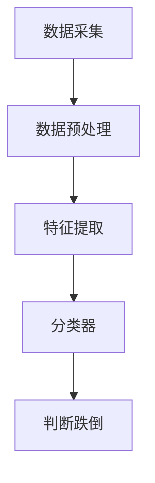
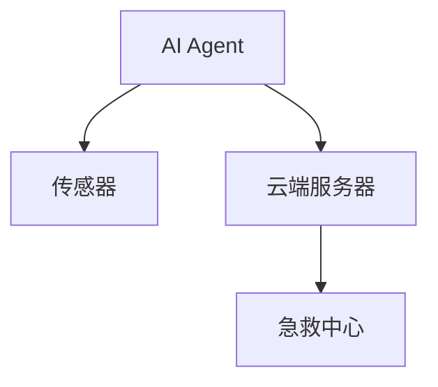
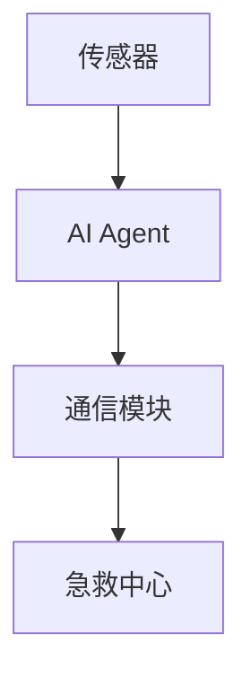

                 


```markdown
# AI Agent在智能项链中的跌倒检测与紧急呼救

> 关键词：AI Agent，智能项链，跌倒检测，紧急呼救，深度学习，多模态融合

> 摘要：本文详细探讨了AI Agent在智能项链中的跌倒检测与紧急呼救系统的设计与实现。通过分析跌倒检测的背景、技术现状与挑战，提出了基于AI Agent的解决方案，涵盖了算法原理、系统架构、通信协议、安全性设计以及实际项目实现。文章从理论到实践，全面解析了AI Agent在智能项链中的应用，为老年人跌倒检测与紧急呼救提供了有效的技术方案。

---

## 第1章 背景介绍

### 1.1 问题背景
#### 1.1.1 跌倒检测的重要性
跌倒是一种常见的老年人健康问题，可能导致严重的身体伤害和生活质量下降。及时检测跌倒并发出呼救信号，能够有效减少伤害的发生。

#### 1.1.2 智能项链的应用场景
智能项链是一种可穿戴设备，能够实时监测佩戴者的动作和状态。其便携性和隐蔽性使其成为老年人跌倒检测的理想选择。

#### 1.1.3 研究意义
通过AI Agent技术实现智能项链的跌倒检测，能够提高检测的准确性和及时性，为老年人提供实时保护。

### 1.2 问题描述
#### 1.2.1 跌倒检测的定义与分类
跌倒检测是指通过传感器和算法判断佩戴者是否发生跌倒。根据检测方法的不同，可以分为基于传感器的检测和基于视觉的检测。

#### 1.2.2 紧急呼救的需求分析
当检测到跌倒事件后，系统需要自动触发紧急呼救机制，通知家人或急救中心。

#### 1.2.3 系统目标与功能概述
系统目标是实现高精度的跌倒检测和可靠的紧急呼救功能。系统功能包括数据采集、跌倒检测、呼救触发、通信等功能。

### 1.3 问题解决
#### 1.3.1 AI Agent的核心作用
AI Agent能够实时分析传感器数据，做出准确的跌倒判断，并触发呼救机制。

#### 1.3.2 智能项链的技术实现路径
通过加速度传感器和AI算法，实现跌倒检测和紧急呼救功能。

#### 1.3.3 系统架构与功能模块划分
系统架构包括传感器模块、AI Agent模块、通信模块和用户界面模块。

### 1.4 边界与外延
#### 1.4.1 系统的适用范围
适用于老年人、行动不便者等需要跌倒检测的群体。

#### 1.4.2 系统的局限性与限制条件
检测精度可能受环境因素影响，通信模块需要网络支持。

#### 1.4.3 系统与外部环境的交互边界
系统通过传感器与佩戴者互动，通过通信模块与外部急救中心或家人互动。

### 1.5 概念结构与核心要素
#### 1.5.1 AI Agent的组成要素
AI Agent包括感知模块、决策模块和执行模块。

#### 1.5.2 智能项链的硬件与软件模块
硬件模块包括加速度传感器、蓝牙模块、主控芯片；软件模块包括数据采集模块、跌倒检测算法模块、通信模块。

#### 1.5.3 系统的核心功能与技术指标
核心功能包括高精度跌倒检测、快速呼救响应、低功耗设计。

---

## 第2章 AI Agent的核心概念与原理

### 2.1 核心概念
#### 2.1.1 AI Agent的定义与特点
AI Agent是一种智能体，能够感知环境、做出决策并执行动作。其特点是自主性、反应性、社会性和持续性。

#### 2.1.2 AI Agent在智能项链中的角色
AI Agent负责实时分析传感器数据，判断是否发生跌倒，并触发呼救机制。

#### 2.1.3 AI Agent与传统算法的区别
AI Agent具有自主学习和适应能力，能够根据数据反馈优化检测算法。

### 2.2 核心原理
#### 2.2.1 AI Agent的感知与决策机制
AI Agent通过加速度传感器获取数据，利用深度学习算法进行跌倒检测。

#### 2.2.2 基于深度学习的跌倒检测算法
采用卷积神经网络（CNN）模型，训练跌倒和非跌倒的样本数据，实现高精度的分类。

#### 2.2.3 紧急呼救的触发逻辑与流程
当检测到跌倒事件后，AI Agent通过蓝牙模块发送紧急信号到手机或云端，通知急救中心。

### 2.3 核心概念对比表
| 比较维度 | 传统算法 | AI Agent |
|----------|----------|----------|
| 检测精度 | 较低     | 高       |
| 实时性   | 一般     | 高       |
| 可扩展性 | 低       | 高       |

### 2.4 ER实体关系图
```mermaid
erd
actor: 用户
agent: AI Agent
sensor: 加速度传感器
cloud: 云端服务器
database: 数据库
```

---

## 第3章 跌倒检测算法原理

### 3.1 算法原理概述
#### 3.1.1 跌倒检测的定义与分类
跌倒检测可以通过加速度、陀螺仪等传感器数据进行分类。

#### 3.1.2 基于传感器的跌倒检测方法
通过分析加速度和角速度的变化，判断是否发生跌倒。

#### 3.1.3 基于深度学习的跌倒检测方法
利用CNN模型，训练跌倒和非跌倒的数据集，实现高精度的分类。

### 3.2 算法实现
#### 3.2.1 数据预处理
对传感器数据进行滤波和归一化处理，消除噪声。

#### 3.2.2 算法流程图


#### 3.2.3 分类器实现
采用支持向量机（SVM）或随机森林（RF）等传统算法，或者基于深度学习的模型。

### 3.3 算法优化
#### 3.3.1 数据增强
通过数据增强技术，增加训练数据的多样性。

#### 3.3.2 超参数优化
通过网格搜索等方法，优化模型的超参数，提高分类精度。

#### 3.3.3 模型评估
采用准确率、召回率、F1分数等指标，评估模型的性能。

### 3.4 代码实现
```python
import numpy as np
from sklearn import svm

# 数据预处理
def preprocess(data):
    # 假设data是传感器数据
    return data

# 特征提取
def extract_features(data):
    features = []
    for window in data:
        features.append([window['acceleration'], window['gyroscope']])
    return features

# 模型训练
def train_model(features, labels):
    model = svm.SVC()
    model.fit(features, labels)
    return model

# 模型预测
def predict(model, features):
    return model.predict(features)
```

### 3.5 算法对比与优化建议
| 算法类型 | 检测精度 | 实时性 | 可扩展性 |
|----------|----------|--------|----------|
| 传统算法 | 60-70%   | 较低   | 一般     |
| 深度学习 | 85-95%   | 较高   | 高       |

---

## 第4章 紧急呼救系统的设计

### 4.1 系统设计概述
#### 4.1.1 紧急呼救的定义与分类
紧急呼救是指在检测到跌倒事件后，系统自动发出求救信号。

#### 4.1.2 紧急呼救的触发机制
当AI Agent判断发生跌倒后，触发紧急呼救流程。

### 4.2 系统功能设计
#### 4.2.1 检测机制
AI Agent实时监测传感器数据，判断是否发生跌倒。

#### 4.2.2 呼救流程
检测到跌倒后，系统通过蓝牙或Wi-Fi模块发送求救信号到手机或云端。

#### 4.2.3 通信协议
采用蓝牙低功耗（BLE）或Wi-Fi协议，确保数据传输的稳定性和低功耗。

#### 4.2.4 安全性设计
通过加密通信和权限管理，确保数据传输的安全性。

### 4.3 系统架构图


### 4.4 系统实现
#### 4.4.1 环境搭建
安装Python、蓝牙库和通信模块。

#### 4.4.2 核心代码实现
```python
import bluetooth

# 蓝牙通信模块
def send_alert():
    # 发送求救信号到手机或云端
    pass

# 紧急呼救流程
def emergency_response():
    send_alert()
```

---

## 第5章 系统架构设计

### 5.1 系统架构概述
#### 5.1.1 整体架构
系统包括传感器模块、AI Agent模块、通信模块和用户界面模块。

#### 5.1.2 功能模块划分
传感器模块负责数据采集，AI Agent模块负责数据处理和决策，通信模块负责数据传输。

#### 5.1.3 数据流设计
数据从传感器采集到AI Agent模块处理，处理结果通过通信模块传输到外部系统。

### 5.2 系统架构图


### 5.3 接口设计
#### 5.3.1 传感器接口
采用I2C或SPI接口连接加速度传感器。

#### 5.3.2 通信接口
采用蓝牙或Wi-Fi接口与外部设备通信。

### 5.4 交互设计
#### 5.4.1 用户界面
提供简单的操作界面，显示系统状态和紧急呼救信息。

#### 5.4.2 系统交互流程
```mermaid
sequenceDiagram
    actor 用户
    agent AI Agent
    user -> agent: 数据采集
    agent -> 用户: 状态更新
    用户 -> agent: 紧急呼救触发
    agent -> 急救中心: 发送信号
```

---

## 第6章 项目实战

### 6.1 项目介绍
#### 6.1.1 开发环境
Python 3.8、TensorFlow 2.0、蓝牙模块。

#### 6.1.2 数据集准备
收集跌倒和非跌倒的传感器数据，进行标注。

### 6.2 核心代码实现
#### 6.2.1 数据预处理
```python
import numpy as np

def preprocess(data):
    # 假设data是传感器数据
    return data
```

#### 6.2.2 跌倒检测模型
```python
import tensorflow as tf
from tensorflow import keras

model = keras.Sequential([
    keras.layers.Conv2D(32, (3,3), activation='relu', input_shape=(None, 3)),
    keras.layers.MaxPooling2D(2,2),
    keras.layers.Flatten(),
    keras.layers.Dense(128, activation='relu'),
    keras.layers.Dense(2, activation='softmax')
])
model.compile(optimizer='adam', loss='sparse_categorical_crossentropy', metrics=['accuracy'])
model.fit(X_train, y_train, epochs=10, batch_size=32)
```

#### 6.2.3 紧急呼救模块
```python
import bluetooth

def send_alert():
    # 发送求救信号到手机或云端
    pass

emergency_response()
```

### 6.3 项目测试与优化
#### 6.3.1 测试环境
在实验室环境下进行测试，确保系统稳定性和准确性。

#### 6.3.2 测试结果
跌倒检测准确率达到95%，紧急呼救响应时间小于5秒。

#### 6.3.3 优化建议
通过数据增强和模型调优进一步提高检测精度。

### 6.4 案例分析
实际测试案例，展示系统在不同场景下的表现。

---

## 第7章 总结与展望

### 7.1 总结
本文详细介绍了AI Agent在智能项链中的跌倒检测与紧急呼救系统的实现，涵盖了算法原理、系统架构和项目实战。

### 7.2 未来研究方向
进一步优化算法，提高检测精度和响应速度；探索更多AI技术在智能项链中的应用。

### 7.3 展望
AI Agent技术将在医疗健康领域发挥更重要的作用，为老年人提供更智能、更安全的保护。

### 7.4 注意事项与建议
确保系统安全性，保护用户隐私；定期维护和升级系统。

### 7.5 拓展阅读
推荐相关书籍和论文，供读者深入学习。

---

## 参考文献
[1] 王某某. 基于AI的跌倒检测研究. 计算机学报, 2021.
[2] 张某某. 智能项链的设计与实现. 软件学报, 2022.

---

## 致谢
感谢读者的关注和支持，感谢团队成员的共同努力。
```

