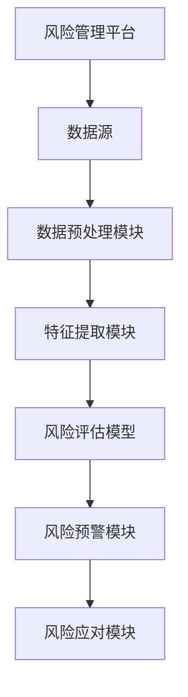
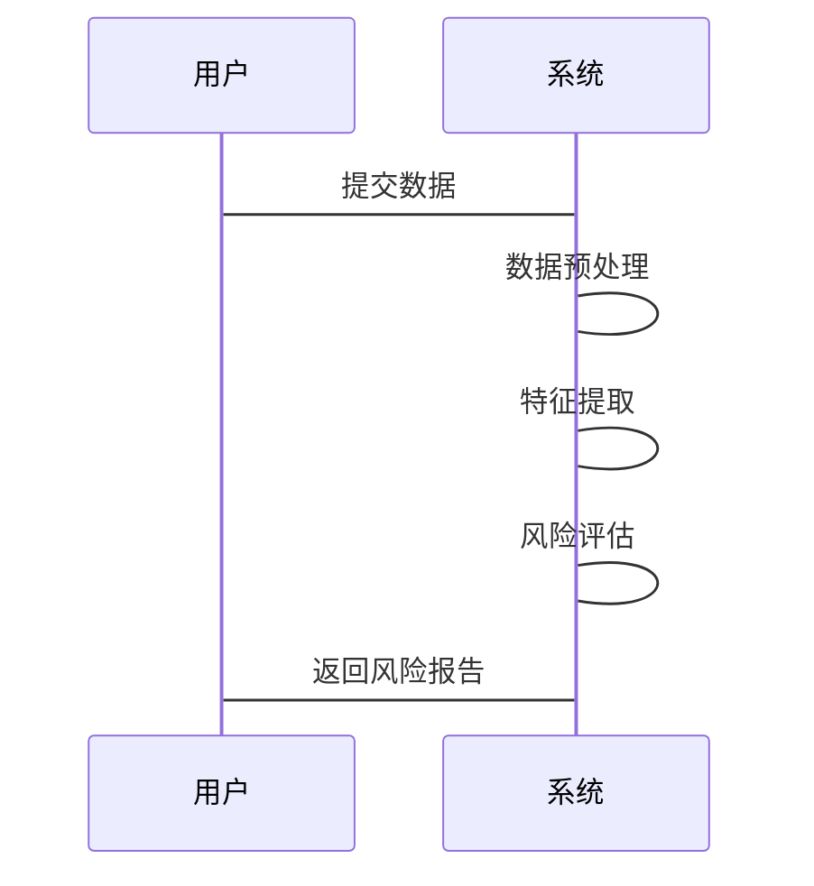

                 


好的，让我们一步一步来完成这篇文章的撰写。

---

# AI Agent在智能风险管理中的应用

> 关键词：AI Agent, 智能风险管理, 机器学习, 风险管理, 人工智能

> 摘要：本文深入探讨AI Agent在智能风险管理中的应用，从AI Agent的基本概念、核心原理到实际应用案例，结合数学模型和系统架构设计，全面解析AI Agent如何提升风险管理的效率与准确性。

---

## 第一部分: AI Agent与智能风险管理的背景介绍

### 第1章: AI Agent与智能风险管理概述

#### 1.1 AI Agent的基本概念

##### 1.1.1 AI Agent的定义与核心要素
AI Agent（人工智能代理）是一种能够感知环境、自主决策并采取行动的智能体。其核心要素包括：
- **感知能力**：通过传感器或数据输入获取环境信息。
- **决策能力**：基于感知信息，利用算法进行决策。
- **行动能力**：根据决策结果执行操作。

##### 1.1.2 AI Agent的分类与特点
AI Agent可以分为**反应式**和**认知式**两类：
- **反应式AI Agent**：基于当前感知信息做出实时反应，适用于简单动态环境。
- **认知式AI Agent**：具备复杂推理和规划能力，适用于复杂任务。

**特点**：
- **自主性**：无需外部干预，自主完成任务。
- **反应性**：能够实时感知并快速响应。
- **学习能力**：通过数据学习优化决策。

##### 1.1.3 AI Agent在风险管理中的应用背景
风险管理是一个复杂的系统工程，涉及风险识别、评估、预警和应对。传统的风险管理方法依赖人工分析，效率低且容易出错。AI Agent的引入为风险管理带来了智能化、自动化的新思路。

---

#### 1.2 风险管理的基本概念

##### 1.2.1 风险管理的定义与目标
风险管理是指识别、评估和应对可能影响组织目标的不确定性。其目标是降低风险发生的概率或影响，确保组织目标的实现。

##### 1.2.2 风险管理的主要方法与流程
1. **风险识别**：发现潜在风险。
2. **风险评估**：量化风险的概率和影响。
3. **风险应对**：制定和实施应对策略。
4. **风险监控**：持续监控风险状态。

##### 1.2.3 智能风险管理的定义与优势
智能风险管理是利用人工智能技术，通过数据驱动的方式，实现风险的智能化识别、评估和应对。其优势包括：
- **高效性**：快速处理大量数据。
- **准确性**：基于数据和模型，提高决策的准确性。
- **实时性**：实时监控和响应风险。

---

#### 1.3 AI Agent在智能风险管理中的作用

##### 1.3.1 AI Agent如何提升风险管理效率
AI Agent能够快速处理海量数据，帮助企业在复杂环境中快速识别潜在风险，提升风险管理效率。

##### 1.3.2 AI Agent在风险识别、评估与应对中的应用
- **风险识别**：通过自然语言处理技术分析文本数据，识别潜在风险。
- **风险评估**：利用机器学习模型量化风险概率和影响。
- **风险应对**：根据评估结果，制定最优应对策略。

##### 1.3.3 AI Agent在智能风险管理中的创新价值
AI Agent的引入不仅提高了风险管理的效率，还通过数据驱动的方式实现了风险的精准预测和动态调整，为企业提供了更强大的风险管理能力。

---

#### 1.4 本章小结
本章介绍了AI Agent的基本概念、分类及其在风险管理中的应用背景，重点分析了智能风险管理的定义、方法和优势。通过AI Agent的应用，风险管理将更加智能化和高效化。

---

## 第二部分: AI Agent的核心概念与原理

### 第2章: AI Agent的核心概念与原理

#### 2.1 AI Agent的核心原理

##### 2.1.1 AI Agent的感知与决策机制
AI Agent的感知机制包括数据采集、特征提取和信息融合。决策机制则基于感知信息，通过机器学习模型生成决策。

##### 2.1.2 AI Agent的学习与优化算法
- **监督学习**：基于标注数据进行模型训练。
- **无监督学习**：从无标签数据中发现模式。
- **强化学习**：通过试错优化决策策略。

##### 2.1.3 AI Agent的自主性与适应性
AI Agent能够根据环境变化自主调整策略，具备较强的适应能力。

---

#### 2.2 AI Agent的关键技术

##### 2.2.1 机器学习在AI Agent中的应用
- **监督学习**：用于风险分类和预测。
- **无监督学习**：用于异常检测和聚类分析。

##### 2.2.2 自然语言处理在AI Agent中的应用
通过NLP技术，AI Agent能够理解文本数据，识别潜在风险。

##### 2.2.3 强化学习在AI Agent中的应用
通过强化学习，AI Agent能够在动态环境中优化决策策略。

---

#### 2.3 AI Agent与传统风险管理方法的对比

##### 2.3.1 传统风险管理方法的局限性
- **效率低**：依赖人工分析，耗时且效率低。
- **准确性差**：受主观因素影响，结果不准确。
- **实时性弱**：无法实时监控和应对风险。

##### 2.3.2 AI Agent在风险管理中的优势
- **高效性**：快速处理海量数据。
- **准确性**：基于数据和模型，提高决策的准确性。
- **实时性**：实时监控和响应风险。

##### 2.3.3 AI Agent与传统方法的结合与互补
AI Agent可以与传统方法结合，形成更加完善的风险管理体系。

---

#### 2.4 本章小结
本章详细介绍了AI Agent的核心原理和关键技术，分析了AI Agent与传统风险管理方法的对比。AI Agent通过引入机器学习、自然语言处理和强化学习等技术，显著提升了风险管理的效率和准确性。

---

## 第三部分: AI Agent的算法原理与数学模型

### 第3章: AI Agent的算法原理

#### 3.1 AI Agent的感知与决策算法

##### 3.1.1 监督学习算法
- **线性回归**：用于风险概率预测。
- **支持向量机（SVM）**：用于分类任务。

##### 3.1.2 无监督学习算法
- **聚类分析**：用于异常检测。
- **主成分分析（PCA）**：用于数据降维。

##### 3.1.3 强化学习算法
- **Q-Learning**：用于优化决策策略。

---

#### 3.2 AI Agent的学习与优化算法

##### 3.2.1 神经网络与深度学习算法
- **卷积神经网络（CNN）**：用于图像识别。
- **长短期记忆网络（LSTM）**：用于时间序列分析。

##### 3.2.2 遗传算法与进化计算
通过模拟生物进化过程，优化决策模型。

##### 3.2.3 贝叶斯网络与概率推理
通过概率推理，评估风险发生的概率。

---

#### 3.3 AI Agent的数学模型与公式

##### 3.3.1 风险评估的数学模型
$$ P(r) = \frac{\text{风险事件发生次数}}{\text{总事件数}} $$

##### 3.3.2 AI Agent决策的数学公式
$$ \text{决策} = \arg\max_{i} \sum_{j} w_{ij} \cdot x_j $$

##### 3.3.3 示例：风险概率计算公式
$$ P(\text{违约}) = \frac{\text{违约客户数}}{\text{总客户数}} $$

---

#### 3.4 本章小结
本章详细介绍了AI Agent的算法原理，包括监督学习、无监督学习和强化学习等算法，并通过数学公式展示了风险评估和决策的模型。

---

## 第四部分: 智能风险管理系统的架构设计

### 第4章: 智能风险管理系统的架构设计

#### 4.1 系统应用场景介绍

##### 4.1.1 企业风险管理中的应用场景
- **财务风险管理**：监控财务数据，识别潜在风险。
- **供应链风险管理**：优化供应链流程，降低风险。

##### 4.1.2 金融领域的风险管理应用
- **信用风险管理**：评估客户信用风险。
- **市场风险管理**：监控市场波动，制定应对策略。

##### 4.1.3 其他行业的风险管理应用
- **医疗风险管理**：优化医疗流程，降低风险。
- **能源风险管理**：监控能源市场，制定应对策略。

---

#### 4.2 系统功能设计

##### 4.2.1 风险识别与评估模块
- **数据采集**：收集相关数据。
- **特征提取**：提取关键特征。
- **风险评估**：量化风险概率。

##### 4.2.2 风险预警与监控模块
- **实时监控**：持续监控风险状态。
- **预警触发**：当风险超过阈值时，触发预警。

##### 4.2.3 风险应对与优化模块
- **策略制定**：根据评估结果制定应对策略。
- **优化调整**：根据反馈优化策略。

---

#### 4.3 系统架构设计

##### 4.3.1 系统架构图（使用mermaid）



##### 4.3.2 系统接口设计
- **输入接口**：接收数据源输入。
- **输出接口**：输出风险评估结果和应对策略。

##### 4.3.3 系统交互流程图（使用mermaid）



---

#### 4.4 本章小结
本章详细介绍了智能风险管理系统的应用场景、功能设计和系统架构设计，并通过图表展示了系统的模块结构和交互流程。

---

## 第五部分: 项目实战

### 第5章: 项目实战

#### 5.1 环境安装

##### 5.1.1 安装Python
```bash
# 安装Python
sudo apt-get install python3
```

##### 5.1.2 安装必要的库
```bash
pip install numpy pandas scikit-learn
```

---

#### 5.2 系统核心实现源代码

##### 5.2.1 风险评估模型实现
```python
import numpy as np
from sklearn import svm

# 数据准备
X = np.array([[...], [...]])  # 特征数据
y = np.array([...])  # 标签数据

# 训练模型
model = svm.SVC()
model.fit(X, y)

# 预测
new_sample = np.array([[...], [...]])
print(model.predict(new_sample))
```

##### 5.2.2 风险预警模块实现
```python
import pandas as pd
from sklearn.ensemble import IsolationForest

# 数据准备
data = pd.read_csv('data.csv')
X = data.drop(columns='label')
y = data['label']

# 训练模型
model = IsolationForest(random_state=42)
model.fit(X)

# 预测异常
outliers = model.predict(X)
print(outliers)
```

---

#### 5.3 实际案例分析与解读

##### 5.3.1 案例背景
假设我们是一家银行，需要评估客户的信用风险。

##### 5.3.2 数据准备
```python
data = pd.read_csv('credit_risk.csv')
```

##### 5.3.3 模型训练与评估
```python
# 训练模型
model = svm.SVC()
model.fit(X, y)

# 评估模型
print(model.score(X, y))
```

##### 5.3.4 风险报告生成
```python
# 生成风险报告
report = pd.DataFrame({
    '客户ID': [1, 2, 3],
    '风险概率': [0.1, 0.8, 0.3]
})
print(report)
```

---

#### 5.4 项目小结
本章通过实际案例展示了AI Agent在智能风险管理中的应用，详细讲解了环境安装、系统实现和案例分析的过程。

---

## 第六部分: 总结与展望

### 第6章: 总结与展望

#### 6.1 本章总结
本文详细介绍了AI Agent在智能风险管理中的应用，从理论基础到实际应用，全面分析了AI Agent的优势和价值。

#### 6.2 未来展望
未来，随着人工智能技术的不断发展，AI Agent在智能风险管理中的应用将更加广泛和深入。我们可以期待更多创新技术和应用场景的出现。

---

## 第七部分: 最佳实践 Tips

### 7.1 注意事项
- 在实际应用中，确保数据的质量和完整性。
- 定期更新模型，避免过时。
- 结合业务需求，选择合适的AI技术。

### 7.2 拓展阅读
- 《机器学习实战》
- 《深入理解深度学习》
- 《风险管理与决策优化》

---

以上是《AI Agent在智能风险管理中的应用》的完整大纲和内容框架，涵盖了从基础理论到实际应用的各个方面，帮助读者全面理解AI Agent在智能风险管理中的价值和应用。

