                 


# AI Agent在智能风险管理系统中的应用

> **关键词**：AI Agent, 智能风险管理, 风险预测, 强化学习, 知识图谱, 系统架构  
> 
> **摘要**：本文深入探讨了AI Agent在智能风险管理系统中的应用，从AI Agent的核心原理到智能风险管理的基础理论，再到AI Agent在风险管理中的具体应用场景，系统地分析了其在风险识别、风险评估和风险应对中的优势。文章还详细讲解了AI Agent在智能风险管理中的算法实现，包括基于强化学习的决策算法、基于监督学习的风险预测和基于知识图谱的风险分析，并通过实际案例展示了AI Agent在智能风险管理中的项目实战。最后，文章总结了AI Agent在智能风险管理中的应用成果，并展望了未来的发展方向。

---

## 第1章: AI Agent与智能风险管理概述

### 1.1 AI Agent的基本概念
#### 1.1.1 AI Agent的定义与特点
AI Agent（人工智能代理）是指能够感知环境、自主决策并执行任务的智能实体。其特点包括：  
- **自主性**：能够自主决策，无需外部干预。  
- **反应性**：能够实时感知环境变化并做出反应。  
- **学习能力**：通过数据和经验不断优化自身行为。  
- **社交能力**：能够与其他系统或人类进行交互协作。

#### 1.1.2 智能风险管理的定义与目标
智能风险管理是指利用人工智能技术，对潜在风险进行预测、识别、评估和控制的过程。其目标是通过智能化手段，降低风险发生概率，减少潜在损失。

#### 1.1.3 AI Agent在风险管理中的作用
AI Agent在风险管理中的作用主要体现在以下三个方面：  
- **风险识别**：通过数据分析和模式识别，发现潜在风险。  
- **风险评估**：利用机器学习算法，对风险进行量化评估。  
- **风险应对**：根据风险评估结果，制定和执行风险应对策略。

### 1.2 AI Agent的核心原理
#### 1.2.1 AI Agent的感知与决策机制
AI Agent的感知机制包括数据采集、特征提取和状态表示。决策机制则基于感知结果，通过算法生成最优决策。以下是AI Agent的感知与决策流程图：

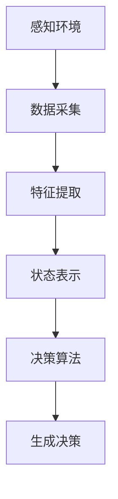

#### 1.2.2 智能风险管理的流程与方法
智能风险管理的流程包括：  
1. **风险识别**：通过数据采集和分析，发现潜在风险。  
2. **风险评估**：利用概率论和统计学方法，对风险进行量化评估。  
3. **风险应对**：根据评估结果，制定和执行风险应对策略。

#### 1.2.3 AI Agent与传统风险管理的区别
| **维度**       | **传统风险管理**                     | **AI Agent驱动的风险管理**               |
|----------------|------------------------------------|------------------------------------------|
| **效率**       | 依赖人工分析，效率较低              | 通过自动化算法，效率显著提高            |
| **准确性**      | 受人工经验限制，准确性有限           | 利用大数据和机器学习，准确性更高        |
| **实时性**      | 无法实时响应，周期较长              | 实时监控，快速响应                      |
| **适应性**      | 需要人工调整，适应性较慢            | 自适应能力强，能够动态优化              |

### 1.3 AI Agent在智能风险管理中的优势
#### 1.3.1 提高风险识别的准确性
AI Agent通过大数据分析和机器学习算法，能够从海量数据中发现潜在风险，显著提高风险识别的准确性。

#### 1.3.2 实现风险的实时监控
AI Agent能够实时感知环境变化，快速响应潜在风险，实现风险的实时监控。

#### 1.3.3 优化风险应对策略
AI Agent通过强化学习等算法，能够在复杂环境中优化风险应对策略，提高风险管理的效率和效果。

## 1.4 本章小结
本章主要介绍了AI Agent的基本概念和智能风险管理的核心原理，分析了AI Agent在风险管理中的作用和优势。通过对比传统风险管理，进一步突出了AI Agent在提高效率、准确性和实时性方面的显著优势。

---

## 第2章: AI Agent的核心原理与技术

### 2.1 AI Agent的基本架构
#### 2.1.1 状态空间与动作空间
AI Agent的决策过程基于状态空间和动作空间。状态空间表示环境中的所有可能状态，动作空间表示AI Agent在每个状态下可以执行的所有动作。

#### 2.1.2 知识表示与推理
知识表示是AI Agent理解环境的基础，通常采用知识图谱或规则库的形式。推理过程则基于知识表示和逻辑推理算法，生成合理的决策。

#### 2.1.3 行为决策机制
行为决策机制是AI Agent的核心，通过感知环境状态、分析可能动作及其结果，最终选择最优动作。以下是行为决策机制的流程图：

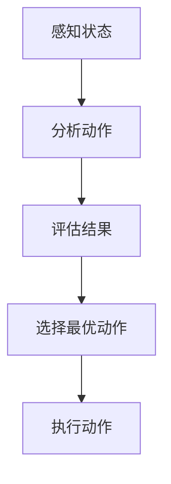

### 2.2 AI Agent的感知与决策算法
#### 2.2.1 基于强化学习的决策算法
强化学习是一种通过试错机制优化决策的算法。以下是强化学习的基本流程：

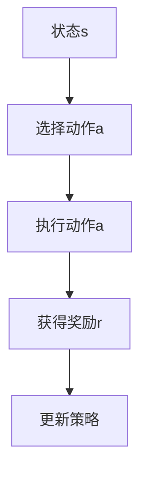

#### 2.2.2 基于监督学习的风险预测
监督学习通过历史数据训练模型，预测未来风险。以下是监督学习的基本流程：

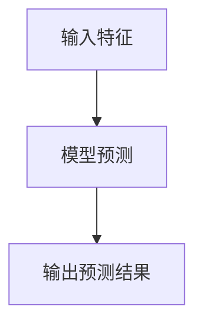

#### 2.2.3 基于知识图谱的风险分析
知识图谱通过构建实体间的关系，帮助AI Agent更好地理解环境。以下是知识图谱的构建流程：

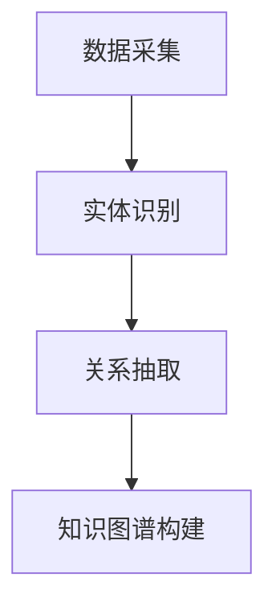

### 2.3 AI Agent的风险管理应用模型
#### 2.3.1 风险识别模型
风险识别模型通过数据分析和模式识别，发现潜在风险。以下是风险识别模型的流程图：

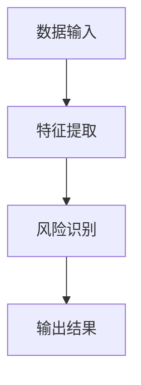

#### 2.3.2 风险评估模型
风险评估模型通过概率论和统计学方法，量化风险的影响和概率。以下是风险评估模型的流程图：

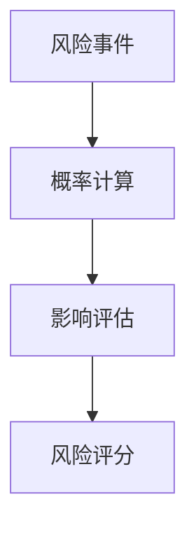

#### 2.3.3 风险应对策略生成模型
风险应对策略生成模型根据风险评估结果，生成最优应对策略。以下是风险应对策略生成模型的流程图：

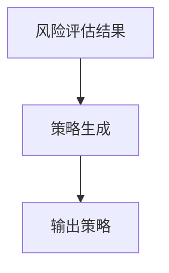

### 2.4 本章小结
本章详细讲解了AI Agent的核心原理与技术，包括其基本架构、感知与决策算法以及风险管理应用模型。通过具体算法和流程图的展示，帮助读者更好地理解AI Agent在智能风险管理中的技术实现。

---

## 第3章: 智能风险管理的基础理论

### 3.1 风险管理的基本概念
#### 3.1.1 风险的定义与分类
风险是指在特定条件下，某一事件发生可能导致的损失或收益。根据影响范围，风险可以分为系统性风险和非系统性风险。

#### 3.1.2 风险管理的目标与原则
风险管理的目标是通过识别、评估和应对风险，降低潜在损失。风险管理的原则包括全面性、科学性和经济性。

#### 3.1.3 风险管理的流程
风险管理的流程包括：  
1. **风险识别**：发现潜在风险。  
2. **风险评估**：量化风险的影响和概率。  
3. **风险应对**：制定和执行应对策略。  
4. **风险监控**：持续监控风险变化。

### 3.2 风险识别与评估方法
#### 3.2.1 基于概率论的风险评估
概率论是风险评估的重要工具。以下是风险概率计算公式：

$$ P(r) = \frac{\text{风险事件发生次数}}{\text{总事件次数}} $$

#### 3.2.2 基于统计学的风险预测
统计学方法通过分析历史数据，预测未来风险。以下是线性回归模型的公式：

$$ y = a x + b $$

其中，$y$ 是预测结果，$x$ 是输入特征，$a$ 和 $b$ 是模型参数。

#### 3.2.3 基于知识图谱的风险分析
知识图谱通过构建实体间的关系，帮助分析风险的传播路径和影响范围。

### 3.3 风险控制与应对策略
#### 3.3.1 风险规避策略
风险规避策略是指通过完全避免某些活动来降低风险。例如，避免投资高风险资产。

#### 3.3.2 风险降低策略
风险降低策略是指通过采取措施，减少风险的影响。例如，购买保险以降低潜在损失。

#### 3.3.3 风险转移策略
风险转移策略是指将风险转移给第三方。例如，通过衍生品交易将风险转移给市场参与者。

### 3.4 本章小结
本章介绍了智能风险管理的基础理论，包括风险管理的基本概念、风险识别与评估方法以及风险控制与应对策略。通过概率论、统计学和知识图谱等方法，帮助读者更好地理解风险管理的实现过程。

---

## 第4章: AI Agent在智能风险管理中的应用

### 4.1 AI Agent在风险识别中的应用
#### 4.1.1 基于强化学习的风险识别
强化学习通过试错机制，优化风险识别的准确性和效率。以下是强化学习在风险识别中的应用流程图：

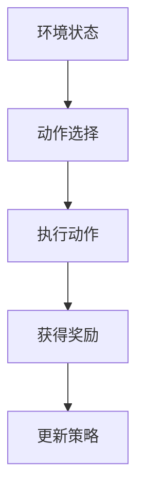

#### 4.1.2 基于监督学习的风险预测
监督学习通过历史数据训练模型，预测未来风险。以下是监督学习在风险预测中的应用流程图：


#### 4.1.3 基于知识图谱的风险分析
知识图谱通过构建实体间的关系，帮助分析风险的传播路径和影响范围。以下是知识图谱在风险分析中的应用流程图：

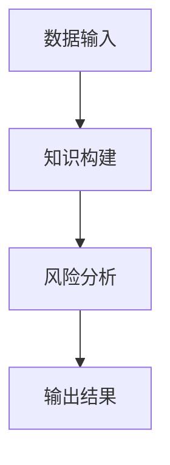

### 4.2 AI Agent在风险评估中的应用
#### 4.2.1 基于强化学习的风险评估
强化学习通过动态调整策略，优化风险评估的准确性和实时性。以下是强化学习在风险评估中的应用流程图：


#### 4.2.2 基于监督学习的风险预测
监督学习通过历史数据训练模型，预测未来风险。以下是监督学习在风险预测中的应用流程图：


#### 4.2.3 基于知识图谱的风险分析
知识图谱通过构建实体间的关系，帮助分析风险的传播路径和影响范围。以下是知识图谱在风险分析中的应用流程图：


### 4.3 AI Agent在风险应对中的应用
#### 4.3.1 基于强化学习的风险应对
强化学习通过动态调整策略，优化风险应对的效率和效果。以下是强化学习在风险应对中的应用流程图：


#### 4.3.2 基于监督学习的风险预测
监督学习通过历史数据训练模型，预测未来风险。以下是监督学习在风险预测中的应用流程图：


#### 4.3.3 基于知识图谱的风险分析
知识图谱通过构建实体间的关系，帮助分析风险的传播路径和影响范围。以下是知识图谱在风险分析中的应用流程图：


### 4.4 本章小结
本章详细讲解了AI Agent在智能风险管理中的具体应用，包括风险识别、风险评估和风险应对。通过强化学习、监督学习和知识图谱等技术，显著提高了风险管理的效率和准确性。

---

## 第5章: AI Agent驱动的智能风险管理系统的架构设计

### 5.1 系统功能设计
#### 5.1.1 风险识别模块
风险识别模块负责从数据源中提取特征，识别潜在风险。以下是风险识别模块的类图：

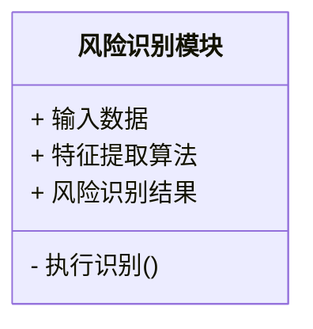

#### 5.1.2 风险评估模块
风险评估模块负责量化风险的影响和概率。以下是风险评估模块的类图：

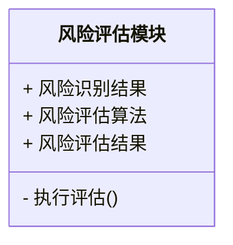

#### 5.1.3 风险应对模块
风险应对模块负责制定和执行风险应对策略。以下是风险应对模块的类图：

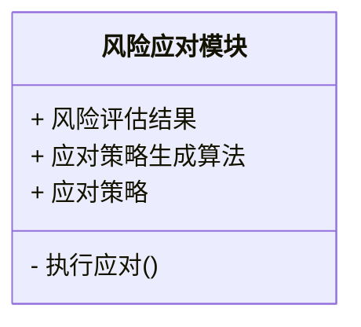

### 5.2 系统架构设计
#### 5.2.1 系统架构图
以下是AI Agent驱动的智能风险管理系统的架构图：

```mermaid
graph TD
    A[数据源] --> B[风险识别模块]
    B --> C[风险评估模块]
    C --> D[风险应对模块]
    D --> E[输出结果]
```

#### 5.2.2 系统接口设计
系统接口设计包括数据源接口、算法接口和输出接口。以下是系统接口设计的类图：

```mermaid
classDiagram
    class 数据源接口 {
        + 提供数据
        - 获取数据()
    }
    class 算法接口 {
        + 提供算法
        - 执行算法()
    }
    class 输出接口 {
        + 提供结果
        - 显示结果()
    }
```

### 5.3 系统交互设计
#### 5.3.1 系统交互流程图
以下是系统交互的流程图：

```mermaid
graph TD
    A[用户输入] --> B[数据源]
    B --> C[风险识别模块]
    C --> D[风险评估模块]
    D --> E[风险应对模块]
    E --> F[输出结果]
```

### 5.4 本章小结
本章详细讲解了AI Agent驱动的智能风险管理系统的架构设计，包括系统功能设计、系统架构设计、系统接口设计和系统交互设计。通过类图和流程图的展示，帮助读者更好地理解系统的实现过程。

---

## 第6章: AI Agent驱动的智能风险管理系统的实现

### 6.1 环境配置
#### 6.1.1 硬件环境
- CPU: Intel Core i7或更高
- 内存: 16GB或更高
- 存储: 至少50GB可用空间

#### 6.1.2 软件环境
- 操作系统: Linux或Windows
- 开发工具: Python 3.8及以上，TensorFlow 2.0及以上，Keras 2.4及以上，Scikit-learn 0.24及以上

### 6.2 系统核心实现
#### 6.2.1 风险识别模块的实现
以下是风险识别模块的实现代码：

```python
class RiskIdentification:
    def __init__(self, data):
        self.data = data
        self.features = []
    
    def extract_features(self):
        # 提取特征
        self.features = [feature for feature in self.data.columns if feature != 'label']
    
    def identify_risk(self):
        # 使用监督学习模型进行风险识别
        from sklearn.model

