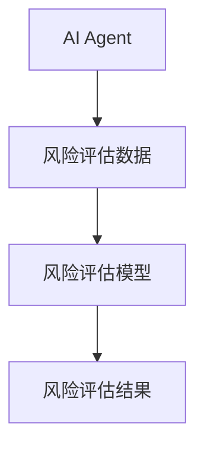
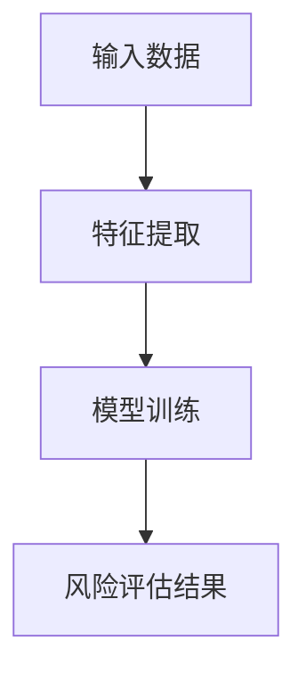
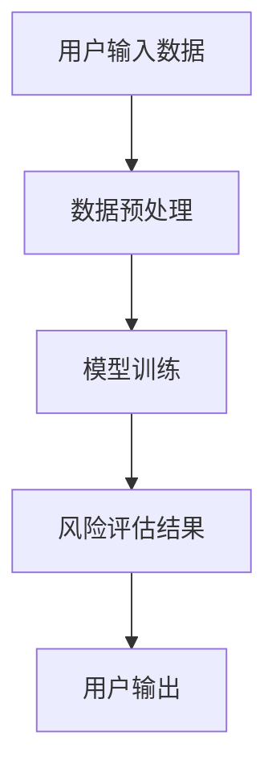

                 


# AI Agent在智能风险评估中的应用

> 关键词：AI Agent，风险评估，智能系统，机器学习，决策树，数学模型

> 摘要：本文深入探讨AI Agent在智能风险评估中的应用，分析其核心概念、算法原理、系统架构，并通过实际案例展示其在风险评估中的应用价值。文章内容涵盖AI Agent的基本概念、算法原理、系统架构设计以及项目实战，为读者提供全面的技术指导。

---

## 第一部分: AI Agent 的基础与概念

### 第1章: AI Agent 的基本概念与背景

#### 1.1 AI Agent 的定义与特点

AI Agent（人工智能代理）是一种能够感知环境、自主决策并执行任务的智能实体。它结合了机器学习、自然语言处理和强化学习等技术，具备以下特点：
- **自主性**：能够独立决策和行动。
- **反应性**：能够实时感知环境变化并做出响应。
- **学习能力**：通过数据和经验不断优化自身模型。
- **可解释性**：决策过程需要透明，便于人类理解和信任。

#### 1.2 AI Agent 的类型与应用场景

AI Agent 可分为以下几种类型：
1. **知识型 AI Agent**：依赖于知识库进行推理和决策，适用于法律咨询、医疗诊断等领域。
2. **数据驱动型 AI Agent**：基于大量数据进行训练，适用于金融风险评估、信用评分等领域。
3. **混合型 AI Agent**：结合知识和数据驱动方法，适用于复杂场景的风险评估。

#### 1.3 AI Agent 的技术基础

AI Agent 的技术基础包括：
- **机器学习**：用于模型训练和预测。
- **自然语言处理**：用于处理和分析非结构化数据。
- **强化学习**：用于动态环境下的决策优化。
- **知识图谱**：用于构建和管理知识库。

#### 1.4 AI Agent 在风险评估中的作用

AI Agent 在风险评估中的作用主要体现在：
- **数据处理**：能够高效处理大量复杂数据。
- **决策优化**：通过学习和优化算法，提升风险评估的准确性。
- **实时响应**：能够在动态环境中实时调整评估策略。

---

## 第二部分: AI Agent 的核心概念与联系

### 第2章: AI Agent 的核心概念与联系

#### 2.1 核心概念原理

AI Agent 的核心概念包括感知、决策和学习机制：
- **感知**：通过传感器或数据源获取环境信息。
- **决策**：基于感知信息和模型进行决策。
- **学习**：通过反馈不断优化模型。

#### 2.2 核心概念属性对比表

| 概念 | 属性 | 描述 |
|------|------|------|
| AI Agent | 智能性 | 基于数据和模型进行决策 |
| 风险评估 | 数据依赖性 | 需要大量历史数据支持 |
| 决策机制 | 可解释性 | 需要对决策过程进行解释 |

#### 2.3 ER 实体关系图



---

## 第三部分: AI Agent 的算法原理与数学模型

### 第3章: AI Agent 的算法原理与数学模型

#### 3.1 算法原理

AI Agent 的算法流程如下：


#### 3.2 数学模型与公式

风险评估的数学模型可以表示为：
$$ R = f(x) $$
其中，$R$ 是风险评估结果，$x$ 是输入特征，$f$ 是模型函数。

概率计算公式：
$$ P(R|E) = \frac{P(E|R)P(R)}{P(E)} $$

---

## 第四部分: AI Agent 的系统架构与实现

### 第4章: AI Agent 的系统架构与实现

#### 4.1 系统设计

AI Agent 的系统架构包括：
1. 数据采集模块
2. 数据处理模块
3. 模型训练模块
4. 风险评估模块
5. 结果输出模块

#### 4.2 接口设计

系统接口设计：
- 输入接口：接收风险评估数据
- 输出接口：输出风险评估结果

#### 4.3 交互流程

交互流程：


---

## 第五部分: AI Agent 的项目实战

### 第5章: AI Agent 的项目实战

#### 5.1 项目介绍

本项目旨在构建一个基于AI Agent的风险评估系统，应用于金融领域。

#### 5.2 系统实现

环境配置：
```bash
pip install numpy scikit-learn matplotlib
```

代码实现：
```python
import numpy as np
from sklearn.tree import DecisionTreeClassifier

# 示例数据
X = np.array([[1, 2], [3, 4], [5, 6]])
y = np.array([0, 1, 2])

# 模型训练
model = DecisionTreeClassifier()
model.fit(X, y)

# 预测
print(model.predict([[2, 3]]))
```

#### 5.3 案例分析

以银行贷款风险评估为例，分析模型如何分类不同客户的风险等级。

---

## 第六部分: AI Agent 的最佳实践与展望

### 第6章: AI Agent 的最佳实践与展望

#### 6.1 最佳实践

- 数据质量：确保数据的完整性和准确性。
- 模型解释性：提升模型的可解释性。
- 安全性：确保数据和模型的安全性。

#### 6.2 未来展望

随着AI技术的不断发展，AI Agent 在风险评估中的应用将更加广泛和深入，特别是在实时风险监控和动态决策优化方面。

---

## 结语

AI Agent 在智能风险评估中的应用为各行业提供了高效、智能的解决方案。通过本文的分析和实践，读者可以深入了解AI Agent的核心概念、算法原理和实际应用，为未来的实践提供有价值的参考。

