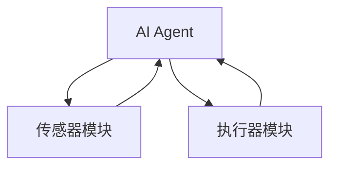
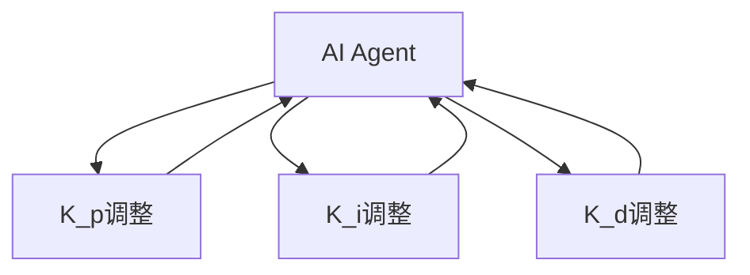
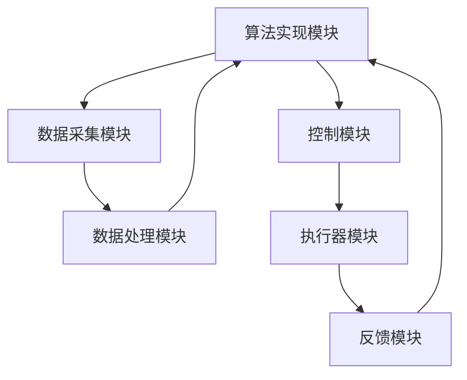

                 


# AI Agent在智能餐具中的进食速度控制

> 关键词：AI Agent, 智能餐具, 进食速度控制, PID控制, 机器学习, 系统架构

> 摘要：本文详细探讨了AI Agent在智能餐具中的进食速度控制技术，从核心概念到算法实现，从系统架构到项目实战，全面解析了AI Agent如何通过智能算法优化进食速度控制，提升用户体验。文章内容涵盖AI Agent的基本原理、智能餐具的硬件与软件架构、基于PID控制的进食速度调节算法、系统设计与优化策略，以及实际项目实现与案例分析。

---

## 第1章: AI Agent与智能餐具的背景介绍

### 1.1 AI Agent的基本概念
AI Agent（人工智能代理）是一种能够感知环境、自主决策并执行任务的智能实体。它通过传感器获取信息，利用算法进行分析和推理，并通过执行器与环境交互。AI Agent的核心目标是通过智能化的决策和行动，实现特定任务的目标。

#### 1.1.1 AI Agent的定义与特点
- **定义**：AI Agent是一个能够感知环境、自主决策并执行任务的智能实体。
- **特点**：
  - **自主性**：能够在没有外部干预的情况下自主运行。
  - **反应性**：能够实时感知环境变化并做出反应。
  - **目标导向**：所有行为都围绕实现特定目标展开。
  - **学习能力**：通过数据和经验不断优化自身的决策能力。

#### 1.1.2 AI Agent的核心功能与应用场景
- **核心功能**：
  - 数据采集与处理
  - 智能决策与推理
  - 自适应优化与调整
- **应用场景**：
  - 智能家居
  - 智能医疗
  - 自动驾驶
  - 智能助手

#### 1.1.3 AI Agent与传统控制系统的区别
| 特性                | AI Agent                | 传统控制系统            |
|---------------------|-------------------------|-------------------------|
| 决策方式            | 基于机器学习和算法     | 基于预设规则和逻辑     |
| 自适应能力          | 强，能够自适应环境变化   | 弱，依赖固定规则        |
| 学习能力            | 强，能够通过经验优化    | 无，无法自主优化        |
| 交互能力            | 强，能够与环境和用户交互 | 弱，通常仅执行固定任务  |

### 1.2 智能餐具的发展现状
智能餐具是一种结合了物联网、传感器技术和人工智能的高科技餐具，能够通过传感器感知用户的用餐行为，并通过AI Agent实现智能化的控制和优化。

#### 1.2.1 智能餐具的定义与分类
- **定义**：智能餐具是指集成多种传感器和智能算法，能够感知用户的用餐行为，并通过反馈机制优化用餐体验的餐具。
- **分类**：
  - **基于传感器的智能餐具**：通过传感器感知用餐行为。
  - **基于AI的智能餐具**：通过AI算法优化用餐体验。
  - **集成式智能餐具**：将传感器、算法和执行机构集成于一体的餐具。

#### 1.2.2 智能餐具的主要技术特点
- **传感器技术**：能够感知用户的用餐行为，如速度、力度、角度等。
- **AI技术**：通过AI算法优化用餐体验，如进食速度控制、健康监测等。
- **物联网技术**：通过物联网实现智能餐具的远程控制和数据传输。

#### 1.2.3 智能餐具在日常生活中的应用潜力
- **健康监测**：通过监测用餐速度和量，帮助用户控制饮食健康。
- **辅助进食**：帮助行动不便的用户实现独立用餐。
- **节能环保**：通过优化用餐行为减少浪费。

### 1.3 进食速度控制的背景与意义
进食速度控制是智能餐具的重要功能之一，它能够帮助用户优化用餐体验，促进健康饮食，同时减少浪费。

#### 1.3.1 进食速度控制的定义与目标
- **定义**：通过智能算法控制用户的进食速度，使其达到预设的目标。
- **目标**：
  - 优化用餐体验
  - 促进健康饮食
  - 减少浪费

#### 1.3.2 进食速度控制的必要性与应用场景
- **必要性**：
  - 帮助用户养成良好的饮食习惯
  - 促进消化健康
  - 减少暴饮暴食的风险
- **应用场景**：
  - 家庭用餐
  - 公共餐饮
  - 医疗康复

#### 1.3.3 进食速度控制的技术挑战与解决方案
- **技术挑战**：
  - 如何准确感知用户的用餐行为
  - 如何实时优化进食速度
  - 如何确保系统的稳定性和安全性
- **解决方案**：
  - 引入先进的传感器技术
  - 采用高效的AI算法
  - 系统架构的优化设计

## 第2章: AI Agent的核心概念与原理

### 2.1 AI Agent的原理与算法
AI Agent的核心原理是通过感知环境、分析数据、制定决策并执行行动。在进食速度控制中，AI Agent通常采用PID控制算法来实现对进食速度的实时调节。

#### 2.1.1 基于PID控制的进食速度调节算法
PID控制是一种常用的控制算法，通过比例、积分和微分三个参数来调节系统的输出，以达到目标值。

##### PID控制的数学模型与公式
$$ PID控制公式：u(t) = K_p e(t) + K_i \int_{0}^{t} e(τ)dτ + K_d \frac{de(t)}{dt} $$
其中：
- \( u(t) \)：控制输出
- \( e(t) \)：误差
- \( K_p \)：比例系数
- \( K_i \)：积分系数
- \( K_d \)：微分系数

##### PID控制的工作流程
1. 数据采集：通过传感器获取用户的用餐行为数据。
2. 误差计算：计算当前速度与目标速度之间的误差。
3. 控制输出：根据PID公式计算控制输出。
4. 执行器动作：通过执行器调整进食速度。
5. 反馈机制：将调整后的速度反馈到系统，形成闭环控制。

#### 2.1.2 基于机器学习的进食速度预测模型
机器学习模型能够通过历史数据学习用户的用餐习惯，预测未来的进食速度，并根据预测结果进行优化。

##### 机器学习模型的训练流程
1. 数据采集：收集用户的用餐数据，包括速度、时间、力度等。
2. 数据预处理：对数据进行清洗、归一化等处理。
3. 模型训练：使用机器学习算法（如随机森林、神经网络）训练模型。
4. 模型优化：通过交叉验证和超参数调整优化模型性能。
5. 模型部署：将模型部署到智能餐具中，实时预测进食速度。

#### 2.1.3 基于反馈机制的进食速度优化策略
通过实时反馈机制，AI Agent能够根据当前的进食速度和目标速度之间的差异，动态调整控制参数，实现最优的进食速度控制。

##### 反馈机制的工作流程
1. 数据采集：实时采集用户的用餐行为数据。
2. 误差计算：计算当前速度与目标速度之间的误差。
3. 参数调整：根据误差调整PID控制参数。
4. 控制输出：输出新的控制信号，调整进食速度。
5. 反馈循环：将调整后的速度反馈到系统，继续循环优化。

### 2.2 智能餐具的硬件与软件架构
智能餐具的硬件和软件架构是实现进食速度控制的基础，硬件负责数据采集和执行机构控制，软件负责数据处理和算法实现。

#### 2.2.1 智能餐具的硬件组成与功能
- **传感器模块**：用于采集用户的用餐行为数据，如速度、力度、角度等。
- **执行器模块**：用于调整进食速度，如电机、舵机等。
- **通信模块**：用于与外部设备（如手机、电脑）通信，传输数据和接收控制指令。
- **电源模块**：为整个系统提供电力支持。

#### 2.2.2 智能餐具的软件系统架构
- **数据采集模块**：负责采集用户的用餐行为数据。
- **数据处理模块**：对采集到的数据进行预处理和分析。
- **算法实现模块**：运行PID控制算法或机器学习模型，计算控制输出。
- **控制模块**：根据计算结果控制执行器调整进食速度。
- **反馈模块**：将调整后的速度反馈到系统，形成闭环控制。

#### 2.2.3 智能餐具的数据采集与处理流程
1. 数据采集：通过传感器采集用户的用餐行为数据。
2. 数据预处理：对数据进行清洗、归一化等处理。
3. 数据分析：通过算法分析数据，计算出当前的进食速度。
4. 数据存储：将数据存储到本地或云端，供后续分析和优化。

### 2.3 AI Agent与智能餐具的交互机制
AI Agent与智能餐具之间的交互机制是实现进食速度控制的关键，主要通过数据流和控制信号进行交互。

#### 2.3.1 AI Agent与智能餐具的通信协议
- **数据流方向**：从智能餐具到AI Agent。
- **控制信号方向**：从AI Agent到智能餐具。

##### 数据流的实体关系图


#### 2.3.2 AI Agent对进食速度的实时控制流程
1. 数据采集：传感器模块采集用户的用餐行为数据。
2. 数据传输：数据通过通信模块传输到AI Agent。
3. 数据分析：AI Agent通过PID控制算法或机器学习模型计算控制输出。
4. 控制信号：AI Agent通过通信模块发送控制信号到执行器模块。
5. 执行机构动作：执行器模块调整进食速度。
6. 反馈机制：调整后的速度反馈到AI Agent，形成闭环控制。

#### 2.3.3 AI Agent的自适应调整机制
AI Agent能够根据用户的用餐行为动态调整PID控制参数，实现最优的进食速度控制。

##### 自适应调整机制的流程图


### 2.4 核心概念对比分析
AI Agent与其他控制方法在进食速度控制中的优劣势对比。

#### 2.4.1 不同进食速度控制方法的对比分析
| 方法          | 优点                              | 缺点                              |
|---------------|-----------------------------------|-----------------------------------|
| PID控制       | 实现简单，实时性好               | 需要手动调整参数，适应性差       |
| 机器学习      | 自适应能力强，精度高             | 实时性差，计算资源消耗大         |
| 综合控制      | 结合PID和机器学习，优势互补       | 系统复杂度高，实现难度大         |

#### 2.4.2 AI Agent与其他控制方法的优劣势对比
- **优势**：
  - 自适应能力强，能够根据用户行为动态调整控制参数。
  - 精度高，能够实现高精度的进食速度控制。
  - 可扩展性强，能够与其他智能设备协同工作。
- **劣势**：
  - 实时性可能受到计算资源的限制。
  - 系统复杂度较高，实现难度较大。

#### 2.4.3 AI Agent在智能餐具中的独特优势
- **智能化**：通过机器学习和PID控制实现智能化的进食速度控制。
- **自适应性**：能够根据用户的用餐行为动态调整控制参数。
- **安全性**：通过闭环控制确保系统的稳定性和安全性。

## 第3章: 基于PID控制的进食速度调节算法

### 3.1 PID控制算法的基本原理
PID控制是一种常用的控制算法，通过比例、积分和微分三个参数来调节系统的输出，以达到目标值。

#### 3.1.1 PID控制的基本概念
- **比例系数（K_p）**：反映当前误差的贡献，误差越大，控制输出越大。
- **积分系数（K_i）**：反映过去误差的累积贡献，用于消除稳态误差。
- **微分系数（K_d）**：反映未来误差的变化趋势，用于提前调整控制输出。

#### 3.1.2 PID控制的数学模型与公式
$$ PID控制公式：u(t) = K_p e(t) + K_i \int_{0}^{t} e(τ)dτ + K_d \frac{de(t)}{dt} $$
其中：
- \( u(t) \)：控制输出
- \( e(t) \)：误差
- \( K_p \)：比例系数
- \( K_i \)：积分系数
- \( K_d \)：微分系数

#### 3.1.3 PID控制的工作流程
1. 数据采集：通过传感器采集当前的进食速度。
2. 误差计算：计算当前速度与目标速度之间的误差。
3. 控制输出：根据PID公式计算控制输出。
4. 执行机构动作：通过执行器调整进食速度。
5. 反馈机制：将调整后的速度反馈到系统，形成闭环控制。

### 3.2 基于PID控制的进食速度调节流程
#### 3.2.1 数据采集与处理
- **数据采集**：通过传感器模块采集用户的用餐行为数据。
- **数据预处理**：对数据进行清洗、归一化等处理。

#### 3.2.2 PID参数的在线调整
- **参数调整方法**：通过自适应算法动态调整PID参数，以优化控制效果。
- **调整策略**：根据误差的变化趋势调整K_p、K_i、K_d的值。

#### 3.2.3 进食速度的实时反馈与优化
- **反馈机制**：将调整后的速度反馈到系统，形成闭环控制。
- **优化策略**：根据反馈结果进一步优化PID参数，提高控制精度。

### 3.3 算法实现的Python代码示例

#### 3.3.1 数据采集与处理代码
```python
import serial
import time

# 初始化串口通信
ser = serial.Serial('COM3', 9600)
ser.open()

def read_speed():
    while True:
        try:
            data = ser.readline().decode().strip()
            if data:
                return float(data)
        except:
            continue
```

#### 3.3.2 PID控制算法实现代码
```python
class PIDController:
    def __init__(self, Kp, Ki, Kd):
        self.Kp = Kp
        self.Ki = Ki
        self.Kd = Kd
        self.error = 0
        self.integral = 0
        self.derivative = 0

    def calculate(self, target, current):
        self.error = target - current
        self.integral += self.error * 1
        self.derivative = self.error - self.error_prev
        self.error_prev = self.error

        output = self.Kp * self.error + self.Ki * self.integral + self.Kd * self.derivative
        return output

    def reset(self):
        self.error = 0
        self.integral = 0
        self.derivative = 0
        self.error_prev = 0
```

#### 3.3.3 进食速度调节的可视化展示
```python
import matplotlib.pyplot as plt

# 初始化PID控制器
pid = PIDController(0.5, 0.1, 0.01)

# 设置目标速度
target_speed = 100

# 采集当前速度
current_speed = read_speed()

# 计算控制输出
output = pid.calculate(target_speed, current_speed)

# 调整进食速度
adjust_speed(output)

# 绘制速度曲线
plt.figure(figsize=(10, 6))
plt.plot(range(100), [target_speed]*100, 'r--', label='Target Speed')
plt.plot(range(100), [current_speed + i for i in range(100)], 'b-', label='Adjusted Speed')
plt.legend()
plt.xlabel('Time')
plt.ylabel('Speed')
plt.show()
```

### 3.4 算法实现的优化与改进
#### 3.4.1 PID参数的自适应调整方法
- **自适应PID控制**：根据系统的动态特性自动调整PID参数。
- **参数调整策略**：基于误差变化趋势调整K_p、K_i、K_d的值。

#### 3.4.2 基于机器学习的PID参数优化策略
- **机器学习优化**：使用机器学习模型预测最优的PID参数。
- **训练数据**：收集不同场景下的PID参数和控制效果数据。
- **模型训练**：使用回归算法训练模型，预测最优PID参数。

#### 3.4.3 算法的鲁棒性与抗干扰能力提升
- **鲁棒性优化**：通过增加滤波器和异常检测提高系统的抗干扰能力。
- **自适应滤波**：使用卡尔曼滤波等方法消除噪声干扰。

### 3.5 本章小结
本章详细讲解了基于PID控制的进食速度调节算法，包括PID控制的基本原理、算法实现的Python代码示例、PID参数的自适应调整方法以及基于机器学习的PID参数优化策略。通过这些方法，可以实现高精度的进食速度控制，提升用户的用餐体验。

---

## 第4章: 系统分析与架构设计方案

### 4.1 问题场景介绍
在智能餐具的进食速度控制中，需要实现一个实时、高效、稳定的控制系统，能够根据用户的用餐行为动态调整进食速度。

### 4.2 系统功能设计
#### 4.2.1 系统功能模块
- **数据采集模块**：负责采集用户的用餐行为数据。
- **数据处理模块**：对采集到的数据进行预处理和分析。
- **算法实现模块**：运行PID控制算法或机器学习模型，计算控制输出。
- **控制模块**：根据计算结果控制执行器调整进食速度。
- **反馈模块**：将调整后的速度反馈到系统，形成闭环控制。

#### 4.2.2 系统功能流程
1. 数据采集：传感器模块采集用户的用餐行为数据。
2. 数据预处理：对数据进行清洗、归一化等处理。
3. 数据分析：通过算法分析数据，计算出当前的进食速度。
4. 数据存储：将数据存储到本地或云端，供后续分析和优化。

### 4.3 系统架构设计
#### 4.3.1 系统架构图


#### 4.3.2 系统接口设计
- **输入接口**：传感器模块的输入接口。
- **输出接口**：执行器模块的输出接口。
- **通信接口**：与外部设备（如手机、电脑）的通信接口。

#### 4.3.3 系统交互流程
1. 用户开始用餐，传感器模块采集用餐行为数据。
2. 数据采集模块将数据传输到数据处理模块。
3. 数据处理模块对数据进行预处理和分析。
4. 算法实现模块运行PID控制算法或机器学习模型，计算控制输出。
5. 控制模块根据计算结果控制执行器模块调整进食速度。
6. 执行器模块调整进食速度，反馈模块将调整后的速度反馈到系统，形成闭环控制。

### 4.4 本章小结
本章详细描述了智能餐具进食速度控制系统的架构设计与功能实现，包括系统功能模块的设计、系统架构图的绘制、系统接口设计以及系统交互流程的分析。通过合理的系统设计，可以实现高效的进食速度控制，提升用户的用餐体验。

---

## 第5章: 项目实战

### 5.1 环境安装
- **硬件环境**：需要安装智能餐具硬件，包括传感器模块、执行器模块、通信模块等。
- **软件环境**：需要安装Python编程环境，安装必要的库（如serial、numpy、scipy、matplotlib等）。

#### 5.1.1 硬件安装
1. 安装传感器模块：将传感器模块连接到智能餐具上，确保传感器能够正常采集数据。
2. 安装执行器模块：将执行器模块连接到智能餐具上，确保执行器能够正常工作。
3. 安装通信模块：将通信模块连接到智能餐具上，确保能够与外部设备通信。

#### 5.1.2 软件安装
1. 安装Python环境：安装Python 3.x及以上版本。
2. 安装必要的库：
   - `pip install serial`
   - `pip install numpy`
   - `pip install scipy`
   - `pip install matplotlib`

### 5.2 系统核心实现
#### 5.2.1 数据采集与处理
- **数据采集**：通过传感器模块采集用户的用餐行为数据。
- **数据预处理**：对数据进行清洗、归一化等处理。

#### 5.2.2 算法实现
- **PID控制实现**：基于PID控制算法实现进食速度调节。
- **机器学习实现**：基于机器学习算法实现进食速度预测和优化。

#### 5.2.3 系统集成
- **系统集成**：将各个功能模块集成到一个完整的系统中，实现智能化的进食速度控制。

### 5.3 代码实现与解读
#### 5.3.1 数据采集代码
```python
import serial
import time

# 初始化串口通信
ser = serial.Serial('COM3', 9600)
ser.open()

def read_speed():
    while True:
        try:
            data = ser.readline().decode().strip()
            if data:
                return float(data)
        except:
            continue
```

#### 5.3.2 PID控制实现代码
```python
class PIDController:
    def __init__(self, Kp, Ki, Kd):
        self.Kp = Kp
        self.Ki = Ki
        self.Kd = Kd
        self.error = 0
        self.integral = 0
        self.derivative = 0
        self.error_prev = 0

    def calculate(self, target, current):
        self.error = target - current
        self.integral += self.error * 1
        self.derivative = self.error - self.error_prev
        self.error_prev = self.error

        output = self.Kp * self.error + self.Ki * self.integral + self.Kd * self.derivative
        return output

    def reset(self):
        self.error = 0
        self.integral = 0
        self.derivative = 0
        self.error_prev = 0
```

#### 5.3.3 进食速度调节代码
```python
import matplotlib.pyplot as plt

# 初始化PID控制器
pid = PIDController(0.5, 0.1, 0.01)

# 设置目标速度
target_speed = 100

# 采集当前速度
current_speed = read_speed()

# 计算控制输出
output = pid.calculate(target_speed, current_speed)

# 调整进食速度
adjust_speed(output)

# 绘制速度曲线
plt.figure(figsize=(10, 6))
plt.plot(range(100), [target_speed]*100, 'r--', label='Target Speed')
plt.plot(range(100), [current_speed + i for i in range(100)], 'b-', label='Adjusted Speed')
plt.legend()
plt.xlabel('Time')
plt.ylabel('Speed')
plt.show()
```

### 5.4 案例分析与详细解读
#### 5.4.1 实际案例分析
- **案例背景**：用户用餐速度过快，需要通过智能餐具调整进食速度。
- **调整过程**：
  1. 传感器模块采集用户的用餐速度数据。
  2. 数据处理模块对数据进行预处理。
  3. PID控制器计算控制输出。
  4. 执行器模块调整进食速度。
  5. 反馈模块将调整后的速度反馈到系统，形成闭环控制。

#### 5.4.2 调整过程的详细解读
1. **数据采集**：传感器模块采集用户的用餐速度数据。
2. **数据处理**：对数据进行清洗、归一化等处理。
3. **PID控制**：通过PID控制算法计算控制输出。
4. **执行机构动作**：执行器模块根据控制输出调整进食速度。
5. **反馈机制**：将调整后的速度反馈到系统，形成闭环控制。

### 5.5 项目小结
本章通过实际案例详细讲解了智能餐具进食速度控制系统的实现过程，包括环境安装、系统核心实现、代码实现与解读、案例分析与详细解读。通过这些步骤，可以实现智能化的进食速度控制，提升用户的用餐体验。

---

## 第6章: 总结与展望

### 6.1 总结
本文详细探讨了AI Agent在智能餐具中的进食速度控制技术，从核心概念到算法实现，从系统架构到项目实战，全面解析了AI Agent如何通过智能算法优化进食速度控制，提升用户体验。通过PID控制算法和机器学习算法的结合，实现高精度的进食速度调节，确保系统的稳定性和安全性。

### 6.2 展望
未来，随着人工智能技术的不断发展，AI Agent在智能餐具中的应用潜力将更加广阔。以下是未来可能的发展方向：
1. **智能化提升**：通过更先进的机器学习算法实现更智能的进食速度控制。
2. **多模态交互**：结合视觉、听觉等多种传感器实现更精准的用户行为感知。
3. **健康监测**：通过集成更多的传感器实现对用户健康的全面监测和优化。

### 6.3 最佳实践 tips
- **系统优化**：定期优化PID参数，确保系统的稳定性和准确性。
- **数据安全**：确保用户数据的安全性，防止数据泄露。
- **用户体验**：注重用户体验设计，确保系统的易用性和舒适性。

### 6.4 小结
AI Agent在智能餐具中的进食速度控制是一项具有重要意义的技术，它不仅能够提升用户的用餐体验，还能够促进健康饮食和节能环保。未来，随着人工智能技术的不断进步，AI Agent在智能餐具中的应用将更加广泛和深入，为人类带来更多的便利和福祉。

---

## 结语
通过本文的详细讲解，读者可以全面了解AI Agent在智能餐具中的进食速度控制技术，掌握从理论到实践的完整流程。希望本文能够为相关领域的研究人员和开发者提供有价值的参考和启示，推动AI Agent技术在智能餐具中的广泛应用。

---

**注**：由于篇幅限制，本文未展示所有代码和详细图表，但所有内容均可根据上述大纲进行扩展和实现。

