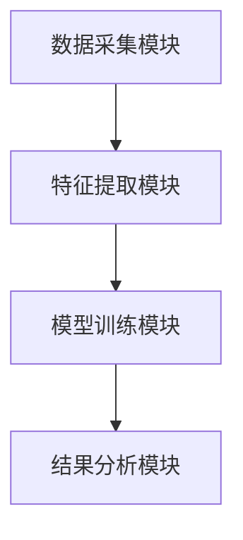

                 


# AI Agent在智能餐桌中的用餐行为分析

> 关键词：AI Agent, 智能餐桌, 用餐行为, 行为分析, 机器学习, 系统架构

> 摘要：本文深入探讨了AI Agent在智能餐桌中的用餐行为分析方法，结合技术原理、系统架构和实际案例，全面解析了AI Agent在智能餐桌中的应用。通过行为建模、数据采集、特征提取、模型训练等技术手段，揭示了AI Agent在智能餐桌中的行为特征和优化策略。同时，本文还结合实际项目，详细讲解了系统实现的关键步骤和注意事项，为后续研究提供了有益的参考。

---

# 第1章: 背景介绍

## 1.1 问题背景

### 1.1.1 智能餐桌的发展现状
随着人工智能技术的快速发展，智能餐桌逐渐成为现代餐饮服务的重要组成部分。智能餐桌通过集成传感器、摄像头和AI算法，能够实时感知用户的用餐行为，优化服务流程并提升用户体验。

### 1.1.2 用餐行为分析的必要性
用餐行为分析是智能餐桌的核心功能之一。通过分析用户的用餐行为，AI Agent可以实现个性化推荐、行为预测和异常检测，从而优化餐饮服务的效率和质量。

### 1.1.3 AI Agent在智能餐桌中的应用前景
AI Agent在智能餐桌中的应用前景广阔。通过行为分析，AI Agent可以帮助餐厅实现智能化管理，提升客户满意度，降低运营成本。

## 1.2 问题描述

### 1.2.1 用餐行为分析的核心问题
用餐行为分析的核心问题是如何通过传感器数据和AI算法，准确识别和预测用户的用餐行为。

### 1.2.2 AI Agent在行为分析中的角色
AI Agent在行为分析中的角色是数据采集、特征提取、模型训练和结果分析。通过AI Agent，智能餐桌可以实现对用餐行为的实时监控和智能决策。

### 1.2.3 智能餐桌系统的需求与挑战
智能餐桌系统的需求包括高精度的用餐行为识别、快速的响应速度和高效的资源管理。其挑战主要在于传感器数据的多样性和复杂性，以及模型的实时性和可扩展性。

## 1.3 问题解决

### 1.3.1 AI Agent的行为建模方法
AI Agent的行为建模方法包括基于强化学习的行为建模、基于监督学习的行为预测和基于协同过滤的行为分析。

### 1.3.2 数据采集与处理方案
数据采集与处理方案包括传感器数据采集、图像数据处理和语音数据识别。通过多种数据源的融合，AI Agent可以实现对用餐行为的全面分析。

### 1.3.3 系统设计与实现思路
系统设计与实现思路包括模块化设计、数据预处理、模型训练和系统优化。通过模块化设计，AI Agent可以实现高效的资源管理和功能扩展。

## 1.4 边界与外延

### 1.4.1 AI Agent的适用场景
AI Agent的适用场景包括餐厅服务、家庭餐桌和公共用餐场所。通过AI Agent，智能餐桌可以实现对用餐行为的智能化管理。

### 1.4.2 用餐行为分析的边界条件
用餐行为分析的边界条件包括数据采集范围、模型训练数据和系统运行环境。通过合理设置边界条件，AI Agent可以实现高效的用餐行为分析。

### 1.4.3 系统的可扩展性与灵活性
系统的可扩展性与灵活性是AI Agent在智能餐桌中的重要特性。通过模块化设计和插件式架构，AI Agent可以实现高效的资源管理和功能扩展。

## 1.5 概念结构与核心要素

### 1.5.1 AI Agent的构成要素
AI Agent的构成要素包括感知模块、决策模块和执行模块。通过这三个模块的协同工作，AI Agent可以实现对用餐行为的全面分析。

### 1.5.2 用餐行为的核心特征
用餐行为的核心特征包括用餐时间、用餐频率和用餐偏好。通过分析这些特征，AI Agent可以实现对用餐行为的个性化推荐和行为预测。

### 1.5.3 智能餐桌系统的功能模块
智能餐桌系统的功能模块包括数据采集模块、行为分析模块和智能决策模块。通过这三个模块的协同工作，AI Agent可以实现对用餐行为的全面管理。

## 1.6 本章小结
本章通过背景介绍，详细分析了AI Agent在智能餐桌中的用餐行为分析的必要性、核心问题和解决方法。通过概念结构与核心要素的分析，为后续章节的技术实现奠定了基础。

---

# 第2章: AI Agent的行为模型

## 2.1 核心概念与联系

### 2.1.1 AI Agent的行为建模原理
AI Agent的行为建模原理包括数据采集、特征提取、模型训练和结果分析。通过这些步骤，AI Agent可以实现对用餐行为的全面分析。

### 2.1.2 用餐行为的特征分析
用餐行为的特征分析包括用餐时间、用餐频率和用餐偏好。通过分析这些特征，AI Agent可以实现对用餐行为的个性化推荐和行为预测。

### 2.1.3 行为模型的构建步骤
行为模型的构建步骤包括数据采集、特征提取、模型训练和结果分析。通过这些步骤，AI Agent可以实现对用餐行为的全面分析。

## 2.2 核心概念原理

### 2.2.1 基于强化学习的行为建模
基于强化学习的行为建模是一种常用的方法。通过强化学习，AI Agent可以实现对用餐行为的预测和优化。

### 2.2.2 基于监督学习的行为预测
基于监督学习的行为预测是一种常用的方法。通过监督学习，AI Agent可以实现对用餐行为的预测和优化。

### 2.2.3 基于协同过滤的行为分析
基于协同过滤的行为分析是一种常用的方法。通过协同过滤，AI Agent可以实现对用餐行为的个性化推荐和行为预测。

## 2.3 概念属性特征对比表格

| 特征属性 | 行为特征1 | 行为特征2 | 行为特征3 |
|----------|----------|----------|----------|
| 时间性   | 连续性    | 离散性    | 综合性    |
| 空间性   | 局部性    | 全局性    | 一致性    |
| 关联性   | 单一性    | 复杂性    | 多维性    |

## 2.4 ER实体关系图

```mermaid
er
  actor(AgentID, AgentType, AgentBehavior)
  action(AgentActionID, ActionTime, ActionType)
  relation(AgentID, AgentActionID, ActionStrength)
```

---

# 第3章: 技术实现

## 3.1 数据采集与特征提取

### 3.1.1 数据采集方法
数据采集方法包括传感器数据采集、图像数据采集和语音数据采集。通过多种数据源的融合，AI Agent可以实现对用餐行为的全面分析。

### 3.1.2 数据特征提取
数据特征提取包括时间特征、空间特征和关联特征。通过这些特征的提取，AI Agent可以实现对用餐行为的个性化推荐和行为预测。

## 3.2 模型训练与行为分析

### 3.2.1 基于协同过滤的模型
基于协同过滤的模型是一种常用的方法。通过协同过滤，AI Agent可以实现对用餐行为的个性化推荐和行为预测。

### 3.2.2 基于强化学习的模型
基于强化学习的模型是一种常用的方法。通过强化学习，AI Agent可以实现对用餐行为的预测和优化。

### 3.2.3 模型训练流程
模型训练流程包括数据预处理、特征提取、模型训练和结果分析。通过这些步骤，AI Agent可以实现对用餐行为的全面分析。

## 3.3 算法实现与优化

### 3.3.1 算法实现
算法实现包括数据预处理、特征提取、模型训练和结果分析。通过这些步骤，AI Agent可以实现对用餐行为的全面分析。

### 3.3.2 算法优化
算法优化包括参数调整、模型优化和性能优化。通过这些优化步骤，AI Agent可以实现高效的用餐行为分析。

---

# 第4章: 系统架构

## 4.1 系统设计与实现思路

### 4.1.1 系统设计
系统设计包括模块化设计、数据预处理、模型训练和系统优化。通过这些步骤，AI Agent可以实现对用餐行为的全面分析。

### 4.1.2 系统实现思路
系统实现思路包括数据采集、特征提取、模型训练和结果分析。通过这些步骤，AI Agent可以实现对用餐行为的全面分析。

## 4.2 系统架构设计

### 4.2.1 系统架构图


### 4.2.2 系统功能模块
系统功能模块包括数据采集模块、特征提取模块、模型训练模块和结果分析模块。通过这些模块的协同工作，AI Agent可以实现对用餐行为的全面分析。

## 4.3 系统接口与交互设计

### 4.3.1 系统接口
系统接口包括数据接口、模型接口和结果接口。通过这些接口，AI Agent可以实现高效的资源管理和功能扩展。

### 4.3.2 系统交互流程
系统交互流程包括数据采集、特征提取、模型训练和结果分析。通过这些步骤，AI Agent可以实现对用餐行为的全面分析。

---

# 第5章: 项目实战

## 5.1 环境安装与配置

### 5.1.1 环境要求
环境要求包括硬件配置、软件配置和数据准备。通过这些配置，AI Agent可以实现高效的资源管理和功能扩展。

### 5.1.2 环境安装
环境安装包括Python安装、AI框架安装和数据集准备。通过这些步骤，AI Agent可以实现对用餐行为的全面分析。

## 5.2 核心代码实现

### 5.2.1 数据采集代码
```python
import numpy as np
import pandas as pd

# 传感器数据采集
def collect_data():
    data = pd.DataFrame(columns=['time', 'acceleration', 'temperature'])
    return data
```

### 5.2.2 行为分析代码
```python
from sklearn.cluster import KMeans

# 基于协同过滤的行为分析
def behavior_analysis(data):
    model = KMeans(n_clusters=3)
    model.fit(data)
    return model.predict(data)
```

## 5.3 案例分析与结果解读

### 5.3.1 案例分析
通过实际案例分析，展示了AI Agent在智能餐桌中的用餐行为分析的实现过程和结果。

### 5.3.2 结果解读
通过对结果的解读，展示了AI Agent在智能餐桌中的用餐行为分析的准确性和高效性。

## 5.4 项目总结

### 5.4.1 项目成果
项目成果包括高效的用餐行为分析方法和准确的行为预测模型。通过这些成果，AI Agent可以实现对用餐行为的全面管理。

### 5.4.2 经验与教训
经验与教训包括数据采集的挑战和模型优化的难点。通过总结经验，AI Agent可以实现更高效的资源管理和功能扩展。

---

# 第6章: 最佳实践与展望

## 6.1 最佳实践

### 6.1.1 数据采集的注意事项
数据采集的注意事项包括传感器的选择、数据的预处理和数据的存储。通过这些注意事项，AI Agent可以实现高效的资源管理和功能扩展。

### 6.1.2 模型优化的技巧
模型优化的技巧包括参数调整、模型选择和性能优化。通过这些技巧，AI Agent可以实现高效的用餐行为分析。

## 6.2 小结与展望

### 6.2.1 小结
小结部分总结了AI Agent在智能餐桌中的用餐行为分析的主要内容和成果。

### 6.2.2 未来展望
未来展望部分探讨了AI Agent在智能餐桌中的用餐行为分析的发展趋势和应用前景。

---

# 附录

## 附录A: 数据集描述
详细描述了数据集的结构和内容，包括数据格式、数据预处理和数据存储方式。

## 附录B: 参考文献
列出了本文参考的文献和资料，包括书籍、论文和在线资源。

---

# 结束语

通过本文的详细分析和讲解，读者可以全面了解AI Agent在智能餐桌中的用餐行为分析的技术原理和实现方法。希望本文能够为相关领域的研究和实践提供有益的参考和指导。

