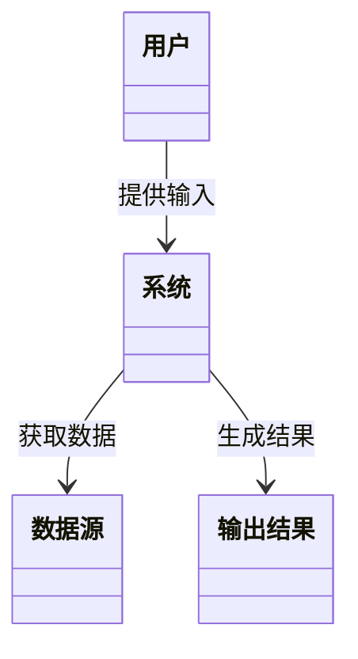
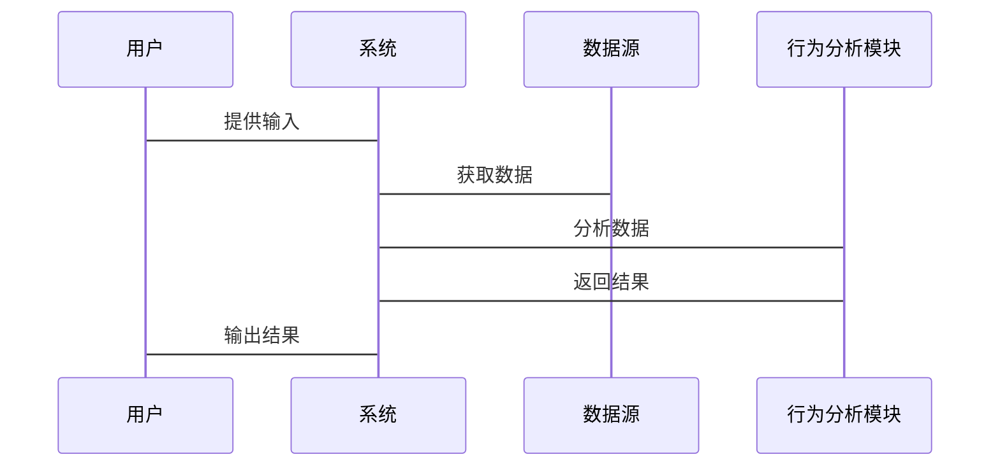

                 


# AI Agent在智能餐桌中的饮食行为分析

**关键词：** AI Agent, 智能餐桌, 饮食行为分析, 机器学习, 系统架构, 实践案例

**摘要：**  
本文深入探讨AI Agent在智能餐桌中的饮食行为分析，从背景介绍、核心概念到算法原理、系统架构，再到项目实战和最佳实践，全面解析AI Agent如何在智能餐桌环境中实现高效的饮食行为分析。通过结合具体案例和代码实现，本文为技术开发者和研究人员提供了一份详尽的技术指南，帮助他们在智能餐桌领域更好地应用AI技术。

---

# AI Agent在智能餐桌中的饮食行为分析

## 第1章: AI Agent与智能餐桌的背景介绍

### 1.1 AI Agent的基本概念
AI Agent（人工智能代理）是一种能够感知环境、自主决策并执行任务的智能实体。AI Agent的核心特征包括自主性、反应性、目标导向性和社会性。在智能餐桌场景中，AI Agent可以实时分析用户的饮食行为，提供个性化服务。

#### 1.1.1 什么是AI Agent
AI Agent是一种智能实体，能够通过传感器和数据输入感知环境，并通过算法进行决策和执行任务。AI Agent在智能餐桌中的应用，使其能够实时分析用户的饮食行为，优化用户体验。

#### 1.1.2 AI Agent的核心特征
- **自主性**：AI Agent能够在没有外部干预的情况下独立运作。
- **反应性**：AI Agent能够实时感知环境变化并做出反应。
- **目标导向性**：AI Agent的行为以实现特定目标为导向。
- **社会性**：AI Agent能够与其他实体（如用户、其他设备）进行交互和协作。

#### 1.1.3 AI Agent在智能餐桌中的应用潜力
AI Agent在智能餐桌中的应用潜力巨大，可以实现用户行为分析、个性化推荐、健康监测等功能，从而提升用户体验和生活质量。

### 1.2 智能餐桌的定义与发展
智能餐桌是一种结合了物联网（IoT）和人工智能技术的智能设备，能够通过传感器和AI算法实时感知和分析用户的饮食行为。

#### 1.2.1 智能餐桌的基本定义
智能餐桌是一种结合了物联网和人工智能技术的智能设备，能够通过传感器和AI算法实时感知和分析用户的饮食行为。

#### 1.2.2 智能餐桌的技术基础
智能餐桌的技术基础包括传感器技术、物联网（IoT）、人工智能（AI）和大数据分析等。

#### 1.2.3 智能餐桌的市场现状与发展趋势
智能餐桌市场目前处于快速发展阶段，随着AI技术的不断进步和用户需求的增加，智能餐桌的应用场景将更加广泛。

### 1.3 饮食行为分析的意义
饮食行为分析在智能餐桌中的意义重大，能够帮助用户优化饮食习惯、提升健康水平。

#### 1.3.1 饮食行为分析的定义
饮食行为分析是指通过传感器和AI算法，对用户的饮食行为进行实时感知、分析和反馈的过程。

#### 1.3.2 饮食行为分析的应用场景
饮食行为分析在智能餐桌中的应用场景包括个性化推荐、健康监测、行为矫正等。

#### 1.3.3 饮食行为分析的技术挑战
饮食行为分析面临的技术挑战包括数据采集的准确性、算法的实时性和系统的可扩展性等。

---

## 第2章: AI Agent在智能餐桌中的核心概念与联系

### 2.1 AI Agent的核心原理
AI Agent的核心原理包括感知、决策和执行三个环节。

#### 2.1.1 AI Agent的基本原理
AI Agent通过感知环境、分析数据、制定决策并执行任务来实现其功能。

#### 2.1.2 AI Agent的感知与决策机制
AI Agent通过传感器和数据输入感知环境，利用算法进行分析和决策。

#### 2.1.3 AI Agent的学习与优化方法
AI Agent通过机器学习和优化算法不断改进其感知和决策能力。

### 2.2 智能餐桌的饮食行为分析模型
智能餐桌的饮食行为分析模型是一种基于AI Agent的模型，用于分析用户的饮食行为。

#### 2.2.1 模型的基本结构
饮食行为分析模型通常包括数据采集、特征提取、行为识别和结果反馈四个部分。

#### 2.2.2 模型的输入与输出
模型的输入包括用户的饮食数据，输出包括行为分析结果和个性化建议。

#### 2.2.3 模型的关键参数与性能指标
模型的关键参数包括算法参数和传感器参数，性能指标包括准确率、响应时间和处理效率。

### 2.3 AI Agent与智能餐桌的实体关系图
通过Mermaid图展示AI Agent与智能餐桌的实体关系，帮助读者理解系统架构。

```mermaid
er
    actor 用户
    actor 系统
    actor 数据源
    actor 输出结果
    用户 --> 系统: 提供输入
    系统 --> 数据源: 获取数据
    系统 --> 输出结果: 生成结果
```

---

## 第3章: AI Agent在智能餐桌中的算法原理

### 3.1 监督学习算法
监督学习是一种常用的机器学习算法，用于分类和回归任务。

#### 3.1.1 监督学习的基本原理
监督学习通过训练数据学习输入与输出之间的关系，用于分类和回归任务。

#### 3.1.2 监督学习的实现步骤
1. 数据预处理
2. 特征提取
3. 模型训练
4. 模型评估
5. 模型优化

#### 3.1.3 监督学习的Python代码示例
```python
from sklearn.tree import DecisionTreeClassifier
import pandas as pd

# 加载数据
data = pd.read_csv('饮食数据.csv')

# 特征提取
X = data.drop('标签', axis=1)
y = data['标签']

# 模型训练
model = DecisionTreeClassifier()
model.fit(X, y)

# 模型预测
预测结果 = model.predict(X)
```

### 3.2 强化学习算法
强化学习是一种通过试错机制优化决策的算法。

#### 3.2.1 强化学习的基本原理
强化学习通过试错机制优化决策，适用于动态环境中的决策问题。

#### 3.2.2 强化学习的实现步骤
1. 状态定义
2. 动作选择
3. 奖励机制
4. 策略优化

#### 3.2.3 强化学习的Python代码示例
```python
import numpy as np
import gym

# 初始化环境
env = gym.make('CartPole-v0')

# 定义策略
policy = np.random.randn(env.action_space.n)

# 策略优化
while True:
    state = env.reset()
    done = False
    while not done:
        action = np.argmax(policy)
        next_state, reward, done, info = env.step(action)
        # 更新策略
        policy[action] += reward
```

### 3.3 聚类算法
聚类算法用于将相似的数据点分组，适用于用户行为分析。

#### 3.3.1 聚类算法的基本原理
聚类算法通过数据点的相似性进行分组，适用于无监督学习任务。

#### 3.3.2 聚类算法的实现步骤
1. 数据预处理
2. 特征提取
3. 聚类模型训练
4. 聚类结果分析

#### 3.3.3 聚类算法的Python代码示例
```python
from sklearn.cluster import KMeans
import pandas as pd

# 加载数据
data = pd.read_csv('饮食数据.csv')

# 特征提取
X = data[['特征1', '特征2']]

# 聚类模型训练
model = KMeans(n_clusters=3)
model.fit(X)

# 聚类结果分析
聚类结果 = model.labels_
```

### 3.4 数学公式与模型解释
AI Agent在智能餐桌中的饮食行为分析涉及多种数学公式和模型。

#### 3.4.1 监督学习的数学模型
$$ y = f(x) + \epsilon $$
其中，$y$是目标变量，$x$是输入变量，$\epsilon$是误差项。

#### 3.4.2 强化学习的数学模型
$$ Q(s, a) = Q(s, a) + \alpha [r + \gamma Q(s', a) - Q(s, a)] $$
其中，$Q(s, a)$是状态-动作值函数，$\alpha$是学习率，$r$是奖励，$\gamma$是折扣因子，$s'$是下一个状态。

---

## 第4章: 系统分析与架构设计方案

### 4.1 问题场景介绍
智能餐桌的饮食行为分析系统需要解决用户饮食行为的实时感知和分析问题。

### 4.2 系统功能设计
系统功能设计包括数据采集、行为分析、结果反馈等模块。

#### 4.2.1 领域模型类图


#### 4.2.2 系统架构图
```mermaid
container 智能餐桌系统 {
    component 数据采集模块
    component 行为分析模块
    component 结果反馈模块
}
```

#### 4.2.3 系统交互序列图


### 4.3 系统接口设计
系统接口设计包括数据输入接口、算法接口和结果输出接口。

### 4.4 系统交互设计
系统交互设计包括用户与系统的交互流程和交互界面设计。

---

## 第5章: 项目实战

### 5.1 环境安装
需要安装Python、TensorFlow、Keras等开发环境。

### 5.2 系统核心实现
实现AI Agent在智能餐桌中的饮食行为分析系统。

#### 5.2.1 核心代码实现
```python
import numpy as np
from sklearn.tree import DecisionTreeClassifier

# 数据预处理
data = np.array([[1, 2], [3, 4], [5, 6], [7, 8]])
X = data[:, :-1]
y = data[:, -1]

# 模型训练
model = DecisionTreeClassifier()
model.fit(X, y)

# 模型预测
预测结果 = model.predict(X)
```

#### 5.2.2 代码应用解读与分析
代码实现了一个简单的决策树分类模型，用于分析用户的饮食行为。

### 5.3 实际案例分析
通过具体案例分析，展示AI Agent在智能餐桌中的实际应用。

#### 5.3.1 案例分析
案例分析展示了AI Agent如何通过分析用户的饮食行为，提供个性化的饮食建议。

#### 5.3.2 详细讲解剖析
详细讲解剖析了案例分析的每一步，帮助读者理解AI Agent在智能餐桌中的实际应用。

### 5.4 项目小结
项目小结总结了项目实现的关键点和经验教训，为读者提供了宝贵的参考。

---

## 第6章: 总结与展望

### 6.1 总结
总结本文的核心内容，强调AI Agent在智能餐桌中的重要性和应用价值。

### 6.2 小结
小结本文的主要内容，为读者提供一个清晰的回顾。

### 6.3 未来展望
展望AI Agent在智能餐桌中的未来发展方向，提出进一步研究的方向和建议。

---

通过本文的详细分析和实践案例，读者可以深入了解AI Agent在智能餐桌中的饮食行为分析，掌握相关的技术原理和实现方法。希望本文能够为技术开发者和研究人员提供有价值的参考和启发。

