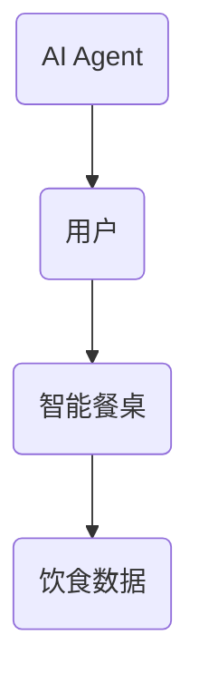
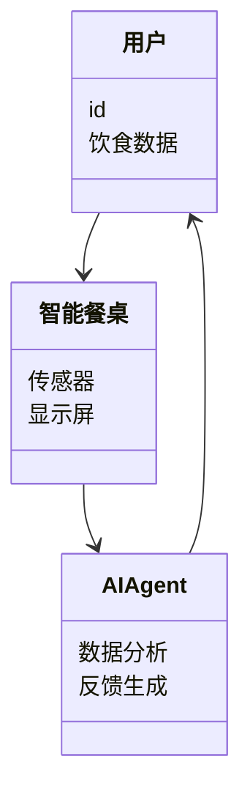
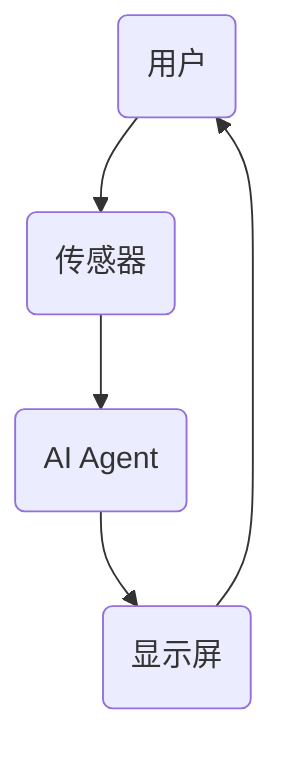

                 


---

# AI Agent在智能餐桌中的饮食行为矫正

**关键词**：AI Agent, 智能餐桌, 饮食行为矫正, 强化学习, 系统架构

**摘要**：本文探讨了AI Agent在智能餐桌中的应用，重点分析了如何通过AI技术矫正用户的饮食行为。文章从问题背景出发，详细介绍了AI Agent的核心概念、算法原理、系统架构，并通过项目实战展示了AI Agent在智能餐桌中的具体实现。最后，提出了系统的优化方法和未来的研究方向。

---

## 第1章: 背景介绍

### 1.1 问题背景

#### 1.1.1 饮食行为问题的现状
现代社会中，饮食不均衡、营养过剩等问题日益严重，导致肥胖、糖尿病等慢性疾病发病率上升。传统健康干预手段（如宣传教育）效果有限，亟需技术创新来解决这一问题。

#### 1.1.2 AI技术在饮食健康领域的应用潜力
AI技术在数据分析、个性化推荐和行为干预方面具有显著优势，可帮助用户养成健康饮食习惯。

#### 1.1.3 智能餐桌的定义与特点
智能餐桌是一种集成传感器、AI算法和人机交互设备的智能装置，能够实时监测和分析用户的饮食行为。

### 1.2 问题描述

#### 1.2.1 不良饮食行为的表现形式
包括饮食不均衡、过量摄入高热量食物、饮食时间不规律等。

#### 1.2.2 饮食行为矫正的目标与意义
目标是帮助用户建立健康饮食习惯，预防慢性疾病。意义在于提升用户健康水平，降低医疗成本。

#### 1.2.3 智能餐桌在饮食行为矫正中的作用
智能餐桌通过实时监测和反馈，为用户提供个性化的饮食建议和行为矫正。

### 1.3 问题解决

#### 1.3.1 AI Agent在饮食行为矫正中的核心作用
AI Agent通过分析用户数据，提供个性化建议，并通过反馈机制帮助用户调整饮食习惯。

#### 1.3.2 智能餐桌与AI Agent的结合方式
智能餐桌作为数据采集和人机交互的终端，AI Agent负责数据分析和决策。

#### 1.3.3 饮食行为矫正的实现路径
通过数据采集、分析、反馈的闭环实现饮食行为矫正。

### 1.4 边界与外延

#### 1.4.1 AI Agent在智能餐桌中的应用边界
仅关注饮食行为，不涉及运动、睡眠等领域。

#### 1.4.2 饮食行为矫正的适用场景与限制
适用于个人用户，对复杂社交场景（如聚餐）的矫正效果有限。

#### 1.4.3 智能餐桌系统的功能范围
包括数据采集、分析、反馈三个功能模块。

### 1.5 概念结构与核心要素

#### 1.5.1 AI Agent的基本构成
- 感知模块：采集数据。
- 决策模块：分析数据，制定策略。
- 执行模块：输出反馈。

#### 1.5.2 智能餐桌的核心要素
- 传感器：监测饮食数据。
- 显示屏：人机交互界面。
- AI算法：数据处理与反馈生成。

#### 1.5.3 饮食行为矫正的实现机制
- 数据采集：监测饮食行为。
- 数据分析：识别问题。
- 反馈干预：提供矫正建议。

---

## 第2章: AI Agent的核心概念与联系

### 2.1 AI Agent的定义与特点

#### 2.1.1 AI Agent的定义
AI Agent是一种能够感知环境、自主决策并执行任务的智能实体。

#### 2.1.2 AI Agent的核心特点
- 自主性：无需外部干预。
- 反应性：实时响应环境变化。
- 学习能力：通过经验优化行为。

### 2.2 AI Agent的工作原理

#### 2.2.1 感知与决策机制
通过传感器采集数据，利用算法进行分析，制定决策。

#### 2.2.2 行为执行与反馈
AI Agent根据决策输出行动，并通过反馈机制优化行为。

#### 2.2.3 自适应与学习能力
通过机器学习算法，AI Agent能够不断优化自身行为。

### 2.3 AI Agent与智能餐桌的关联

#### 2.3.1 智能餐桌的功能需求
实时监测饮食行为，提供个性化建议。

#### 2.3.2 AI Agent在智能餐桌中的角色
作为数据处理和决策的核心，为用户提供矫正建议。

#### 2.3.3 智能餐桌与AI Agent的交互流程
数据采集 → 数据分析 → 提供反馈。

### 2.4 核心概念对比表

| 对比项 | AI Agent | 传统算法 | 智能餐桌 |
| ------ | -------- | -------- | -------- |
| 自主性 | 高 | 低 | 高 |
| 适应性 | 强 | 弱 | 中 |
| 交互性 | 高 | 低 | 高 |

### 2.5 ER实体关系图



---

## 第3章: 算法原理

### 3.1 强化学习算法

#### 3.1.1 强化学习的基本原理
通过状态、动作和奖励的机制，使AI Agent学习最优策略。

#### 3.1.2 Q-learning算法实现
使用Q-learning算法实现饮食行为矫正，代码示例如下：

```python
import numpy as np

class QLearningAgent:
    def __init__(self, state_space, action_space, learning_rate=0.1, gamma=0.9):
        self.state_space = state_space
        self.action_space = action_space
        self.learning_rate = learning_rate
        self.gamma = gamma
        self.Q = np.zeros((state_space, action_space))

    def choose_action(self, state, epsilon=0.1):
        if np.random.random() < epsilon:
            return np.random.randint(self.action_space)
        return np.argmax(self.Q[state, :])

    def update_Q(self, state, action, reward, next_state):
        self.Q[state, action] = self.Q[state, action] + self.learning_rate * (reward + self.gamma * np.max(self.Q[next_state, :]))
```

#### 3.1.3 算法原理的数学模型
Q-learning的更新公式：
$$ Q(s, a) = Q(s, a) + \alpha (r + \gamma \max Q(s', a')) $$

---

## 第4章: 系统分析与架构设计

### 4.1 问题场景介绍
用户在智能餐桌上吃饭，系统通过传感器监测饮食行为，并通过AI Agent提供反馈。

### 4.2 项目介绍
项目目标：设计一个基于AI Agent的智能餐桌系统，矫正用户的饮食行为。

### 4.3 系统功能设计

#### 4.3.1 领域模型


### 4.4 系统架构设计

#### 4.4.1 系统架构


### 4.5 系统接口设计

#### 4.5.1 系统接口
- 传感器接口：采集饮食数据。
- 用户界面：显示反馈信息。

### 4.6 系统交互

#### 4.6.1 交互流程
用户吃饭 → 传感器采集数据 → AI Agent分析 → 显示屏显示反馈。

---

## 第5章: 项目实战

### 5.1 环境安装

#### 5.1.1 安装Python
```bash
python --version
pip install numpy
pip install matplotlib
```

### 5.2 系统核心实现

#### 5.2.1 数据采集模块
```python
import numpy as np

class Sensor:
    def read_data(self):
        # 返回模拟的饮食数据
        return np.random.randint(0, 100, 5)
```

#### 5.2.2 AI Agent实现
```python
class AIAgent:
    def analyze(self, data):
        # 分析数据并返回反馈
        return "建议减少盐分摄入"
```

### 5.3 代码应用解读

#### 5.3.1 数据分析模块
```python
import pandas as pd

data = pd.read_csv('diet.csv')
data.describe()
```

### 5.4 实际案例分析
用户A在智能餐桌上吃饭，系统监测到盐分摄入过多，AI Agent建议减少盐分摄入。

### 5.5 项目小结
通过AI Agent实现饮食行为矫正，帮助用户养成健康饮食习惯。

---

## 第6章: 优化与展望

### 6.1 系统优化

#### 6.1.1 模型优化
使用更复杂的深度学习模型提高准确性。

#### 6.1.2 用户体验优化
优化人机交互设计，提升用户体验。

### 6.2 未来展望

#### 6.2.1 结合更多AI技术
将自然语言处理技术应用于智能餐桌，实现语音交互。

#### 6.2.2 拓展应用场景
探索AI Agent在更多健康领域的应用。

---

## 附录

### 附录1: 参考文献
1. Russell, S. J., & Norvig, P. (2010). Artificial Intelligence: A Modern Approach.
2. LeCun, Y., Bengio, Y., & Hinton, G. (2015). Deep learning.

### 附录2: 工具资源
- Python安装：[Python官网](https://www.python.org/)
- TensorFlow安装：[TensorFlow官网](https://www.tensorflow.org/)

---

# 总结

通过本文的详细讲解，读者可以全面理解AI Agent在智能餐桌中的饮食行为矫正的应用。从理论到实践，从系统设计到项目实现，本文为读者提供了丰富的知识和实用的指导。未来，随着AI技术的不断发展，智能餐桌将在健康领域发挥更大的作用。

