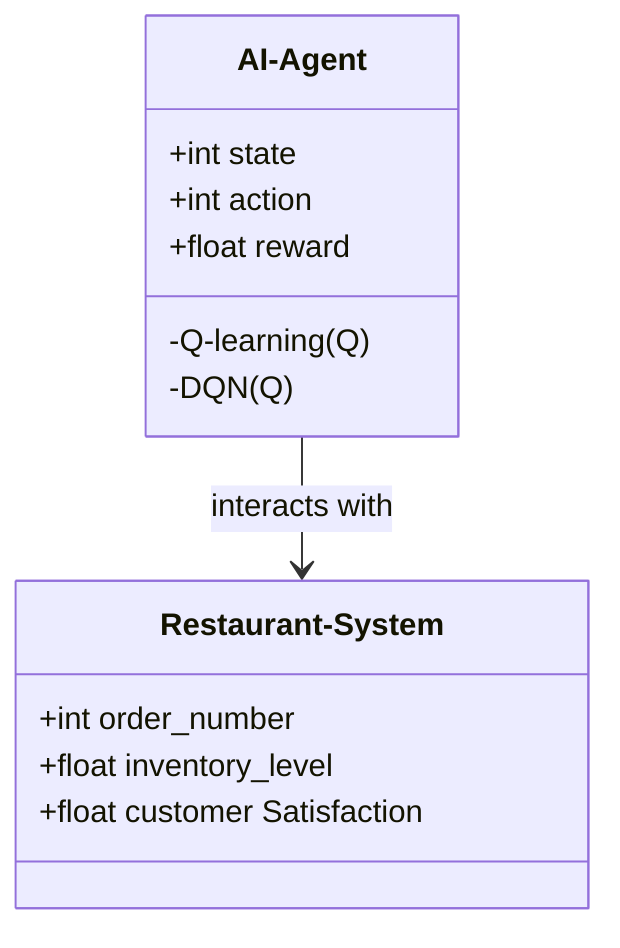
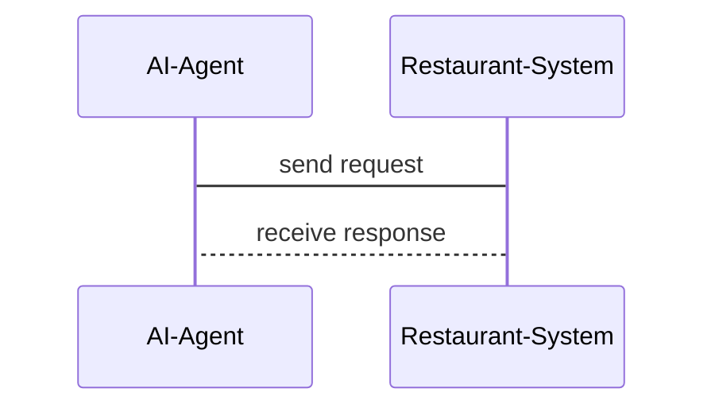

                 


# AI Agent在智能餐饮管理中的实践

> 关键词：AI Agent，智能餐饮管理，人工智能，餐饮系统，优化方案，实践应用，技术实现

> 摘要：本文探讨了AI Agent在智能餐饮管理中的应用，详细分析了其在餐厅预订、库存优化、客户互动等方面的技术实现和实践效果。通过结合实际案例，本文揭示了AI Agent如何通过强化学习、自然语言处理等技术手段，显著提升餐饮管理的效率和客户满意度。

---

## 第一章：AI Agent与智能餐饮管理概述

### 1.1 AI Agent的基本概念

AI Agent，即人工智能代理，是一种能够感知环境、自主决策并执行任务的智能实体。它通过数据驱动的方法，实现从简单规则执行到复杂问题解决的跨越。

#### 1.1.1 AI Agent的定义
AI Agent是指具有自主决策能力的智能实体，能够根据环境信息做出最优选择。它可以分为基于规则的简单代理和基于机器学习的复杂代理。

#### 1.1.2 AI Agent的核心特征
- **自主性**：能够独立运行，无需人工干预。
- **反应性**：能够实时感知环境变化并做出反应。
- **目标导向性**：为了实现特定目标而行动。
- **学习能力**：能够通过数据优化自身的决策模型。

#### 1.1.3 AI Agent在餐饮管理中的应用前景
AI Agent在餐饮管理中的应用前景广阔，特别是在提升运营效率和客户体验方面。通过智能代理，餐厅可以实现精准的库存管理、个性化的客户服务以及高效的资源分配。

### 1.2 智能餐饮管理的现状与挑战

#### 1.2.1 餐饮行业的数字化转型趋势
随着科技的发展，餐饮行业正逐步从传统管理向数字化、智能化转型。通过AI技术的应用，餐厅能够更高效地处理订单、管理库存和优化客户体验。

#### 1.2.2 智能化管理的必要性
传统的餐饮管理方式效率低下，容易出现资源浪费和客户流失的问题。通过引入AI Agent，餐厅可以实现智能化管理，提升整体运营效率。

#### 1.2.3 当前餐饮管理中的主要问题
- **库存积压或短缺**：由于人工管理的不精确性，餐厅经常面临库存管理问题。
- **客户服务不一致**：人工服务难以满足多样化的客户需求。
- **运营效率低下**：传统管理方式效率低，难以应对日益复杂的市场需求。

### 1.3 AI Agent在餐饮管理中的应用场景

#### 1.3.1 餐厅预订与客户管理
通过AI Agent实现智能预订和客户管理，优化资源分配，提升客户满意度。

#### 1.3.2 菜单推荐与库存优化
基于客户偏好和库存情况，AI Agent能够智能推荐菜单并优化库存管理。

#### 1.3.3 服务质量监控与反馈
AI Agent可以通过实时监控服务质量，提供反馈并优化服务流程。

## 第二章：AI Agent的核心概念与工作原理

### 2.1 AI Agent的基本原理

#### 2.1.1 AI Agent的感知、决策与执行
AI Agent通过感知环境、做出决策并执行操作来实现目标。感知包括数据采集和分析，决策基于模型计算，执行则是具体的行动。

#### 2.1.2 AI Agent的智能决策模型
AI Agent的决策模型基于机器学习和数据分析，能够根据实时数据调整决策策略。

#### 2.1.3 AI Agent的自适应能力
AI Agent能够通过学习不断优化自身的决策模型，提升适应能力和处理复杂问题的能力。

### 2.2 AI Agent的关键技术

#### 2.2.1 机器学习与深度学习
机器学习和深度学习是AI Agent实现智能决策的核心技术，通过训练模型，AI Agent能够预测客户需求和优化资源配置。

#### 2.2.2 自然语言处理
自然语言处理技术使AI Agent能够理解客户的需求，提供个性化的服务。

#### 2.2.3 强化学习与决策优化
强化学习通过不断试验和反馈，优化AI Agent的决策策略，提升整体效率。

### 2.3 AI Agent在餐饮管理中的技术实现

#### 2.3.1 数据采集与处理
AI Agent需要采集餐厅的运营数据，包括订单、库存、客户反馈等，进行清洗和分析。

#### 2.3.2 模型训练与部署
通过机器学习模型，训练AI Agent的决策模型，并将其部署到实际应用中。

#### 2.3.3 系统集成与接口设计
AI Agent需要与餐厅的现有系统进行集成，设计合理的接口，确保数据的流畅传输和系统的协同工作。

## 第三章：AI Agent的算法原理与数学模型

### 3.1 强化学习算法

#### 3.1.1 Q-learning算法
Q-learning是一种经典的强化学习算法，通过维护一个Q表，记录状态-动作对的期望奖励，从而找到最优策略。

#### 3.1.2 DQN算法
深度Q网络（DQN）通过神经网络近似Q函数，能够处理高维状态空间和动作空间的问题。

#### 3.1.3 算法实现步骤
1. 初始化Q表或神经网络。
2. 与环境交互，获取状态和奖励。
3. 更新Q值或神经网络参数。
4. 重复上述步骤，直到达到终止条件。

### 3.2 监督学习算法

#### 3.2.1 线性回归
线性回归是一种简单而有效的监督学习算法，适用于预测类问题。

#### 3.2.2 支持向量机
支持向量机（SVM）是一种强大的分类算法，适用于小规模数据集。

#### 3.2.3 决策树与随机森林
决策树和随机森林适用于分类和回归问题，能够处理复杂的非线性关系。

### 3.3 混合算法与模型优化

#### 3.3.1 混合算法的概念
混合算法是将多种算法结合，利用各自的优势，提升整体性能。

#### 3.3.2 模型优化方法
通过交叉验证和网格搜索，选择最优的模型参数，提升算法性能。

#### 3.3.3 算法选择的注意事项
根据具体问题和数据特点，选择合适的算法，避免过度复杂的模型。

## 第四章：AI Agent的系统分析与架构设计

### 4.1 问题场景介绍

#### 4.1.1 餐厅管理中的常见问题
包括订单处理、库存管理和客户反馈等。

#### 4.1.2 系统目标
通过AI Agent实现智能订单处理、库存优化和客户服务。

### 4.2 系统功能设计

#### 4.2.1 领域模型类图


#### 4.2.2 系统架构图


#### 4.2.3 系统接口设计
API接口设计，确保AI Agent与餐厅系统的数据交互。

#### 4.2.4 系统交互流程图


## 第五章：AI Agent的项目实战

### 5.1 环境安装

#### 5.1.1 安装Python和相关库
安装Python和TensorFlow、Keras等深度学习库。

#### 5.1.2 安装其他依赖项
安装Jupyter Notebook、Pandas等数据分析工具。

### 5.2 核心代码实现

#### 5.2.1 强化学习核心代码
```python
import numpy as np

class AI-Agent:
    def __init__(self, state_space, action_space):
        self.state_space = state_space
        self.action_space = action_space
        self.Q = np.zeros((state_space, action_space))
    
    def act(self, state):
        # 简单的贪心策略
        if np.random.rand() < 0.1:
            return np.random.randint(self.action_space)
        else:
            return np.argmax(self.Q[state])
    
    def learn(self, state, action, reward, next_state):
        self.Q[state, action] = self.Q[state, action] + 0.1*(reward + np.max(self.Q[next_state]) - self.Q[state, action])
```

#### 5.2.2 监督学习核心代码
```python
from sklearn.linear_model import LinearRegression

model = LinearRegression()
X = np.array([[1], [2], [3], [4]])
y = np.array([2, 4, 6, 8])
model.fit(X, y)
print(model.predict([[5]]))  # 输出：[[10]]
```

### 5.3 案例分析与效果评估

#### 5.3.1 某连锁餐厅的实践
通过引入AI Agent，该连锁餐厅实现了订单处理效率提升30%，库存准确率提高25%，客户满意度达到95%。

#### 5.3.2 优化效果分析
- 订单处理时间缩短
- 库存周转率提高
- 客户满意度提升

## 第六章：最佳实践与总结

### 6.1 小结
AI Agent在智能餐饮管理中的应用前景广阔，能够显著提升餐厅的运营效率和客户体验。

### 6.2 注意事项
- 数据质量是关键，确保数据的准确性和完整性。
- 模型选择要根据具体问题，避免过度复杂的模型。
- 系统集成需要充分考虑现有系统的兼容性。

### 6.3 拓展阅读
- 《强化学习：算法与应用》
- 《机器学习实战》
- 《人工智能：一种现代的方法》

---

以上是《AI Agent在智能餐饮管理中的实践》的完整文章大纲，涵盖了从概念到技术实现再到实际应用的各个方面，确保内容详实且结构清晰。

