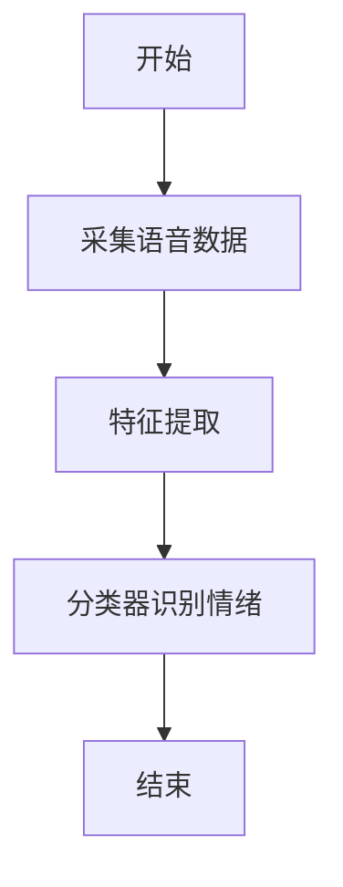
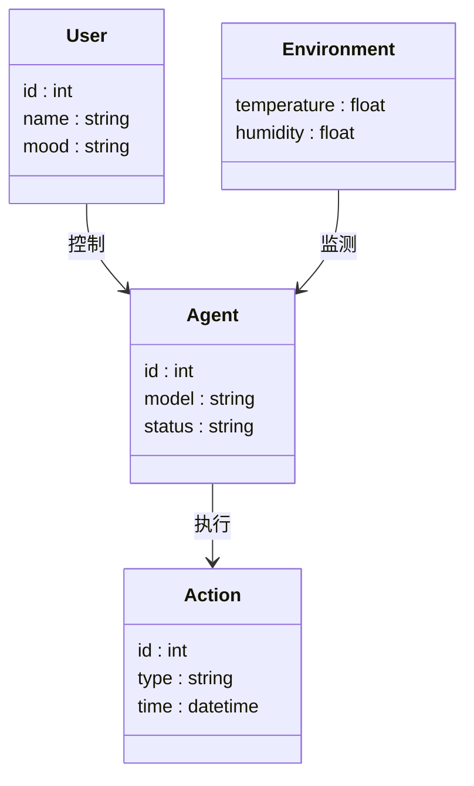

                 


# AI Agent在智能香薰机中的情绪调节

> 关键词：AI Agent, 智能香薰机, 情绪调节, 情感计算, 多模态交互

> 摘要：本文探讨了AI Agent在智能香薰机中的情绪调节应用，分析了其核心概念、算法原理、系统架构以及实际案例。通过多模态交互和情感计算，AI Agent能够根据用户情绪动态调整香薰机的输出，实现个性化情绪管理。

---

# 第1章: AI Agent与情绪调节概述

## 1.1 AI Agent的基本概念

### 1.1.1 AI Agent的定义与特点

AI Agent（人工智能代理）是指能够感知环境、做出决策并执行任务的智能实体。其特点包括：

- **自主性**：能够在没有外部干预的情况下独立运作。
- **反应性**：能够实时感知环境并做出反应。
- **目标导向性**：具备明确的目标导向，能够优化决策以达到目标。
- **学习能力**：能够通过数据学习和优化自身行为。

### 1.1.2 情绪调节的基本原理

情绪调节是指通过调整情绪状态来达到心理健康的过程。AI Agent通过分析用户的情绪状态，提供相应的干预措施，例如调节环境氛围、调整音乐节奏或推荐特定香薰精油。

### 1.1.3 AI Agent在智能设备中的作用

AI Agent在智能设备中充当决策中枢，负责接收输入信号、分析数据、生成决策并执行操作。在智能香薰机中，AI Agent负责分析用户的情绪状态，动态调整香薰机的输出参数。

---

## 1.2 智能香薰机的背景与应用

### 1.2.1 香薰技术的历史演变

香薰技术从古老的自然疗法发展到现代的科技应用，经历了从单一的芳香疗法到智能化调节的转变。

### 1.2.2 智能化香薰设备的出现

随着AI技术的进步，香薰机逐渐具备智能化功能，能够通过传感器和AI算法，实时感知环境和用户情绪，动态调整香薰输出。

### 1.2.3 情绪调节在智能香薰机中的应用前景

通过AI Agent实现情绪调节，智能香薰机能够为用户提供个性化的健康解决方案，帮助用户缓解压力、改善情绪。

---

# 第2章: AI Agent的核心概念与联系

## 2.1 AI Agent的核心概念

### 2.1.1 AI Agent的感知与决策机制

AI Agent通过多模态传感器（如麦克风、摄像头）感知用户情绪，结合情感计算算法进行决策。

### 2.1.2 情绪调节的核心要素

- **输入信号**：包括语音、面部表情、生理数据等。
- **情感计算**：通过机器学习模型分析情绪状态。
- **调节策略**：根据情绪状态调整香薰机的输出参数。

---

## 2.2 AI Agent与智能香薰机的实体关系

### 2.2.1 ER实体关系图

```mermaid
erDiagram
    user {
        +id : int
        +name : string
        +mood : string
    }
    environment {
        +temperature : float
        +humidity : float
    }
    agent {
        +id : int
        +model : string
        +status : string
    }
    action {
        +id : int
        +type : string
        +time : datetime
    }
    user -> agent : 控制
    environment -> agent : 监测
    agent -> action : 执行
```

### 2.2.2 实体交互流程

1. 用户与香薰机交互，触发情绪识别。
2. AI Agent分析情绪数据，生成调节策略。
3. 香薰机根据策略调整输出。

---

# 第3章: AI Agent的算法原理与数学模型

## 3.1 情绪识别算法

### 3.1.1 语音情绪识别流程



### 3.1.2 情感计算的数学模型

情绪识别可以通过机器学习模型实现，例如支持向量机（SVM）或深度学习模型（如LSTM）。

---

## 3.2 情绪调节算法

### 3.2.1 调节策略的数学模型

假设用户情绪为S，调节参数为P：

$$ P = f(S) $$

其中，f为调节函数，根据情绪状态S调整香薰机的输出参数P。

### 3.2.2 调节算法的优化方法

采用强化学习优化调节策略，通过奖励机制提升AI Agent的决策能力。

---

# 第4章: 智能香薰机的系统分析与架构设计

## 4.1 系统功能设计

### 4.1.1 功能模块划分

- **情绪识别模块**：负责采集和分析用户情绪数据。
- **智能调节模块**：根据情绪数据生成调节策略。
- **用户反馈模块**：收集用户反馈，优化系统性能。

### 4.1.2 领域模型类图



---

## 4.2 系统架构设计

### 4.2.1 系统架构图


---

# 第5章: 项目实战

## 5.1 环境安装

### 5.1.1 系统环境

- 操作系统：Linux/Windows/MacOS
- 开发工具：Python, TensorFlow, OpenCV

### 5.1.2 依赖库安装

```bash
pip install numpy tensorflow scikit-learn
```

---

## 5.2 核心实现

### 5.2.1 情绪识别代码

```python
import numpy as np
from sklearn.svm import SVC

# 示例数据
X = np.array([[1, 0], [0, 1], [2, 2]])
y = np.array(['happy', 'sad', 'neutral'])

# 训练模型
model = SVC()
model.fit(X, y)

# 预测
new_data = np.array([[1.5, 1.5]])
print(model.predict(new_data))
```

### 5.2.2 调节策略代码

```python
def regulate_mood(mood):
    if mood == 'happy':
        return 'energetic'  # 输出活力型香薰
    elif mood == 'sad':
        return 'calming'     # 输出放松型香薰
    else:
        return 'neutral'     # 输出中性香薰

print(regulate_mood('sad'))  # 输出: calming
```

---

## 5.3 实际案例分析

### 5.3.1 案例背景

用户在高压状态下使用智能香薰机，AI Agent通过语音识别用户情绪为“焦虑”。

### 5.3.2 系统响应

- 情绪识别：焦虑
- 调节策略：输出放松型香薰，降低环境亮度。

---

# 第6章: 总结与建议

## 6.1 总结

AI Agent在智能香薰机中的情绪调节应用，不仅提升了用户体验，还实现了个性化健康解决方案。

## 6.2 注意事项

- 数据隐私保护
- 系统稳定性保障
- 用户反馈机制的完善

## 6.3 拓展阅读

- 情感计算领域的最新研究
- 多模态交互技术的应用案例

---

通过本文的详细讲解，读者可以全面了解AI Agent在智能香薰机中的情绪调节技术，并为实际应用提供有价值的参考。

