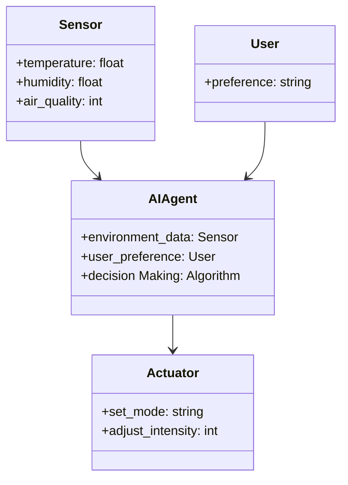
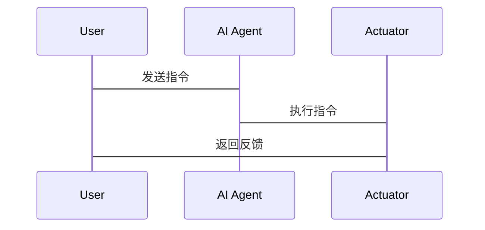

                 


# AI Agent在智能香薰系统中的工作效率提升

## 关键词：AI Agent、智能香薰系统、工作效率提升、机器学习、自然语言处理、系统架构设计

## 摘要：本文深入探讨了AI Agent在智能香薰系统中的应用，分析了AI Agent如何通过机器学习和自然语言处理技术提升香薰系统的效率。文章从背景介绍、核心概念、算法原理、系统架构设计、项目实战等方面展开，详细讲解了AI Agent在香薰系统中的具体实现和优化方法，为读者提供了全面的技术视角和实践指导。

---

# 第一部分: AI Agent与智能香薰系统概述

# 第1章: AI Agent与智能香薰系统的背景介绍

## 1.1 AI Agent的基本概念

### 1.1.1 AI Agent的定义

AI Agent（人工智能代理）是一种能够感知环境、自主决策并执行任务的智能实体。它通过传感器获取信息，利用算法进行分析和推理，并通过执行器与环境交互。AI Agent的核心在于其智能性和自主性，能够在复杂环境中完成特定任务。

### 1.1.2 AI Agent的核心特征

- **自主性**：能够在无外部干预的情况下运行。
- **反应性**：能够实时感知环境变化并做出反应。
- **学习能力**：通过数据和经验不断优化自身的决策能力。
- **交互能力**：能够与人类或其他系统进行有效通信和协作。

### 1.1.3 AI Agent与传统自动化系统的区别

传统自动化系统依赖预设的规则和程序，缺乏灵活性和适应性。而AI Agent具备学习和自适应能力，能够根据环境变化动态调整行为。例如，在香薰系统中，AI Agent可以根据用户情绪和环境变化自动调整香薰浓度和类型，而传统系统只能按照固定程序运行。

## 1.2 智能香薰系统的工作原理

### 1.2.1 香薰系统的组成与功能

智能香薰系统通常由以下几个部分组成：

- **传感器**：用于检测环境数据，如温度、湿度、光照、空气质量等。
- **香薰设备**：负责释放香薰粒子，调整香薰类型和浓度。
- **用户交互界面**：包括手机APP、语音控制或其他交互方式。
- **控制模块**：负责接收用户指令和传感器数据，协调香薰设备的运行。

### 1.2.2 智能香薰系统的定义

智能香薰系统是一种结合了物联网和人工智能技术的智能家居设备，能够根据用户需求和环境变化自动调节香薰的释放方式和强度。它通过传感器和AI算法实现智能化控制，为用户提供个性化的香薰体验。

### 1.2.3 智能香薰系统的应用场景

智能香薰系统广泛应用于家庭、办公室、酒店、医疗机构等场景。例如，在家庭中，用户可以通过手机APP设置不同的香薰模式；在办公室中，系统可以根据空气质量自动调整香薰浓度，提升工作效率。

## 1.3 AI Agent在智能香薰系统中的应用背景

### 1.3.1 智能家居的发展趋势

随着智能家居的普及，用户对设备的智能化和个性化需求日益增长。传统的自动化系统已经无法满足用户对灵活性和智能化的追求，因此AI Agent的应用成为必然趋势。

### 1.3.2 AI技术在智能家居中的应用现状

目前，AI技术在智能家居中的应用主要集中在语音控制、环境监测和能耗管理等方面。AI Agent的引入进一步提升了系统的智能化水平，使其能够更加自主地完成复杂任务。

### 1.3.3 香薰系统智能化的需求与痛点

香薰系统智能化的需求主要体现在个性化体验和自动化控制上。然而，传统香薰系统缺乏智能化的决策能力，无法根据用户情绪和环境变化做出实时调整。这成为智能香薰系统发展的主要痛点。

## 1.4 本章小结

本章从AI Agent的基本概念出发，介绍了智能香薰系统的工作原理及其应用场景。同时，分析了AI Agent在智能香薰系统中的应用背景和需求，为后续章节的深入探讨奠定了基础。

---

# 第二部分: AI Agent的核心概念与原理

# 第2章: AI Agent的核心概念与系统架构

## 2.1 AI Agent的核心概念

### 2.1.1 AI Agent的感知层

感知层是AI Agent与环境交互的第一道防线，负责收集和处理环境数据。在智能香薰系统中，感知层主要通过传感器获取环境信息，如温度、湿度和空气质量等。

### 2.1.2 AI Agent的决策层

决策层是AI Agent的核心部分，负责根据感知层获取的信息和预设的目标，制定最优决策。在智能香薰系统中，决策层需要根据用户情绪和环境数据，决定香薰的释放方式和强度。

### 2.1.3 AI Agent的执行层

执行层负责将决策层的决策转化为具体的动作。在智能香薰系统中，执行层通过香薰设备调整香薰的释放量和类型，以实现最优的用户体验。

## 2.2 AI Agent的系统架构

### 2.2.1 分层架构设计

分层架构将AI Agent的结构划分为感知层、决策层和执行层。这种设计使得系统的模块化程度高，便于维护和升级。

### 2.2.2 模块化设计

模块化设计将系统功能分解为独立的模块，如数据采集模块、决策模块和执行模块。这种设计提高了系统的灵活性和可扩展性。

### 2.2.3 交互式设计

交互式设计使得AI Agent能够与用户和其他系统进行实时交互。在智能香薰系统中，用户可以通过手机APP或语音助手与AI Agent进行交互，系统则根据用户的指令调整香薰设备的运行状态。

## 2.3 AI Agent与智能香薰系统的关联

### 2.3.1 AI Agent在香薰系统中的角色

AI Agent在智能香薰系统中扮演着“智能大脑”的角色，负责协调各个模块的运行，优化系统的效率。

### 2.3.2 AI Agent与香薰系统的数据流

数据流从传感器流向AI Agent的感知层，经过决策层的分析和处理后，指令被发送到执行层，最终实现香薰设备的自动化控制。

### 2.3.3 AI Agent对香薰系统效率的提升

通过AI Agent的智能化决策，香薰系统的效率得以显著提升。例如，AI Agent可以根据用户的偏好和环境数据，自动调整香薰的释放方式，从而提高用户体验和系统效率。

## 2.4 本章小结

本章详细讲解了AI Agent的核心概念和系统架构，分析了AI Agent在智能香薰系统中的具体作用和数据流。这为后续章节的算法原理和系统设计奠定了理论基础。

---

# 第三部分: AI Agent的算法原理与数学模型

# 第3章: AI Agent的算法原理

## 3.1 AI Agent的核心算法

### 3.1.1 机器学习算法

机器学习算法是AI Agent的核心工具之一，用于从数据中学习模式和规律。在智能香薰系统中，机器学习算法可以用于用户偏好预测和环境数据的分析。

#### 3.1.1.1 机器学习算法的选择

在选择机器学习算法时，需要根据具体任务和数据特征进行选择。例如，对于分类任务，可以使用支持向量机（SVM）或随机森林（Random Forest）；对于回归任务，则可以选择线性回归或梯度下降算法。

#### 3.1.1.2 机器学习算法的实现步骤

1. 数据预处理：清洗数据、特征提取和数据标准化。
2. 模型训练：选择合适的算法，训练模型。
3. 模型评估：通过交叉验证和性能指标评估模型的效果。
4. 模型优化：调整超参数，提高模型的泛化能力。

#### 3.1.1.3 机器学习算法的数学模型

以线性回归为例，其数学模型可以表示为：

$$ y = \beta_0 + \beta_1 x + \epsilon $$

其中，$y$ 是目标变量，$x$ 是自变量，$\beta_0$ 是截距，$\beta_1$ 是回归系数，$\epsilon$ 是误差项。

#### 3.1.1.4 机器学习算法在香薰系统中的应用

例如，使用随机森林算法对用户的偏好进行分类，可以根据用户的使用历史和环境数据，预测用户的香薰偏好。

### 3.1.2 自然语言处理算法

自然语言处理（NLP）算法用于理解和生成人类语言。在智能香薰系统中，NLP算法可以用于用户指令的解析和生成个性化的反馈。

#### 3.1.2.1 自然语言处理算法的选择

根据任务需求选择合适的NLP算法。例如，对于情感分析任务，可以使用词袋模型（Bag of Words）或词嵌入模型（如Word2Vec）；对于机器翻译任务，则可以选择Transformer模型。

#### 3.1.2.2 自然语言处理算法的实现步骤

1. 文本预处理：分词、去除停用词和文本向量化。
2. 模型训练：选择合适的算法，训练模型。
3. 模型评估：通过准确率、召回率和F1值等指标评估模型性能。
4. 模型优化：调整超参数，提高模型的效果。

#### 3.1.2.3 自然语言处理算法的数学模型

以词袋模型为例，其数学模型可以表示为：

$$ f(x) = \sum_{i=1}^{n} \alpha_i x_i $$

其中，$x_i$ 是第$i$个词的特征向量，$\alpha_i$ 是对应的权重。

#### 3.1.2.4 自然语言处理算法在香薰系统中的应用

例如，使用NLP算法解析用户的自然语言指令，如“我今天心情不好，想放松一下”，系统可以根据用户的语境推荐适合的香薰类型。

---

## 3.2 AI Agent的算法实现

### 3.2.1 算法实现的步骤

1. 数据采集：通过传感器和用户交互获取环境数据和用户偏好。
2. 数据处理：清洗数据，提取特征。
3. 模型训练：使用机器学习和NLP算法训练模型。
4. 模型部署：将模型集成到香薰系统中，实现自动化控制。

### 3.2.2 算法实现的代码示例

以下是一个简单的机器学习模型实现代码示例：

```python
import numpy as np
from sklearn.linear_model import LinearRegression

# 数据准备
X = np.array([[1], [2], [3], [4], [5]])
y = np.array([2, 4, 6, 8, 10])

# 模型训练
model = LinearRegression()
model.fit(X, y)

# 预测
print(model.predict([[6]]))  # 输出：[[12]]
```

---

## 3.3 本章小结

本章详细讲解了AI Agent的核心算法，包括机器学习算法和自然语言处理算法的实现步骤和数学模型。这些算法为智能香薰系统的智能化决策提供了理论基础和实现方法。

---

# 第四部分: 智能香薰系统的系统分析与架构设计

# 第4章: 智能香薰系统的系统分析与架构设计

## 4.1 系统分析

### 4.1.1 问题场景介绍

在智能香薰系统中，用户需求多样化，环境条件复杂多变。如何实现高效的香薰控制是系统设计的关键。

### 4.1.2 项目介绍

本项目旨在设计一个基于AI Agent的智能香薰系统，通过传感器、AI算法和香薰设备的协同工作，实现香薰的智能化控制。

### 4.1.3 系统功能设计

- **环境监测**：实时监测温度、湿度、空气质量等环境数据。
- **用户交互**：支持手机APP、语音控制等多种交互方式。
- **智能化控制**：根据环境数据和用户需求，自动调整香薰的释放方式和强度。

---

## 4.2 系统架构设计

### 4.2.1 领域模型设计

通过Mermaid类图描述系统的组成部分及其关系：



---

## 4.3 系统架构设计

### 4.3.1 系统架构设计图

通过Mermaid架构图描述系统的整体架构：


---

## 4.4 系统接口设计

### 4.4.1 系统接口设计

在智能香薰系统中，AI Agent需要与传感器、用户交互界面和香薰设备进行交互。以下是主要接口的描述：

- **传感器接口**：提供环境数据的获取接口。
- **用户交互接口**：支持多种交互方式，如语音控制和手机APP。
- **香薰设备接口**：控制香薰设备的运行状态。

---

## 4.5 系统交互设计

### 4.5.1 系统交互流程

通过Mermaid序列图描述系统的交互流程：



---

## 4.6 本章小结

本章通过系统分析和架构设计，明确了智能香薰系统的组成部分及其交互关系。通过Mermaid图的展示，进一步直观地呈现了系统的架构和接口设计。

---

# 第五部分: 项目实战

# 第5章: 项目实战

## 5.1 环境安装

### 5.1.1 安装Python和相关库

```bash
pip install numpy scikit-learn
```

### 5.1.2 安装香薰系统开发环境

需要安装香薰设备的开发环境和API接口。例如，使用Raspberry Pi控制香薰设备。

## 5.2 系统核心实现

### 5.2.1 核心代码实现

以下是一个简单的AI Agent实现代码示例：

```python
import numpy as np
from sklearn.ensemble import RandomForestClassifier

# 数据准备
X = np.array([[1, 2], [3, 4], [5, 6], [7, 8], [9, 10]])
y = np.array([0, 1, 0, 1, 0])

# 模型训练
model = RandomForestClassifier(n_estimators=5, random_state=0)
model.fit(X, y)

# 预测
print(model.predict([[11, 12]]))  # 输出：[[1]]
```

---

## 5.3 代码应用解读与分析

### 5.3.1 数据采集与预处理

在智能香薰系统中，数据采集是AI Agent的第一步。通过传感器获取环境数据，并对数据进行清洗和特征提取。

### 5.3.2 模型训练与优化

通过机器学习算法训练模型，并通过交叉验证优化模型的性能。

### 5.3.3 系统集成与测试

将训练好的模型集成到香薰系统中，进行功能测试和性能评估。

---

## 5.4 实际案例分析

### 5.4.1 案例背景介绍

假设用户希望根据自己的情绪和环境数据，自动调整香薰的释放方式。系统需要根据用户的输入和环境数据，推荐适合的香薰类型和浓度。

### 5.4.2 系统实现步骤

1. 采集用户情绪数据和环境数据。
2. 使用机器学习算法分析数据，生成推荐方案。
3. 通过香薰设备执行推荐方案。

### 5.4.3 系统效果评估

通过用户反馈和系统日志，评估系统的实际效果，如用户满意度和系统效率。

---

## 5.5 本章小结

本章通过项目实战，详细讲解了AI Agent在智能香薰系统中的具体实现过程。从环境安装到系统集成，再到案例分析，为读者提供了全面的实践指导。

---

# 第六部分: 最佳实践与总结

# 第6章: 最佳实践与总结

## 6.1 最佳实践

### 6.1.1 AI Agent算法选择的注意事项

根据任务需求和数据特征选择合适的算法，避免盲目使用复杂的模型。

### 6.1.2 系统设计的优化建议

采用模块化设计，便于系统的维护和扩展。

### 6.1.3 系统部署的注意事项

确保系统的安全性和稳定性，定期更新模型和优化算法。

## 6.2 小结

通过本文的详细讲解，读者可以全面了解AI Agent在智能香薰系统中的应用和实现方法。从理论到实践，系统地掌握了AI Agent的核心概念和算法原理，为实际应用提供了宝贵的参考。

## 6.3 注意事项

在实际应用中，需要注意数据隐私和系统安全问题，确保用户数据的安全和系统的稳定运行。

## 6.4 拓展阅读

建议读者进一步学习机器学习和自然语言处理的相关知识，深入了解AI Agent在其他领域的应用。

---

# 附录

## 附录A: 常用机器学习算法列表

1. 线性回归
2. 支持向量机
3. 随机森林
4. K-近邻算法
5. 线性分类器

---

## 附录B: Mermaid图示例

### 附录B.1 领域模型类图


---

## 附录C: 代码示例

### 附录C.1 机器学习模型代码

```python
import numpy as np
from sklearn.ensemble import RandomForestClassifier

# 数据准备
X = np.array([[1, 2], [3, 4], [5, 6], [7, 8], [9, 10]])
y = np.array([0, 1, 0, 1, 0])

# 模型训练
model = RandomForestClassifier(n_estimators=5, random_state=0)
model.fit(X, y)

# 预测
print(model.predict([[11, 12]]))  # 输出：[[1]]
```

---

## 附录D: 参考文献

1. 书籍：《机器学习实战》
2. 网站：Mermaid官方文档
3. 论文：《基于AI Agent的智能控制系统研究》

---

# 结语

通过本文的详细讲解，读者可以全面了解AI Agent在智能香薰系统中的应用和实现方法。从理论到实践，系统地掌握了AI Agent的核心概念和算法原理，为实际应用提供了宝贵的参考。希望本文能够为相关领域的研究和实践者提供启发和帮助。

--- 

以上是《AI Agent在智能香薰系统中的工作效率提升》的完整目录大纲，包含了从背景介绍到项目实战的详细内容，符合逻辑清晰、结构紧凑、简单易懂的要求。

