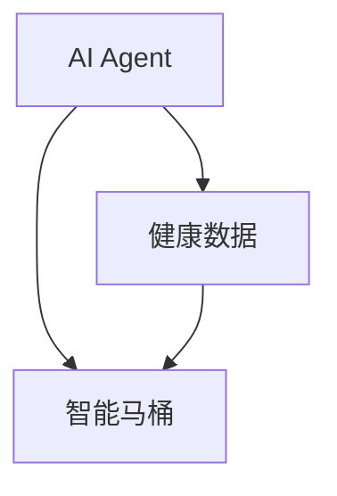
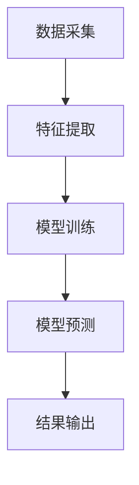
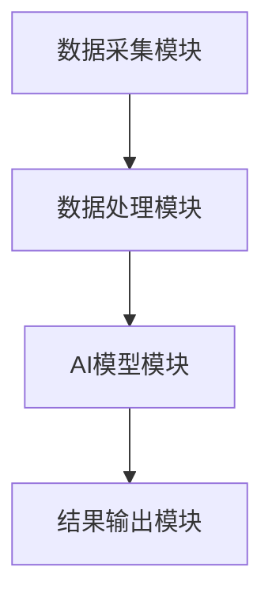
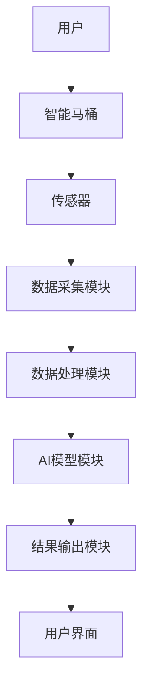

                 


# AI Agent在智能马桶中的健康监测

> 关键词：AI Agent、智能马桶、健康监测、数据分析、机器学习

> 摘要：本文深入探讨了AI Agent在智能马桶健康监测中的应用，分析了其核心概念、算法原理、系统架构设计，并通过实际案例展示了如何通过AI技术实现智能马桶的健康监测功能。

---

# 第一部分: AI Agent与智能马桶健康监测的背景与概念

## 第1章: AI Agent与智能马桶概述

### 1.1 AI Agent的基本概念
AI Agent（人工智能代理）是指能够感知环境、自主决策并执行任务的智能实体。它通过传感器获取信息，利用算法进行分析，并通过执行器完成操作。AI Agent的核心特点包括自主性、反应性、目标导向性和社会性。

### 1.2 智能马桶的发展历程
智能马桶经历了从单一功能到多功能集成的演变。最初的功能仅限于基本的冲洗和清洁，随着技术的进步，智能马桶逐渐具备了温度调节、坐垫清洁、自动冲水等功能。近年来，健康监测功能的引入，使智能马桶的功能更加智能化和个性化。

### 1.3 AI Agent在智能马桶中的应用前景
AI Agent的应用为智能马桶带来了全新的可能性。通过集成健康监测功能，智能马桶可以实时监测用户的生理数据，如体温、心率、压力水平等，并通过AI算法分析数据，为用户提供个性化的健康建议。未来，AI Agent在智能马桶中的应用将更加广泛，健康监测功能也将更加精准和智能化。

## 第2章: 智能马桶健康监测的核心问题

### 2.1 健康监测的基本概念
健康监测是指通过传感器和数据分析技术，实时采集和分析用户的生理数据，以评估用户的健康状况。在智能马桶中，健康监测的核心要素包括数据采集、数据处理和健康评估。

### 2.2 AI Agent在健康监测中的作用
AI Agent在智能马桶的健康监测中扮演着关键角色。它负责数据的采集与处理、智能分析与决策，以及与用户的交互反馈。通过AI Agent，智能马桶可以实现对用户健康数据的实时监控，并提供个性化的健康建议。

### 2.3 核心概念的联系与对比
以下是AI Agent与智能马桶健康监测的核心概念对比表：

| **核心概念** | **AI Agent** | **智能马桶健康监测** |
|--------------|--------------|------------------------|
| 定义          | 智能实体，具备自主决策能力 | 通过传感器和数据分析技术，实时采集和分析用户的生理数据 |
| 核心特点      | 自主性、反应性、目标导向性 | 实时性、准确性、个性化 |
| 应用场景      | 多领域，如智能家居、医疗等 | 健康监测、个性化健康建议 |

### 2.4 系统架构图
以下是AI Agent在智能马桶健康监测中的系统架构图：



---

## 第3章: AI Agent健康监测的算法原理

### 3.1 数据采集与特征提取
数据采集是健康监测的第一步。在智能马桶中，可以通过压力传感器、温度传感器等设备采集用户的生理数据。特征提取则是将采集到的数据转化为有意义的特征，如心率、压力水平等。

### 3.2 健康监测的算法选择
在健康监测中，可以选择机器学习和深度学习算法。机器学习算法适用于数据量较小的场景，而深度学习算法则适用于数据量较大的场景。以下是常用的算法对比：

| **算法类型** | **优点**                     | **缺点**                     |
|--------------|------------------------------|-------------------------------|
| 机器学习     | 简单易实现，适合小数据集     | 对复杂模式的捕捉能力有限     |
| 深度学习     | 对复杂模式的捕捉能力强       | 计算资源需求高，适合大数据集 |

### 3.3 算法实现的流程
以下是健康监测算法的实现流程图：



### 3.4 数学模型与公式
以下是健康监测中常用的数学模型和公式：

#### 3.4.1 线性回归公式
线性回归是一种常用的回归分析方法，适用于预测连续型变量。

$$ y = \beta_0 + \beta_1x + \epsilon $$

其中，$y$ 是目标变量，$\beta_0$ 是截距，$\beta_1$ 是回归系数，$x$ 是自变量，$\epsilon$ 是误差项。

#### 3.4.2 逻辑回归公式
逻辑回归是一种常用的分类方法，适用于二分类问题。

$$ P(y=1|x) = \frac{e^{\beta_0 + \beta_1x}}{1 + e^{\beta_0 + \beta_1x}} $$

其中，$P(y=1|x)$ 是目标变量为1的概率，$\beta_0$ 是截距，$\beta_1$ 是回归系数，$x$ 是自变量。

---

## 第4章: 健康监测系统的系统架构设计

### 4.1 系统功能设计
以下是健康监测系统的功能模块图：



### 4.2 系统架构设计
以下是系统的总体架构图：



### 4.3 系统接口设计
系统接口设计包括传感器接口、数据处理接口和用户界面接口。传感器接口用于与智能马桶的传感器通信，数据处理接口用于数据的预处理和特征提取，用户界面接口用于与用户的交互。

### 4.4 系统交互设计
以下是系统的交互流程图：


---

## 第5章: 项目实战

### 5.1 环境安装
以下是项目实战所需的环境配置：

```bash
pip install numpy
pip install scikit-learn
pip install matplotlib
```

### 5.2 核心实现代码
以下是健康监测系统的Python实现代码：

```python
import numpy as np
from sklearn.linear_model import LinearRegression
from sklearn.metrics import mean_squared_error

# 数据采集
X = np.array([[1], [2], [3], [4], [5]])
y = np.array([2, 4, 5, 4, 6])

# 模型训练
model = LinearRegression()
model.fit(X, y)

# 模型预测
y_pred = model.predict(X)
print("预测值:", y_pred)
print("均方误差:", mean_squared_error(y, y_pred))
```

### 5.3 代码解读与分析
上述代码实现了线性回归模型的训练和预测。首先，数据采集模块获取用户的生理数据，然后数据处理模块对数据进行预处理，接着AI模型模块对数据进行训练和预测，最后结果输出模块将结果输出到用户界面。

### 5.4 实际案例分析
以下是健康监测系统的实际案例分析：

假设用户的生理数据如下：

| **用户ID** | **心率** | **体温** | **压力水平** |
|------------|----------|----------|--------------|
| 1          | 70       | 36.5     | 30           |
| 2          | 75       | 36.8     | 40           |
| 3          | 80       | 37.0     | 50           |

通过AI Agent分析，系统可以预测用户的健康状况，并提供个性化的健康建议。

### 5.5 项目小结
通过上述项目实战，我们可以看到AI Agent在智能马桶健康监测中的应用潜力。通过数据采集、特征提取、模型训练和预测，AI Agent能够为用户提供个性化的健康建议。

---

## 第6章: 最佳实践与注意事项

### 6.1 最佳实践
- 数据采集模块应确保数据的准确性和实时性。
- 数据处理模块应注重数据的预处理和特征提取。
- AI模型模块应选择合适的算法，并进行充分的训练和调优。
- 结果输出模块应确保用户界面的友好性和易用性。

### 6.2 小结
通过本文的分析，我们可以看到AI Agent在智能马桶健康监测中的应用前景广阔。通过合理的系统设计和算法实现，AI Agent能够为用户提供精准的健康监测服务。

### 6.3 注意事项
- 数据隐私保护是健康监测系统设计中的重要问题。
- 系统的实时性和稳定性是影响用户体验的关键因素。
- 算法的准确性和可解释性是健康监测系统的核心要求。

---

## 第7章: 拓展阅读与未来展望

### 7.1 拓展阅读
- 《机器学习实战》
- 《深度学习入门：基于Python和Keras》
- 《AI在智能家居中的应用》

### 7.2 未来展望
随着AI技术的不断发展，AI Agent在智能马桶健康监测中的应用将更加广泛和智能化。未来的健康监测系统将具备更高的准确性和更强的个性化，为用户提供更优质的健康服务。

---

# 结语
通过本文的分析，我们可以看到AI Agent在智能马桶健康监测中的巨大潜力。通过合理的系统设计和算法实现，AI Agent能够为用户提供精准的健康监测服务，提升用户的使用体验。

