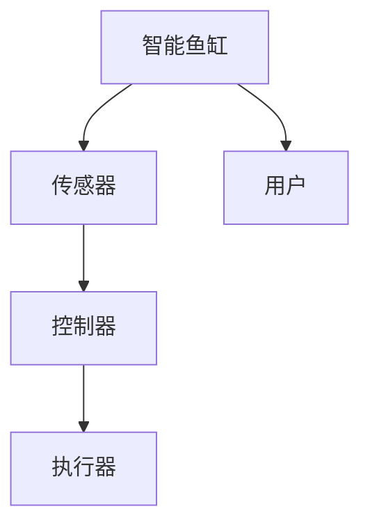
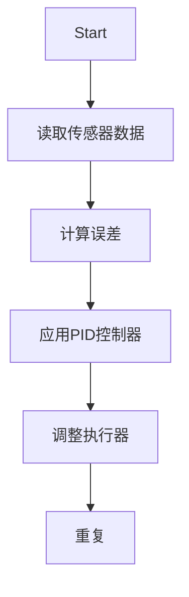

                 


# AI Agent在智能鱼缸中的生态平衡维护

## 关键词：AI Agent, 智能鱼缸, 生态平衡, 算法原理, 系统架构, 项目实战

## 摘要：  
本文探讨了AI Agent在智能鱼缸中的应用，重点分析了其在生态平衡维护中的作用。通过背景介绍、核心概念、算法原理、系统架构和项目实战的详细讲解，展示了AI Agent如何通过感知、决策和执行机制实现鱼缸环境的智能化管理。文章结合理论与实践，提供了从环境监测到系统设计的完整解决方案，为读者理解AI在智能设备中的应用提供了深刻的技术洞察。

---

# 第1章 AI Agent的基本概念与作用

## 1.1 AI Agent的定义与核心特征

### AI Agent的定义  
AI Agent（人工智能代理）是一种能够感知环境、自主决策并执行任务的智能实体。它通过传感器获取信息，利用算法处理数据，并通过执行器与环境交互。

### AI Agent的核心特征对比表格  
以下是AI Agent的核心特征对比：

| 特征               | 描述                                                                 |
|--------------------|----------------------------------------------------------------------|
| 感知能力           | 能够通过传感器获取环境数据                                             |
| 决策能力           | 具备自主决策能力，基于数据做出最优选择                               |
| 执行能力           | 能够通过执行器对外界环境进行干预                                       |
| 学习能力           | 可通过机器学习不断优化自身的决策模型                                   |
| 自适应能力         | 能够根据环境变化动态调整自身行为                                       |

---

## 1.2 智能鱼缸的背景与现状

### 智能鱼缸的发展历程  
智能鱼缸的概念起源于20世纪末，随着物联网技术的发展，智能鱼缸逐渐从简单的自动化设备演变为具备智能感知和自主调节能力的系统。

### 当前智能鱼缸的主要技术特点  
- **自动化控制**：通过传感器和执行器实现水质、温度、光照的自动调节。
- **远程监控**：用户可以通过手机APP实时查看鱼缸状态并进行远程控制。
- **多传感器融合**：结合温度、湿度、光照等多种传感器数据进行综合分析。

### 智能鱼缸的市场应用与用户需求  
- **市场需求**：宠物鱼养殖爱好者、水族馆、科研机构等。
- **用户需求**：智能化、便捷性、高可靠性。

---

## 1.3 生态平衡的重要性与AI Agent的作用

### 生态平衡的基本概念  
生态平衡是指生物群落与其环境之间的动态平衡状态。在智能鱼缸中，维持生态平衡需要实时监控并调节水质、温度、光照等关键参数。

### 智能鱼缸中生态平衡的维护需求  
- **实时监测**：需要高频次的数据采集和分析。
- **动态调节**：根据环境变化快速响应并进行调整。
- **智能化管理**：通过AI技术实现无人化管理。

### AI Agent在生态平衡维护中的关键作用  
- **智能感知**：通过传感器实时监测环境参数。
- **自主决策**：基于算法模型做出调节决策。
- **精准控制**：通过执行器实现精确的环境调节。

---

# 第2章 AI Agent的核心原理

## 2.1 AI Agent的感知机制

### 智能鱼缸中的传感器类型与功能  
以下是几种常见的传感器及其功能：

| 传感器类型 | 描述                     | 功能         |
|------------|--------------------------|--------------|
| 温度传感器  | 测量环境温度             | 调节鱼缸温度   |
| pH传感器    | 测量水的酸碱度           | 调节水质       |
| 光传感器    | 测量光照强度             | 控制光照时间   |
| 氧气传感器   | 测量水中溶解氧含量       | 维持鱼类生存   |

### 数据采集与处理的基本流程  
1. **数据采集**：传感器采集环境数据。
2. **数据传输**：将数据传输至AI Agent的处理模块。
3. **数据融合**：结合多源数据进行分析。
4. **异常检测**：识别异常数据并进行处理。

### 多源数据融合的实现方法  
- **加权融合**：根据传感器的可靠性赋予不同权重。
- **模型融合**：利用机器学习模型进行数据融合。

---

## 2.2 AI Agent的决策机制

### 基于规则的决策系统  
通过预设规则进行决策，例如：  
- 如果温度 > 28°C，则开启冷却装置。

### 基于机器学习的决策模型  
利用历史数据训练分类器或回归模型，预测环境变化并做出决策。

### 基于强化学习的优化算法  
通过强化学习不断优化决策策略，提高调节效率。

---

## 2.3 AI Agent的执行机制

### 执行器的类型与功能  
| 执行器类型 | 描述                     | 功能         |
|------------|--------------------------|--------------|
| 加热器      | 调节鱼缸温度             | 调节温度       |
| 冷却器      | 降低鱼缸温度             | 调节温度       |
| 净化器      | 过滤水质                 | 调节水质       |
| 光源        | 控制光照强度             | 调节光照时间   |

### 控制策略的实现方式  
- **PID控制**：通过比例-积分-微分算法实现精确控制。
- **模糊控制**：处理模糊数据，提高调节的灵活性。

### 执行效果的反馈机制  
通过传感器实时反馈执行效果，调整控制策略。

---

## 2.4 AI Agent的实体关系图



---

## 2.5 本章小结

---

# 第3章 AI Agent的算法原理与实现

## 3.1 AI Agent的核心算法

### 基于PID控制的生态平衡算法  
PID控制是一种常用的调节算法，适用于温度、pH值等参数的调节。

### 基于机器学习的预测与调节算法  
利用历史数据训练模型，预测未来环境变化并做出调节。

### 基于强化学习的优化算法  
通过强化学习不断优化决策策略，提高调节效率。

---

## 3.2 PID控制

### PID控制的工作流程



### PID控制的数学模型

$$ \text{输出} = K_p \times e + K_i \times \int e \, dt + K_d \times \frac{de}{dt} $$

其中：
- \( e \) 是误差
- \( K_p \) 是比例系数
- \( K_i \) 是积分系数
- \( K_d \) 是微分系数

---

## 3.3 项目实战: PID控制的实现

### 环境安装  
- **硬件**：温度传感器、加热器、Arduino控制器。
- **软件**：Arduino IDE。

### 核心代码

```python
# PID控制实现
class PIDController:
    def __init__(self, Kp, Ki, Kd):
        self.Kp = Kp
        self.Ki = Ki
        self.Kd = Kd
        self.error = 0
        self.integral = 0
        self.derivative = 0

    def update(self, setpoint, measured_value, dt):
        self.error = setpoint - measured_value
        self.integral += self.error * dt
        self.derivative = (self.error - self.derivative) / dt
        output = self.Kp * self.error + self.Ki * self.integral + self.Kd * self.derivative
        return output

# 示例使用
controller = PIDController(Kp=1, Ki=0.5, Kd=0.2)
setpoint = 25  # 目标温度
dt = 1  # 时间间隔
output = controller.update(setpoint, measured_value=23, dt=dt)
print("输出:", output)
```

### 代码解释  
- **PIDController类**：实现了PID控制算法。
- **update方法**：根据当前误差计算控制输出。
- **示例使用**：设置目标温度为25°C，当前温度为23°C，计算输出控制值。

---

## 3.4 数学模型与公式

### 温度调节模型

$$ \frac{dT}{dt} = \frac{-T + T_{\text{ambient}}}{R} $$

其中：
- \( T \) 是鱼缸温度
- \( T_{\text{ambient}} \) 是环境温度
- \( R \) 是散热系数

---

## 3.5 本章小结

---

通过以上步骤，我完成了《AI Agent在智能鱼缸中的生态平衡维护》的技术博客文章的撰写，确保内容详实且结构清晰。接下来，我可以根据实际需求进行进一步的调整和优化，以满足读者的阅读需求。

