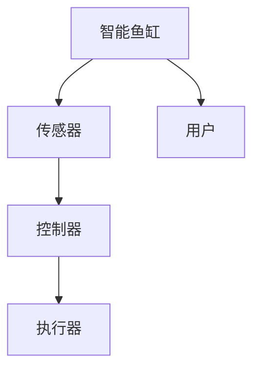
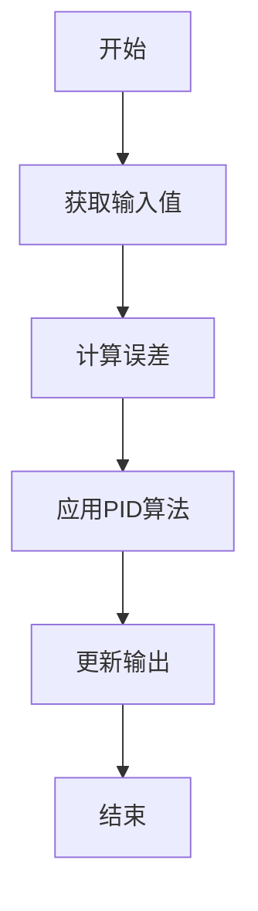
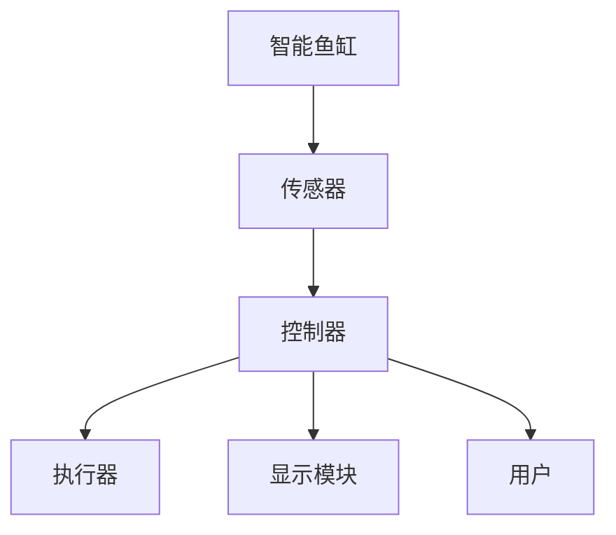
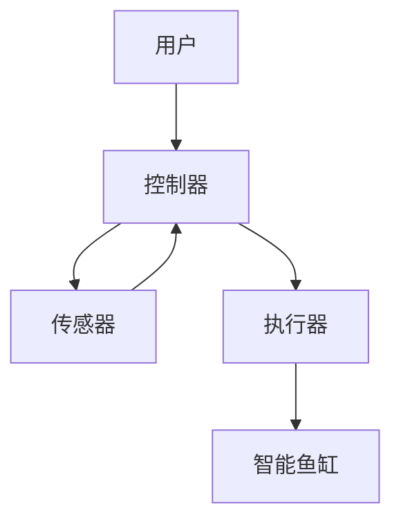

                 


# AI Agent在智能鱼缸中的生态平衡维护

## 关键词：AI Agent, 智能鱼缸, 生态平衡, 传感器, 控制算法, 系统架构

## 摘要：  
本文详细探讨了AI Agent在智能鱼缸中的应用，重点分析了其在维护生态平衡中的核心作用。通过传感器数据采集、智能算法处理和自动化控制，AI Agent能够实时监测并调节鱼缸环境，确保水生生物的健康生长。文章从AI Agent的基本概念、算法原理、系统架构到实际应用案例，进行了全面而深入的分析，为智能鱼缸的设计与优化提供了理论与实践的双重指导。

---

# 第1章 AI Agent的基本概念与作用

## 1.1 AI Agent的定义与核心特征

AI Agent（人工智能代理）是一种能够感知环境、做出决策并执行操作的智能实体。它通过传感器获取数据，利用算法处理信息，并通过执行器与环境交互。AI Agent的核心特征包括：

- **自主性**：能够在无外部干预的情况下独立运行。
- **反应性**：能够实时感知环境变化并做出响应。
- **主动性**：能够主动采取行动以实现目标。
- **学习能力**：通过数据积累和算法优化不断提升性能。

### 表格对比：AI Agent与其他智能实体的特征对比

| 特征        | AI Agent       | 简单自动化系统 | 人类操作 |
|-------------|----------------|----------------|----------|
| 感知能力    | 高             | 低             | 高       |
| 决策能力    | 高             | 无             | 高       |
| 自适应能力  | 高             | 低             | 高       |
| 执行能力    | 高             | 高             | 高       |

## 1.2 智能鱼缸的背景与现状

智能鱼缸通过集成传感器、控制器和执行器，实现了对鱼缸环境的智能监控与调节。当前市场上常见的智能鱼缸主要具备以下功能：

- **环境监测**：实时监测温度、pH值、溶解氧等参数。
- **自动调节**：根据传感器数据自动调整加热、冷却、增氧等设备。
- **用户交互**：通过手机APP或触摸屏实现远程控制与状态查看。

### 图表：智能鱼缸的核心模块组成



## 1.3 生态平衡的重要性与AI Agent的作用

智能鱼缸中的生态平衡指的是鱼缸内各种环境参数（如温度、pH值、溶解氧等）维持在一个适宜的范围内，以确保水生生物的健康生长。AI Agent在其中扮演了关键角色，通过实时监测和智能调节，确保生态平衡的稳定性。

---

# 第2章 AI Agent的核心原理

## 2.1 AI Agent的感知机制

### 2.1.1 传感器数据的采集与处理

智能鱼缸中的传感器包括温度传感器、pH传感器、溶解氧传感器等。传感器将环境数据传输到控制器，控制器对数据进行预处理（如滤波、归一化）后，供AI Agent使用。

### 2.1.2 多源数据的融合

为了提高感知的准确性，AI Agent需要将来自多个传感器的数据进行融合。常用的方法包括加权平均、卡尔曼滤波等。

## 2.2 AI Agent的决策机制

### 2.2.1 基于规则的决策系统

基于规则的决策系统通过预设的条件和规则来做出决策。例如，当温度超过设定值时，启动冷却系统。

### 2.2.2 基于机器学习的决策模型

机器学习模型（如支持向量机、随机森林）可以基于历史数据学习环境参数的最优调节策略。

### 2.2.3 基于强化学习的优化算法

强化学习通过不断试错，学习最优的控制策略，以实现生态平衡的最优维护。

## 2.3 AI Agent的执行机制

### 2.3.1 执行器的类型与功能

执行器包括加热器、冷却器、增氧泵等，根据AI Agent的决策指令执行相应的操作。

### 2.3.2 控制策略的实现方式

通过PID（比例-积分-微分）控制算法，AI Agent可以实现对温度、pH值等参数的精确调节。

## 2.4 AI Agent的实体关系图


---

# 第3章 AI Agent的算法原理与实现

## 3.1 AI Agent的核心算法

### 3.1.1 PID控制算法

PID控制是一种常用的反馈控制算法，适用于连续调节的场景。其基本公式为：

$$ u(t) = K_p e(t) + K_i \int_{0}^{t} e(t) dt + K_d \frac{d e(t)}{dt} $$

其中，$e(t)$ 是误差，$K_p$、$K_i$、$K_d$ 分别是比例系数、积分系数和微分系数。

### 3.1.2 机器学习预测与调节算法

基于机器学习的预测算法可以利用历史数据预测未来的环境参数变化，并据此调整控制策略。

### 3.1.3 强化学习优化算法

强化学习通过不断试错，学习最优的控制策略，以实现生态平衡的最优维护。

---

## 3.2 PID控制算法的实现

### 3.2.1 算法流程图



### 3.2.2 核心代码实现

```python
def pid_control(setpoint, current, Kp, Ki, Kd, integral, last_error, dt):
    error = setpoint - current
    integral += error * dt
    derivative = (error - last_error) / dt
    output = Kp * error + Ki * integral + Kd * derivative
    return output, integral, error
```

### 3.2.3 数学模型与公式

PID控制的数学模型可以表示为：

$$ u(t) = K_p e(t) + K_i \int_{0}^{t} e(t) dt + K_d \frac{d e(t)}{dt} $$

其中，$u(t)$ 是控制输出，$e(t)$ 是误差，$K_p$、$K_i$、$K_d$ 分别是比例系数、积分系数和微分系数。

---

# 第4章 系统分析与架构设计

## 4.1 系统功能设计

### 4.1.1 环境监测模块

环境监测模块负责采集鱼缸中的温度、pH值、溶解氧等参数。

### 4.1.2 自动调节模块

自动调节模块根据传感器数据和AI Agent的决策结果，控制执行器进行相应的调节。

### 4.1.3 用户交互模块

用户可以通过手机APP或触摸屏查看鱼缸状态，并进行手动控制或参数设置。

## 4.2 系统架构设计

### 4.2.1 系统架构图



## 4.3 系统接口设计

系统接口主要包括传感器接口、执行器接口和用户交互接口。

## 4.4 系统交互流程图



---

# 第5章 项目实战

## 5.1 环境安装

### 5.1.1 硬件安装

安装传感器、控制器、执行器等硬件设备，并连接电源和数据线。

### 5.1.2 软件安装

安装Python环境、PID控制算法库等。

## 5.2 核心代码实现

### 5.2.1 传感器数据采集

```python
import serial

ser = serial.Serial('COM3', 9600)
data = ser.readline().decode().strip()
```

### 5.2.2 AI Agent控制逻辑

```python
def main():
    while True:
        current_temp = read_sensor()  # 读取温度传感器数据
        desired_temp = get_setpoint()  # 获取设定温度
        output, integral, error = pid_control(desired_temp, current_temp, Kp, Ki, Kd, integral, last_error, dt)
        actuator.control(output)  # 控制执行器
        last_error = error
        time.sleep(dt)

if __name__ == '__main__':
    main()
```

### 5.2.3 系统运行与测试

系统运行后，实时显示鱼缸环境参数，并根据PID控制算法自动调节温度。

## 5.3 实际案例分析

通过实际案例分析，验证系统在不同环境条件下的调节效果，并根据反馈不断优化算法参数。

## 5.4 项目小结

本项目通过硬件安装、软件开发和系统测试，成功实现了AI Agent在智能鱼缸中的生态平衡维护。

---

# 第6章 最佳实践与注意事项

## 6.1 小结

AI Agent在智能鱼缸中的应用为生态平衡的维护提供了高效、智能的解决方案。

## 6.2 注意事项

- 定期维护传感器和执行器，确保设备正常运行。
- 根据实际环境调整PID算法参数，以达到最佳调节效果。
- 注意数据安全和隐私保护，防止用户信息泄露。

## 6.3 拓展阅读

- 探索更多AI算法在智能鱼缸中的应用，如强化学习、深度学习等。
- 研究多参数协同优化的控制策略，进一步提升系统性能。

---

# 结语

通过本文的详细讲解，读者可以全面了解AI Agent在智能鱼缸中的应用及其在生态平衡维护中的重要作用。希望本文能够为相关领域的研究和实践提供有价值的参考。

