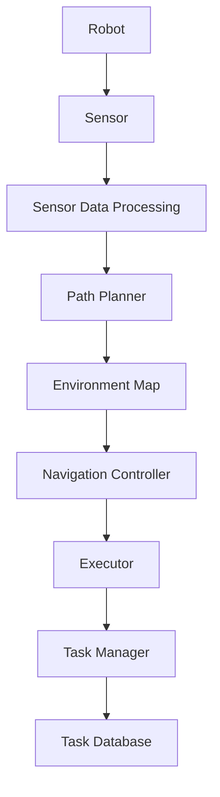

                 


# AI Agent在机器人控制中的应用：自主导航与任务执行

## 关键词：
AI Agent, 机器人控制, 自主导航, 任务执行, 路径规划, 环境感知, 多目标优化

## 摘要：
本文探讨AI Agent在机器人控制中的应用，特别是自主导航与任务执行的核心技术。通过分析AI Agent的基本原理、算法原理、系统架构设计以及项目实战，详细阐述其在机器人控制中的应用，帮助读者理解如何利用AI技术实现机器人自主导航与任务执行。

---

# 第一部分: AI Agent在机器人控制中的应用概述

## 第1章: AI Agent与机器人控制的背景介绍

### 1.1 问题背景
#### 1.1.1 机器人控制的挑战
机器人在复杂环境中导航和执行任务面临诸多挑战，如动态障碍物、环境不确定性以及多目标协调等问题。

#### 1.1.2 AI Agent在机器人控制中的作用
AI Agent通过感知环境、推理决策和自主行动，能够有效解决机器人在复杂环境中的控制问题。

#### 1.1.3 自主导航与任务执行的核心问题
- 环境感知与建模
- 路径规划与避障
- 多目标优化与协调

### 1.2 问题描述
#### 1.2.1 自主导航的定义与目标
自主导航指机器人在未知或部分已知环境中，通过自身传感器实现定位、建模和路径规划。

#### 1.2.2 任务执行的定义与目标
任务执行指机器人根据任务要求，自主完成特定目标，如物品搬运、环境监测等。

#### 1.2.3 机器人控制中的问题解决路径
通过AI Agent技术，实现感知-决策-执行的闭环控制。

### 1.3 问题解决
#### 1.3.1 AI Agent在自主导航中的解决方案
- 基于SLAM技术的环境建模
- 多传感器融合的环境感知
- 动态路径规划算法

#### 1.3.2 AI Agent在任务执行中的解决方案
- 基于强化学习的任务决策
- 多目标优化的任务调度
- 人机协作的任务分配

#### 1.3.3 多目标优化与协调控制
- 多目标优化算法
- 协调控制策略
- 跨Agent通信与协作

### 1.4 边界与外延
#### 1.4.1 自主导航的边界条件
- 环境静态性
- 传感器精度
- 计算资源限制

#### 1.4.2 任务执行的边界条件
- 任务复杂度
- 时间约束
- 资源约束

#### 1.4.3 机器人控制的外延领域
- 人机交互
- 云计算与边缘计算
- 群智能控制

### 1.5 概念结构与核心要素
#### 1.5.1 AI Agent的核心要素
- 知识表示
- 感知与推理
- 行为决策

#### 1.5.2 自主导航的关键要素
- 传感器
- 定位与建模
- 路径规划

#### 1.5.3 任务执行的关键要素
- 任务分解
- 资源分配
- 执行监控

---

# 第二部分: AI Agent的核心概念与联系

## 第2章: AI Agent的基本原理

### 2.1 核心概念原理
#### 2.1.1 AI Agent的定义与分类
AI Agent是一种具有感知环境、自主决策和行动能力的智能体，可分为简单反射Agent和基于模型的反射Agent。

#### 2.1.2 知识表示与推理机制
知识表示包括状态表示和动作表示，推理机制通过逻辑推理和概率推理实现决策。

#### 2.1.3 行为决策与执行机制
基于推理结果，AI Agent通过规划算法生成动作序列，并通过执行器完成任务。

### 2.2 核心概念对比表
| 概念 | 定义 | 特性 | 示例 |
|------|------|------|------|
| AI Agent | 具有感知和决策能力的智能体 | 自主性、反应性、学习性 | 机器人控制 |
| 自主导航 | 基于环境感知的自主移动 | 实时性、动态性、鲁棒性 | 服务机器人 |
| 任务执行 | 根据任务要求完成目标 | 多目标性、协作性、可扩展性 | 智能仓储 |

### 2.3 ER实体关系图
```mermaid
erDiagram
    class Robot {
        id
        state
        position
    }
    class Environment {
        id
        map
        obstacles
    }
    class Task {
        id
        goal
        constraints
    }
    class Agent {
        id
        knowledge
        plan
    }
    Robot o-|1..n| Task
    Robot o-|1..n| Environment
    Agent o-|1| Robot
```

---

# 第三部分: AI Agent的算法原理

## 第3章: 算法原理与实现

### 3.1 Dijkstra算法原理
Dijkstra算法用于找到图中节点到目标节点的最短路径。

#### 3.1.1 算法步骤
1. 初始化起点的优先队列。
2. 取出队列中距离最短的节点，标记为已访问。
3. 更新相邻节点的最短距离。
4. 重复直到队列为空。

#### 3.1.2 算法公式
$$d[v] = \min(d[v], d[u] + w(u, v))$$

#### 3.1.3 代码实现
```python
import heapq

def dijkstra(graph, start, goal):
    heap = []
    heapq.heappush(heap, (0, start))
    visited = {start: 0}
    
    while heap:
        current_dist, current_node = heapq.heappop(heap)
        if current_node == goal:
            break
        if visited[current_node] < current_dist:
            continue
        for neighbor, weight in graph[current_node].items():
            distance = current_dist + weight
            if distance < visited.get(neighbor, float('inf')):
                visited[neighbor] = distance
                heapq.heappush(heap, (distance, neighbor))
    return visited[goal]
```

### 3.2 A*算法原理
A*算法在Dijkstra的基础上加入启发式函数，优先探索最有希望的节点。

#### 3.2.1 算法公式
$$f(n) = g(n) + h(n)$$
其中，$g(n)$为从起点到当前点的已知成本，$h(n)$为从当前点到目标点的估算成本。

#### 3.2.2 代码实现
```python
import heapq

def a_star(graph, start, goal):
    open_set = {start}
    came_from = {}
    g_score = {node: float('infinity') for node in graph.nodes}
    g_score[start] = 0
    f_score = {node: float('infinity') for node in graph.nodes}
    f_score[start] = heuristic(start, goal)

    while open_set:
        current = heapq.heappop(open_set)
        if current == goal:
            break
        for neighbor in graph.neighbors(current):
            tentative_g_score = g_score[current] + graph.weight(current, neighbor)
            if tentative_g_score < g_score[neighbor]:
                came_from[neighbor] = current
                g_score[neighbor] = tentative_g_score
                f_score[neighbor] = g_score[neighbor] + heuristic(neighbor, goal)
                heapq.heappush(open_set, neighbor)
    return came_from, g_score
```

---

# 第四部分: 系统分析与架构设计

## 第4章: 系统架构设计

### 4.1 问题场景介绍
机器人需要在动态环境中完成自主导航和任务执行，涉及传感器数据处理、路径规划和任务管理。

### 4.2 系统功能设计
- 传感器数据处理模块
- 路径规划模块
- 任务管理模块

### 4.3 系统架构图


### 4.4 接口设计
- 传感器接口：接收激光雷达、摄像头数据
- 执行器接口：发送控制指令
- 任务管理接口：接收任务请求，分配任务

### 4.5 交互流程
1. 传感器数据处理模块接收环境数据。
2. 路径规划模块基于数据生成路径。
3. 导航控制器执行路径，调整机器人位置。
4. 任务管理模块分配任务，监控执行状态。

---

# 第五部分: 项目实战

## 第5章: 项目实战与分析

### 5.1 环境安装
安装ROS系统，配置传感器和执行器驱动。

### 5.2 核心代码实现
实现基于A*算法的路径规划模块，代码如下：
```python
def a_star():
    start = (0, 0)
    goal = (5, 5)
    grid = create_grid()
    path = []
    open_set = {start}
    came_from = {}
    g_score = {start: 0}
    f_score = {start: heuristic(start, goal)}
    while open_set:
        current = heapq.heappop(open_set)
        if current == goal:
            break
        for neighbor in get_neighbors(current):
            tentative_g = g_score[current] + cost
            if tentative_g < g_score.get(neighbor, float('inf')):
                came_from[neighbor] = current
                g_score[neighbor] = tentative_g
                f_score[neighbor] = g_score[neighbor] + heuristic(neighbor, goal)
                heapq.heappush(open_set, neighbor)
    path = reconstruct_path(came_from, start, goal)
    return path
```

### 5.3 案例分析
在家庭环境中实现机器人清扫任务，路径规划模块生成清扫路径，任务管理模块监控清扫进度。

---

# 第六部分: 最佳实践与总结

## 第6章: 最佳实践与小结

### 6.1 小结
AI Agent在机器人控制中的应用显著提高了自主导航和任务执行的效率和可靠性。

### 6.2 注意事项
- 算法选择需考虑环境动态性
- 系统设计需注重实时性和鲁棒性
- 代码实现需注意资源消耗

### 6.3 拓展阅读
- 多智能体协作
- 增强学习在机器人控制中的应用
- 云计算在机器人控制中的应用

---

通过以上章节的详细阐述，本文全面探讨了AI Agent在机器人控制中的应用，从理论到实践，为读者提供了系统化的知识和实践指导。

