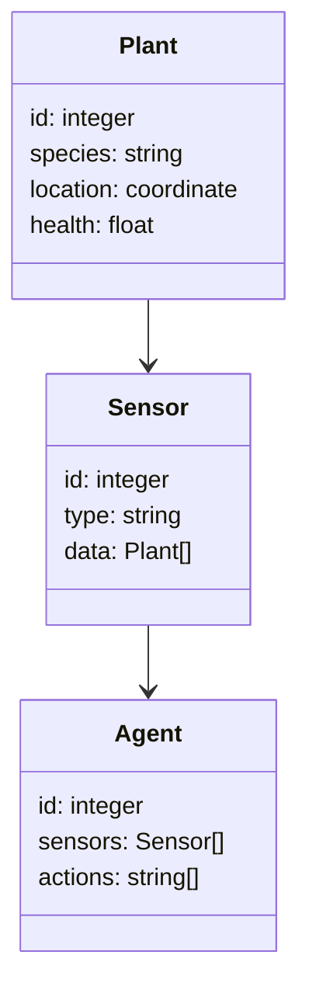

                 


# AI Agent在植物学中的应用：物种识别与生态监测

> 关键词：AI Agent，植物学，物种识别，生态监测，机器学习，计算机视觉，自然语言处理

> 摘要：本文探讨AI Agent在植物学中的应用，重点分析其在物种识别与生态监测中的作用。通过介绍AI Agent的基本概念、核心技术、算法实现、系统架构及实际案例，展示了AI技术如何助力植物学研究和生态保护。

---

## 第1章: AI Agent与植物学的结合

### 1.1 AI Agent的基本概念

#### 1.1.1 AI Agent的定义
AI Agent（人工智能代理）是指能够感知环境、自主决策并执行任务的智能实体。它通过传感器获取信息，利用算法处理数据，并通过执行器与环境互动。

#### 1.1.2 AI Agent的核心特征
- **自主性**：无需外部干预，自主完成任务。
- **反应性**：实时感知并响应环境变化。
- **学习能力**：通过数据优化决策和行为。
- **协作性**：与其他系统或人类协同工作。

#### 1.1.3 AI Agent在植物学中的应用背景
植物学研究涉及物种分类、生态监测等领域，传统方法依赖人工经验，效率低且成本高。AI Agent的引入为这些领域带来了高效、智能的解决方案。

---

### 1.2 植物学中的物种识别与生态监测

#### 1.2.1 物种识别的挑战
- 数据多样性和不完整性。
- 对环境变化的敏感性。
- 专家经验的依赖性。

#### 1.2.2 生态监测的重要性
- 跟踪物种分布变化。
- 监测生态系统的健康状况。
- 保护濒危物种。

#### 1.2.3 AI Agent在其中的作用
AI Agent通过图像识别、数据处理和自主决策，帮助研究人员高效、准确地进行物种识别和生态监测。

---

## 第2章: AI Agent的核心技术与原理

### 2.1 AI Agent的基本原理

#### 2.1.1 感知模块
- **数据采集**：通过摄像头、传感器等获取植物图像或环境数据。
- **特征提取**：利用计算机视觉技术提取植物的形态特征。

#### 2.1.2 推理模块
- **数据处理**：将感知模块获取的数据进行预处理和特征提取。
- **决策逻辑**：基于机器学习模型进行分类和预测。

#### 2.1.3 执行模块
- **行动执行**：根据推理结果采取相应行动，如标记植物或调整监测参数。

---

### 2.2 AI Agent的关键技术

#### 2.2.1 机器学习算法
- **卷积神经网络（CNN）**：用于图像识别和分类。
- **循环神经网络（RNN）**：处理时间序列数据，如环境变化监测。

#### 2.2.2 自然语言处理
- **文本分析**：用于处理植物学文献和生态报告。

#### 2.2.3 计算机视觉
- **图像分割**：识别植物的具体部位，如叶子和花朵。

---

## 第3章: AI Agent在物种识别中的应用

### 3.1 物种识别的流程

#### 3.1.1 数据采集与预处理
- **数据采集**：拍摄植物图像，记录地理位置和环境数据。
- **数据清洗**：去除噪声，标注数据。

#### 3.1.2 特征提取
- **图像特征**：提取颜色、纹理、形状等特征。

#### 3.1.3 分类与识别
- **模型训练**：使用CNN等算法训练分类器。
- **模型部署**：实时识别植物种类。

---

### 3.2 基于图像的物种识别

#### 3.2.1 图像分类算法
- **CNN架构**：AlexNet、VGGNet等。
- **迁移学习**：利用预训练模型提升识别精度。

#### 3.2.2 使用CNN进行物种识别
- **模型训练**：使用公开数据集或自建数据集训练模型。
- **实时识别**：部署模型到移动设备或无人机上进行实时识别。

---

## 第4章: AI Agent在生态监测中的应用

### 4.1 生态监测的挑战

#### 4.1.1 数据的多样性和复杂性
- 不同环境和气候条件下的数据差异大。

#### 4.1.2 监测的实时性和连续性
- 需要实时监控，持续收集和分析数据。

#### 4.1.3 环境变化的动态性
- 物种分布和生态系统会随时间发生变化。

---

### 4.2 基于AI Agent的生态监测系统

#### 4.2.1 系统架构设计
- **数据采集层**：传感器和摄像头收集数据。
- **数据处理层**：实时处理和分析数据。
- **决策层**：根据分析结果制定监测策略。

#### 4.2.2 数据流处理
- **数据融合**：整合来自不同传感器的数据。
- **异常检测**：识别生态系统的异常变化。

#### 4.2.3 实时监测与反馈
- **实时警报**：当检测到异常时，立即通知相关人员。
- **自适应调整**：根据环境变化动态调整监测参数。

---

## 第5章: AI Agent的算法实现与优化

### 5.1 算法选择与优化

#### 5.1.1 选择合适的算法
- 根据任务需求选择CNN、RNN等算法。

#### 5.1.2 算法优化策略
- **模型压缩**：减少模型参数，降低计算成本。
- **分布式计算**：利用多台设备并行计算，提高效率。

#### 5.1.3 性能评估
- **准确率**：模型在测试集上的识别准确率。
- **计算效率**：模型的推理速度和资源消耗。

---

### 5.2 算法实现细节

#### 5.2.1 使用CNN进行图像分类
```python
import tensorflow as tf
from tensorflow.keras import layers

model = tf.keras.Sequential([
    layers.Conv2D(32, (3,3), activation='relu', input_shape=(224, 224, 3)),
    layers.MaxPooling2D((2,2)),
    layers.Conv2D(64, (3,3), activation='relu'),
    layers.MaxPooling2D((2,2)),
    layers.Flatten(),
    layers.Dense(128, activation='relu'),
    layers.Dense(num_classes, activation='softmax')
])
```

#### 5.2.2 训练过程
```python
model.compile(optimizer='adam', loss='sparse_categorical_crossentropy', metrics=['accuracy'])
model.fit(train_images, train_labels, epochs=10, validation_data=(test_images, test_labels))
```

---

## 第6章: 系统分析与架构设计

### 6.1 问题场景介绍
我们设计了一个基于AI Agent的生态监测系统，用于监测自然保护区内的植物分布和健康状况。

### 6.2 系统功能设计

#### 6.2.1 领域模型


#### 6.2.2 系统架构


---

## 第7章: 项目实战

### 7.1 环境安装
```bash
pip install tensorflow numpy matplotlib scikit-learn
```

### 7.2 核心代码实现

#### 7.2.1 图像预处理
```python
import cv2
import numpy as np

def preprocess_image(image_path):
    image = cv2.imread(image_path)
    image = cv2.resize(image, (224, 224))
    image = image / 255.0
    return image
```

#### 7.2.2 模型训练
```python
model = tf.keras.Sequential([
    layers.Conv2D(32, (3,3), activation='relu', input_shape=(224, 224, 3)),
    layers.MaxPooling2D((2,2)),
    layers.Conv2D(64, (3,3), activation='relu'),
    layers.MaxPooling2D((2,2)),
    layers.Flatten(),
    layers.Dense(128, activation='relu'),
    layers.Dense(num_classes, activation='softmax')
])

model.compile(optimizer='adam', loss='sparse_categorical_crossentropy', metrics=['accuracy'])
model.fit(train_images, train_labels, epochs=10, validation_data=(test_images, test_labels))
```

---

## 第8章: 总结与展望

### 8.1 总结
AI Agent在植物学中的应用为物种识别和生态监测提供了高效、智能的解决方案。通过结合机器学习、计算机视觉和自然语言处理等技术，AI Agent能够显著提升研究效率和精度。

### 8.2 未来展望
- **多模态数据融合**：结合图像、文本和传感器数据，提升识别精度。
- **自适应学习**：开发能够持续优化的自适应AI Agent。
- **边缘计算**：将AI Agent部署到边缘设备，实现低延迟和高效处理。

### 8.3 最佳实践 Tips
- 确保数据质量和多样性，以提高模型的泛化能力。
- 定期更新模型，以适应环境和物种的变化。
- 结合领域知识，优化模型的决策逻辑。

---

通过本文的详细讲解，读者可以全面了解AI Agent在植物学中的应用，从理论到实践，为未来的科学研究和生态保护提供有力支持。

