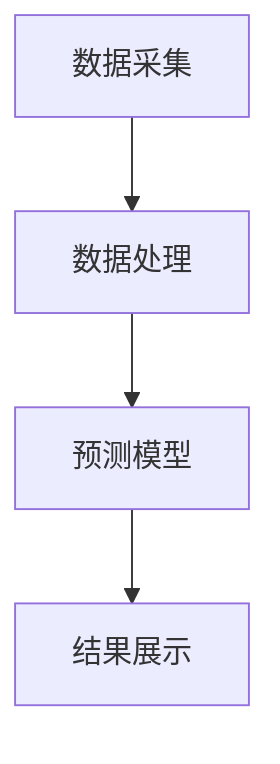
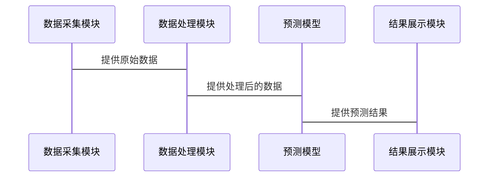

                 


# AI Agent在气象预报中的应用前景

**关键词**：AI Agent, 气象预报, 机器学习, 深度学习, 自然语言处理, 强化学习, 气象数据

**摘要**：随着人工智能技术的快速发展，AI Agent（人工智能代理）在气象预报中的应用前景广阔。本文将从AI Agent的基本概念出发，结合气象预报的传统方法与挑战，详细探讨AI Agent的核心技术，包括机器学习、自然语言处理和强化学习等算法原理，并通过系统设计与实现、项目实战等部分，展示AI Agent在气象预报中的具体应用场景与实际效果。文章最后将总结AI Agent的优势与挑战，并展望其未来发展方向。

---

## 第一章: AI Agent与气象预报的背景与概念

### 1.1 AI Agent的基本概念
#### 1.1.1 AI Agent的定义与特点
- AI Agent是一种智能代理系统，能够感知环境、自主决策并执行任务。
- 具备自主性、反应性、目标导向性和社会性等核心特点。

#### 1.1.2 AI Agent的核心功能与应用场景
- 数据采集与处理：实时收集气象数据，包括温度、湿度、风速等。
- 数据分析与预测：基于历史数据，预测未来天气变化。
- 自适应优化：根据实时数据动态调整预测模型。

#### 1.1.3 气象预报的基本原理与挑战
- 气象预报的传统方法依赖数值模型，但存在计算复杂、精度受限等问题。
- 天气数据的多样性与实时性要求对AI Agent提出了更高挑战。

### 1.2 AI Agent在气象预报中的应用背景
#### 1.2.1 气象预报的传统方法与局限性
- 基于物理模型的传统数值预报方法计算量大，且难以实时更新。
- 数据来源单一，难以整合多源异构数据。

#### 1.2.2 AI Agent在气象预报中的优势
- 实时数据处理能力：AI Agent能够快速响应实时气象数据。
- 动态调整预测模型：根据数据变化自适应优化预测结果。
- 多源数据融合：整合卫星、气象站等多源数据，提升预测精度。

#### 1.2.3 当前AI Agent技术的发展现状
- AI Agent技术在多个领域取得突破，但气象预报领域的应用仍处于探索阶段。
- 需要结合气象学专业知识与AI技术，实现更精准的预测。

### 1.3 本章小结
本章介绍了AI Agent的基本概念与核心功能，并分析了其在气象预报中的应用背景。通过对比传统气象预报方法的局限性，突出了AI Agent在实时数据处理与预测优化方面的优势。

---

## 第二章: AI Agent的核心技术

### 2.1 机器学习基础
#### 2.1.1 监督学习与无监督学习
- 监督学习：基于标注数据，训练模型预测未来天气。
- 无监督学习：从无标签数据中发现模式，辅助气象分析。

#### 2.1.2 深度学习与强化学习
- 深度学习：通过神经网络提取高维特征，提升预测精度。
- 强化学习：通过试错优化预测策略，实现动态调整。

#### 2.1.3 机器学习在气象预报中的应用
- 使用回归模型预测气温，分类模型判断天气类型。

### 2.2 自然语言处理技术
#### 2.2.1 NLP的基本概念与技术
- 用于处理气象报告文本，提取关键信息。

#### 2.2.2 NLP在气象数据处理中的应用
- 自动提取天气预报中的关键词，辅助预测模型优化。

#### 2.2.3 气象预报文本分析的NLP实现
- 使用词袋模型或词嵌入模型对气象文本进行分类。

### 2.3 强化学习与决策优化
#### 2.3.1 强化学习的基本原理
- 通过奖励机制优化预测策略。

#### 2.3.2 强化学习在气象预报中的应用
- 动态调整预测模型参数，提升预测精度。

#### 2.3.3 决策优化算法的实现与优化
- 使用动态规划方法优化预测策略。

### 2.4 本章小结
本章详细介绍了AI Agent的核心技术，包括机器学习、自然语言处理和强化学习。通过这些技术的结合，AI Agent能够实现对气象数据的高效处理与精准预测。

---

## 第三章: AI Agent的算法原理

### 3.1 监督学习算法
#### 3.1.1 线性回归模型
- 使用线性回归模型预测气温变化。

#### 3.1.2 随机森林与梯度提升树
- 使用随机森林与XGBoost模型进行多变量预测。

#### 3.1.3 算法实现与气象数据应用
- 示例代码：使用Python实现线性回归模型。

```python
import numpy as np
from sklearn.linear_model import LinearRegression

# 示例数据：温度与湿度
X = np.array([[20, 60], [22, 55], [25, 50]])
y = np.array([70, 75, 80])

model = LinearRegression()
model.fit(X, y)

# 预测新数据
new_X = np.array([[23, 58]])
print(model.predict(new_X))
```

### 3.2 深度学习算法
#### 3.2.1 卷积神经网络（CNN）
- 用于处理气象卫星图像。

#### 3.2.2 循环神经网络（RNN）
- 用于时间序列预测。

#### 3.2.3 Transformer架构与气象预测
- 使用Transformer模型处理气象数据的时间依赖性。

### 3.3 强化学习算法
#### 3.3.1 Q-learning算法
- 用于动态调整预测策略。

#### 3.3.2 DQN算法
- 使用深度Q网络优化预测模型。

#### 3.3.3 算法实现与优化
- 示例代码：使用OpenAI Gym实现Q-learning。

```python
import gym
from gym import spaces
from gym.utils import seeding

class WeatherEnv(gym.Env):
    def __init__(self):
        self.action_space = spaces.Discrete(3)  # 三个可能的预测动作
        self.observation_space = spaces.Box(low=0, high=100, shape=(1,))  # 示例观测空间
        self.current_state = None
        self.episode_over = False

    # 环境复位
    def _reset(self):
        self.current_state = np.random.randint(0, 100, size=(1,))
        return self.current_state

    # 环境步进
    def _step(self, action):
        # 示例奖励机制
        reward = 0
        if action == 1:  # 假设动作1是最佳预测
            reward = 1
        elif action == 0 or action == 2:
            reward = -1
        self.episode_over = True
        return self.current_state, reward, self.episode_over, {}

env = WeatherEnv()
observation = env.reset()

# Q-learning算法实现
import numpy as np
import random

alpha = 0.1
gamma = 0.9

# 初始化Q表
Q = np.zeros((env.observation_space.shape[0], env.action_space.n))

# 训练过程
for _ in range(1000):
    state = observation
    action = np.argmax(Q[state, :])
    observation, reward, done, _ = env.step(action)
    next_state = observation
    if not done:
        Q[state, action] = Q[state, action] * (1 - alpha) + alpha * (reward + gamma * np.max(Q[next_state, :]))
    
    if done:
        observation = env.reset()

print(Q)
```

### 3.4 本章小结
本章详细讲解了AI Agent的核心算法，包括监督学习、深度学习和强化学习。通过示例代码和算法流程图，展示了这些算法在气象预报中的具体实现与应用。

---

## 第四章: 系统设计与架构

### 4.1 系统功能设计
#### 4.1.1 数据采集模块
- 采集气象数据，包括温度、湿度、风速等。

#### 4.1.2 数据处理模块
- 数据清洗与特征提取。

#### 4.1.3 预测模块
- 使用机器学习模型进行天气预测。

### 4.2 系统架构设计
#### 4.2.1 系统架构图


#### 4.2.2 模块交互流程


### 4.3 本章小结
本章通过系统设计与架构图，展示了AI Agent在气象预报中的整体架构，并详细说明了各模块的功能与交互流程。

---

## 第五章: 项目实战

### 5.1 环境安装与配置
#### 5.1.1 安装Python与相关库
- 安装Python 3.8及以上版本。
- 安装NumPy、Scikit-learn、TensorFlow等库。

### 5.2 核心代码实现
#### 5.2.1 数据预处理
```python
import pandas as pd
import numpy as np

# 加载数据
data = pd.read_csv('weather.csv')
data = data.dropna()  # 删除缺失值
```

#### 5.2.2 模型训练
```python
from sklearn.model

