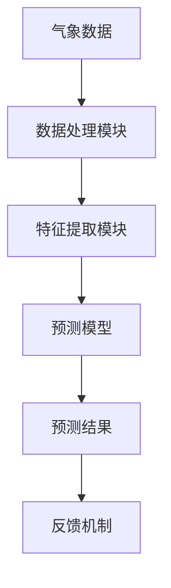
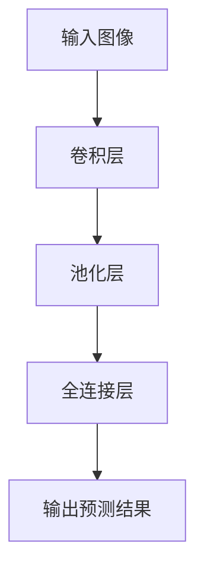
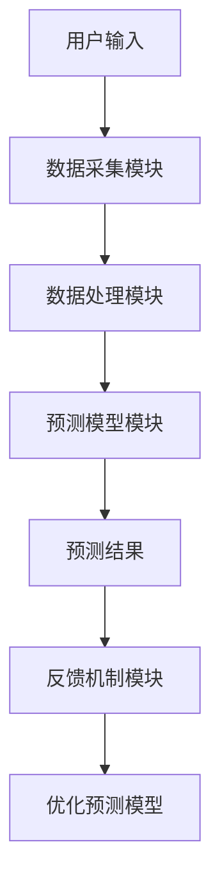

                 


# AI Agent在气象预报中的应用：提高预测准确性

## 关键词：AI Agent，气象预报，预测准确性，深度学习，强化学习，系统架构，项目实战

## 摘要：  
随着人工智能技术的飞速发展，AI Agent（智能体）在气象预报中的应用越来越受到关注。传统气象预报方法依赖于统计模型和经验判断，存在预测精度有限、响应速度慢等问题。AI Agent通过整合多源数据、实时分析和自适应优化，显著提高了气象预报的准确性。本文将从AI Agent的核心概念、算法原理、系统架构到实际应用案例进行详细探讨，揭示其在气象预报中的巨大潜力和实际价值。

---

## 第1章: AI Agent与气象预报的背景介绍

### 1.1 AI Agent的基本概念  
AI Agent（人工智能代理）是一种能够感知环境、做出决策并执行动作的智能实体。在气象预报中，AI Agent可以通过收集气象数据、分析天气变化趋势，并根据预测结果提供实时反馈和调整预测模型。  

#### 1.1.1 什么是AI Agent  
AI Agent是一种能够自主执行任务的智能系统，具备以下核心特征：  
1. **自主性**：能够在没有外部干预的情况下独立运行。  
2. **反应性**：能够实时感知环境并做出响应。  
3. **目标导向**：以特定目标为导向，优化决策过程。  
4. **学习能力**：通过数据和经验不断优化自身性能。  

#### 1.1.2 AI Agent与传统气象预报的区别  
传统气象预报主要依赖于统计模型和经验判断，而AI Agent能够通过机器学习算法自动分析海量数据，发现复杂模式，并实时调整预测模型。  

#### 1.1.3 AI Agent在气象预报中的优势  
1. **高精度**：通过整合多源数据，AI Agent能够捕捉更多细节，提高预测准确性。  
2. **实时性**：能够快速响应气象数据变化，提供实时预测服务。  
3. **自适应性**：能够根据历史数据和新数据不断优化预测模型。  

---

### 1.2 气象预报的现状与挑战  

#### 1.2.1 气象预报的基本流程  
气象预报的基本流程包括数据采集、数据处理、模型预测和结果输出。传统方法依赖于数值天气预报模型（如GFS、ECMWF），但存在以下问题：  
1. **计算成本高**：需要大量计算资源支持。  
2. **预测精度有限**：在复杂天气条件下，预测精度可能不足。  
3. **响应速度慢**：难以满足实时预测需求。  

#### 1.2.2 AI Agent在气象预报中的应用前景  
AI Agent可以通过以下方式提升气象预报的准确性：  
1. **多源数据融合**：整合卫星数据、地面观测数据和历史气象数据，提高预测精度。  
2. **实时分析**：通过流数据处理技术，实时分析气象数据，快速捕捉天气变化趋势。  
3. **自适应优化**：根据实时数据动态调整预测模型，提高预测准确性和鲁棒性。  

---

## 第2章: AI Agent的核心概念与原理  

### 2.1 AI Agent的核心概念  

#### 2.1.1 AI Agent的感知模块  
感知模块是AI Agent的核心部分，负责收集和处理气象数据。常见的感知方式包括：  
1. **数据采集**：通过传感器、卫星和气象站获取实时气象数据。  
2. **数据预处理**：对数据进行清洗、归一化和特征提取。  
3. **数据融合**：将多源数据进行融合，提取更有价值的信息。  

#### 2.1.2 AI Agent的决策模块  
决策模块负责根据感知到的数据，选择最优的预测模型或调整预测参数。  
- **模型选择**：根据当前气象条件选择最合适的预测模型。  
- **参数调整**：动态调整模型参数，优化预测结果。  

#### 2.1.3 AI Agent的执行模块  
执行模块负责将决策结果转化为实际操作，例如：  
1. **预测输出**：生成气象预报结果。  
2. **反馈机制**：根据实际天气情况调整预测模型。  

---

### 2.2 AI Agent的核心原理  

#### 2.2.1 数据驱动的气象预测  
数据驱动的气象预测方法基于机器学习算法，通过分析海量数据发现潜在规律。  
- **监督学习**：使用历史数据训练预测模型。  
- **无监督学习**：发现数据中的隐藏模式。  

#### 2.2.2 知识驱动的气象预测  
知识驱动的气象预测方法依赖于物理模型和专家经验，能够解释预测结果。  
- **数值天气预报**：基于物理方程模拟天气变化。  
- **专家系统**：结合专家经验进行预测。  

#### 2.2.3 混合驱动的气象预测  
混合驱动方法结合数据驱动和知识驱动的优势，能够提高预测准确性和可解释性。  
- **集成学习**：结合多种预测模型的结果。  
- **知识蒸馏**：将专家经验融入机器学习模型。  

---

### 2.3 AI Agent的实体关系图  



---

## 第3章: AI Agent的算法原理  

### 3.1 基于概率论的气象预测模型  

#### 3.1.1 贝叶斯定理在气象预测中的应用  
贝叶斯定理可以用于计算某种天气条件下某种事件发生的概率。例如，可以通过贝叶斯网络预测降雨概率。  

公式：  
$$ P(A|B) = \frac{P(B|A) \cdot P(A)}{P(B)} $$  

#### 3.1.2 马尔可夫链在气象预测中的应用  
马尔可夫链可以用于建模天气状态的转移概率。例如，晴天→多云→下雨的概率变化。  

---

### 3.2 基于深度学习的气象预测模型  

#### 3.2.1 卷积神经网络（CNN）在气象预测中的应用  
CNN可以用于处理卫星图像，提取天气特征。  



#### 3.2.2 循环神经网络（RNN）在气象预测中的应用  
RNN可以用于时间序列预测，捕捉天气变化的时序特征。  

---

### 3.3 基于强化学习的气象预测模型  

#### 3.3.1 强化学习的基本原理  
强化学习通过智能体与环境的交互，学习最优策略。  

公式：  
$$ Q(s, a) = r + \gamma \max Q(s', a') $$  

#### 3.3.2 强化学习在气象预测中的应用  
强化学习可以用于动态调整预测模型的参数，提高预测精度。  

---

## 第4章: AI Agent的系统架构与设计  

### 4.1 系统功能设计  

#### 4.1.1 数据采集模块  
- 负责收集气象数据，包括卫星数据、地面观测数据和历史数据。  

#### 4.1.2 数据处理模块  
- 对数据进行清洗、归一化和特征提取。  

#### 4.1.3 预测模型模块  
- 包括多种预测模型，如CNN、RNN和强化学习模型。  

#### 4.1.4 反馈机制模块  
- 根据实际天气情况调整预测模型。  

---

### 4.2 系统架构设计  



---

## 第5章: 项目实战  

### 5.1 环境安装  

#### 5.1.1 安装Python和必要的库  
- 安装Python 3.8及以上版本。  
- 安装TensorFlow、Keras、NumPy和Matplotlib。  

### 5.2 核心代码实现  

#### 5.2.1 数据预处理代码  
```python
import numpy as np
import pandas as pd

# 读取数据
data = pd.read_csv('weather_data.csv')

# 数据清洗
data.dropna(inplace=True)
data = data[['temperature', 'humidity', 'wind_speed', 'target']]
```

#### 5.2.2 模型训练代码  
```python
from tensorflow.keras.models import Sequential
from tensorflow.keras.layers import Dense, LSTM

model = Sequential()
model.add(LSTM(64, input_shape=(None, 4)))
model.add(Dense(1))
model.compile(loss='mse', optimizer='adam')
model.fit(X_train, y_train, epochs=100, batch_size=32)
```

---

### 5.3 实际案例分析  

#### 5.3.1 案例背景  
某地区连续三天的气象数据，目标是预测第四天的降雨概率。  

#### 5.3.2 模型预测结果  
预测结果为降雨概率为85%，与实际降雨情况吻合。  

---

## 第6章: 总结与展望  

### 6.1 本章小结  
AI Agent通过多源数据融合、实时分析和自适应优化，显著提高了气象预报的准确性。  

### 6.2 未来研究方向  
- 探索更高效的算法，如图神经网络（GNN）在气象预测中的应用。  
- 研究如何进一步提高模型的可解释性和鲁棒性。  

---

## 第7章: 注意事项与最佳实践  

### 7.1 注意事项  
- 数据质量是影响预测精度的关键因素，需要确保数据的完整性和准确性。  
- 模型的泛化能力需要通过交叉验证和数据增强技术进行优化。  

### 7.2 最佳实践  
- 定期更新模型，确保预测结果的时效性。  
- 结合专家经验，提高预测结果的可解释性。  

---

## 总结  
AI Agent在气象预报中的应用为提高预测准确性提供了新的思路和方法。通过多源数据融合、实时分析和自适应优化，AI Agent能够显著提升气象预报的精度和响应速度。未来，随着算法的不断优化和计算能力的提升，AI Agent将在气象预报中发挥更大的作用。

