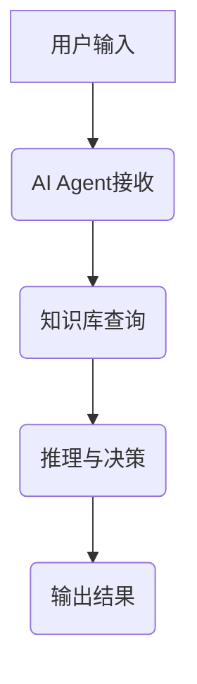
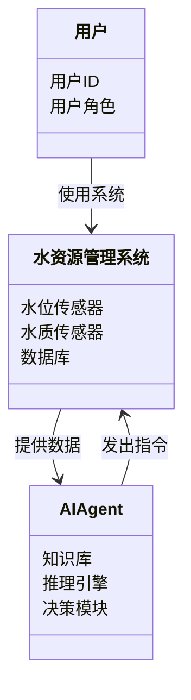
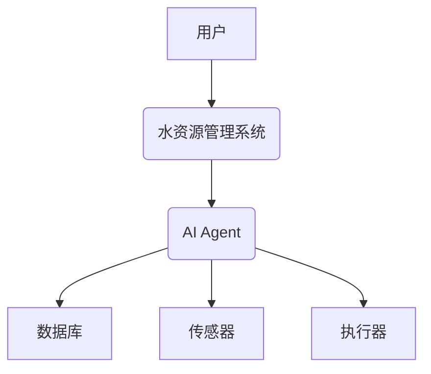
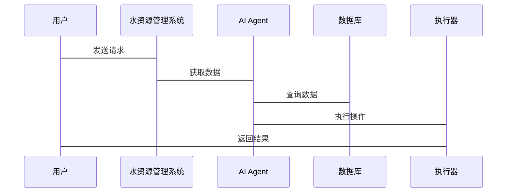

                 


# AI Agent在水资源管理中的优化决策

> 关键词：AI Agent, 水资源管理, 优化决策, 强化学习, 遗传算法, 多智能体协同

> 摘要：本文探讨了AI Agent在水资源管理中的优化决策应用，从理论背景到算法实现，再到系统架构设计，结合实际案例，系统性地分析了AI Agent在水资源管理中的潜力与优势。通过详细阐述强化学习、遗传算法等技术原理，以及多智能体协同的系统设计，本文为水资源管理的智能化转型提供了理论支持与实践指导。

---

# 第1章 AI Agent与水资源管理的背景介绍

## 1.1 水资源管理的现状与挑战

### 1.1.1 水资源短缺与污染问题
水资源是人类生存和发展的基础，然而，全球范围内水资源短缺和污染问题日益严重。根据联合国数据，全球约有20亿人面临水资源短缺问题，而水污染更是导致每年数百万人死亡的主要原因之一。传统的水资源管理方法依赖于人工经验，难以应对复杂多变的环境条件和多元化的用水需求。

### 1.1.2 水资源管理的传统方法与局限性
传统的水资源管理方法主要依赖于统计分析和专家经验，例如基于历史数据的线性规划模型。这些方法在一定程度上能够解决水资源分配问题，但存在以下局限性：
- **静态性**：传统模型难以适应实时变化的环境条件。
- **局部优化**：传统方法通常只能解决局部问题，难以实现全局最优。
- **缺乏智能性**：传统方法缺乏自我学习和自适应能力，难以应对复杂场景。

### 1.1.3 智能化管理的必要性
随着人工智能技术的快速发展，智能化管理成为解决水资源问题的重要方向。AI Agent作为一种智能化决策工具，能够实时感知环境、自主学习和优化决策，为水资源管理提供了新的可能性。

## 1.2 AI Agent的基本概念

### 1.2.1 AI Agent的定义
AI Agent（人工智能代理）是指能够感知环境、自主决策并采取行动的智能实体。它通过传感器获取信息，利用算法进行分析和推理，并根据结果采取相应行动。AI Agent可以是软件程序，也可以是物理设备。

### 1.2.2 AI Agent的核心特征
AI Agent的核心特征包括：
1. **自主性**：能够在没有外部干预的情况下自主运行。
2. **反应性**：能够实时感知环境并做出反应。
3. **学习能力**：能够通过经验优化决策策略。
4. **协作性**：能够与其他Agent或系统协同工作。

### 1.2.3 AI Agent与传统优化方法的区别
传统的优化方法通常基于静态模型，而AI Agent能够动态适应环境变化。例如，传统的线性规划模型需要明确的目标函数和约束条件，而AI Agent可以通过强化学习动态调整策略。

## 1.3 水资源管理中的AI Agent应用潜力

### 1.3.1 AI Agent在水资源优化中的优势
AI Agent能够实时优化水资源分配，减少浪费，提高利用效率。例如，在农业灌溉中，AI Agent可以根据土壤湿度、天气预报和作物需求动态调整灌溉计划。

### 1.3.2 AI Agent与其他技术的结合
AI Agent可以与物联网、大数据和云计算等技术结合，构建智能化的水资源管理系统。例如，通过物联网设备实时采集水质和水位数据，AI Agent可以快速做出决策。

### 1.3.3 AI Agent在水资源管理中的应用场景
- **洪水预警**：通过实时监测降雨量和水位变化，AI Agent可以提前预测洪水风险。
- **水资源分配**：根据用水需求和水资源 availability，优化水资源分配方案。
- **污染监测**：通过分析水质数据，AI Agent可以识别污染源并采取措施。

## 1.4 本章小结
本章介绍了水资源管理的现状与挑战，以及AI Agent的基本概念和核心特征。AI Agent在水资源管理中的应用潜力巨大，尤其是在动态优化和智能化决策方面具有显著优势。

---

# 第2章 AI Agent的核心概念与原理

## 2.1 AI Agent的核心原理

### 2.1.1 知识表示与推理
知识表示是AI Agent进行推理的基础。常用的知识表示方法包括规则表示和概率表示。例如，可以将水资源分配规则表示为逻辑规则，通过推理引擎进行推理。

### 2.1.2 智能决策机制
智能决策机制是AI Agent的核心，主要包括感知、推理和行动三个步骤。例如，在农业灌溉场景中，AI Agent会感知土壤湿度、天气预报等信息，通过推理得出最优灌溉方案，并通过执行模块调整灌溉设备。

### 2.1.3 多智能体协同
在复杂的水资源管理系统中，通常需要多个AI Agent协同工作。例如，城市供水系统中，多个区域的AI Agent需要协同优化供水计划。

## 2.2 AI Agent与水资源管理的关系

### 2.2.1 水资源管理中的问题建模
水资源管理中的问题通常需要建模，例如，可以通过优化模型描述水资源分配问题。AI Agent可以通过强化学习优化模型参数。

### 2.2.2 AI Agent在水资源优化中的角色
AI Agent在水资源管理中扮演决策者和执行者双重角色。它不仅能够根据环境信息做出决策，还可以通过执行模块实施决策方案。

### 2.2.3 AI Agent与其他技术的协同
AI Agent可以与物联网、大数据等技术协同，构建智能化的水资源管理系统。例如，通过物联网设备实时采集数据，AI Agent可以快速做出决策。

## 2.3 AI Agent的实体关系图

```mermaid
er
actor: 用户
agent: AI Agent
system: 水资源管理系统
```

## 2.4 AI Agent的流程图



---

# 第3章 AI Agent的算法原理与实现

## 3.1 强化学习算法

### 3.1.1 强化学习的基本原理
强化学习是一种通过试错学习的方法，通过与环境交互获得奖励或惩罚，最终找到最优策略。例如，在水资源分配问题中，AI Agent可以通过强化学习找到最优的分配策略。

### 3.1.2 强化学习的数学模型
强化学习的核心是Q-learning算法，其数学模型如下：

$$ Q(s, a) = r + \gamma \max_{a'} Q(s', a') $$

其中：
- \( Q(s, a) \) 表示状态 \( s \) 下采取动作 \( a \) 的价值。
- \( r \) 表示奖励。
- \( \gamma \) 表示折扣因子。

### 3.1.3 强化学习的实现代码
以下是一个简单的Q-learning实现代码：

```python
import numpy as np

class QLearning:
    def __init__(self, state_space, action_space, gamma=0.9):
        self.state_space = state_space
        self.action_space = action_space
        self.gamma = gamma
        self.q_table = np.zeros((state_space, action_space))

    def choose_action(self, state, epsilon=0.1):
        if np.random.random() < epsilon:
            return np.random.randint(self.action_space)
        else:
            return np.argmax(self.q_table[state, :])

    def learn(self, state, action, reward, next_state):
        self.q_table[state, action] = reward + self.gamma * np.max(self.q_table[next_state, :])
```

## 3.2 遗传算法

### 3.2.1 遗传算法的基本原理
遗传算法是一种基于自然选择和遗传机制的优化算法。它通过编码、选择、交叉和变异等操作，逐步优化解空间。

### 3.2.2 遗传算法的数学模型
遗传算法的核心步骤包括：
1. **编码**：将问题表示为二进制字符串。
2. **选择**：根据适应度值选择优秀的个体。
3. **交叉**：将两个个体的基因进行交叉重组。
4. **变异**：随机改变个体的基因。

### 3.2.3 遗传算法的实现代码
以下是一个简单的遗传算法实现代码：

```python
import random

def decode基因（基因）:
    return 基因

def 适应度函数(基因):
    return 计算适应度

def 选择(种群):
    根据适应度选择个体

def 交叉(父1, 父2):
    中间点 = random.randint(1, len(父1))
    子1 = 父1[:中间点] + 父2[中间点:]
    子2 = 父2[:中间点] + 父1[中间点:]
    return 子1, 子2

def 变异(基因):
    变异位置 = random.randint(0, len(基因))
    变异后的基因 = 基因[:变异位置] + (1 - 基因[变异位置:]) if 基因[变异位置] == 1 else 基因[:变异位置] + 0
    return 变异后的基因

def 遗传算法(初始种群, 迭代次数):
    当前种群 = 初始种群
    for _ in range(迭代次数):
        新种群 = []
        选择后的个体 = 选择(当前种群)
        for i in range(0, len(选择后的个体), 2):
            父1 = 选择后的个体[i]
            父2 = 选择后的个体[i+1]
            子1, 子2 = 交叉(父1, 父2)
            子1 = 变异(子1)
            子2 = 变异(子2)
            新种群.append(子1)
            新种群.append(子2)
        当前种群 = 新种群
    return 当前种群
```

---

# 第4章 系统分析与架构设计

## 4.1 系统功能设计

### 4.1.1 领域模型
以下是水资源管理系统的领域模型：



### 4.1.2 系统架构
以下是系统的整体架构：



## 4.2 接口设计

### 4.2.1 系统接口
以下是系统接口的设计：



---

# 第5章 项目实战

## 5.1 实际案例分析

### 5.1.1 案例介绍
以某城市供水系统为例，以下是AI Agent的应用场景：

1. **数据采集**：通过传感器实时采集水位、流量等数据。
2. **数据处理**：将采集的数据进行预处理和特征提取。
3. **模型训练**：基于历史数据训练强化学习模型。
4. **优化决策**：根据实时数据和模型预测结果，优化供水计划。
5. **结果输出**：将优化结果输出到执行系统。

### 5.1.2 实际案例分析
以下是某城市供水系统的实际案例分析：

1. **需求分析**：通过调查和访谈，了解用水需求和水资源 availability。
2. **数据采集**：部署传感器，实时采集水位和流量数据。
3. **模型训练**：基于历史数据训练强化学习模型。
4. **系统集成**：将AI Agent与传感器和执行器集成，实现智能化管理。
5. **效果评估**：通过实验验证系统的性能和效果。

## 5.2 项目小结
通过实际案例分析，我们可以看到AI Agent在水资源管理中的巨大潜力。AI Agent能够通过实时数据和智能算法，显著提高水资源的利用效率。

---

# 第6章 最佳实践与总结

## 6.1 小结
AI Agent在水资源管理中的应用具有重要意义。它能够通过实时感知、自主学习和优化决策，显著提高水资源的利用效率和管理效果。

## 6.2 注意事项
在实际应用中，需要注意以下问题：
1. **数据质量**：确保数据的准确性和实时性。
2. **模型选择**：根据具体问题选择合适的算法。
3. **系统安全性**：确保系统的安全性和可靠性。

## 6.3 拓展阅读
推荐以下书籍和论文：
- 《强化学习》
- 《遗传算法入门》
- 《多智能体系统》
- 《人工智能在水资源管理中的应用》

---

# 结语

AI Agent作为人工智能技术的重要组成部分，正在逐步改变水资源管理的方式。通过本文的分析，我们可以看到AI Agent在水资源管理中的巨大潜力。未来，随着技术的不断发展，AI Agent将在水资源管理中发挥更加重要的作用。

