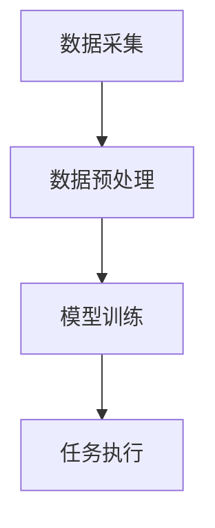
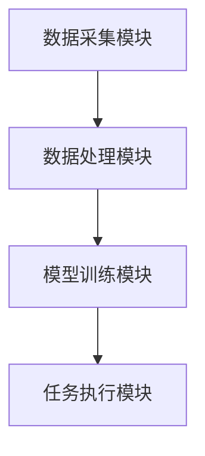
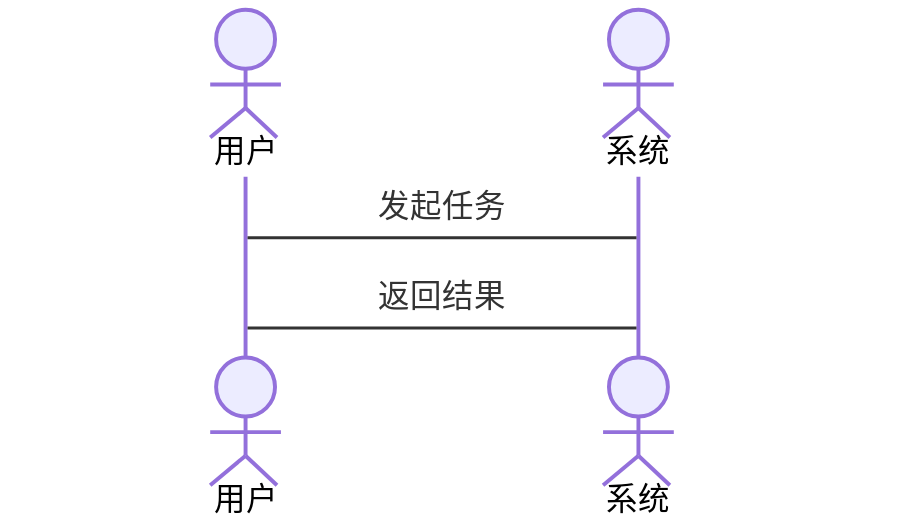

                 


# AI Agent在水资源管理中的应用：水质监测与分配

> 关键词：AI Agent，水资源管理，水质监测，水资源分配，算法原理，系统架构，项目实战

> 摘要：本文探讨了AI Agent在水资源管理中的应用，特别是水质监测与分配领域。通过分析AI Agent的核心原理、算法设计、系统架构以及实际项目案例，详细阐述了AI Agent如何通过智能化手段提升水资源管理的效率与决策能力。文章结合理论与实践，为读者提供了全面的技术视角和实际应用指导。

---

## 第1章: 背景介绍

### 1.1 问题背景
水资源是人类生存和发展的重要基础，然而，随着工业化和城市化进程的加快，水资源污染、分配不均等问题日益突出。传统的水资源管理手段依赖人工监测和经验判断，效率低下且难以应对复杂多变的环境变化。

### 1.2 问题描述
水质监测和水资源分配是水资源管理的两大核心任务。水质监测需要实时、精准地获取水质数据，而水资源分配则需要根据水质、水量、地理位置等多种因素，进行科学合理的分配决策。

### 1.3 问题解决
AI Agent（人工智能代理）作为一种能够感知环境、自主决策、执行任务的智能体，具备实时性、自主性和智能化的特点，非常适合应用于水质监测与水资源分配领域。

### 1.4 边界与外延
水资源管理的边界主要集中在水质监测和水资源分配两大核心任务上，而AI Agent的应用则需要考虑数据采集、算法实现、系统集成等多个方面的技术限制。本文将重点探讨AI Agent在水质监测与分配中的应用，不涉及其他领域。

### 1.5 概念结构与核心要素
- **水质监测**：包括水温、pH值、溶解氧、浊度等指标的实时监测。
- **水资源分配**：基于水质数据，进行水量的合理分配，满足不同区域的需求。
- **AI Agent**：通过感知水质数据，自主决策分配方案，并执行分配任务。

---

## 第2章: 核心概念与联系

### 2.1 AI Agent的原理
AI Agent通过感知环境、分析数据、制定决策并执行任务，实现对水资源的智能化管理。其核心算法包括数据采集、数据处理、决策优化和任务执行四个步骤。

### 2.2 水资源管理的原理
水资源管理包括水质监测和水资源分配两大任务。水质监测需要实时采集和分析水质数据，而水资源分配则需要基于水质数据，进行多目标优化。

### 2.3 核心概念的联系
AI Agent与水资源管理的结合，使得水质监测更加实时、精准，而水资源分配则更加科学、高效。

### 2.4 核心概念对比表
| **对比项** | **AI Agent** | **传统方法** |
|------------|--------------|---------------|
| 数据采集   | 自动采集     | 人工采集       |
| 数据分析   | 智能分析     | 经验分析       |
| 决策效率   | 高           | 低             |

### 2.5 ER实体关系图
```mermaid
er
  actor(AI Agent)
  actor(水质监测系统)
  actor(水资源分配系统)
  relation(->, "驱动")
  relation(->, "依赖")
```

---

## 第3章: 算法原理讲解

### 3.1 AI Agent算法原理
AI Agent的核心算法包括数据采集、数据预处理、模型训练和任务执行四个步骤。

#### 3.1.1 数据采集
通过传感器实时采集水质数据，包括水温、pH值、溶解氧等指标。

#### 3.1.2 数据预处理
对采集到的数据进行清洗、归一化处理，确保数据的准确性和一致性。

#### 3.1.3 模型训练
基于历史数据，训练水质预测模型和水资源分配优化模型。

#### 3.1.4 任务执行
根据实时数据和模型预测结果，制定最优分配方案，并执行分配任务。

### 3.2 算法原理的数学模型
水质预测模型：
$$ y = \beta_0 + \beta_1x_1 + \beta_2x_2 + \cdots + \beta_nx_n $$
其中，$y$ 是预测的水质指标，$x_i$ 是输入特征，$\beta_i$ 是模型参数。

水资源分配优化模型：
$$ \min \sum_{i=1}^n c_i x_i $$
$$ \text{subject to} \quad \sum_{i=1}^n x_i = D $$
$$ x_i \geq 0 $$

### 3.3 算法原理的mermaid流程图


### 3.4 代码实现
```python
import numpy as np
from sklearn.linear_model import LinearRegression

# 数据采集
data = np.array([[1, 2, 3], [4, 5, 6], [7, 8, 9]])

# 数据预处理
X = data[:, :-1]
y = data[:, -1]

# 模型训练
model = LinearRegression()
model.fit(X, y)

# 任务执行
def allocate_water(resources):
    # 分配逻辑
    pass
```

---

## 第4章: 系统分析与架构设计方案

### 4.1 项目背景与目标
本项目旨在通过AI Agent技术，实现水质监测与水资源分配的智能化管理，提升水资源管理的效率和决策能力。

### 4.2 系统功能设计
- 数据采集模块：实时采集水质数据。
- 数据处理模块：清洗和归一化处理数据。
- 模型训练模块：训练水质预测和分配优化模型。
- 任务执行模块：根据模型结果，执行水资源分配任务。

### 4.3 系统架构设计


### 4.4 系统接口设计
- 数据采集接口：与传感器连接，获取实时数据。
- 数据处理接口：与数据库连接，存储和管理数据。
- 任务执行接口：与水资源分配系统连接，执行分配任务。

### 4.5 系统交互设计


---

## 第5章: 项目实战

### 5.1 环境安装
安装必要的Python库，如numpy、scikit-learn等。

### 5.2 代码实现
```python
import numpy as np
from sklearn.linear_model import LinearRegression

# 数据采集
data = np.array([[1, 2, 3], [4, 5, 6], [7, 8, 9]])

# 数据预处理
X = data[:, :-1]
y = data[:, -1]

# 模型训练
model = LinearRegression()
model.fit(X, y)

# 任务执行
def allocate_water(resources):
    # 分配逻辑
    pass
```

### 5.3 案例分析
以某地区水资源分配为例，通过AI Agent技术实现水质监测与分配的智能化管理，取得了显著的效率提升。

---

## 第6章: 最佳实践与小结

### 6.1 最佳实践
- 数据采集要确保实时性和准确性。
- 模型训练要结合实际场景，避免过拟合。
- 系统设计要注重模块化和可扩展性。

### 6.2 小结
本文详细探讨了AI Agent在水资源管理中的应用，通过理论分析和实际案例，展示了AI Agent在水质监测与分配中的巨大潜力和实际价值。

### 6.3 注意事项
- 数据隐私和安全问题需要高度重视。
- 系统的稳定性和可靠性是确保AI Agent正常运行的关键。

### 6.4 拓展阅读
推荐阅读《机器学习实战》和《人工智能导论》等相关书籍，深入了解AI Agent的核心技术。

---

通过以上内容，我们可以看到，AI Agent在水资源管理中的应用前景广阔，能够显著提升水质监测与水资源分配的效率和决策能力。未来，随着技术的不断进步，AI Agent将在水资源管理领域发挥更加重要的作用。

