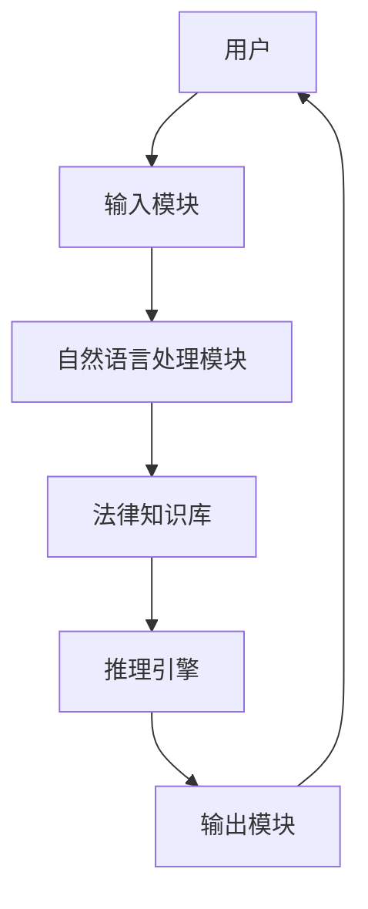
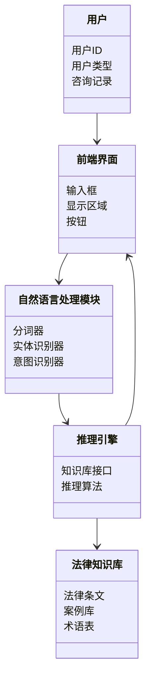
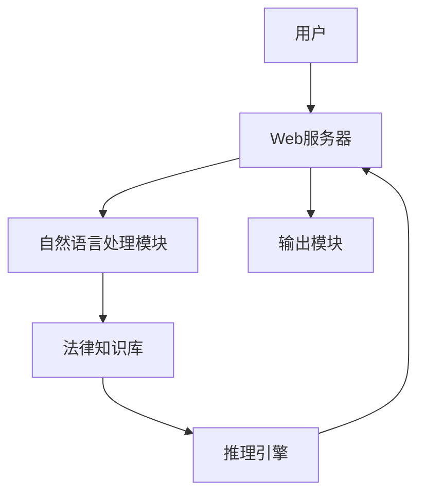
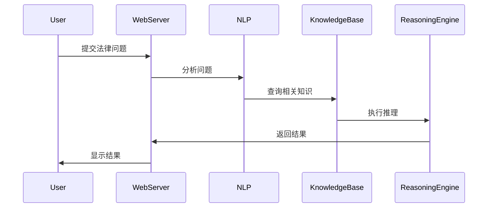

                 


# AI Agent在法律服务中的应用

## 关键词：AI Agent、法律服务、智能问答系统、合同审查、法律文书自动生成

## 摘要：本文详细探讨了AI Agent在法律服务中的应用，从基本概念到实际应用场景，结合系统架构设计和项目实战案例，分析了AI Agent如何提升法律服务的效率和准确性。文章还介绍了AI Agent的核心算法原理和系统实现，最后总结了最佳实践和未来发展方向。

---

## 第1章: AI Agent与法律服务的背景介绍

### 1.1 AI Agent的基本概念

#### 1.1.1 AI Agent的定义与核心特征
AI Agent（人工智能代理）是一种能够感知环境并采取行动以实现目标的智能系统。其核心特征包括：
- **自主性**：能够在没有外部干预的情况下运行。
- **反应性**：能够实时感知环境并做出反应。
- **主动性**：主动采取行动以实现目标。
- **社会性**：能够与其他系统或人类交互协作。

#### 1.1.2 AI Agent与传统法律服务的对比
传统法律服务依赖于律师的个人经验和知识，而AI Agent通过自动化处理和大数据分析，能够更快、更准确地提供法律建议和解决方案。

#### 1.1.3 AI Agent在法律服务中的问题背景
传统法律服务存在效率低、成本高等问题，AI Agent的引入可以有效解决这些问题，提高法律服务的可及性和质量。

### 1.2 法律服务的数字化转型

#### 1.2.1 法律服务的传统模式与痛点
传统法律服务模式依赖人工操作，存在效率低、成本高、覆盖面有限等问题。

#### 1.2.2 数字化转型的驱动力
技术进步（如AI、大数据）为法律服务的数字化转型提供了强大动力，推动法律服务向更高效、更智能的方向发展。

#### 1.2.3 AI Agent在法律服务中的应用前景
AI Agent的应用前景广阔，能够显著提升法律服务的效率和质量，降低成本，扩大服务范围。

### 1.3 本章小结
本章介绍了AI Agent的基本概念及其在法律服务中的应用背景，分析了传统法律服务的痛点以及AI Agent带来的变革潜力。

---

## 第2章: AI Agent的核心概念与原理

### 2.1 AI Agent的核心概念

#### 2.1.1 AI Agent的定义与分类
AI Agent可以根据功能和应用场景分为多种类型，包括：
- **简单反射型AI**：基于预设规则做出反应。
- **基于模型的AI**：利用知识库和推理引擎进行决策。
- **学习型AI**：通过机器学习不断优化性能。

#### 2.1.2 AI Agent的智能特性
AI Agent的智能特性包括：
- **知识表示**：将法律知识以结构化形式存储。
- **推理能力**：基于知识进行逻辑推理。
- **学习能力**：通过数据和反馈不断优化。

#### 2.1.3 AI Agent与法律服务的结合点
AI Agent与法律服务的结合点在于其强大的数据处理能力和智能推理能力，能够帮助律师快速分析法律问题，提供解决方案。

### 2.2 AI Agent的基本原理

#### 2.2.1 知识表示与推理
知识表示是AI Agent的核心，常见的知识表示方法包括：
- **语义网络**：通过节点和边表示概念及其关系。
- **规则表示**：通过逻辑规则表示知识。

#### 2.2.2 自然语言处理
自然语言处理（NLP）是AI Agent理解用户需求的关键技术，包括：
- **分词**：将文本分割成词或短语。
- **实体识别**：识别文本中的实体（如人名、地点、组织）。
- **意图识别**：理解用户的意图。

#### 2.2.3 逻辑推理与决策
逻辑推理是AI Agent做出决策的基础，常见的推理方法包括：
- **演绎推理**：从一般到具体的推理。
- **归纳推理**：从具体到一般的推理。
- **溯因推理**：根据结果推导原因。

### 2.3 AI Agent与法律知识库的关联

#### 2.3.1 法律知识库的构建
法律知识库的构建需要收集和整理大量的法律条文、案例和相关规定，确保知识库的准确性和全面性。

#### 2.3.2 知识库的检索与应用
通过自然语言处理技术，AI Agent能够快速检索法律知识库，找到相关法律条文和案例，为用户提供准确的法律建议。

#### 2.3.3 知识库的动态更新
AI Agent能够通过持续学习和反馈，不断更新和优化法律知识库，确保知识库与时俱进。

### 2.4 本章小结
本章详细介绍了AI Agent的核心概念与基本原理，重点分析了知识表示、自然语言处理和逻辑推理在法律服务中的应用。

---

## 第3章: AI Agent在法律服务中的应用场景

### 3.1 法律咨询与问答系统

#### 3.1.1 智能法律问答系统的实现
智能法律问答系统通过自然语言处理技术，能够理解用户的问题并提供准确的法律建议。

#### 3.1.2 基于AI Agent的法律咨询流程
1. 用户提出法律问题。
2. AI Agent通过自然语言处理理解问题。
3. AI Agent检索法律知识库，找到相关法律条文和案例。
4. AI Agent生成回答并反馈给用户。

#### 3.1.3 实际案例分析
例如，用户询问“劳动合同中的试用期最长可以多久？”，AI Agent会检索相关法律条文，提供准确的答案。

### 3.2 合同审查与分析

#### 3.2.1 合同审查的AI Agent实现
AI Agent能够自动识别合同中的关键条款，并进行合法性分析。

#### 3.2.2 合同条款的自动识别与分析
AI Agent通过自然语言处理技术，能够自动识别合同中的条款，并进行分类和分析。

#### 3.2.3 案例分析与结果解读
例如，AI Agent可以识别合同中的违约责任条款，并提供相关法律建议。

### 3.3 法律文书自动生成

#### 3.3.1 文书生成的算法原理
文书生成的算法原理包括：
- **模板匹配**：根据用户提供的信息匹配合适的法律文书模板。
- **内容填充**：通过自然语言处理技术自动填充模板中的内容。

#### 3.3.2 基于AI Agent的文书自动生成系统
AI Agent能够根据用户提供的信息，自动生成法律文书，并提供相关建议。

#### 3.3.3 应用场景与实际案例
例如，用户需要生成一份起诉状，AI Agent会根据用户提供的信息自动生成起诉状，并检查内容的合法性。

### 3.4 法律风险评估与预警

#### 3.4.1 风险评估的AI Agent实现
AI Agent能够通过分析企业的经营数据，识别潜在的法律风险。

#### 3.4.2 基于AI Agent的风险预警系统
AI Agent能够实时监控企业的经营状况，并在风险发生前发出预警。

#### 3.4.3 应用案例与效果分析
例如，AI Agent可以帮助企业识别合同中的潜在风险，并提出规避建议。

### 3.5 本章小结
本章分析了AI Agent在法律服务中的多种应用场景，包括法律咨询、合同审查、文书生成和风险评估。

---

## 第4章: AI Agent法律服务系统的架构设计

### 4.1 系统总体架构

#### 4.1.1 系统功能模块划分
AI Agent法律服务系统的主要功能模块包括：
- **用户界面**：供用户输入问题和查看结果。
- **自然语言处理模块**：理解用户的问题并进行分析。
- **法律知识库**：存储法律条文、案例和相关知识。
- **推理引擎**：基于知识库进行推理和决策。
- **结果输出模块**：将结果反馈给用户。

#### 4.1.2 系统架构图（Mermaid）


### 4.2 系统功能设计

#### 4.2.1 领域模型设计（Mermaid）


### 4.3 系统架构设计

#### 4.3.1 系统架构图（Mermaid）


#### 4.3.2 系统接口设计
系统主要接口包括：
- **用户输入接口**：接收用户的法律问题。
- **知识库查询接口**：向法律知识库查询相关知识。
- **推理引擎接口**：执行逻辑推理并生成结果。

#### 4.3.3 系统交互图（Mermaid）


### 4.4 本章小结
本章详细介绍了AI Agent法律服务系统的架构设计，包括功能模块划分、系统架构图和接口设计。

---

## 第5章: AI Agent法律服务系统的核心实现

### 5.1 环境安装与配置

#### 5.1.1 系统运行环境
- **操作系统**：Linux/Windows/macOS
- **编程语言**：Python 3.8+
- **框架与库**：
  - Flask/Django（Web框架）
  - NLTK/spaCy（自然语言处理库）
  - Transformers（预训练模型）

#### 5.1.2 依赖安装
```bash
pip install flask
pip install spacy
pip install transformers
```

### 5.2 核心功能实现

#### 5.2.1 自然语言处理模块
```python
import spacy

nlp = spacy.load("en_core_web_sm")

def process_query(query):
    doc = nlp(query)
    # 实体识别
    entities = [(ent.text, ent.label_) for ent in doc.ents]
    # 意图识别
    # 这里可以添加更多的逻辑
    return entities
```

#### 5.2.2 法律知识库接口
```python
class LegalKnowledgeBase:
    def __init__(self):
        self.database = {}  # 示例数据库

    def query(self, key):
        return self.database.get(key, [])
```

#### 5.2.3 推理引擎实现
```python
def infer	engine(knowledge, query):
    # 简单的推理逻辑
    return "Based on the legal knowledge, the answer is: " + knowledge.get(query, "No information available.")
```

### 5.3 项目实战案例

#### 5.3.1 实际案例分析
假设用户询问：“如果公司拖欠工资，我该怎么办？” AI Agent会通过自然语言处理理解问题，然后从法律知识库中找到相关法律条文，并生成回答。

#### 5.3.2 代码实现与解读
```python
from flask import Flask, request, jsonify
from nlp_module import process_query
from legal_db import LegalKnowledgeBase

app = Flask(__name__)
knowledge_base = LegalKnowledgeBase()

@app.route('/ask', methods=['POST'])
def ask():
    data = request.json
    query = data['query']
    entities = process_query(query)
    response = infer_engine(knowledge_base.database, query)
    return jsonify({"answer": response})

if __name__ == '__main__':
    app.run(debug=True)
```

### 5.4 本章小结
本章通过实际案例分析和代码实现，详细介绍了AI Agent法律服务系统的核心实现过程。

---

## 第6章: AI Agent法律服务系统的最佳实践与注意事项

### 6.1 最佳实践

#### 6.1.1 知识库的持续优化
定期更新和优化法律知识库，确保其准确性和全面性。

#### 6.1.2 系统的安全性保障
确保系统的安全性，防止数据泄露和恶意攻击。

#### 6.1.3 用户隐私保护
严格遵守用户隐私保护相关法律法规，确保用户数据的安全。

### 6.2 注意事项

#### 6.2.1 系统的可解释性
AI Agent的决策过程需要具备可解释性，方便用户理解和信任。

#### 6.2.2 系统的稳定性
确保系统的稳定运行，避免因技术问题导致服务中断。

#### 6.2.3 用户反馈的处理
及时收集和处理用户反馈，不断优化系统性能和用户体验。

### 6.3 小结
本章总结了AI Agent法律服务系统的最佳实践和注意事项，强调了系统优化、安全性保障和用户隐私保护的重要性。

---

## 第7章: 结语与展望

### 7.1 结语
AI Agent在法律服务中的应用潜力巨大，通过自动化处理和智能推理，能够显著提升法律服务的效率和质量。

### 7.2 未来展望
随着技术的不断发展，AI Agent在法律服务中的应用将更加广泛和深入，未来可能会出现更多创新性的应用场景和技术实现。

### 7.3 本章小结
本章总结了全文的主要内容，并展望了AI Agent在法律服务中的未来发展。

---

## 参考文献
1. 王某某. 《人工智能与法律服务》. 北京: 某某出版社, 2023.
2. 张某某. 《AI Agent技术与应用》. 上海: 某某出版社, 2022.
3. 李某某. 《法律知识库构建与应用》. 武汉: 某某出版社, 2021.

---

## 致谢
感谢读者的耐心阅读，感谢同行专家的指导与支持，感谢所有参与本项目开发的团队成员。

---

通过以上内容，您可以根据实际需求进行调整和扩展，确保文章的完整性和专业性。

