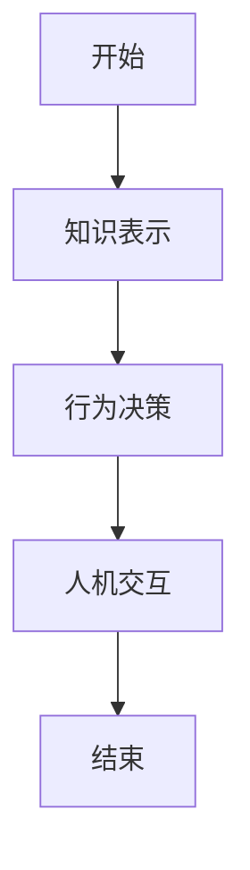
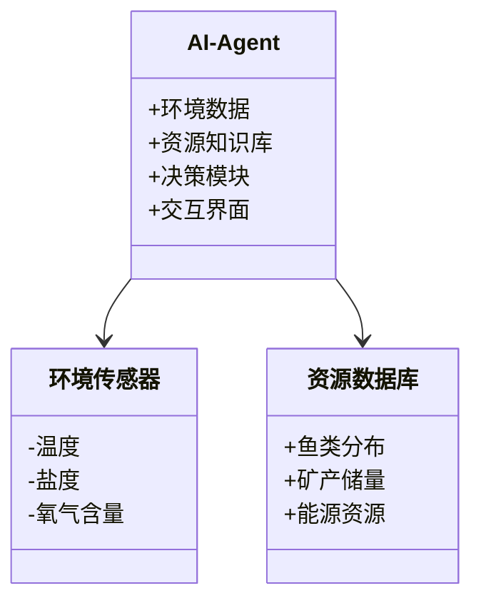
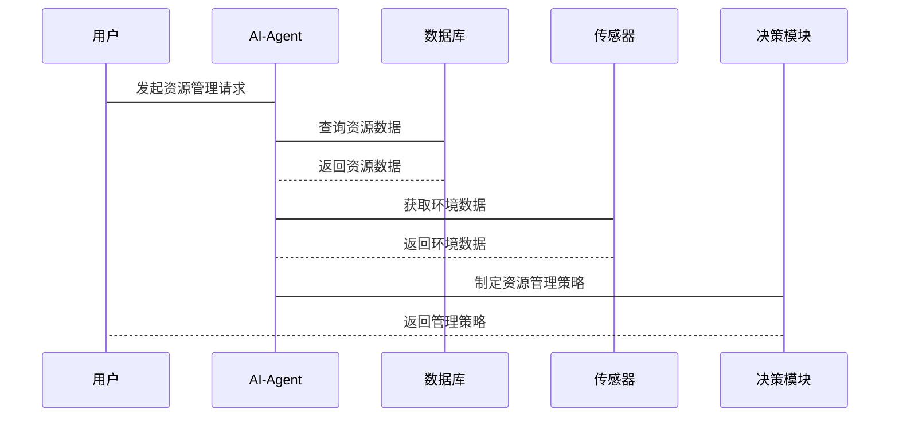

                 


---

# AI Agent在海洋科学中的应用：海洋资源管理与保护

> **关键词**: AI Agent, 海洋科学, 海洋资源管理, 海洋环境保护, 人工智能算法

> **摘要**: 本文探讨了AI Agent在海洋科学中的应用，特别是如何通过AI Agent技术实现海洋资源的有效管理和保护。文章从AI Agent的基本概念、海洋科学的背景需求入手，详细分析了AI Agent在海洋资源管理中的核心概念与算法原理，结合实际项目案例，展示了AI Agent在海洋环境监测、资源分配优化以及生态保护中的具体应用。通过系统架构设计和实战代码实现，本文为读者提供了一套完整的AI Agent应用于海洋资源管理的解决方案。

---

# 第一部分: AI Agent在海洋科学中的应用概述

## 第1章: AI Agent与海洋科学的背景介绍

### 1.1 AI Agent的基本概念

#### 1.1.1 AI Agent的定义
AI Agent（人工智能代理）是一种能够感知环境、自主决策并执行任务的智能实体。它可以是一个软件程序，也可以是一个物理设备，通过传感器和执行器与环境交互。AI Agent的核心目标是通过智能化的决策和行动，帮助用户完成特定任务或解决问题。

#### 1.1.2 AI Agent的核心特征
- **自主性**: AI Agent能够自主决策，无需外部干预。
- **反应性**: 能够实时感知环境变化并做出反应。
- **目标导向**: 通过设定目标来指导行为和决策。
- **学习能力**: 能够通过经验改进性能。

#### 1.1.3 AI Agent与传统AI的区别
传统AI（如专家系统）依赖预定义的规则和知识，而AI Agent具有更强的自主性和适应性，能够根据环境动态调整行为。

### 1.2 海洋科学的基本概念

#### 1.2.1 海洋科学的研究领域
海洋科学涉及海洋地质、海洋生物、海洋化学、海洋物理等多个学科，研究海洋的形成、演化及其与全球环境的相互作用。

#### 1.2.2 海洋资源的分类与特点
海洋资源包括渔业资源、矿产资源、能源资源等。其特点是分布广泛、储量丰富，但开发难度大、环境影响显著。

#### 1.2.3 海洋环境保护的重要性
海洋环境保护是全球可持续发展的重要组成部分，涉及防止污染、保护生物多样性、维护生态平衡等方面。

### 1.3 AI Agent在海洋科学中的应用现状

#### 1.3.1 AI Agent在海洋环境监测中的应用
AI Agent可以通过传感器网络实时监测海洋环境参数（如温度、盐度、氧气含量），并预测环境变化趋势。

#### 1.3.2 AI Agent在海洋资源管理中的应用
AI Agent能够优化资源分配，提高资源利用效率，同时减少对环境的负面影响。

#### 1.3.3 AI Agent在海洋生态保护中的应用
AI Agent可以帮助保护濒危物种，监测非法捕捞活动，维护海洋生态平衡。

---

## 第2章: AI Agent在海洋资源管理中的核心概念与联系

### 2.1 AI Agent的核心概念原理

#### 2.1.1 知识表示与推理
知识表示是AI Agent理解环境的基础。常用的知识表示方法包括语义网络、逻辑推理等。

#### 2.1.2 行为决策机制
AI Agent通过决策树、马尔可夫决策过程等算法，根据当前状态和可能的动作，选择最优行为。

#### 2.1.3 人机交互界面
AI Agent需要与用户或系统进行交互，通过自然语言处理技术实现高效的沟通。

### 2.2 海洋资源管理的核心需求

#### 2.2.1 资源监测与评估
定期监测海洋资源的分布和储量，评估资源的可持续性。

#### 2.2.2 资源分配与优化
根据资源需求和环境条件，优化资源分配策略，避免资源浪费和过度开发。

#### 2.2.3 资源保护与可持续发展
制定保护措施，防止资源枯竭和环境破坏，推动可持续发展。

### 2.3 AI Agent与海洋资源管理的结合

#### 2.3.1 知识表示与海洋资源特征的对应关系
将海洋资源特征（如鱼类分布、海底地形）转化为AI Agent的知识库，支持决策。

#### 2.3.2 行为决策在海洋资源管理中的应用
AI Agent可以根据环境数据和资源需求，实时调整资源分配策略。

#### 2.3.3 人机交互在海洋资源管理中的作用
通过人机交互，用户可以与AI Agent协作，共同制定和优化资源管理方案。

---

## 第3章: AI Agent在海洋科学中的算法原理

### 3.1 AI Agent的核心算法

#### 3.1.1 知识表示算法
知识表示算法将海洋资源特征转化为结构化的数据形式，支持推理和决策。

#### 3.1.2 行为决策算法
行为决策算法（如Q-learning）帮助AI Agent在复杂环境中做出最优决策。

#### 3.1.3 人机交互算法
人机交互算法通过自然语言处理技术，实现与用户的高效沟通。

### 3.2 算法原理的数学模型

#### 3.2.1 知识表示模型
知识表示模型可以用图论中的语义网络表示：
$$
\text{知识图} = \{ (s, r, o) \mid s \in S, r \in R, o \in O \}
$$

#### 3.2.2 行为决策模型
行为决策模型基于Q-learning算法：
$$
Q(s, a) = Q(s, a) + \alpha \left[ r + \max_{a'} Q(s', a') - Q(s, a) \right]
$$

#### 3.2.3 人机交互模型
人机交互模型基于自然语言处理的生成模型：
$$
P(y \mid x) = \frac{P(x, y)}{P(x)}
$$

### 3.3 算法流程图（mermaid）



---

# 第二部分: 系统分析与架构设计

## 第4章: 系统架构设计

### 4.1 问题场景介绍
在海洋资源管理中，AI Agent需要实时监测海洋环境、优化资源分配并保护生态平衡。

### 4.2 项目介绍
本项目旨在开发一个基于AI Agent的海洋资源管理系统，实现资源监测、分配和保护的智能化。

### 4.3 系统功能设计（领域模型mermaid类图）



### 4.4 系统架构设计（mermaid架构图）


### 4.5 系统接口设计
系统接口包括环境传感器接口、资源数据库接口和用户交互接口。

### 4.6 系统交互设计（mermaid序列图）



---

# 第三部分: 项目实战

## 第5章: 项目实战

### 5.1 环境安装

```bash
pip install numpy matplotlib scikit-learn
pip install transformers
```

### 5.2 系统核心实现源代码

```python
import numpy as np
from sklearn.metrics import accuracy_score
from transformers import AutoTokenizer, AutoModelForSequenceClassification

# 知识表示
class KnowledgeRepresentation:
    def __init__(self):
        self.database = {}

    def add Knowledge(self, key, value):
        self.database[key] = value

# 行为决策
class DecisionMaking:
    def __init__(self):
        self.Q_table = {}

    def update_Q_table(self, state, action, reward, next_state):
        alpha = 0.1
        gamma = 0.9
        current_q = self.Q_table.get((state, action), 0)
        next_max_q = max(self.Q_table.get((next_state, a), 0) for a in self.Q_table.keys())
        new_q = current_q + alpha * (reward + gamma * next_max_q - current_q)
        self.Q_table[(state, action)] = new_q

# 人机交互
class HumanInteraction:
    def __init__(self):
        self.tokenizer = AutoTokenizer.from_pretrained('facebook/bart-base')
        self.model = AutoModelForSequenceClassification.from_pretrained('facebook/bart-base')

    def interact(self, input_text):
        inputs = self.tokenizer.encode(input_text, return_tensors='np')
        outputs = self.model.generate(inputs, max_length=50)
        return self.tokenizer.decode(outputs[0], skip_special_tokens=True)
```

### 5.3 代码应用解读与分析
上述代码实现了AI Agent的知识表示、行为决策和人机交互功能。知识表示模块管理资源数据，行为决策模块基于Q-learning算法优化决策，人机交互模块使用预训练模型实现自然语言处理。

### 5.4 实际案例分析
以海洋鱼类资源管理为例，AI Agent可以根据捕捞数据和环境参数，优化捕捞策略，保护鱼类种群。

### 5.5 项目小结
通过本项目，我们展示了AI Agent在海洋资源管理中的实际应用，验证了其在资源监测、优化分配和生态保护中的有效性。

---

# 第四部分: 总结与展望

## 第6章: 总结与展望

### 6.1 小结
本文详细探讨了AI Agent在海洋资源管理中的应用，从背景介绍、算法原理到系统实现，全面展示了AI Agent在海洋科学中的巨大潜力。

### 6.2 注意事项
在实际应用中，需注意数据隐私、算法鲁棒性和系统可扩展性等问题。

### 6.3 拓展阅读
建议进一步研究多智能体协作、强化学习在海洋科学中的应用，探索更高效的AI Agent算法。

---

通过本文的分析，我们可以看到AI Agent技术在海洋资源管理与保护中的巨大潜力。未来，随着AI技术的不断进步，AI Agent将在海洋科学中发挥更加重要的作用，为海洋资源的可持续管理提供强有力的技术支持。

